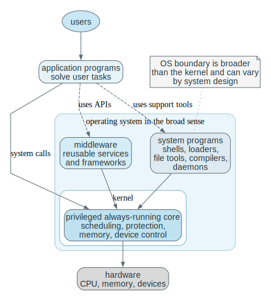
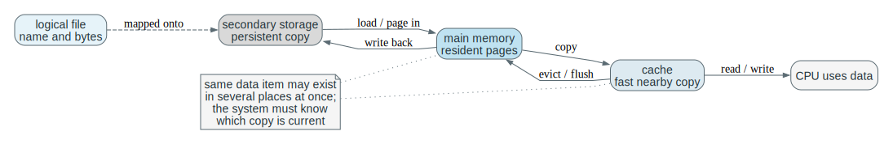
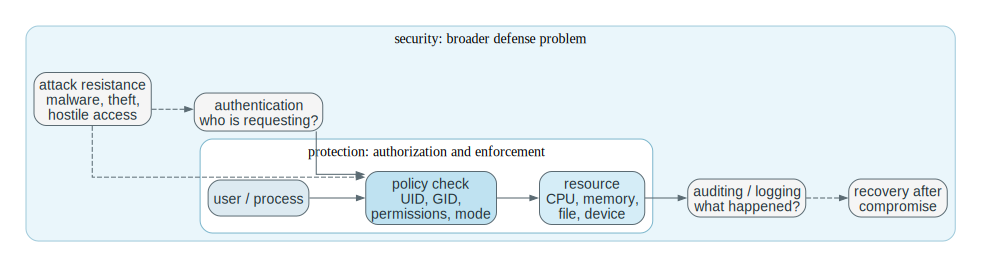
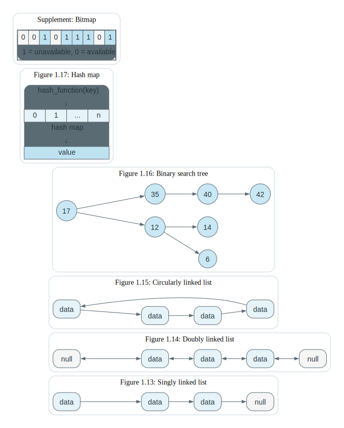
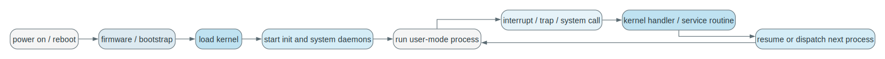

# Chapter 1 Fundamentals Mastery

Source: Chapter 1 of `textbook.pdf` (Operating System Concepts, 9th ed.).

This is the canonical Chapter 1 note in this repo.
It is written for operational mastery: mechanisms, invariants, failure modes, and traces you can reproduce from memory.

If you are short on time, skim `## 2. Mental Models To Know Cold` and reproduce the traces in `## 4. Canonical Traces To Reproduce From Memory`.

## 1. What This File Optimizes For

The goal is not to remember many terms.
The goal is to be able to do the following without guessing:

- Trace how control moves from user code into the kernel and back (syscall, trap, interrupt).
- Explain why the OS requires a timer, privilege separation, and interrupt/trap handling.
- Enumerate what state must be saved and restored at a context switch, and why each piece exists.
- Explain why copying data upward in the storage hierarchy creates coherence and authority problems.
- Predict what new coordination costs appear when you add processors or machines.
- State the invariant the kernel enforces at each major boundary (CPU time, memory mappings, I/O, storage).

For Chapter 1, "dangerous" means:

- you can trace a mechanism step by step
- you can state what must remain true for the mechanism to work
- you can predict what breaks when a mechanism is missing
- you can connect the abstraction to code you would later inspect in a real kernel

Later chapters should deepen these mechanisms, not rescue undefined language here.

## 2. Mental Models To Know Cold

### 2.1 The OS Is a Control System

The operating system is not mainly a bag of services.
It is the control layer that decides who runs, who waits, who may access what, which copy of data is current, and when the kernel must take back control.

If you remember only one idea, remember this:
the OS exists because raw hardware is fast but not self-governing.

### 2.2 The Kernel Is the Trusted Authority

The operating system in the broad sense includes many layers and tools.
The kernel is the part that executes with hardware privilege and therefore holds the authority to enforce the rules.

Applications ask.
The kernel decides.
That asymmetry is the foundation of protection.

### 2.3 Concurrency Is Mostly About Scarcity

There are always fewer immediately usable resources than the system would like:
one CPU, limited RAM, a finite number of devices, finite bandwidth, finite latency budgets.

Scheduling, buffering, caching, and virtualization are all different ways of coping with scarcity while preserving the illusion of abundant progress.

### 2.4 Copies Create Correctness Problems

The moment the same logical data exists in more than one place, the problem is no longer only storage or speed.
It becomes a correctness question: the system must define which copy is authoritative, when another copy is stale, and what rule makes an update visible.

This idea shows up in caches, page caches, DMA buffers, distributed systems, and replicated services.

### 2.5 Scaling Changes The Shape Of Failure

More processors, more machines, and more layers do not simply increase capacity.
They also increase coordination cost, latency variation, and failure modes.

Single CPU:
main problem is multiplexing.

SMP:
main problems become synchronization, cache coherence, and locality.

Clusters and distributed systems:
main problems become communication, partial failure, and coordination across nodes.

### 2.6 If You Remember Only 10 Things

1. The operating system exists to make hardware usable, shareable, and safe.
2. The kernel is the privileged always-running core; system calls are the normal entry path into it.
3. Interrupts, traps, and timers are how control returns to the operating system.
4. Multiprogramming keeps the CPU busy; time sharing keeps users responsive.
5. Faster storage is smaller and more expensive; slower storage is larger and more persistent.
6. Caching improves speed by copying data upward, which creates consistency problems that must be managed.
7. More processors improve throughput only if the system can manage contention, coordination, and memory effects.
8. Protection and security are related but not identical: authorization is not the whole defense story.
9. Kernel data structures matter because operating-system performance is mostly about how state is organized and accessed.
10. Distributed systems, virtualization, cloud systems, and embedded real-time systems are different answers to the same control question.

## 3. Mastery Modules

### 3.1 OS Boundary And Kernel Authority

**Problem**

Useful programs need access to memory, CPU time, files, and devices.
If every program controlled hardware directly, one buggy or malicious program could corrupt the whole machine.

**Mechanism**

User-facing software runs mostly without hardware privilege.
The kernel runs with privilege and exposes controlled entry paths through system calls, traps/faults, and interrupts.
System programs and middleware make the environment usable, but they do not replace the kernel's authority.

Operational definitions that stay stable across OSes:

- `Operating system`: the overall resource-management and service environment.
- `Kernel`: the privileged core that enforces rules and holds authoritative state.
- `System program`: user-space utility/daemon that packages workflows but does not have kernel privilege.
- `Application`: user goal software, not responsible for global control.
- `Middleware`: shared libraries/runtimes above the kernel that standardize common capabilities.

**Invariants**

- Only privileged code may perform privileged operations.
- User code may request service, but cannot directly enforce global policy.
- The kernel must remain able to regain control without relying on user cooperation.
- The authoritative machine state lives in privileged structures, not in user memory alone.

**What Breaks If This Fails**

- Without privilege separation, user code can overwrite device state, disable timers, or corrupt memory mappings.
- Without a standard kernel entry path, applications become hardware-specific and fragile.
- Without a trusted resident core, no global resource policy can be enforced consistently.

**One Trace: launching a program**

| Step | User / Process Side | Kernel Side | Why It Matters |
| --- | --- | --- | --- |
| 1 | user enters a command in a shell | kernel is idle until asked | work begins in user space |
| 2 | shell asks to run another program | syscall/trap transfers control into kernel mode | launch crosses the protection boundary |
| 3 | shell waits for result | kernel validates path, permissions, executable format | authority lives in kernel |
| 4 | shell still in user space or blocked | kernel creates process + address-space state | a program becomes an executing entity via kernel setup |
| 5 | new process gets initial registers and stack | kernel sets return point to user entry | execution context is explicitly constructed |
| 6 | new process begins executing | kernel returns to user mode | privilege is dropped after setup |

**Code Bridge**

- In a teaching kernel, inspect the path from shell command parsing to `exec`.
- Identify where permission checks occur, where memory is allocated, and where control returns to user mode.

**Drills (With Answers)**

1. **Q:** Why is the shell not enough by itself to manage the machine safely?
**A:** The shell is an ordinary user process. It cannot execute privileged instructions, cannot enforce memory protection, cannot program the timer, and cannot prevent another process from bypassing it. Only the kernel can be the central authority because only it runs with hardware privilege.

2. **Q:** What exact power does the kernel have that a normal process does not?
**A:** Kernel code executes in a privileged CPU mode. It can change page tables, handle interrupts/traps, program device controllers and timers, and access protected hardware state. That is what makes enforcement possible rather than “by convention.”

3. **Q:** If user programs could directly edit page tables, what would break first?
**A:** Isolation and protection. A process could map and modify another process’s memory (or kernel memory), steal credentials, corrupt the kernel’s authoritative state, and effectively escape any security policy.

### 3.2 How Control Enters The Kernel

**Problem**

The kernel cannot manage anything unless control can reliably reach it:
at boot, on hardware events, on deliberate requests for service, and on faults.

**Mechanism**

Boot starts with firmware and bootstrap code, which load the kernel before the normal software environment even exists.
After boot, there are three main paths into the kernel:

- `system call`: deliberate request by user code
- `interrupt`: asynchronous external event such as timer expiry or device completion
- `trap/exception`: synchronous event caused by the current instruction stream, such as a fault

Useful distinctions:

- `asynchronous`: not caused by the instruction currently executing
- `synchronous`: caused directly by the instruction currently executing
- `instruction stream`: the ordered sequence of machine instructions executing for the current computation

Timers guarantee preemption.
`DMA` lets the kernel start an I/O transfer and then let a device controller move a bulk block of bytes between a device buffer and main memory without forcing the CPU to copy each word manually.
The kernel still must coordinate ownership of buffers, record completion, and wake any process waiting for the transfer.

**Invariants**

- Every kernel entry must preserve enough state to resume or terminate the interrupted computation correctly.
- Asynchronous and synchronous events must be distinguished, because their causes and handling rules differ.
- The timer must be under privileged control, or a user program could keep the CPU forever.
- DMA may reduce CPU copying, but it does not remove the need for ownership, ordering, and completion handling.

**What Breaks If This Fails**

- Without a timer, the OS cannot guarantee it will regain the CPU from a runaway user process.
- Without saved context, the kernel cannot return correctly after handling an event.
- If user code can program privileged device state directly, protection collapses.
- If interrupt handling is wrong, I/O completion and wakeups become unreliable or lost.

**One Trace: blocking read with device completion**

| Stage | CPU | Device | Kernel | Process State |
| --- | --- | --- | --- | --- |
| before request | process executing in user mode | idle | not yet involved | running |
| read request | process issues `read` syscall | idle | validates request, programs driver or DMA | running inside kernel |
| wait period | scheduler runs something else | transfer in progress | marks caller as blocked | blocked |
| completion | current CPU work interrupted | device signals done | handler records completion and wakeup | caller becomes runnable |
| after interrupt | scheduler eventually runs caller again | idle/ready | syscall finishes and returns | running |

**Code Bridge**

- Later, read a trap handler and a syscall dispatcher side by side.
- Both enter the kernel, but their causes and invariants differ.

**Drills (With Answers)**

1. **Q:** Why is a system call not just “another interrupt” conceptually?
**A:** A system call is an intentional, synchronous request with a defined ABI, return convention, and validation contract. Hardware interrupts are asynchronous events that preempt whatever is running and usually represent device/timer state changes, not a deliberate request.

2. **Q:** Why does DMA improve performance without removing the need for interrupts?
**A:** DMA removes CPU copying, but completion still must be detected, errors handled, and waiting threads woken. Interrupts (or polling in some designs) are still required to learn that the transfer finished and to re-enter the kernel control path.

3. **Q:** What happens if user code can disable the timer and then spin forever?
**A:** The kernel may never regain control, which breaks time sharing and fairness and effectively hands the machine to that process. It is both a responsiveness failure and a security failure.

### 3.3 Processes, Multiprogramming, And Time Sharing

**Problem**

The CPU is too valuable to sit idle while one job waits for I/O, and users do not want to wait through long uninterrupted runs of someone else's job before the machine reacts to their input.

**Mechanism**

A `process` is a program plus execution state and resources:

- `register state`: PC, stack pointer, general registers, status bits
- `memory image`: code, data, heap, stacks as mapped in memory
- `open resources`: kernel-managed objects such as files, sockets, devices

Multiprogramming keeps several jobs resident so the CPU can run another one when the current one blocks.
Time sharing adds frequent preemption so interactive response stays short enough that a human experiences the system as responsive rather than stalled.

This forces the kernel to maintain:

- runnable vs blocked classification
- saved context for resumption
- a policy for selecting which runnable work runs next

**Invariants**

- A blocked process must not consume CPU as if it were runnable.
- A context switch must preserve enough state for later correct resumption.
- Scheduling chooses among runnable work, not arbitrary work.
- A process is more than the program text; it includes execution context and owned resources.

**What Breaks If This Fails**

- Without scheduling, CPU time is not shared intentionally.
- Without context preservation, resumed processes continue incorrectly.
- Without blocked-vs-runnable distinction, the kernel can waste CPU on work that cannot make progress.
- Without time slicing, interactive systems degrade into long waits.

**One Trace: timer-based preemption**

| Stage | Running Process | Timer | Kernel / Scheduler | Result |
| --- | --- | --- | --- | --- |
| slice begins | process A running | armed | kernel already chose A | A progresses |
| timer expires | A interrupted | fires | kernel regains control | preemption point |
| decision | A stops temporarily | reset/rearmed | scheduler checks runnable set | next chosen |
| switch | A context saved | active for next slice | B context loaded | B running |
| return | B runs in user mode | armed again | kernel leaves CPU | sharing continues |

**Code Bridge**

- Later, inspect process state transitions, `sleep`, `wakeup`, and scheduler selection.
- Identify which saved fields make a process resumable after interruption.

**Drills (With Answers)**

1. **Q:** Why does multiprogramming improve utilization even on one CPU?
**A:** It overlaps CPU work with I/O latency. When one job blocks on I/O, the CPU can run another job instead of idling, increasing overall utilization and throughput.

2. **Q:** Why does time sharing require a timer instead of voluntary yielding?
**A:** Voluntary yielding is not enforceable. A timer provides a forced, bounded preemption point so the kernel regains control even if a process is buggy or selfish, which is required for bounded response time.

3. **Q:** What state must survive a context switch for correct resumption?
**A:** At minimum: CPU registers including PC and SP, status/flags, and the kernel’s scheduling/identity bookkeeping for the thread. In practice it also includes memory-mapping state (page table pointer) and kernel bookkeeping needed to re-enter the right execution context safely.

### 3.4 Memory, Storage, Files, And Copies

**Problem**

Execution requires fast, directly addressable memory, but persistence requires larger and slower storage.
The machine therefore has a hierarchy, not one perfect storage medium.

**Mechanism**

Programs execute from main memory.
Files provide a logical abstraction that hides raw storage layout.
Caches keep copies closer to the CPU.
Secondary storage extends persistence and capacity beyond what RAM can provide.

This creates the key OS problem:
not only where data is stored, but what *rules* define the current authoritative copy and the visibility of updates.

**Invariants**

- Code and data must be resident in executable memory before the CPU can use them directly.
- File naming and structure are logical abstractions, not raw device geometry.
- If data exists in multiple locations, there must be a coherence or writeback rule.
- Faster storage is usually smaller and more expensive per bit; slower storage is usually larger and more persistent.

**What Breaks If This Fails**

- Without residency in memory, code on disk does not execute directly.
- Without a file abstraction, software depends on physical storage layout.
- Without coherence/writeback rules, stale copies can silently win.
- Without free-space and allocation policy, storage becomes unusable even if bits remain available.

**One Trace: data moving through the hierarchy**

| Stage | Logical View | Physical Movement | Correctness Rule You Must Know |
| --- | --- | --- | --- |
| file exists | program sees a file | bytes on secondary storage | name -> metadata -> blocks defines the persistent mapping |
| data needed | program requests read | OS brings bytes into memory | kernel defines ownership and lifetime of the in-memory buffer/page |
| data used repeatedly | CPU hits a nearby fast copy | cache fills from memory | coherence rules decide whether cached data is valid |
| data modified | process writes | cache/memory becomes dirty | writeback/journaling rules define ordering and durability |
| persistence restored | OS writes back | memory updates disk copy | commit point defines when disk becomes authoritative |

**Code Bridge**

- Later, study page tables, page faults, buffer cache, and filesystem metadata separately.
- They are layers of the same mapping problem: logical objects -> physical state with correctness.

**Drills (With Answers)**

1. **Q:** Why is storage management also a consistency problem?
**A:** Because performance relies on copies (caches, buffers). Once copies exist, the system must preserve a consistency model: which copy is authoritative, when others are stale, and how/when updates become visible and durable.

2. **Q:** Why is “the same data exists in several places” a correctness issue, not only performance?
**A:** Because reads can observe stale copies and writes can be lost or reordered. Without coherence and writeback invariants, the system can return correct-looking but wrong data, which is a correctness failure.

3. **Q:** What does the file abstraction hide that applications do not manage directly?
**A:** Physical block layout, free-space management, device scheduling, caching/writeback policy, and crash recovery rules (journaling/ordering). Apps operate on names/streams; the OS preserves the mapping and durability.

### 3.5 Scaling: SMP, NUMA, Clusters, Virtualization, Real-Time

**Problem**

Once one CPU or one machine is not enough, the question changes from simple sharing to coordinated parallelism or distributed control.

**Mechanism**

`SMP` lets multiple processors share one memory space and one kernel.
`NUMA` adds unequal memory distance, so placement and locality matter.
`Clusters` join multiple machines that cooperate across a network, introducing partial failure and communication delay.
`Virtualization` inserts a privileged management layer that multiplexes hardware into isolated guests.
`Real-time` systems add deadlines so timing becomes part of correctness.

**Invariants**

- Shared memory requires explicit synchronization and coherence discipline.
- NUMA means locality matters; not all memory access costs are equal.
- Cluster nodes do not share one physical memory image just because they cooperate.
- A virtual machine manager controls hardware access beneath guests.
- In real-time systems, “eventually correct” can still be wrong if it misses the deadline.

**What Breaks If This Fails**

- Ignoring synchronization on SMP gives races and inconsistent shared state.
- Ignoring locality on NUMA gives disappointing performance even with many CPUs.
- Treating a cluster like one shared-memory box produces wrong assumptions about latency and failure.
- Treating virtualization like mere multiprogramming misses the extra control layer.
- Treating real-time like ordinary throughput optimization misses the deadline requirement entirely.

**Code Bridge**

- When studying a hypervisor later, identify which privileges moved beneath the guest kernel.
- When studying multicore scheduling later, identify how locality affects placement and migration.

**Drills (With Answers)**

1. **Q:** Why does adding processors not guarantee linear speedup?
**A:** Serial portions, synchronization overhead, cache coherence traffic, memory bandwidth limits, and contention for shared structures all create diminishing returns (and sometimes regressions).

2. **Q:** Why is a cluster not just “SMP with longer wires”?
**A:** Clusters do not share one physical memory image. Communication is explicit, latency is much higher, failures are partial, and coordination requires distributed protocols rather than shared-memory synchronization.

3. **Q:** Why is real-time correctness stricter than ordinary throughput/latency optimization?
**A:** In real-time, missing a deadline is an incorrect outcome, not merely a slow one. Correctness is defined in part by worst-case timing bounds, not by average performance.

### 3.6 Protection And Security

**Problem**

A useful OS must share resources among mutually untrusted or simply buggy activities without surrendering control of the machine.

**Mechanism**

`Protection` specifies allowed access to resources (who may do what).
`Security` is broader: it includes protection but also authentication, resistance to hostile behavior, auditing, confidentiality, integrity, and recovery.

Mechanisms that make protection enforceable:

- user mode vs kernel mode
- privileged instructions
- system call validation
- timer-controlled regain of CPU control

**Invariants**

- User code cannot directly execute privileged operations.
- Access checks must be tied to identity and policy, not only convenience.
- Protection is necessary but not sufficient for security.
- The kernel must distrust user-supplied inputs enough to validate them.

**What Breaks If This Fails**

- If user code can reach protected hardware state directly, the kernel loses authority.
- If identity is not tracked, policy cannot be enforced meaningfully.
- If the OS assumes user parameters are correct, system calls become attack surfaces.
- If valid credentials are stolen, correct permission bits still do not guarantee security.

**One Trace: forbidden operation**

| Stage | User Process | Hardware / Kernel | Result |
| --- | --- | --- | --- |
| attempt | process tries privileged action or protected access | boundary crossing detected | request cannot proceed directly |
| entry | trap/syscall enters kernel control | kernel checks privilege and policy | authority centralized |
| decision | access denied or process faulted | kernel records failure and returns error / signal | enforcement visible |
| aftermath | process handles error or dies | system remains under kernel control | isolation preserved |

**Code Bridge**

- Later, inspect syscall argument validation, permission checks, and the path for faults caused by illegal access.

**Drills (With Answers)**

1. **Q:** Why is protection not the same thing as security?
**A:** Protection is access control enforcement. Security includes protection plus authentication, attack resistance, auditing, confidentiality/integrity, and recovery. You can have correct protection rules and still be insecure if credentials are stolen or privileged code is exploited.

2. **Q:** Why is the timer also a protection mechanism?
**A:** It guarantees the kernel regains CPU control. Without it, a user process could monopolize the machine by looping forever, preventing enforcement of scheduling and other control policies.

3. **Q:** Why does validating syscall input belong to OS security, not only application correctness?
**A:** The syscall boundary is a trust boundary. User pointers/lengths can be malicious. Validation prevents kernel memory corruption and privilege escalation, which are security failures even if the calling app “meant well.”

### 3.7 Kernel Data Structures As Policy In Disguise

**Problem**

The kernel spends a huge amount of time organizing, finding, and updating state.
That means data-structure choice is often policy expressed in operational form.

**Mechanism**

Common structures and what they encode:

- lists: fast insertion/removal, linear search
- queues: waiting order (fairness policy lives here)
- stacks: nested LIFO behavior
- trees: hierarchy or ordered search
- hash maps: fast expected lookup under controlled collisions
- bitmaps: compact state for fixed-size resources

**Invariants**

- Every structure must preserve a correct mapping between abstract state and stored representation.
- Complexity claims depend on shape and load; they are not magical guarantees.
- Compact representations like bitmaps are only useful if the index-to-resource mapping stays correct.

**What Breaks If This Fails**

- A bad structure choice creates unnecessary scanning and contention.
- Unbalanced trees lose their expected search benefits.
- Hash collisions can turn “fast lookup” into a bottleneck.
- A corrupted bitmap or queue can misrepresent ownership or readiness.

**Code Bridge**

- When reading kernel code later, ask which access pattern forced the structure choice.
- That is often more useful than memorizing names.

**Drills (With Answers)**

1. **Q:** Why can the wrong data structure become a scheduling or allocation policy bug?
**A:** The data structure determines both cost and ordering. An O(n) scan under contention becomes latency; queue ordering becomes fairness policy; tree shape and locking become throughput policy. Structure choices surface as system-level behavior.

2. **Q:** Why are bitmaps attractive for resource availability?
**A:** They are compact and cache-friendly, and support fast test/set operations for fixed-size indexed resources (pages, PIDs, blocks). The tradeoff is that the index mapping must remain correct.

3. **Q:** What performance promise of hashing depends on collisions staying controlled?
**A:** Expected near-constant-time lookup. If collisions grow, operations degrade toward linear time and can become a bottleneck (or even a denial-of-service vector).

## 4. Canonical Traces To Reproduce From Memory

Do not merely read these.
Cover the tables and reproduce the sequence from memory.

### 4.1 Boot To First User Process

| Step | Machine State | Kernel Role |
| --- | --- | --- |
| power on/reset | only firmware-resident code immediately available | kernel not yet in memory |
| bootstrap runs | enough hardware initialized to load kernel | early control path established |
| kernel loads | privileged core takes over | fundamental subsystems start |
| init/system process starts | user-space environment prepared | services begin |
| first user process runs | normal workloads possible | OS now in steady-state control |

### 4.2 Blocking I/O With Interrupt Completion

| Step | CPU Lane | Device Lane | Kernel Lane |
| --- | --- | --- | --- |
| request | user issues `read` | idle | validates request |
| start I/O | caller enters kernel | starts transfer or DMA | driver programs device |
| overlap | other work may run | transferring | caller sleeps/blocks |
| completion | CPU interrupted | raises interrupt | handler records completion |
| wakeup | scheduler may choose caller later | idle/ready | caller marked runnable |
| return | caller resumes | no longer needed for this request | syscall returns |

### 4.3 Timer Preemption

| Step | Running Process | Hardware | Kernel |
| --- | --- | --- | --- |
| slice active | process A runs | timer counts down | not on CPU yet |
| timeout | A interrupted | timer fires | kernel regains control |
| decision | A stops temporarily | timer reset | scheduler chooses next runnable |
| switch | B state loaded | ready for next timeout | kernel returns to user mode |

### 4.4 Faulting Memory Access

| Step | Process View | Hardware / Kernel View |
| --- | --- | --- |
| access issued | process attempts memory access | CPU checks mapping/protection |
| fault detected | instruction cannot complete | exception enters kernel |
| diagnosis | process paused | kernel decides repairable vs fatal |
| outcome | resume or terminate | protection and correctness preserved |

## 5. Key Questions (Answered)

1. **Q:** Why is a timer both a fairness mechanism and a safety mechanism?
**A:** Fairness: it bounds how long one runnable task can monopolize the CPU before others get a chance. Safety: it guarantees the kernel regains control even if a task never yields, which is required to enforce protection and system-wide policy.

2. **Q:** Why can DMA reduce CPU cost while increasing the need for careful ownership rules?
**A:** DMA offloads copying, but now devices read/write memory directly. The OS must ensure buffers are pinned, not freed/reused early, not concurrently modified incorrectly, and that caches/visibility rules are respected. Less CPU work, more coordination duty.

3. **Q:** If two CPUs update related shared data without synchronization, what kind of bug appears even if both CPUs are “correct” in isolation?
**A:** A race condition: lost updates, inconsistent reads, and violated invariants due to interleavings and visibility effects. The bug is in the interaction, not in either CPU’s local logic.

4. **Q:** Why does “the OS is a resource allocator” explain scheduling, memory management, and disk management at the same time?
**A:** They are all instances of scarcity management: CPU time, memory frames, and I/O bandwidth are shared resources. The OS allocates them, enforces protection, and preserves system invariants while trying to optimize some metric.

5. **Q:** Why is the interrupt vs exception distinction conceptually useful even though both enter the kernel?
**A:** Interrupts are asynchronous external events (device/timer) that can preempt arbitrary code. Exceptions are synchronous outcomes of the current instruction stream (faults/traps). The difference determines cause, timing assumptions, and what state must be interpreted to handle correctly.

6. **Q:** If a process can be interrupted almost anywhere, what does that force the kernel to preserve or design carefully?
**A:** It forces resumable state (saved context/PCB), reentrancy/atomicity of kernel updates (locking and careful preemption points), and clear invariants about what can be partially updated. “Interrupt anywhere” is why the OS is fundamentally about careful state management.

7. **Q:** Why does a blocked process exist as real kernel state even while it is not using the CPU?
**A:** Because the OS must remember what it is waiting for, where it should resume, and what resources it owns. Blocked is not “gone”; it is “paused with obligations and a wakeup condition.”

8. **Q:** What exact problem does the file abstraction hide from applications?
**A:** It hides physical storage mapping (blocks/locations), free-space management, device scheduling, caching/writeback ordering, and crash consistency. Apps see stable names and streams while the OS preserves durability and mapping.

9. **Q:** Why does cache coherence become more important as hardware parallelism grows?
**A:** More cores means more caches and more concurrent access to shared data. Without coherence and careful synchronization, cores read stale values, reorder visibility, and violate invariants. The cost of maintaining coherence also becomes a dominant performance factor.

10. **Q:** Why is a cluster failure model fundamentally different from a single-machine failure model?
**A:** Clusters have partial failure: one node or link can fail while others run. Communication is delayed and unreliable compared to memory access. Coordination must handle timeouts, partitions, and inconsistent views, which do not exist in the same way inside one machine.

11. **Q:** Why is protection still meaningful even if there is only one logged-in user?
**A:** Bugs are as dangerous as attackers. Protection prevents accidental corruption between processes, contains faults, and preserves system integrity. It also protects the OS from compromised or malformed applications, regardless of “intent.”

12. **Q:** Why is “security is broader than protection” a practical engineering statement?
**A:** Because correct access control does not stop credential theft, side channels, kernel exploits, or malicious inputs. Security includes authentication, patching, auditing, cryptography, and recovery. Protection is one necessary slice, not the whole problem.

13. **Q:** Why can the wrong data structure become visible as a performance bug at the system level?
**A:** Kernel hot paths run constantly. An extra linear scan, bad cache locality, or high lock contention becomes system-wide latency and throughput collapse. Structure choice is performance policy.

14. **Q:** Why is source-code access valuable only if you already have strong conceptual models?
**A:** Without models, code is overwhelming detail. With models, you can map code paths to mechanisms (traps, scheduling, VM, I/O), locate invariants, and reason about failure modes. Models turn code into evidence.

15. **Q:** If you had to debug a hung system, which Chapter 1 mechanisms would you suspect first and why?
**A:** Start with “who can regain control and make progress”: timer/interrupt delivery (is preemption working), scheduler/run queue logic (is runnable work being chosen), memory pressure (is everything blocked on allocation), and device completion paths (are interrupts or wakeups missing). Those are the control loops that keep the system alive.

## 6. Suggested Bridge Into Real Kernels

If your course later uses `xv6`, this is a good reading order:

1. trap and syscall path
2. process table, scheduler, `sleep`, and `wakeup`
3. page tables and address-space setup
4. filesystem path from file descriptor to disk block cache
5. interrupt and device-driver path

Conceptual anchors to look for:

- where privileged entry happens
- where process state is stored
- where runnable vs blocked state is encoded
- where page-table authority lives
- where file abstraction becomes block-level storage
- where a device completion wakes waiting work

If you later study Linux, look for the same ideas rather than expecting the same code shape.
The names change.
The control problems do not.

## 7. How To Use This File

If you are short on time:

- Read `## 2. Mental Models To Know Cold` once.
- Reproduce `## 4. Canonical Traces To Reproduce From Memory`.

If you want Chapter 1 to become reasoning skill:

- Work the `## 3. Mastery Modules` slowly: problem -> mechanism -> invariants -> failure modes.
- Reproduce the traces from memory and explain why each step exists.
- Use the answered questions in `## 5` as “explain it out loud” checkpoints.

