# Chapter 1 Fundamentals Mastery

Canonical Chapter 1 note: mastery modules plus an integrated reference pass.

If you are short on time, skim `## 2. Mental Models To Know Cold` and reproduce the traces in `## 4. Canonical Traces To Reproduce From Memory`.
If you need the reference-pass paraphrase and embedded figures, use `Appendix A`.

## 1. What This File Optimizes For

The goal is not to remember many terms.
The goal is to be able to answer questions like these without guessing:

- How does control move from a user process into the kernel and back?
- Why does the OS need a timer, privilege separation, and interrupt handling?
- What state must be saved at a context switch?
- Why does copying data upward in the storage hierarchy create correctness problems?
- Why does adding processors create coordination problems instead of only speed?
- What invariant is the kernel protecting at each boundary?

For Chapter 1, "dangerous" means:

- you can trace a mechanism step by step
- you can state what must remain true for the mechanism to work
- you can predict what breaks when a mechanism is missing
- you can connect the abstraction to code you would later inspect in a real kernel

Later chapters should deepen these mechanisms, not rescue undefined language here.
If a term is required to understand Chapter 1, this file should already make that term operationally clear enough to work with.

## 2. Mental Models To Know Cold

### 2.1 The OS Is a Control System

The operating system is not mainly a bag of services.
It is the control layer that decides who runs, who waits, who may access what, which copy of data is current, and when the kernel must take back control.

If you remember only one idea, remember this:
the OS exists because raw hardware is fast but not self-governing.

### 2.2 The Kernel Is the Trusted Authority

The operating system in the broad sense includes many layers and tools.
The kernel is the part that executes with hardware privilege and therefore holds the authority to enforce the rules.

Applications ask.
The kernel decides.
That asymmetry is the foundation of protection.

### 2.3 Concurrency Is Mostly About Scarcity

There are always fewer immediately usable resources than the system would like:
one CPU, limited RAM, a finite number of devices, finite bandwidth, finite latency budgets.

Scheduling, buffering, caching, and virtualization are all different ways of coping with scarcity while preserving the illusion of abundant progress.

### 2.4 Copies Create Correctness Problems

The moment the same logical data exists in more than one place, the problem is no longer only storage or speed.
It becomes a correctness question:
which copy is authoritative, when is another copy stale, and what rule makes an update visible?

This idea shows up in caches, page caches, DMA buffers, distributed systems, and replicated services.

### 2.5 Scaling Changes The Shape Of Failure

More processors, more machines, and more layers do not simply increase capacity.
They also increase coordination cost, latency variation, and failure modes.

Single CPU:
main problem is multiplexing.

SMP:
main problems become synchronization, cache coherence, and locality.

Clusters and distributed systems:
main problems become communication, partial failure, and coordination across nodes.

## 3. Mastery Modules

### 3.1 OS Boundary And Kernel Authority

**Problem**

Useful programs need access to memory, CPU time, files, and devices.
If every program controlled hardware directly, one buggy or malicious program could corrupt the whole machine.

**Mechanism**

User-facing software runs mostly without hardware privilege.
The kernel runs with privilege and exposes a controlled entry path through system calls, faults, and interrupts.
System programs and middleware make the environment usable, but they do not replace the kernel's authority.

**Invariants**

- Only privileged code may perform privileged operations.
- User code may request service, but cannot directly enforce global policy.
- The kernel must remain able to regain control without relying on user cooperation.
- The authoritative machine state lives in privileged structures, not in user memory alone.

**What Breaks If This Fails**

- Without privilege separation, user code can overwrite device state, disable timers, or corrupt memory mappings.
- Without a standard kernel entry path, applications become hardware-specific and fragile.
- Without a trusted resident core, no global resource policy can be enforced consistently.

**One Trace: launching a program**

| Step | User / Process Side | Kernel Side | Why It Matters |
| --- | --- | --- | --- |
| 1 | user enters a command in a shell | kernel is idle until asked | work begins in user space |
| 2 | shell asks to run another program | system call transfers control into kernel mode | launch crosses the protection boundary |
| 3 | shell waits for result | kernel validates path, permissions, and executable format | policy and authority live in kernel |
| 4 | shell still in user space or blocked | kernel creates process state and address-space state | a program becomes an executing entity only after kernel setup |
| 5 | new process gets initial registers and stack | kernel sets return point to user entry | execution context is explicitly constructed |
| 6 | new process begins executing | kernel returns to user mode | privilege is dropped after setup |

**Code Bridge**

- In a teaching kernel, inspect the path from shell command parsing to `exec`.
- Ask where permission checks happen, where memory is allocated, and where control finally returns to user mode.

**Drills**

1. Why is the shell not enough by itself to manage the machine safely?
2. What exact power does the kernel have that a normal process does not?
3. If user programs could directly edit page tables, what would break first?

### 3.2 How Control Enters The Kernel

**Problem**

The kernel cannot manage anything unless control can reliably reach it:
at boot, on hardware events, on deliberate requests for service, and on faults.

**Mechanism**

Boot starts with firmware and bootstrap code, which load the kernel before the normal software environment even exists.
After boot, there are three main paths into the kernel:

- system call: deliberate request by user code
- interrupt: asynchronous external event such as timer expiry or device completion
- trap or exception: synchronous event caused by the current instruction stream, such as a fault

Here `asynchronous` means "not caused by the instruction the CPU is currently executing." Here `synchronous` means "caused directly by the instruction the CPU is currently executing." The `instruction stream` is the ordered sequence of machine instructions the CPU is fetching and executing for the current computation. A `hardware event` is a state change announced by hardware outside that current instruction stream, such as a disk controller reporting I/O completion or a timer reporting that a programmed interval has expired.

Timers guarantee preemption.
`DMA` lets the kernel start an I/O transfer, for example a disk read into memory, and then let a device controller move a large contiguous block of bytes directly between a device buffer and main memory without forcing the CPU to copy each word manually. The kernel still must coordinate ownership of the buffers, record completion, and wake any process waiting for the transfer.

**Invariants**

- Every kernel entry must preserve enough state to resume or terminate the interrupted computation correctly.
- Asynchronous and synchronous events must be distinguished, because their causes and handling rules differ.
- The timer must be under privileged control, or a user program could keep the CPU forever.
- DMA may reduce CPU copying, but it does not remove the need for synchronization, ownership, or completion handling.

**What Breaks If This Fails**

- Without a timer, the OS cannot guarantee it will regain the CPU from a runaway user process.
- Without saved context, the kernel cannot return correctly after handling an event.
- If user code can program privileged device state directly, protection collapses.
- If interrupt handling is wrong, I/O completion and wakeups become unreliable or lost.

**One Trace: blocking read with device completion**

| Stage | CPU | Device | Kernel | Process State |
| --- | --- | --- | --- | --- |
| before request | process is executing in user mode | idle | not yet involved | running |
| read request | process issues `read` system call | idle | validates request, programs driver or DMA | running inside kernel |
| wait period | scheduler runs something else | transfer in progress | marks caller as blocked | blocked |
| completion | current CPU work is interrupted | device signals done | interrupt handler records completion and wakeup | caller becomes runnable |
| after interrupt | scheduler eventually runs caller again | idle or ready for new work | syscall path finishes and returns | running |

**Code Bridge**

- Later, read a trap handler and a syscall dispatcher side by side.
- Notice that both enter the kernel, but they do not mean the same thing and should not be explained as the same mechanism.

**Drills**

1. Why is a system call not just "another interrupt" in the conceptual sense?
2. Why does DMA help performance without removing the need for interrupts?
3. What would happen if user code could disable the timer before entering an infinite loop?

### 3.3 Processes, Multiprogramming, And Time Sharing

**Problem**

The CPU is too valuable to sit idle while one job waits for I/O, and users do not want to wait through long uninterrupted runs of someone else's job before the machine reacts to their input.

**Mechanism**

A process is a program plus execution state and resources. Its `register state` is the CPU's small fast working storage for that computation, such as the program counter, stack pointer, general-purpose registers, and status bits. Its `memory image` is the process's code, data, heap, and stack as they currently exist in memory. Its `open resources` are kernel-managed objects currently in use, such as open files or devices. Its `execution context` is the total resumable state the kernel must preserve in order to stop the process now and continue it correctly later.
Multiprogramming keeps several jobs resident so the CPU can run another one when the current one blocks.
Time sharing adds frequent preemption so interactive response stays short enough that a human user experiences the system as responsive rather than stalled.

This means the kernel must know which processes are runnable, which are blocked, what state must be saved, and when to switch. It is a scheduling problem because many computations compete for one CPU, and it is an isolation problem because those computations must not corrupt one another's memory or resources while sharing the same machine.

**Invariants**

- A blocked process must not consume CPU as if it were runnable.
- A context switch must preserve enough state for later correct resumption.
- Scheduling chooses among runnable work, not arbitrary work.
- A process is more than the program text; it includes execution context and owned resources.

**What Breaks If This Fails**

- Without scheduling, CPU time is not shared intentionally.
- Without context preservation, resumed processes continue incorrectly.
- Without blocked-vs-runnable distinction, the kernel can waste CPU on work that cannot make progress.
- Without time slicing, interactive systems degrade into long waits.

**One Trace: timer-based preemption**

| Stage | Running Process | Timer | Kernel / Scheduler | Result |
| --- | --- | --- | --- | --- |
| slice begins | process A is running | armed | kernel already chose A earlier | A makes progress |
| timer expires | A is interrupted | fires | kernel regains control | preemption point reached |
| decision point | A stops running temporarily | reset or rearmed | scheduler checks runnable work | kernel chooses next process |
| switch | A's context is saved | active for next slice | kernel loads process B context | B becomes running |
| return | B runs in user mode | armed again | kernel leaves CPU | sharing continues |

**Code Bridge**

- In xv6-style kernels, later inspect process state transitions, `sleep`, `wakeup`, and scheduler selection.
- Ask which fields make a process resumable after interruption.

**Drills**

1. Why does multiprogramming improve utilization even on one CPU?
2. Why does time sharing require a timer instead of voluntary yielding alone?
3. What state must survive a context switch for execution to resume correctly?

### 3.4 Memory, Storage, Files, And Copies

**Problem**

Execution requires fast, directly addressable memory, but persistence requires larger and slower storage.
The machine therefore has a hierarchy, not one perfect storage medium.

**Mechanism**

Programs execute from main memory. Here `CPU-addressable` means that the CPU's load and store instructions can directly name locations in that memory by address.
Files provide a logical abstraction that hides raw storage layout.
Caches keep copies closer to the CPU.
Secondary storage extends persistence and capacity beyond what RAM can provide.

This creates the key OS question:
not only where data is stored, but which copy is current and when updates become visible.

**Invariants**

- Code and data must be resident in executable memory before the CPU can use them directly.
- File naming and structure are logical abstractions, not raw device geometry.
- If data exists in multiple locations, there must be a rule for coherence or writeback.
- Faster storage is usually smaller and more expensive per bit; slower storage is usually larger and more persistent.

**What Breaks If This Fails**

- Without residency in memory, code on disk does not execute directly.
- Without a file abstraction, software depends on physical storage layout.
- Without coherence or writeback rules, stale copies can silently win.
- Without free-space and allocation policy, storage becomes unusable even if bits remain available.

**One Trace: data moving through the hierarchy**

| Stage | Logical View | Physical Movement | Correctness Question |
| --- | --- | --- | --- |
| file exists | program sees a file | bytes live on secondary storage | where is the persistent copy? |
| data needed | program requests read | OS brings data into memory | who owns the in-memory copy? |
| data used repeatedly | CPU accesses nearby fast copy | cache fills from memory | is cache content still valid? |
| data modified | process writes | cache or memory becomes dirty | when must lower layers be updated? |
| persistence restored | OS writes back | memory updates disk copy | which copy is now authoritative? |

**Code Bridge**

- Later, study page tables, page faults, the buffer cache, and filesystem metadata separately.
- They are different layers of the same larger question: how does logical data map to physical state efficiently and correctly?

**Drills**

1. Why is storage management also a consistency problem?
2. Why is "the same data exists in several places" a correctness issue rather than only a performance detail?
3. What is hidden by the file abstraction that applications do not need to manage directly?

### 3.5 Scaling: SMP, NUMA, Clusters, Virtualization, Real-Time

**Problem**

Once one CPU or one machine is not enough, the question changes from simple sharing to coordinated parallelism or distributed control.

**Mechanism**

SMP systems let multiple processors share one memory space and one kernel.
NUMA systems add unequal memory distance.
Clusters join multiple machines that cooperate across a network.
Virtualization inserts a privileged management layer that multiplexes hardware into isolated guests. Here `multiplexes` means that one physical hardware platform is shared across several guest environments by rapidly and safely assigning underlying resources among them.
Real-time systems add deadlines so timing becomes part of correctness.

**Invariants**

- Shared memory requires explicit synchronization and coherence discipline.
- NUMA means locality matters; not all memory access costs are equal.
- Cluster nodes do not share one physical memory image just because they cooperate.
- A virtual machine manager controls hardware access beneath guests.
- In real-time systems, "eventually correct" may still be wrong if it misses the deadline.

**What Breaks If This Fails**

- Ignoring synchronization on SMP gives races and inconsistent shared state.
- Ignoring locality on NUMA gives disappointing performance even with many CPUs.
- Treating a cluster like one shared-memory box produces wrong assumptions about latency and failure.
- Treating virtualization like mere multiprogramming misses the extra control layer.
- Treating real-time like ordinary throughput optimization misses the deadline requirement entirely.

**Code Bridge**

- When you later study a hypervisor, ask which privileges moved beneath the guest kernel.
- When you later study NUMA or multicore scheduling, ask how locality affects placement and migration.

**Drills**

1. Why does adding processors not guarantee linear speedup?
2. Why is a cluster not just "SMP with longer wires"?
3. Why is real-time correctness stricter than ordinary throughput or latency optimization?

### 3.6 Protection And Security

**Problem**

A useful OS must share resources among mutually untrusted or simply buggy activities without surrendering control of the machine.

**Mechanism**

Protection specifies allowed access.
Security is the broader effort to remain safe despite mistakes, theft, attacks, and misuse.
User identities, privilege levels, protected instructions, and kernel validation all support this.

**Invariants**

- User code cannot directly execute privileged operations.
- Access checks must be tied to identity and policy, not only convenience.
- Protection is necessary but not sufficient for security.
- The kernel must distrust user-supplied inputs enough to validate them.

**What Breaks If This Fails**

- If user code can reach protected hardware state directly, the kernel loses authority.
- If identity is not tracked, policy cannot be enforced meaningfully.
- If the OS assumes user parameters are correct, system calls become attack surfaces.
- If valid credentials are stolen, perfect permission bits still do not guarantee security.

**One Trace: forbidden operation**

| Stage | User Process | Hardware / Kernel | Result |
| --- | --- | --- | --- |
| attempt | process tries privileged action or protected access | hardware or kernel detects boundary crossing | request cannot proceed directly |
| entry | trap or syscall-like path enters kernel control | kernel checks privilege and policy | authority is centralized |
| decision | access denied or process faulted | kernel records failure, signals, or terminates | rule enforcement becomes visible |
| aftermath | process handles error or dies | system remains under kernel control | isolation is preserved |

**Code Bridge**

- Later, inspect syscall argument validation, permission checks, and the path for faults caused by illegal access.

**Drills**

1. Why is protection not the same thing as security?
2. Why is the timer also a protection mechanism?
3. Why does validating syscall input belong to OS security, not only application correctness?

### 3.7 Kernel Data Structures As Policy In Disguise

**Problem**

The kernel spends a huge amount of time organizing, finding, and updating state.
That means data-structure choice is often policy expressed in operational form.

**Mechanism**

Lists favor frequent insertion and removal.
Queues encode waiting order.
Stacks encode nested last-in-first-out behavior.
Trees encode hierarchy or ordered search.
Hash maps trade ordering for fast expected lookup.
Bitmaps trade readability for compact resource-state tracking.

**Invariants**

- Every structure must preserve a correct mapping between abstract state and stored representation.
- Complexity claims depend on shape and load; they are not magical guarantees.
- Compact representations like bitmaps are only useful if the index-to-resource mapping stays correct.

**What Breaks If This Fails**

- A bad structure choice creates unnecessary scanning and contention.
- Unbalanced trees lose their expected search benefits.
- Hash collisions can turn "fast lookup" into a bottleneck.
- A corrupted bitmap or queue can misrepresent ownership or readiness.

**Code Bridge**

- When later reading kernel code, ask "what access pattern forced this structure choice?"
- That question is often more useful than memorizing the name of the structure.

**Drills**

1. Why can the wrong data structure become a scheduling or allocation policy bug?
2. Why are bitmaps attractive for resource availability?
3. What performance promise of hashing depends on collisions staying controlled?

## 4. Canonical Traces To Reproduce From Memory

Do not merely read these.
Cover the table and try to reconstruct it.

### 4.1 Boot To First User Process

| Step | Machine State | Kernel Role |
| --- | --- | --- |
| power on or reset | only firmware-resident code is immediately available | kernel is not yet in memory |
| bootstrap runs | enough hardware is initialized to load the kernel | early control path is established |
| kernel loads | privileged core takes over | fundamental subsystems start |
| initial system process starts | user-space environment is prepared | long-lived system services begin |
| first user process runs | machine now supports normal workloads | OS has moved from boot to ongoing control |

### 4.2 Blocking I/O With Interrupt Completion

| Step | CPU Lane | Device Lane | Kernel Lane |
| --- | --- | --- | --- |
| request | user process issues `read` | idle | validates request |
| start I/O | caller enters kernel | starts transfer or DMA | driver programs device |
| overlap | other work may run | transferring | caller sleeps or blocks |
| completion | current CPU work is interrupted | raises interrupt | handler records completion |
| wakeup | scheduler may choose caller later | idle or ready for next request | caller marked runnable |
| return | caller resumes | no longer needed for this request | syscall returns to user mode |

### 4.3 Timer Preemption

| Step | Running Process | Hardware | Kernel |
| --- | --- | --- | --- |
| slice active | process A runs | timer counts down | not on CPU yet |
| timeout | A is interrupted | timer fires | kernel regains control |
| scheduling | A stops temporarily | timer is reset | scheduler chooses next runnable process |
| context switch | B's state is loaded | ready for next timeout | kernel returns to user mode |

### 4.4 Faulting Memory Access

| Step | Process View | Hardware / Kernel View |
| --- | --- | --- |
| access issued | process believes it can read or write an address | CPU checks mapping and protection |
| fault detected | instruction cannot complete normally | exception transfers control into kernel |
| diagnosis | process is paused | kernel decides whether the fault is repairable or fatal |
| outcome | process resumes or is terminated | protection and correctness are preserved |

## 5. Questions That Push Beyond Recall

1. Why is a timer both a fairness mechanism and a safety mechanism?
2. Why can DMA reduce CPU cost while increasing the need for careful ownership rules?
3. If two CPUs update related shared data without synchronization, what kind of bug appears even if both CPUs are correct in isolation?
4. Why does "the OS is a resource allocator" explain scheduling, memory management, and disk management at the same time?
5. Why is the distinction between interrupt and exception conceptually useful even though both transfer control into the kernel?
6. If a process can be interrupted almost anywhere, what does that force the kernel to preserve or design carefully?
7. Why does a blocked process exist as real kernel state even while it is not using the CPU?
8. What exact problem does the file abstraction hide from applications?
9. Why does cache coherence become more important as hardware parallelism grows?
10. Why is a cluster failure model fundamentally different from a single-machine failure model?
11. Why is protection still meaningful even if there is only one logged-in user?
12. Why is "security is broader than protection" a practical engineering statement rather than just a vocabulary distinction?
13. Why can the wrong data structure become visible as a performance bug at the system level?
14. Why is source-code access valuable only if you already have strong conceptual models?
15. If you had to debug a hung system, which Chapter 1 mechanisms would you suspect first: timer, interrupt handling, scheduler, memory pressure, or device completion path, and why?

## 6. Suggested Bridge Into Real Kernels

If your course later uses `xv6`, this is a good reading order:

1. trap and syscall path
2. process table, scheduler, `sleep`, and `wakeup`
3. page tables and address-space setup
4. filesystem path from file descriptor to disk block cache
5. interrupt and device-driver path

Conceptual anchors to look for:

- where privileged entry happens
- where process state is stored
- where runnable vs blocked state is encoded
- where page-table authority lives
- where file abstraction becomes block-level storage
- where a device completion wakes waiting work

If you later study Linux, look for the same ideas rather than expecting the same code shape.
The names change.
The control problems do not.

## 7. How To Use This File

If you are short on time:

- Read `## 2. Mental Models To Know Cold` once.
- Reproduce `## 4. Canonical Traces To Reproduce From Memory`.
- Skim `Appendix A` for the reference-pass paraphrase and embedded figures.

If you want Chapter 1 to become reasoning skill:

- Work the `## 3. Mastery Modules` slowly: problem -> mechanism -> invariants -> failure modes.
- Do the drills without looking.
- Use `## 6. Suggested Bridge Into Real Kernels` as your “what to read next” checklist.

This file now includes both mastery modules and the former “fundamentals” reference pass so Chapter 1 lives in one place.

## Appendix A: Chapter 1 Fundamentals (Reference Pass)

Source: Chapter 1 of `textbook.pdf` (Operating System Concepts, 9th ed.).

This appendix is intentionally reorganized for study:

1. Connected foundations come first, so terms are introduced through the problem they solve.
2. Mechanisms, structural limits, and explanation come second.
3. Reconstructed Graphviz diagrams and supplementary diagrams are embedded where they reinforce the idea.

This is a study-first paraphrase, not a verbatim transcription.

## 1. Connected Foundations

Chapter 1 is easier to remember if the terms are not treated as a glossary. The core question is: what problem forces an operating system to exist? A general-purpose computer can execute instructions, store bits, and react to signals, but raw hardware does not decide which program runs next, how memory is divided, who may use a device, or what happens when multiple activities compete. The operating system is the layer that imposes those rules, and nearly every Chapter 1 term names either a piece of that control layer, a mechanism by which control is regained, or a consequence of scaling that control to more programs, more processors, or more machines.

### 1.1 From User Goals to the Kernel

Users do not interact with hardware directly; they pursue tasks through software. `Application programs` are written to solve user-facing problems, while `system programs` provide the surrounding environment. Examples include `shells`, which read commands and launch programs; `loaders`, which place executable code into memory and prepare it to run; `file utilities`, which create, copy, move, inspect, or delete files; `compilers`, which translate source code into executable form; and `service daemons`, which run in the background to provide recurring system services. `Middleware` sits above the kernel and supplies reusable higher-level services, often so applications do not have to talk to low-level operating-system interfaces directly. The `operating system` is the overall software layer that manages hardware resources and offers common services to programs, but the `kernel` is the privileged always-running subset of that layer that actually executes protected operations and maintains the machine's authoritative state.

This distinction matters because "OS" is a broader functional idea than "kernel." On many systems, users experience the operating system through command interpreters that accept user requests, libraries that package reusable code, window systems that manage graphical displays, service managers that start and supervise background services, and runtime frameworks that provide standard execution support for applications, yet those components are not all part of the kernel. The kernel is better understood as the minimal trusted core that must remain resident because it arbitrates access to the CPU, memory, storage, and devices. From that follow the textbook's two classic descriptions of the OS: as a `resource allocator`, it decides how scarce resources are shared; as a `control program`, it supervises execution so programs do not interfere with one another or misuse hardware.

Rigorous distinctions:

- `Operating system`: the total resource-management and service-provision layer presented by the system.
- `Kernel`: the privileged core that executes with hardware authority and enforces the rules of the rest of the system.
- `System program`: OS-adjacent software that supports use of the system but is not itself the privileged kernel.
- `Application program`: software whose primary purpose is solving a user task, not managing the machine.
- `Middleware`: a service layer above the kernel that standardizes common application-facing capabilities.

### 1.2 How the Machine Yields Control to the OS

The operating system cannot manage the machine unless control can reliably reach it. That starts at boot. A `bootstrap program` is the first code executed when the machine powers on or resets; its job is to initialize enough hardware state to load the kernel. That code commonly resides in `firmware`, which is nonvolatile machine-resident code stored in ROM, EEPROM, or flash so it survives power loss. Bootstrapping therefore solves the first causal problem in the chapter: before the OS can manage anything, something outside normal disk-based software has to bring the OS into memory.

After the kernel is running, control must return to it whenever the system needs service, protection, or scheduling. An `interrupt` is a hardware-supported transfer of control in which the CPU stops normal execution, saves enough state to resume later, and jumps to a predefined handler. In the Chapter 1 setting, interrupts are primarily associated with `asynchronous` external events, meaning events whose occurrence is not determined by the instruction the CPU is currently executing. Typical `hardware events` are a device announcing I/O completion or a timer announcing that a time slice has expired. The code that services such an interrupt is the `interrupt service routine` or handler. A `trap` or `exception` also transfers control into the kernel, but it is `synchronous`: it arises directly from the current `instruction stream`, meaning the ordered sequence of machine instructions the CPU is executing for the current process. A faulting memory reference, a divide-by-zero, or an explicit request for kernel service originates from the currently executing program rather than from an external device. A `system call` is the disciplined, intentional case: user code executes a designated instruction or calling sequence whose purpose is to request an operating-system service.

The distinction between `user mode` and `kernel mode` makes this control transfer enforceable rather than conventional. In user mode, application code runs with restricted privilege. In kernel mode, the processor permits `privileged instructions` such as direct device control, changes to page tables that map virtual addresses to physical memory, and other protected operations. A `timer` is then what makes the system preemptive instead of merely polite: by generating an interrupt after a bounded interval, it guarantees that the OS regains control even if a process would otherwise never yield. `DMA` (direct memory access) is the corresponding idea on the data-movement side of I/O. The kernel first initiates an I/O operation, for example a disk read into memory, by programming the device controller with the source, destination, and size of the transfer. The controller can then perform a `bulk transfer`, meaning a large contiguous sequence of bytes or words, directly between a device buffer and main memory without requiring the CPU to copy each word itself. When the transfer finishes, the device typically raises an interrupt so the kernel can record completion, wake any waiting process, and continue the request.

Rigorous distinctions:

- `Interrupt`: generally asynchronous with respect to the current instruction stream; often triggered by hardware events.
- `Trap` or `exception`: synchronous with the current instruction stream; caused by the executing program or the instruction it issued.
- `System call`: a controlled, intentional entry into the kernel, usually implemented through a trap-like mechanism.
- `User mode` and `kernel mode`: hardware-supported privilege states, not merely software conventions.
- `Asynchronous`: caused by something outside the currently executing instruction.
- `Synchronous`: caused directly by the currently executing instruction.
- `Instruction stream`: the ordered sequence of machine instructions the CPU is currently fetching and executing.

### 1.3 Why Concurrency Forces OS Structure

Once more than one active computation exists, such as multiple processes that are runnable or waiting for I/O, the operating system's job becomes a scheduling and isolation problem. It is a `scheduling` problem because many computations compete for one CPU and the OS must decide which one runs next. It is an `isolation` problem because those computations must not corrupt one another's memory, files, or device state. A `process` is not merely the program text on disk; it is a program in execution together with its current `register state`, meaning the CPU's small fast storage such as the program counter, stack pointer, general-purpose registers, and status bits; its `memory image`, meaning the process's code, data, heap, and stack as they currently exist in memory; its `open resources`, meaning kernel-managed objects currently in use such as open files or devices; and its `execution context`, meaning the total resumable state needed to stop the process now and later continue it correctly. On a `single-processor system`, only one general-purpose CPU executes instructions at a time even if many device controllers exist. Here "the CPU executes instructions" means it fetches machine instructions from memory, decodes them, and performs their effects. That creates the central illusion the OS must maintain: many programs appear to make progress even though the CPU is singular.

`Multiprogramming` is the first answer to that illusion. Several jobs are kept in memory so that when one waits for I/O, the CPU can switch to another and remain productive. `Time sharing` sharpens the objective: the OS still `multiplexes`, meaning it shares one physical CPU across many computations by rapidly alternating which one runs, but now the goal is not only utilization; it is interactive response time short enough that human users experience the system as responsive rather than stalled. Those ideas are foundational because they immediately force `context switching`, meaning saving one execution context and loading another; `memory management`, meaning deciding which parts of which processes reside in main memory and where; and `protection`, meaning enforcing boundaries so one process stays within its allowed memory and resource accesses. Without them, the rest of the chapter is a list of techniques without a reason.

When hardware supplies more than one general-purpose CPU, the terminology shifts from multiplexing to parallelism. A `multiprocessor system` contains multiple processors in close communication, typically sharing memory and I/O paths. `Asymmetric multiprocessing` assigns distinct roles to processors, often with one master controlling the system and others serving specialized or subordinate roles. `Symmetric multiprocessing (SMP)` instead treats processors as peers that may all execute operating-system and user work. A `multicore system` is the now-common case in which several cores reside on one chip; conceptually it is still multiprocessing, but the physical packaging is tighter. `NUMA` (non-uniform memory access) adds a further wrinkle: once systems scale, memory is no longer equally "close" to every processor, so adding processors changes memory latency behavior as well as compute throughput.

A `clustered system` pushes cooperation beyond one physical machine. Multiple computers coordinate through a network and often shared storage to provide higher availability or greater aggregate service capacity. That is why `fault tolerance` and `graceful degradation` should not be conflated. `Fault tolerance` means the system still provides correct service after a component fails, so the user-visible service is preserved despite the fault. `Graceful degradation` means the system continues to provide some useful service after a fault, but with reduced performance, capacity, or feature availability. The latter is weaker but often more practical.

Rigorous distinctions:

- `Single-processor` vs `multiprocessor`: one general-purpose execution engine versus several.
- `SMP` vs `cluster`: processors sharing one machine's memory versus independent machines coordinating across a network.
- `Fault tolerance` vs `graceful degradation`: full correctness after failure versus partial but still useful service after failure.

### 1.4 Why Memory, Storage, and Protection Become Central

A program cannot execute from arbitrary persistent storage in the way users conceptualize it. It must be placed into `main memory`, which is the CPU-addressable volatile working store used during execution. Here `CPU-addressable` means that the CPU's load and store instructions can directly name locations in that memory by address. Because main memory is limited, the system relies on `secondary storage` for durable, larger-capacity retention of programs and data, and may use `tertiary storage` for still slower but cheaper archival or backup purposes. The OS makes this layered reality usable by exporting abstractions such as the `file`: a logical unit of named data whose meaning for the user is stable even though its physical blocks, device type, and exact location may change underneath.

Performance then introduces copying. A `cache` is a faster store that keeps copies of data expected to be reused soon or located near other recently used data, exploiting temporal or spatial locality to reduce average access time. But once multiple copies exist, consistency becomes a system property instead of a local one. `Cache coherency` is the requirement that the system preserve a consistent view across cached copies under the architecture's coherence rules; otherwise one processor or device may act on stale data while another believes it has already updated the shared state. This is why the chapter's storage discussion is not only about capacity and speed. It is equally about deciding which copy is current and under what rule a read is allowed to observe a write.

The same logic carries into access control. `Protection` is the part of the system that specifies and enforces which subject may access which object in which way: for example, which process may read a file, map a page, or send to a device. `Security` is broader. It includes protection, but also authentication, resistance to hostile behavior, auditing, confidentiality, integrity, and recovery after compromise. A system can have strong protection rules on paper and still be insecure if credentials are stolen or privileged software is exploited. `User IDs` and `group IDs` provide the naming machinery for many traditional protection decisions: the OS binds actions to user and group identities so policy can be stated and checked consistently.

Rigorous distinctions:

- `Main memory`: volatile execution-time working storage directly addressed by the CPU.
- `Secondary storage`: nonvolatile, larger-capacity storage for long-term retention.
- `File`: a logical OS abstraction for data, independent of raw device geometry.
- `Protection`: rules about who is allowed to access which resource, plus mechanisms that keep a program within those allowed boundaries.
- `Security`: protection plus defense against misuse, attack, and compromise.

### 1.5 Why Kernel Data Structures Matter

Once the OS is viewed as the keeper of authoritative system state, data structures stop being a side topic. The kernel must represent runnable processes, `free pages`, meaning fixed-size units of physical memory that are currently unallocated; `pending I/O`, meaning device operations that have started but not yet completed; open files, timers, mounted devices, `cached objects`, meaning copies of recently used kernel-managed data kept for faster reuse; and `security metadata`, meaning identities, permissions, and related access-control information. The right structure depends on what operation dominates. If the kernel frequently inserts and removes records while traversing them in order, a `linked list` is natural because each element stores links to others rather than requiring contiguous storage. A `singly linked list` stores only a next reference; a `doubly linked list` stores both previous and next references so deletion and backward traversal are cheaper; a `circularly linked list` closes the chain back to the start and is useful when repeatedly cycling through a set, as in some scheduling patterns.

Other structures correspond to other access disciplines. A `stack` is last-in, first-out, which mirrors nested procedure calls and many forms of backtracking state. A `queue` is first-in, first-out, which matches waiting lines such as ready queues, meaning lists of processes prepared to run, device requests, and buffered events. A `tree` represents hierarchical or ordered relationships. A `binary search tree` makes search depend on ordering comparisons, but only a `balanced tree` preserves the intended logarithmic behavior by preventing the tree from degenerating into a linear chain. A `hash function` maps keys to bucket indices, meaning positions in a lookup table, and a `hash map` uses that mapping to support expected fast lookup when collisions remain controlled. A `bitmap` compresses many yes/no states into bits, which is why it appears naturally in free-space maps, `resource-allocation tables`, meaning records of which resources are free or in use, and `status tracking`, meaning compact recording of the current state of many similar items.

The general rule is that kernel performance is often the performance of state organization. The OS spends much of its life not "computing" in the numerical sense, but searching, inserting, deleting, and checking structure.

### 1.6 How the Same Questions Reappear in Larger Environments

Chapter 1 closes by showing that the same control problems recur once computation spreads beyond a single standalone machine. A `distributed system` consists of separate computers that cooperate by communicating over a network rather than by sharing one CPU and one physical memory. A `LAN` covers a limited local region such as a room, building, or campus; a `WAN` spans much larger geographic areas and therefore usually higher latency and more administrative complexity; a `PAN` covers very short-range personal-device communication. These are not mere vocabulary items: the physical scope of the network affects latency, failure behavior, and assumptions about trust.

Different service organizations then produce different operating models. In a `client-server system`, service provision is concentrated in servers and requested by clients, which simplifies administration but can concentrate bottlenecks. In a `peer-to-peer system`, nodes may both request and provide service, reducing central dependence but increasing discovery and coordination complexity. `Emulation` and `virtualization` solve different compatibility problems and are often incorrectly merged. Emulation reproduces one execution environment on top of another by translating or interpreting behavior, which is why it can support different instruction-set architectures, meaning different machine-language interfaces expected by software, at noticeable cost. `Virtualization` instead multiplexes one hardware platform into several isolated guest environments, usually under a `VMM` (virtual machine manager) or `hypervisor`, the privileged control layer that creates and manages virtual machines, so multiple operating systems can share the same physical machine while remaining administratively separate.

`Cloud computing` packages remotely managed compute and storage as network services, usually building on the same virtualization and resource-sharing ideas discussed earlier. A `real-time system` is not defined by speed alone, but by deadlines: correctness requires that outputs be produced within specified timing bounds. An `open-source operating system` is finally important for study because it changes operating systems from a black box into inspectable machinery. Once source is available, Chapter 1's abstractions can be checked against concrete implementation rather than only remembered as prose.

## 2. Mechanisms, Structural Limits, and Explanations

### 2.1 Operating-System Role

The chapter starts by placing the operating system between user goals and raw hardware. Users want tasks completed, applications express those tasks in software, hardware provides the physical capability to execute instructions and move data, and the operating system sits between them as the control layer that makes the machine usable. In practice, that means the OS provides the stable point of coordination between messy hardware detail and the programs that people actually care about running.

That role can be described from several viewpoints at once. From the user view, the OS is about convenience, responsiveness, and access to common services. From the system view, it is about arbitration: deciding how CPU time, memory, devices, and storage are shared safely. From the implementation view, the kernel is the privileged always-running core that enforces those decisions. The important limitation is that there is no single perfect boundary for what "counts as the OS." On some systems the boundary feels narrow and kernel-centered; on others it includes large bodies of supporting software around the kernel.

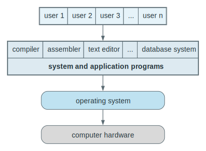

### 2.2 Computer-System Organization

The computer system is organized around a small set of recurring control paths. Bootstrapping begins with firmware logic that initializes enough of the machine to load the kernel. After boot, interrupts let devices and timers signal that something requires attention, while traps and exceptions provide the synchronous software-driven path back into the kernel. Device drivers hide controller-specific detail from the rest of the OS, and DMA improves I/O efficiency by allowing large data transfers to occur between memory and devices without forcing the CPU to copy every word itself.

The same section explains why storage is hierarchical rather than uniform. Faster storage is smaller and more expensive, while slower storage is larger and cheaper. Main memory is directly usable for execution but is volatile and limited. Secondary storage is persistent and larger, but slower. Caches improve average performance by keeping useful data closer to the CPU, but they also create multiple copies of the same logical data, which means the system must later solve consistency and coherence problems.

The main structural limitation is contention. Shared buses, memory channels, and device paths mean CPUs and controllers compete for access. Interrupt-per-byte transfer scales badly because the CPU spends too much time servicing tiny events, which is why DMA exists. The broader interpretation is that Chapter 1 treats the machine as a coordinated flow of control and data: boot code loads the kernel, devices announce completion, controllers move information, and the operating system keeps the whole path coherent despite competing costs in speed, capacity, and persistence.

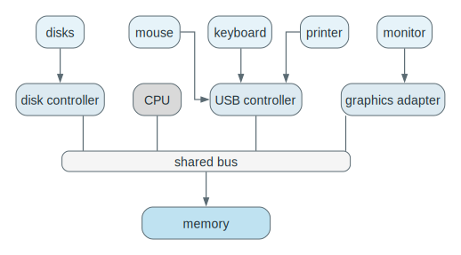

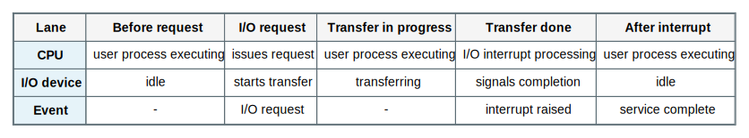

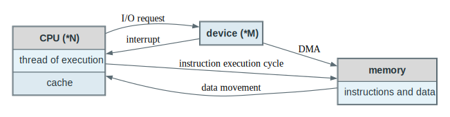

### 2.3 Computer-System Architecture

Computer-system architecture changes the shape of the OS problem by changing how many execution engines exist and how tightly they are coupled. In a single-processor system, only one general-purpose CPU executes user work at a time even though many specialized controllers may exist. In a multiprocessor system, the machine can execute more work in parallel. SMP treats processors as peers sharing memory, while clustered systems scale further by connecting independent machines through a network, often with shared storage or coordinated failover behavior.

The limitation is that more processors do not automatically mean proportional speedup. Coordination costs rise. SMP introduces cache, memory, and I/O coordination problems, and NUMA means that once systems scale, memory behavior may stop being uniform across processors. Clusters increase availability and aggregate capacity, but they also push more responsibility onto software for communication, failover, and distributed coordination. The key interpretation is that architecture is not only about counting CPUs. It is about understanding how tightly processors, memory, and machines are coupled, because that coupling determines what the operating system must coordinate.

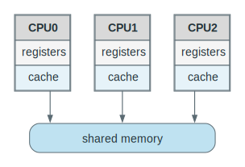

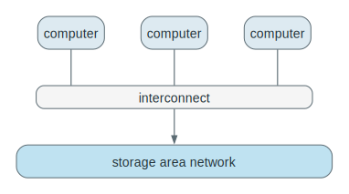

### 2.4 Operating-System Structure and Operations

The operating system becomes structurally interesting as soon as more than one job matters. Multiprogramming keeps several jobs in memory so the CPU can switch away from one that is waiting for I/O and continue making progress on another. Time sharing sharpens that same mechanism for interactive use by switching rapidly enough that users experience the machine as responsive rather than blocked behind long runs. Dual-mode execution separates ordinary program execution from privileged operating-system execution, while system calls, traps, and interrupts provide the controlled paths by which control enters the kernel. Timers complete the picture by forcing the OS to regain control even if user code would otherwise run indefinitely.

Those mechanisms immediately create structural pressure. Once several jobs are resident, the system must schedule them, manage memory among them, synchronize access to shared state, and protect them from one another. Response time depends on how well the OS handles switching and memory pressure, and without hardware-enforced privilege separation one bad user program can corrupt the entire machine. The essential interpretation is simple: multiprogramming solves idle CPU time, time sharing solves user waiting time, and dual mode plus timers solve control and safety.

### 2.5 Process, Memory, and Storage Management

Process, memory, and storage management are the core mechanisms by which the OS turns hardware into a usable execution environment. A process is an executing program together with its state and resources. Memory management tracks what is resident, what must be loaded, and what can be removed. File-system management presents logical files and directories rather than raw device geometry, while mass-storage management handles space allocation, free-space tracking, and disk scheduling. Caching then improves performance by keeping useful copies of data closer to where they will be needed.

The structural limits here are fundamental. A program cannot execute directly from disk; it must be brought into memory. Main memory is finite, so multiprogramming forces the OS to make replacement and allocation decisions under pressure. Caching improves average latency, but it also creates stale-copy problems, and those become harder when multiple processors or distributed components may observe or modify different copies. The right interpretation is that storage management is not only a capacity problem. It is also a consistency problem, because the same logical data item may exist in several places at once and the OS must know which copy is authoritative.

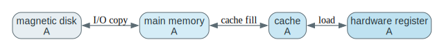

### 2.6 Protection and Security

Protection and security answer related but different questions. Protection controls access to CPU, memory, files, and devices by defining who is allowed to do what. Security is broader: it defends the system against misuse, theft, malware, hostile access, and compromise. User IDs and group IDs give the operating system a consistent way to bind actions to identities, and privilege-escalation mechanisms provide carefully controlled paths for temporary access beyond normal permissions when policy allows it.

The limitation is that protection alone does not guarantee safety. A perfectly protected system can still fail if valid credentials are stolen or trusted software is compromised. Security therefore cannot be reduced to access rules alone; it also requires trust, authentication, auditing, and resistance to attack. The shortest way to remember the distinction is that protection asks who is allowed, while security asks how the system remains safe even when something goes wrong or someone is actively hostile.

### 2.7 Kernel Data Structures

Kernel data structures matter because the OS spends a large amount of time organizing state rather than doing numerical computation. Lists are useful when ordering changes often and insertion or removal is common. Stacks naturally model nested control flow such as function invocation. Queues model waiting and scheduling. Trees support hierarchical organization and ordered lookup. Hash maps support fast key-based lookup when the hash function distributes entries well, and bitmaps compress large yes-or-no availability tables into compact form.

Each structure brings its own limits. Linked-list lookup is linear in the worst case, a binary search tree can degrade toward linear behavior if it becomes unbalanced, hashing degrades as collisions increase, and bitmaps are only meaningful if the mapping from bit positions to resources remains correct. The deeper interpretation is that the kernel chooses structures by access pattern, not by aesthetic preference. If the dominant operation is frequent insertion and removal, one structure fits better; if it is dense status tracking or direct key lookup, another does.

### 2.8 Computing Environments

Computing environments extend the same operating-system questions into larger or more specialized settings. Distributed systems join separate machines through networking. Client-server computing centralizes service provision, while peer-to-peer computing distributes both demand and supply across peers. Virtualization allows one hardware platform to host multiple isolated guest environments, and cloud computing packages remotely managed computation and storage as network services. Real-time embedded systems add fixed timing requirements and often operate with minimal interfaces and tighter control assumptions.

Each environment shifts the operating-system tradeoffs. Client-server designs simplify control but can concentrate bottlenecks and failure points. Peer-to-peer designs reduce some central dependence but make discovery, coordination, and policy harder. Virtualization improves reuse and isolation but adds a management layer and some overhead. Cloud systems move local hardware management into service management, which changes trust and control boundaries. Real-time systems change the definition of correctness itself, because producing the right output too late still counts as failure. The broad interpretation is that computing environments differ mainly in where control lives, how resources are shared, and how strict the timing and reliability requirements are.

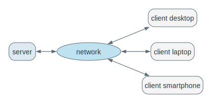

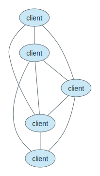

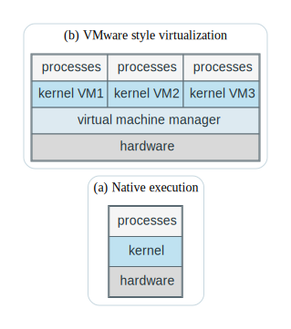

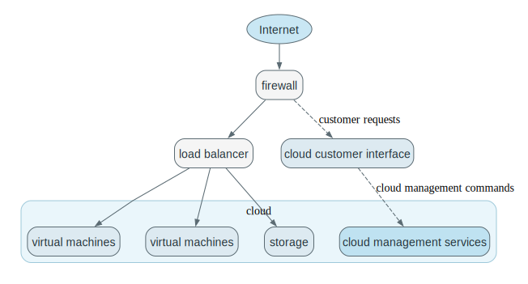

### 2.9 Open-Source Operating Systems

Open-source operating systems publish their source code so others can study, modify, rebuild, and distribute it under the applicable license. For learning, that matters because it turns operating systems from descriptions into inspectable systems. Instead of only reading that schedulers, memory managers, file systems, and protection mechanisms exist, you can look directly at how real implementations represent state and enforce policy.

The limitation is that openness does not remove bugs or complexity. It changes the speed and style of discovery and repair, but real operating-system codebases are still large, historically layered, and difficult to read without conceptual guidance. The important interpretation is that source availability changes the mode of study: once code is visible, operating systems stop being only abstractions and become systems you can inspect, trace, and eventually modify.

## 3. If You Remember Only the Fundamentals

1. The operating system exists to make hardware usable, shareable, and safe.
2. The kernel is the privileged always-running core; system calls are the normal entry path into it.
3. Interrupts, traps, and timers are how control returns to the operating system.
4. Multiprogramming keeps the CPU busy; time sharing keeps users responsive.
5. Faster storage is smaller and more expensive; slower storage is larger and more persistent.
6. Caching improves speed by copying data upward, which creates consistency problems that must be managed.
7. More processors improve throughput only if the system can manage contention, coordination, and memory effects.
8. Protection and security are related but not identical: authorization is not the whole defense story.
9. Kernel data structures matter because operating-system performance is mostly about how state is organized and accessed.
10. Distributed systems, virtualization, cloud systems, and embedded real-time systems are not side topics. They are different answers to the same question: how should computation be organized and controlled?

## 4. Fundamental Questions

Use these as review, recitation, or self-test questions for Chapter 1.
They are intentionally filtered toward operating-system fundamentals: control, protection, concurrency, memory, storage, and the environments that change those problems.

### 4.1 Operating-System Role

1. What is an operating system?
2. Why is an operating system needed between hardware and application programs?
3. What is the difference between the operating system, the kernel, system programs, and application programs?
4. Why is there no single universally accepted definition of what belongs to an operating system?
5. How does the user view of an operating system differ from the system view?
6. In what sense is the operating system a resource allocator?
7. In what sense is the operating system a control program?
8. Why do mobile operating systems often include middleware in addition to a kernel?
9. Why do operating systems for embedded systems differ from those for desktops or servers?
10. What tradeoff often exists between convenience and efficiency in operating-system design?

### 4.2 Computer-System Organization

11. What components make up a general-purpose computer system?
12. What is the role of a device controller?
13. Why can the CPU and device controllers execute in parallel?
14. Why is a memory controller needed?
15. What is the bootstrap program, and where is it usually stored?
16. What is firmware, and how does it differ from ordinary volatile memory?
17. Why must the bootstrap program know how to load the kernel?
18. After the kernel starts, what additional system components are typically loaded?
19. What kinds of events cause interrupts?
20. What is the difference between a hardware interrupt and a software interrupt?
21. Why does an interrupt architecture need to save the address of the interrupted instruction?
22. Why must processor state sometimes be saved and restored during interrupt handling?
23. Why is vectored interrupt handling useful?
24. Why is DMA better than interrupt-driven transfer for bulk data movement?
25. How does a device driver help isolate the rest of the operating system from device-specific details?

### 4.3 Storage Hierarchy and I/O

26. Why are registers, cache, memory, and disks arranged as a hierarchy?
27. What tradeoff connects speed, capacity, cost, and persistence in storage design?
28. What is the difference between volatile and nonvolatile storage?
29. Why is main memory not sufficient by itself?
30. Why is secondary storage considered an extension of main memory?
31. What role does tertiary storage play?
32. What is caching?
33. Why does caching improve average performance?
34. Why can the same data exist in multiple places in the storage hierarchy at once?
35. What consistency problem appears when data is updated in only one copy first?
36. What is cache coherency, and why is it especially important in multiprocessor systems?
37. Which storage movements are usually handled by hardware, and which are often handled by the operating system?
38. What are the major components of the I/O subsystem?
39. What is buffering?
40. What is spooling?

### 4.4 Computer-System Architecture

41. What makes a system single-processor rather than multiprocessor?
42. Why do special-purpose controllers not by themselves make a system multiprocessor?
43. What are the main advantages of multiprocessor systems?
44. Why is speedup with N processors usually less than N?
45. What is graceful degradation?
46. What is fault tolerance?
47. What is the difference between asymmetric multiprocessing and symmetric multiprocessing?
48. Why is SMP the dominant shared-memory model?
49. What inefficiencies can arise even in SMP systems?
50. What is NUMA, and why does it matter?
51. What makes a multicore system a special case of a multiprocessor system?
52. Why can multicore chips be more efficient than several separate single-core chips?
53. How do clustered systems differ from tightly coupled multiprocessor systems?
54. Why is shared storage often central to clustering?
55. What is the purpose of failover in clustered systems?
56. How does a cluster support high availability?
57. Why must cluster-aware applications often be written differently from single-machine applications?

### 4.5 Operating-System Structure and Control

58. What is multiprogramming?
59. Why does multiprogramming increase CPU utilization?
60. What is the job pool?
61. Why can the CPU remain busy when one job waits for I/O?
62. What is time sharing?
63. How does time sharing extend multiprogramming?
64. Why is response time a central requirement in time-sharing systems?
65. Why do time-sharing systems require scheduling?
66. Why do time-sharing systems require memory management?
67. Why do they also require synchronization, communication, and deadlock handling mechanisms?
68. Why is virtual memory useful in a time-sharing environment?
69. How does virtual memory separate logical memory from physical memory?
70. Why does the operating system need to stay in control of the CPU?
71. What is a trap, and how does it differ from a normal interrupt?
72. Why must the operating system protect itself from buggy or malicious user programs?

### 4.6 Modes, System Calls, and Timers

73. What is user mode?
74. What is kernel mode?
75. What problem does dual-mode operation solve?
76. What is the mode bit?
77. Why are some instructions designated as privileged?
78. What happens if user code attempts to execute a privileged instruction?
79. Why do system calls require a transition from user mode to kernel mode?
80. What is the normal life cycle of control transfer during a system call?
81. Why does the kernel validate system-call parameters?
82. Why is the timer a protection mechanism as well as a scheduling tool?
83. How does a timer prevent infinite CPU monopolization by a user program?
84. Why must timer-setting instructions be privileged?
85. How can the CPU support more than two privilege levels?
86. Why do virtualized systems often require an additional level of privilege management?

### 4.7 Process Management

87. What is a process?
88. Why is a program by itself not a process?
89. What makes a process an active entity?
90. What resources does a process need?
91. What initialization information may be passed to a process?
92. What is the role of the operating system in creating and deleting processes?
93. Why are suspension and resumption important operating-system services?
94. Why does concurrent execution require process synchronization?
95. Why does concurrent execution require process communication?
96. How do user processes differ from operating-system processes?
97. How does a multithreaded process differ from a single-threaded process at a high level?

### 4.8 Memory Management

98. Why must instructions and data be loaded into main memory before execution?
99. Why is main memory considered central to system operation?
100. Why do general-purpose systems keep multiple programs in memory simultaneously?
101. What responsibilities does the operating system have in memory management?
102. Why must the operating system track who is using each part of memory?
103. Why must parts of processes sometimes move into and out of memory?
104. Why does memory-management strategy depend on hardware support?
105. What is the difference between logical memory as viewed by the programmer and physical memory as installed in the machine?

### 4.9 Storage Management

106. What is a file?
107. Why is the file abstraction useful?
108. Why are directories needed?
109. What file-related activities are operating systems responsible for?
110. What disk-related activities are operating systems responsible for?
111. Why does disk scheduling matter to overall system performance?
112. Why is storage allocation a core operating-system problem?
113. Why is free-space management necessary?
114. Why must files be mapped onto physical media?
115. Why do systems need backup and archival storage in addition to online storage?

### 4.10 Protection and Security

116. What is protection?
117. What is security?
118. Why are protection and security related but not identical?
119. How does memory-addressing hardware contribute to protection?
120. How does the timer contribute to protection?
121. Why are device-control registers inaccessible to ordinary users?
122. Why can a system have adequate protection and still be insecure?
123. Why does authentication matter even if file permissions are correct?
124. What is a user ID, and why is it attached to processes and threads?
125. What is a group ID, and why is it useful?
126. Why might a process need privilege escalation?
127. What is the conceptual purpose of mechanisms like `setuid`?
128. Why is operating-system security an ongoing implementation and research problem?

### 4.11 Kernel Data Structures

129. Why are arrays not always sufficient for kernel data management?
130. What is the main conceptual advantage of a linked list?
131. What is the main lookup disadvantage of a linked list?
132. When is a singly linked list enough?
133. What extra capability does a doubly linked list provide?
134. Why is a circular linked list useful in cyclic traversal or scheduling contexts?
135. What is the difference between a stack and a queue?
136. Why does a stack match function-call behavior?
137. Why do queues appear naturally in scheduling and I/O?
138. What is a tree?
139. What constraint defines a binary tree?
140. What additional constraint defines a binary search tree?
141. Why can a binary search tree degrade to linear-time lookup?
142. Why does balancing matter in tree performance?
143. What does a hash function do?
144. Why can hashing approach constant-time retrieval?
145. What is a hash collision?
146. How can collisions be handled?
147. What is a hash map?
148. Why are bitmaps so space-efficient?
149. Why are bitmaps useful for tracking resource availability?

### 4.12 Computing Environments

150. What is a distributed system?
151. Why does networking become fundamental in distributed systems?
152. How do LANs, WANs, and PANs differ at a high level, and why do those differences matter?
153. How does a client-server system organize responsibility?
154. What is the main idea behind peer-to-peer computing?
155. Why can peer-to-peer systems avoid some client-server bottlenecks?
156. Why is virtualization useful even when modern operating systems already support multiprogramming well?
157. What is the difference between emulation and virtualization?
158. What is the role of the virtual machine manager?
159. Why is cloud computing a logical extension of virtualization and remote resource management?
160. Why can cloud-management software be viewed as operating-system-like control software?
161. What is an embedded system?
162. What makes a real-time system different from an ordinary time-sharing system?
163. Why is meeting the deadline part of correctness in real-time systems?

### 4.13 Open-Source Operating Systems

164. What is an open-source operating system?
165. Why is source-code availability especially valuable for learning operating systems?
166. Why is reverse engineering binaries an inferior substitute for source access?
167. Why are open-source systems useful as experimentation platforms for students?
168. Why does open source change operating-system study from passive reading to active inspection and modification?
