# Chapter 1 Fundamentals Mastery

Source: Chapter 1 of `textbook.pdf` (Operating System Concepts, 9th ed.).

This is the canonical Chapter 1 note in this repo.
It is written for operational mastery: mechanisms, invariants, failure modes, and traces you can reproduce from memory.

If you are short on time, skim `## 2. Mental Models To Know Cold`, reproduce the traces in `## 4. Canonical Traces To Reproduce From Memory`, and cover the `One Trace: launching a program` table in `### 3.1` once.

## 1. What This File Optimizes For

The goal is not to remember many terms.
The goal is to be able to do the following without guessing:

- Trace how control moves from user code into the kernel and back (syscall, trap, interrupt).
- Explain why the OS requires a timer, privilege separation, and interrupt/trap handling.
- Enumerate what state must be saved and restored at a context switch, and why each piece exists.
- Explain why copying data upward in the storage hierarchy creates coherence and authority problems.
- Predict what new coordination costs appear when you add processors or machines.
- State the invariant the kernel enforces at each major boundary (CPU time, memory mappings, I/O, storage).

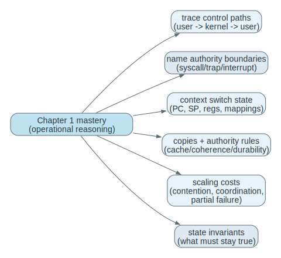

For Chapter 1, "dangerous" means:

- you can trace a mechanism step by step
- you can state what must remain true for the mechanism to work
- you can predict what breaks when a mechanism is missing
- you can connect the abstraction to code you would later inspect in a real kernel

This file is organized to support that skill directly: each module names a **Problem**, explains the **Mechanism**, states the **Invariants**, shows **What Breaks If This Fails**, and gives a **Trace** you can rehearse. If you can reproduce the traces from memory and explain why each step exists, later chapters feel like added detail instead of new mysteries.

Later chapters should deepen these mechanisms, not rescue undefined language here.

## 2. Mental Models To Know Cold

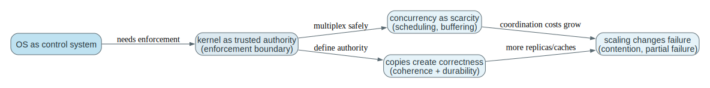

### 2.1 The OS Is a Control System

The operating system is the machine's control layer, not merely a list of services.
Its role is to decide which computation runs, which computation waits, which resource each computation may access, which copy of data is current, and when control must return to privileged code.

If you remember only one idea, remember this:
raw hardware can execute instructions, but raw hardware cannot enforce shared rules by itself.

To "see" a control system, imagine a feedback loop: unprivileged code runs until something forces a return to privileged code (timer, interrupt, fault, syscall). The kernel then observes state (queues, mappings, device completion), applies rules (scheduling, protection), updates authoritative structures, and returns to user mode. The OS is not watching continuously; it is regaining control at specific entry points and using those moments to enforce system-wide invariants.

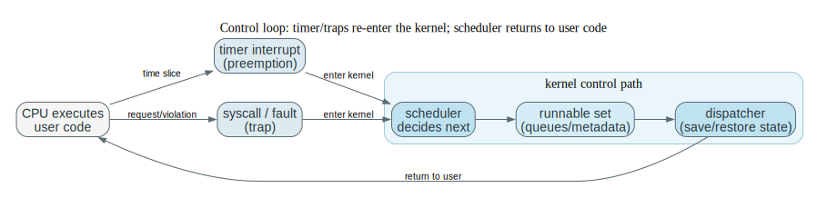

### 2.2 The Kernel Is the Trusted Authority

The operating system in the broad sense includes many layers and tools.
The kernel is the privileged component of that system.
Its role is to hold authoritative machine state and enforce rules that ordinary programs cannot enforce for themselves.

Applications request work.
The kernel validates the request and updates protected state.
That asymmetry is the foundation of protection.

When you read "the OS decides X," translate it into "privileged code updated authoritative state Y at boundary Z." Examples of authoritative state include ready queues (who can run), page tables (what memory is accessible), filesystem metadata (what names map to what blocks), and credentials (who may do what). This is also why the trusted computing base matters: any bug in privileged code can violate invariants globally, while most user-space bugs are contained.

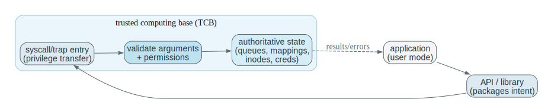

### 2.3 Concurrency Is Mostly About Scarcity

There are always fewer immediately usable resources than the system would like:
one CPU, limited RAM, a finite number of devices, finite bandwidth, finite latency budgets.

Scheduling, buffering, caching, and virtualization are all different ways of coping with scarcity while preserving the illusion of abundant progress.

Scarcity forces the kernel to represent "who is waiting for what" explicitly. A blocked computation is not "doing nothing"; it is a kernel record (queue membership + a wakeup condition) that lets the CPU run someone else without losing the blocked computation's identity or resources. This is the thread that connects scheduling, I/O completion interrupts, and later synchronization: progress is managed by queues and wakeups, not by hope.

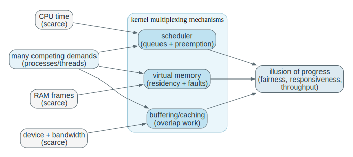

### 2.4 Copies Create Correctness Problems

The moment the same logical data exists in more than one place, the problem is no longer only storage or speed.
It becomes a correctness question: the system must define which copy is authoritative, when another copy is stale, and what rule makes an update visible.

This idea shows up in caches, page caches, DMA buffers, distributed systems, and replicated services.

If you want a concrete mental check, ask a power-loss question: "If the machine lost power right now, which copy would be considered the truth when it comes back, and why?" The answer is never "whichever one is newest" by magic; it is defined by explicit rules (coherence protocols for caches, writeback/commit rules for storage, ordering rules for journaling). Later chapters mostly refine these rules; the fundamental problem is already here.

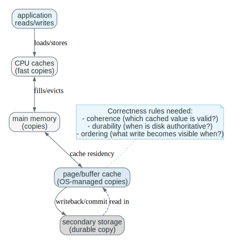

### 2.5 Scaling Changes The Shape Of Failure

Adding processors or machines changes the object being coordinated.
On a single CPU, the OS mainly multiplexes one execution resource.
On an SMP machine, the kernel coordinates shared-memory execution across multiple CPUs and is responsible for synchronization, cache-coherence effects, and placement.
In a cluster or distributed system, the coordinating software manages separate machines and is responsible for communication, partial-failure handling, and cross-node agreement.

Scaling adds new constraints, not just more throughput. Shared-memory parallelism adds contention and visibility problems (races, coherence, locality). Distributed systems add partial failure and time uncertainty (timeouts, partitions, inconsistent views). Real-time adds deadlines, where "late" is incorrect. The point of this mental model is to expect new invariants as soon as you add CPUs or machines: coordination becomes part of correctness, not optional optimization.

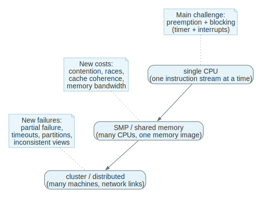

### 2.6 If You Remember Only 10 Things

Treat this list as retrieval cues, not as a memory test. Each line should make you think of a trace (boot, syscall entry, interrupt completion, timer preemption, copy/writeback) and the invariant it exists to enforce.

1. The operating system exists to make hardware usable, shareable, and safe.
2. The kernel is the privileged always-running core; system calls are the normal entry path into it.
3. Interrupts, traps, and timers are how control returns to the operating system.
4. Multiprogramming keeps the CPU busy; time sharing keeps users responsive.
5. Faster storage is smaller and more expensive; slower storage is larger and more persistent.
6. Caching improves speed by copying data upward, which creates consistency problems that must be managed.
7. More processors improve throughput only if the system can manage contention, coordination, and memory effects.
8. Protection and security are related but not identical: authorization is not the whole defense story.
9. Kernel data structures matter because operating-system performance is mostly about how state is organized and accessed.
10. Distributed systems, virtualization, cloud systems, and embedded real-time systems are different answers to the same control question.

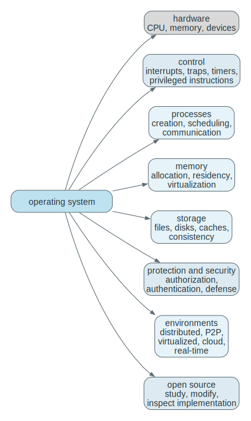

Use this map as a retrieval tool, not as a poster.
Pick one node (e.g., “timer preemption” or “copies/authority”), then explain the mechanism, the invariant, and the failure mode it introduces in your own words without looking.
If you can traverse the map and justify the edges (“why does this imply that?”), you have Chapter 1 mastery.

## 3. Mastery Modules

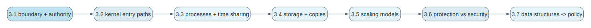

### 3.1 OS Boundary And Kernel Authority

**Problem**

Useful programs need access to memory, CPU time, files, and devices.
If every program controlled hardware directly, one buggy or malicious program could corrupt the whole machine.

**Mechanism**

User-facing software runs mostly without hardware privilege.
The kernel runs with privilege and exposes controlled entry paths through system calls, traps/faults, and interrupts.
System programs and middleware make the environment usable, but they do not replace the kernel's authority.

Operational definitions that stay stable across OSes:

- `Operating system`: the overall resource-management and service environment.
- `Kernel`: the privileged core that enforces rules and holds authoritative state.
- `System program`: user-space utility/daemon that packages workflows but does not have kernel privilege.
- `Application`: user goal software, not responsible for global control.
- `Middleware`: shared libraries/runtimes above the kernel that standardize common capabilities.

**Why This Section Exists**

Chapter 1 cannot proceed with “processes,” “files,” or “scheduling” until we settle a more basic question: *where does authority live?*
If you do not know which component is allowed to change page tables, program I/O devices, or decide who runs next, every later abstraction becomes ambiguous.
This section exists to force a clean separation between (1) user intent and convenience logic and (2) the privileged machinery that enforces system-wide invariants even when programs are buggy or adversarial.

**The Object Being Introduced (The Boundary, Not A Vocabulary Word)**

The main object here is the **kernel boundary**: the line that separates code that may directly mutate protected machine state from code that may only request such mutations.
That boundary is not “a design preference.” It is the only place where the OS can reliably enforce global rules, because it is the only place where:

1. the CPU guarantees privilege (user mode cannot execute certain instructions),
2. the OS can validate untrusted inputs before they reach authoritative state, and
3. the OS can regain control (timer/interrupts/traps) even if a program never cooperates.

Everything else in the operating system ecosystem (shells, libraries, daemons, window systems) is important, but it is important for *interface and policy packaging*, not for being the final authority.

**Formal Definition**

Definition (kernel boundary): A system has a kernel boundary if there exists a privileged execution mode and a controlled entry/exit mechanism such that unprivileged code cannot directly execute privileged instructions or directly mutate protected machine state, and all privileged effects must occur in privileged code after validation.

**Interpretation**

Read that definition operationally: “If you want to change something the system must protect (who runs, what memory is accessible, what device is programmed, which file metadata is authoritative), you must cross into kernel mode through a narrow gate, and the kernel decides whether the request is allowed and how it will be realized.”
The boundary is therefore both a *protection boundary* and a *meaning boundary*.
It is the point where “a number in a register” becomes “a descriptor that names a kernel object,” where “a pointer” becomes “a claim that must be checked,” and where “a user-level plan” becomes “a system-wide state transition.”

**Boundary Conditions / Assumptions / Failure Modes**

This story assumes hardware support for privilege and controlled entry.
If the CPU cannot distinguish user from kernel mode, then “the OS” becomes a convention, and any program can become the OS by writing to device registers or memory mappings directly.
If the kernel boundary exists but does not validate inputs, the boundary becomes a funnel for exploitation: untrusted pointers and sizes become a way to corrupt kernel memory or leak secrets.
If the kernel cannot regain control (for example, no timer interrupt), a single program can monopolize execution and the OS cannot enforce fairness or responsiveness.

**Fully Worked Example: Why The Shell Cannot Be “The OS”**

Suppose the shell were the only “control” program and there were no privileged kernel boundary.
A user runs a normal command and the shell launches it.
Now that program runs and executes a tight infinite loop. What can the shell do?

1. The shell is not running; it only runs when scheduled.
2. Without a timer interrupt that forces control back to privileged code, the looping program can keep the CPU indefinitely.
3. Even if the shell *could* run, it has no privileged instruction to stop the other program safely, and no authoritative state to enforce memory protection or device access.

So the shell cannot be the OS because it lacks enforceable authority: it is a normal process competing for the same CPU and living under the same constraints as every other program.
Only a privileged resident kernel, reached through traps/interrupts and armed with a timer, can guarantee “someone else gets to run” and “one process cannot rewrite another’s memory.”

**Misconception Block: OS vs Kernel**

Do not confuse “the OS experience” with “the kernel.”
Users often say “the OS did X” when a user-space service did it (a shell, a window system, a daemon).
That language is fine socially, but it is disastrous for reasoning.
When reasoning, ask: did this effect require privileged state changes?
If yes, the kernel (or some privileged component) must have been involved.
If no, it can live entirely in user space and be replaced without changing kernel authority.

**Connection To Later Material**

This boundary is the spine of the entire course:

- Chapter 2 will explain how interfaces (GUI/CLI/APIs) package intent but converge on the same privileged enforcement boundary.
- Chapter 3 will rely on the boundary to define a process as a resumable execution container whose state can be saved/restored by the kernel.
- Chapters 4 and 5 will rely on the boundary to explain why blocking, wakeups, and scheduling are kernel-mediated, and why synchronization must preserve invariants even under preemption and interrupts.

**Retain / Do Not Confuse**

Retain: the kernel boundary is the unique place where the system can validate and commit protected effects to authoritative state.
Do not confuse: shells/libraries/daemons (interfaces and policy packaging) with the kernel (authority and enforcement).

**Invariants**

- Only privileged code may perform privileged operations.
- User code may request service, but cannot directly enforce global policy.
- The kernel must remain able to regain control without relying on user cooperation.
- The authoritative machine state lives in privileged structures, not in user memory alone.

**What Breaks If This Fails**

- Without privilege separation, user code can overwrite device state, disable timers, or corrupt memory mappings.
- Without a standard kernel entry path, applications become hardware-specific and fragile.
- Without a trusted resident core, no global resource policy can be enforced consistently.

**One Trace: launching a program**

Read this as a control and authority trace, not as “shell trivia.”
The shell expresses intent (parse a command, choose an executable), but the kernel is the only actor that can create a new execution context and install the initial machine state that makes the program *run*.
When you rehearse this trace from memory, say out loud (1) when you cross the user/kernel boundary, and (2) what privileged state is being constructed or validated at each kernel step.

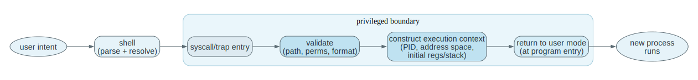

| Step | User / Process Side | Kernel Side | Why It Matters |
| --- | --- | --- | --- |
| 1 | user enters a command in a shell | kernel is idle until asked | work begins in user space |
| 2 | shell asks to run another program | syscall/trap transfers control into kernel mode | launch crosses the protection boundary |
| 3 | shell waits for result | kernel validates path, permissions, executable format | authority lives in kernel |
| 4 | shell still in user space or blocked | kernel creates process + address-space state | a program becomes an executing entity via kernel setup |
| 5 | new process gets initial registers and stack | kernel sets return point to user entry | execution context is explicitly constructed |
| 6 | new process begins executing | kernel returns to user mode | privilege is dropped after setup |

The table is intentionally “boring”: it is the same control handoff every OS must perform.
Mastery is being able to name the privileged *state constructed* (identity, address space, initial registers/stack) and the privileged *checks enforced* (permissions, executable format) before the kernel can safely return to user mode.

**Code Bridge**

- In a teaching kernel, inspect the path from shell command parsing to `exec`.
- Identify where permission checks occur, where memory is allocated, and where control returns to user mode.

**Drills (With Answers)**

1. **Q:** Why is the shell not enough by itself to manage the machine safely?
**A:** The shell is an ordinary user process. It cannot execute privileged instructions, cannot enforce memory protection, cannot program the timer, and cannot prevent another process from bypassing it. Only the kernel can be the central authority because only it runs with hardware privilege.

2. **Q:** What exact power does the kernel have that a normal process does not?
**A:** Kernel code executes in a privileged CPU mode. It can change page tables, handle interrupts/traps, program device controllers and timers, and access protected hardware state. That is what makes enforcement possible rather than “by convention.”

3. **Q:** If user programs could directly edit page tables, what would break first?
**A:** Isolation and protection. A process could map and modify another process’s memory (or kernel memory), steal credentials, corrupt the kernel’s authoritative state, and effectively escape any security policy.

### 3.2 How Control Enters The Kernel

**Problem**

The kernel cannot manage anything unless control can reliably reach it:
at boot, on hardware events, on deliberate requests for service, and on faults.

**Mechanism**

Boot starts with firmware and bootstrap code, which load the kernel before the normal software environment even exists.
After boot, there are three main paths into the kernel:

- `system call`: deliberate request by user code
- `interrupt`: asynchronous external event such as timer expiry or device completion
- `trap/exception`: synchronous event caused by the current instruction stream, such as a fault

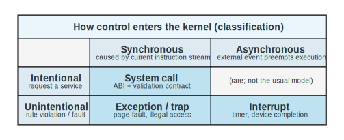

**Why This Section Exists**

Once you accept that the kernel boundary is where authority lives, you immediately hit the next question: *how does control reach the kernel at the moments it must act?*
If the kernel only ran when applications politely asked, it could not enforce fairness (runaway loops), could not respond to devices (I/O completion), and could not handle protection violations (illegal memory access).
This section exists to make kernel entry feel like a small set of repeated control shapes rather than like a bag of unrelated terms.

**The Object Being Introduced**

The key object is a **kernel entry event**: a hardware-supported transition that (1) moves execution into privileged code and (2) leaves behind a resumable record of what was interrupted.
The “resumable record” is what makes the control system stable: the kernel can intervene without destroying the interrupted computation unless it chooses to.

**Formal Definitions**

Definition (system call): a deliberate, synchronous request by user code that triggers a controlled transfer to privileged code through a defined ABI so the kernel can validate the request and perform a protected operation.

Definition (interrupt): an asynchronous hardware event that forces control transfer to privileged code (typically to report timer expiration or device completion) regardless of what instruction stream is running.

Definition (trap/exception): a synchronous event raised by the current instruction stream when an instruction cannot proceed under the current protection/translation state (e.g., invalid memory access, divide-by-zero, or a page fault).

Definition (trap frame): a saved snapshot of enough CPU state (PC/flags/registers and related metadata) to resume or terminate the interrupted instruction stream correctly after privileged handling.

**Interpretation**

The difference between these paths is not “which buzzword you use.”
It is *who initiated the boundary crossing and why*:

- syscalls exist because user intent must be converted into privileged state change under validation,
- interrupts exist because external reality (time and devices) must be reflected into kernel state even if user code does not cooperate,
- traps exist because hardware must stop illegal or impossible actions and give the kernel a chance to enforce protection or to repair state (in later VM designs).

All three paths share one structural invariant: the kernel must be able to return safely, and that requires saved state (a trap frame) plus disciplined handler code.

Useful distinctions:

- `asynchronous`: not caused by the instruction currently executing
- `synchronous`: caused directly by the instruction currently executing
- `instruction stream`: the ordered sequence of machine instructions executing for the current computation

Timers guarantee preemption.
`DMA` lets the kernel start an I/O transfer and then let a device controller move a bulk block of bytes between a device buffer and main memory without forcing the CPU to copy each word manually.
The kernel still must coordinate ownership of buffers, record completion, and wake any process waiting for the transfer.

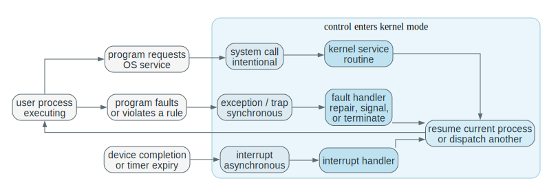

**Boundary Conditions / Assumptions / Failure Modes**

All of this assumes the kernel entry path is correct and minimal:
it must save enough state to return correctly, it must not trust user inputs, and it must not lose events.
If interrupts can be lost without being buffered, device completions and wakeups can vanish, producing hangs that look like “mysterious randomness.”
If traps are not distinguished from interrupts, the kernel cannot apply correct policies (a page fault is not a timer tick; a divide-by-zero is not a disk completion).
If the syscall ABI is inconsistent, user-space wrappers and kernel handlers cannot agree on what request is being made.

**Worked Example: A Page Fault As “Fault And Repair,” Not “Fault And Die”**

Take a user instruction that loads from a virtual address `v`.
If the MMU cannot translate `v` under the current mappings, it raises a page fault trap.
At that moment, the kernel has a choice:

1. If the access is illegal (violates permissions), the kernel should reject it (signal/terminate), because resuming would break protection.
2. If the access is legal but the page is not resident (later virtual memory chapters), the kernel can *repair* the world: allocate or page-in the data, install the mapping, then return to the same instruction so it can retry and succeed.

The conceptual leap is that faults are not merely error reports; they are control events that let the kernel enforce or restore invariants.
Later, demand paging uses this mechanism to make “large memory” an illusion built from “fault, fetch, resume” cycles.

#### I/O Completion: Polling vs Interrupts

When the kernel (or a driver) starts I/O, it must later learn when it is done.
Lecture 1 emphasizes two completion styles:

- `polling`: the CPU repeatedly checks a device status flag in a loop
- `interrupts`: the device raises an interrupt when the operation completes

Polling is simple but wastes CPU time under latency.
Interrupt completion preserves CPU for other runnable work, at the cost of interrupt delivery and handler overhead.

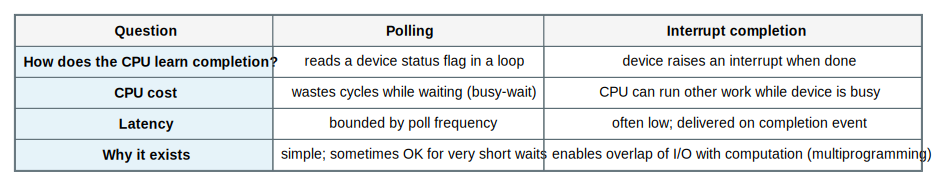

#### Interrupt Dispatch: Polling All Devices vs An Interrupt Vector Table

After the CPU takes an interrupt, the OS must decide *which* device/event caused it.
Two common shapes:

- `interrupt-handler polling`: a generic handler runs, then checks devices to discover the cause
- `interrupt vector table`: hardware indexes to a specific handler for a specific interrupt source

The vector table is part of the trusted control plane: if a user process could rewrite it, it could redirect control to arbitrary code in privileged context.

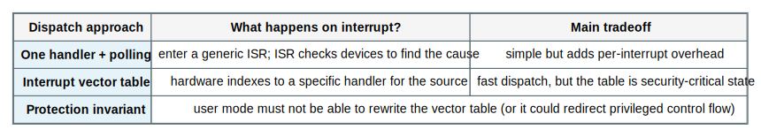

#### Interrupt Concurrency: Masking vs Nested Interrupts

While the kernel is handling one interrupt, a new interrupt can arrive.
Systems choose among policies:

- `masking`: temporarily disable (mask) some or all interrupts while handling one
- `nesting`: allow higher-priority interrupts to preempt the current handler

Masking simplifies reasoning but risks lost/buffered interrupts and longer latency.
Nesting reduces latency but increases concurrency complexity inside the kernel.

#### Interrupt Handling Is A Save-Handle-Restore Protocol

The phrase “an interrupt transfers control to the interrupt service routine” hides the critical invariant:
the OS must be able to **return** to the interrupted computation as if the interrupt were a brief detour, not a corruption event.

Operationally, an interrupt handler is a protocol:

1. **save** enough CPU state to resume the interrupted instruction stream
2. **handle** the device/timer event in privileged code
3. **restore** the saved state and return to user mode (or to the kernel code that was interrupted)

The saved record is often called a `trap frame`.
If interrupts are allowed to nest, you must assume there can be multiple trap frames stacked in time order: “interrupt A interrupted user code; interrupt B interrupted interrupt A,” and so on.
Masking is the mechanism that reduces (or eliminates) such reentrancy pressure.

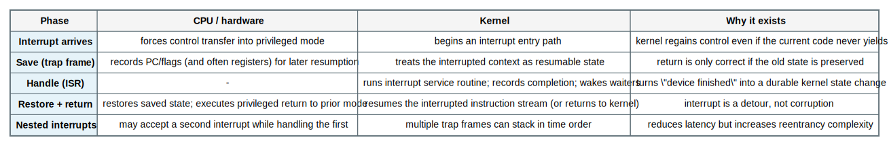

**Worked Example: One Disk Read, One DMA Completion Interrupt, And The Meaning Of “Return”**

Suppose a process issues a blocking `read` from a disk-backed file.
At the moment of the syscall, what is *fixed* is the control contract: the kernel must either complete the request or record precisely what the caller is waiting for and then safely resume it later.
What varies is the device latency and the exact interleaving with other runnable work.

1. The process enters the kernel via a syscall trap. The kernel validates parameters, programs the driver/DMA, and records the caller as waiting for “this I/O completion.”
2. The scheduler runs other work. This is not an optimization detail; it is the entire point of multiprogramming. The waiting process is not “half running.” It is *not runnable*.
3. When the device finishes, it interrupts the CPU. The CPU does not “jump into the driver” in the way a function call jumps; it performs a privileged control transfer and creates a resumable snapshot.
4. The interrupt handler runs with one job: turn “device finished” into authoritative kernel state (mark request complete, place the waiting thread back in the runnable set).
5. The handler returns. The CPU resumes whatever was interrupted (perhaps another user process, perhaps kernel code). Later, when the scheduler chooses the original reader again, the kernel returns from the syscall, delivering the bytes or an error.

The conceptual pitfall is to imagine “the interrupt returns to the original read syscall.” It does not.
It returns to the interrupted instruction stream. The *kernel’s bookkeeping* is what links “this completion interrupt” to “wake that sleeping reader” across time.

**Misconception Block: Interrupts Are Not Context Switches**

Do not confuse “an interrupt happened” with “the OS switched processes.”
An interrupt is a forced kernel entry that lets the OS *choose* to context-switch, but the handler itself is not the switch.
If you collapse these, you will later misreason about performance (“interrupts always mean process switches”) and correctness (“interrupt returns to the thing that asked for I/O”).

#### Memory Protection (Minimal Model): Base + Limit (Bounds) Registers

The simplest hardware memory-protection model is:

- `base register`: smallest legal physical address for the process
- `limit/bound register`: size of the legal range

On each user-mode memory reference, the CPU checks `0 <= virtual < limit`.
If valid, it translates to `physical = base + virtual`; otherwise it raises a trap/exception.

Loading base/limit must be privileged, and kernel mode must be able to access all memory; otherwise a user process could expand its accessible range and escape isolation.

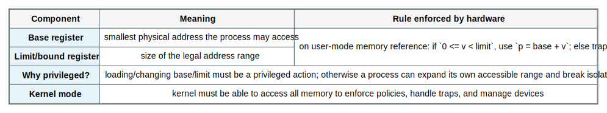

**Worked Example: Base+Limit As “A Contiguous Legal Region”**

Assume `base = 300000` and `limit = 120000`.
This means the process is allowed to use virtual addresses in `[0, 120000)`, and those translate to physical addresses in `[300000, 420000)`.

- If the program references virtual address `v = 500`, the CPU checks `0 <= 500 < 120000` (valid), then translates to `p = 300000 + 500 = 300500`.
- If the program references virtual address `v = 200000`, the check fails (`200000 >= 120000`), so the CPU raises an exception (a trap) and the kernel gets control.

Notice what is *not* happening: there is no “best effort” attempt by the user program to stay in bounds, and no “soft warning.”
The hardware boundary is the mechanism of isolation. The kernel then decides what the fault means (bug, attack, or missing mapping in a more advanced VM design).

#### Virtual vs Physical Addresses: What The CPU Is Actually Checking

When we say “a process has an address space,” we are talking about **virtual addresses**: the addresses the program uses in its instructions.
Physical memory is accessed using **physical addresses**: the locations in RAM the hardware actually reads and writes.

Hardware address translation (an `MMU`) sits between those worlds.
Base+limit is the simplest possible translator: it treats the virtual address as an offset into one contiguous physical region.
Modern OSes use page tables (later chapters) to generalize this into many regions with per-page permissions, but the core logic is the same:

- translate a virtual address to a physical address *if allowed*
- otherwise raise a trap/exception so the kernel can handle the violation (or the missing mapping)

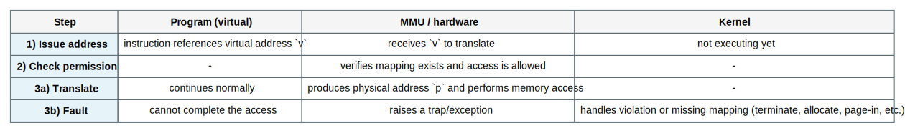

**Misconception Block: A Fault Is Not Automatically “A Crash”**

At this point in the course, it is tempting to treat “fault” as synonymous with “the program died.”
Later, virtual memory uses faults as a normal control mechanism: a missing page can be *resolved* by the kernel (bring data in from disk, install a mapping) and then resume execution.
The key lesson to keep now is structural: a fault is a controlled kernel entry caused by an attempted action that cannot proceed under the current protection/translation state.

#### I/O Protection: Why User Code Talks To Devices Through Syscalls

Devices are not “just memory.” They have side effects.
If an unprivileged program could program a disk controller, a network card, or an interrupt controller directly, it could:

- read or corrupt other processes’ data
- bypass filesystem permissions
- disable interrupts/timers (denial of service)
- impersonate devices or exfiltrate data

Therefore, raw device programming is privileged.
User code performs I/O by calling syscalls; the kernel and its drivers validate permissions and translate those requests into safe device operations, then use interrupts (or polling) to learn completion.

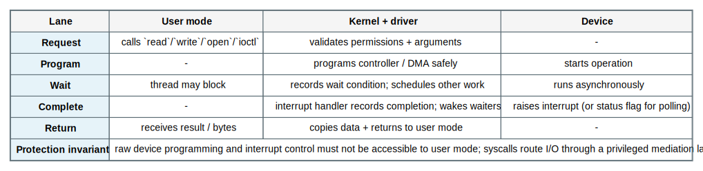

**Connection To Later Material**

Everything above is not “hardware trivia.” It is the minimum set of control levers the OS needs to make later abstractions precise:
processes are resumable because trap frames exist; threads can block and be re-admitted because interrupts turn external completion into kernel-visible state; memory protection exists because translation is enforced by hardware and faults are recoverable kernel entries; and device access is safe because syscalls route I/O through drivers that own the authoritative device state.

**Invariants**

- Every kernel entry must preserve enough state to resume or terminate the interrupted computation correctly.
- Asynchronous and synchronous events must be distinguished, because their causes and handling rules differ.
- The timer must be under privileged control, or a user program could keep the CPU forever.
- DMA may reduce CPU copying, but it does not remove the need for ownership, ordering, and completion handling.

**What Breaks If This Fails**

- Without a timer, the OS cannot guarantee it will regain the CPU from a runaway user process.
- Without saved context, the kernel cannot return correctly after handling an event.
- If user code can program privileged device state directly, protection collapses.
- If interrupt handling is wrong, I/O completion and wakeups become unreliable or lost.

**One Trace: blocking read with device completion**

This trace is the “synchronous request + asynchronous completion” pattern you will see everywhere.
The `read` system call is synchronous in the sense that *the instruction stream causes the entry* into the kernel, but the completion is asynchronous: a device finishes later and signals the CPU with an interrupt.
The mastery goal is to be able to explain how the OS turns an I/O wait into “someone else runs” (blocked vs runnable) without losing the waiting process’s identity, buffer ownership, or resumption point.

| Stage | CPU | Device | Kernel | Process State |
| --- | --- | --- | --- | --- |
| before request | process executing in user mode | idle | not yet involved | running |
| read request | process issues `read` syscall | idle | validates request, programs driver or DMA | running inside kernel |
| wait period | scheduler runs something else | transfer in progress | marks caller as blocked | blocked |
| completion | current CPU work interrupted | device signals done | handler records completion and wakeup | caller becomes runnable |
| after interrupt | scheduler eventually runs caller again | idle/ready | syscall finishes and returns | running |

The key learning is that “blocked” is not a feeling; it is a kernel state plus queue membership that removes the caller from CPU competition until the interrupt path re-admits it.
If you imagine the CPU “waiting for the disk,” you will systematically misunderstand utilization and why multiprogramming works.

**Code Bridge**

- Later, read a trap handler and a syscall dispatcher side by side.
- Both enter the kernel, but their causes and invariants differ.

**Drills (With Answers)**

1. **Q:** Why is a system call not just “another interrupt” conceptually?
**A:** A system call is an intentional, synchronous request with a defined ABI, return convention, and validation contract. Hardware interrupts are asynchronous events that preempt whatever is running and usually represent device/timer state changes, not a deliberate request.

2. **Q:** Why does DMA improve performance without removing the need for interrupts?
**A:** DMA removes CPU copying, but completion still must be detected, errors handled, and waiting threads woken. Interrupts (or polling in some designs) are still required to learn that the transfer finished and to re-enter the kernel control path.

3. **Q:** What happens if user code can disable the timer and then spin forever?
**A:** The kernel may never regain control, which breaks time sharing and fairness and effectively hands the machine to that process. It is both a responsiveness failure and a security failure.

### 3.3 Processes, Multiprogramming, And Time Sharing

#### Why This Section Exists

At this point you know there is a privileged kernel boundary and that control enters the kernel through syscalls, interrupts, and faults. That is enough to explain *how* the OS regains authority, but it is not yet enough to explain *what* the OS is regulating over time. Chapter 1 cannot talk coherently about scheduling, blocking, memory protection, or I/O without a precise object that answers the question: "what is the unit of execution the OS can pause, resume, and account for?"

That unit is the **process**. The process concept exists because the OS needs something that is (1) resumable after an interruption, (2) isolatable from other work, and (3) accountable (CPU time, memory, open files, credentials). Multiprogramming and time sharing are then not "features" but consequences of having many processes and a control loop that can move the CPU between them.

#### The Object Being Introduced (A Process As An OS-Managed Execution Container)

The key object here is not a buzzword. It is a *container of running-ness* with a stable identity in the kernel.

What is fixed:

- The hardware provides a CPU that executes one instruction stream at a time per core, and provides privileged entry points (timer interrupts, traps).
- The kernel provides authoritative data structures that can store and restore a resumable execution context.

What varies:

- Which instruction stream is currently executing.
- Which code and data mappings are currently installed.
- Which kernel-managed resources (files, sockets, memory mappings) are attached to that executing work.

What conclusions this object licenses:

- You can explain preemption and blocking as state transitions of one kernel-recorded object, rather than as "the CPU waiting."
- You can reason about isolation ("process A cannot read process B's memory") by pointing to concrete kernel-managed mappings and checks.
- You can reason about accounting and fairness ("A used too much CPU") because the OS has a stable identity for "A" that persists across interruptions.

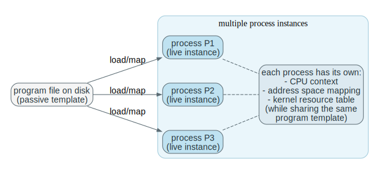

#### Formal Definitions (Program, Process, PCB, Context Switch)

Definition (program): A program is a passive artifact: instructions and data stored in some format (typically a file) that can be loaded and executed. A program by itself does not have a current instruction pointer, does not have live registers, and is not "running" in any operational sense.

Definition (process): A process is an OS-managed, resumable execution container consisting of:

1. an **address space** (the virtual memory mapping that defines which addresses mean what for this execution),
2. one or more **execution contexts** (CPU register state that makes "resume here" well-defined), and
3. a set of **owned kernel resources** (files, sockets, credentials, timers, mappings, etc.) referenced through kernel-managed handles.

Definition (process control block, PCB): A PCB is the kernel-resident record that represents a process: it stores the process identity and enough pointers/metadata to find or reconstruct the process's execution context, address-space mapping, and owned resources. The PCB is not a copy of the entire address space; it is the authoritative index into the kernel's representation of the process.

Definition (context switch): A context switch is the kernel action that (1) saves the currently running execution context into kernel-managed storage, (2) selects another runnable execution context, and (3) restores that new context so the CPU begins executing a different instruction stream. On systems with virtual memory, a context switch also typically installs a different page-table root (so the active address space changes as well).

#### Interpretation (What These Definitions Are Really Saying)

The deepest mistake to avoid is to treat "process" as "a program in memory." That phrase hides the essence: **the kernel must be able to stop and later resume the computation without losing correctness**. Resumption requires two separate kinds of continuity:

1. **Control-flow continuity**: the CPU must know *which instruction comes next* and the values of registers that the code expects to persist.
2. **Meaning continuity**: the bytes the code reads and writes must continue to mean the same things. That is the role of the address space: it makes the same virtual address refer to the same logical object across time.

The PCB exists because "running-ness" cannot be stored in user memory safely. If user code could rewrite its own saved PC/privilege state or forge kernel pointers, it could break isolation or regain privilege. So the kernel stores the authoritative bookkeeping about where and how a process may resume.

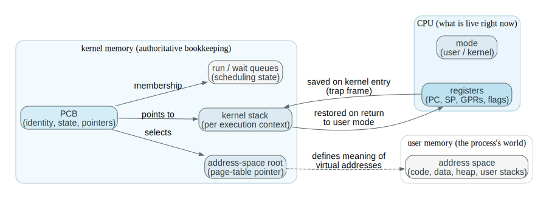

#### Boundary Conditions / Assumptions / Failure Modes

This conceptual package relies on several hidden assumptions:

- The CPU supports a **privileged mode** and a controlled return to user mode. Otherwise, there is no trustworthy "kernel decides who runs next" moment.
- There exists a **timer interrupt** (or equivalent preemption mechanism) that the kernel can configure and that user code cannot disable permanently. Otherwise, time sharing is not enforceable.
- There is some **memory protection mechanism** (at minimum, a way to prevent one process from overwriting another). Otherwise, "process" is not an isolation container; it is merely a scheduling label.

Common failure modes and what they mean:

- No timer preemption: a single process can run forever unless it voluntarily yields, so interactive responsiveness and fairness are not kernel-enforceable properties.
- Saving "only some registers": subtle corruption. Code may run for a while and then fail because a register that was assumed preserved was not restored.
- Switching CPU context but not memory mapping (or vice versa): the resumed code observes a nonsensical world (it is running with a different memory meaning than it was compiled for), which is correctness failure, not just performance failure.

#### Fully Worked Example: Why Multiprogramming Improves Utilization (Even On One CPU)

Set up a minimal world with one CPU and two workloads.

- Process A is compute-heavy: it runs 9 ms of CPU work, then occasionally performs a quick I/O.
- Process B is I/O-heavy: it runs 1 ms of CPU work, then waits 9 ms for an I/O completion (disk/network).

If the OS runs only one job at a time, the CPU must often sit idle during B's I/O wait. Multiprogramming exists to eliminate that waste without losing the ability to resume B correctly.

Step by step:

1. **B runs for 1 ms and issues a read.**
   The read is a syscall: it transfers control to the kernel and asks for I/O. The kernel validates the request, programs the device (or the driver), and then B cannot make progress until completion.
2. **The kernel blocks B and records the wait condition.**
   This is not "B waiting in place." The kernel changes B's state to blocked and places it on a wait queue associated with the device or I/O completion event.
3. **The CPU is now free to run A.**
   The kernel selects A from the ready queue, performs a context switch (save B's context, restore A's), and returns to user mode. A executes while the device works in parallel.
4. **The device completes B's I/O and interrupts the CPU.**
   The interrupt enters the kernel asynchronously. The handler records completion, moves B from blocked to ready, and B becomes eligible to run again.
5. **Later, the scheduler returns the CPU to B.**
   The kernel restores B's saved context and the syscall returns to user mode with a result. From B's perspective, it called `read` and then continued; from the system perspective, many other instructions ran between those points.

This example illustrates a general pattern you will reuse:

- a syscall can suspend the caller,
- the kernel represents that suspension as a data-structure fact (state + queue membership),
- an interrupt can make suspended work runnable again,
- and the scheduler chooses when runnable work actually runs.

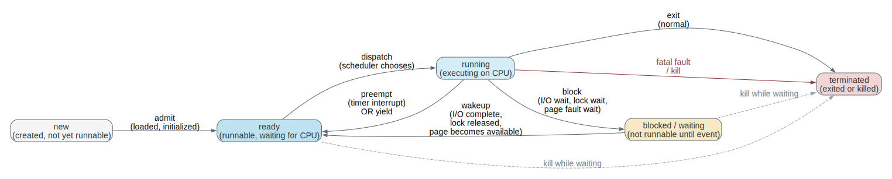

#### Misconceptions To Kill Early (Because They Create Wrong Traces Later)

Misconception 1: "A process is the same thing as a program."

- A program is a template (a file). A process is an instance with live state. Many processes can be instances of the same program, and a single process can execute different programs over its lifetime (for example via an `exec`-style replacement).

Misconception 2: "A context switch is just saving registers."

- Saving registers is necessary but not sufficient. The *meaning* of addresses matters, so the active address space (page-table root) must match the execution context. In addition, kernel bookkeeping must ensure the resumed process has the correct privilege boundaries, signal/interrupt masks, and ownership of kernel resources.

Misconception 3: "Blocked means the CPU is idle."

- Blocked means "not eligible for CPU selection because a wakeup condition is unsatisfied." The CPU can be busy running other runnable work during that time. Confusing blocked with idle destroys your ability to reason about utilization, throughput, and why multiprogramming exists at all.

Misconception 4: "Threads make processes obsolete."

- Threads change the unit of scheduling from "process" to "execution context," but the process remains the unit of protection and resource ownership in most designs. You will later need both objects: process for isolation, thread for parallelism within an isolation boundary.

#### Connection To Later Material

Everything that follows in the course builds on this module:

- Chapter 2 will use processes as the reason system calls and kernel boundaries exist: you need a protected authority to create and manage these containers.
- Chapter 3 will deepen process creation/termination, PCB structure, and process state transitions in real implementations.
- Chapters 4 and 5 will explain why threads exist (multiple execution contexts per process) and how blocking/wakeup interacts with synchronization and IPC.
- CPU scheduling (later chapters) is essentially the study of which runnable execution context should run next and why.

#### Retain / Do Not Confuse

Retain: a process is an OS-managed, resumable execution container whose identity persists across interrupts and syscalls.

Retain: multiprogramming overlaps CPU work with I/O wait by switching among runnable work; time sharing bounds interactive response by forced preemption.

Do not confuse: program (passive template) with process (live instance), and process (protection + resource container) with thread (execution context that can be multiplexed within a process).

**Problem**

The CPU is too valuable to sit idle while one job waits for I/O, and users do not want to wait through long uninterrupted runs of someone else's job before the machine reacts to their input.

**Mechanism**

A `process` is a program plus execution state and resources:

- `register state`: PC, stack pointer, general registers, status bits
- `memory image`: code, data, heap, stacks as mapped in memory
- `open resources`: kernel-managed objects such as files, sockets, devices

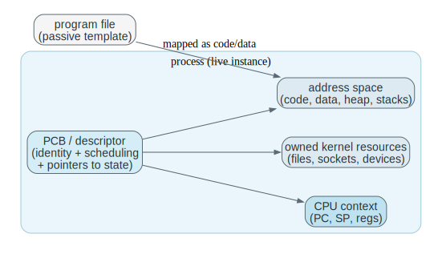

Multiprogramming keeps several jobs resident so the CPU can run another one when the current one blocks.
Time sharing adds frequent preemption so interactive response stays short enough that a human experiences the system as responsive rather than stalled.

This forces the kernel to maintain:

- runnable vs blocked classification
- saved context for resumption
- a policy for selecting which runnable work runs next

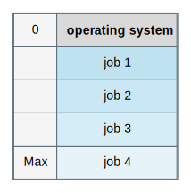

**Invariants**

- A blocked process must not consume CPU as if it were runnable.
- A context switch must preserve enough state for later correct resumption.
- Scheduling chooses among runnable work, not arbitrary work.
- A process is more than the program text; it includes execution context and owned resources.

**What Breaks If This Fails**

- Without scheduling, CPU time is not shared intentionally.
- Without context preservation, resumed processes continue incorrectly.
- Without blocked-vs-runnable distinction, the kernel can waste CPU on work that cannot make progress.
- Without time slicing, interactive systems degrade into long waits.

**One Trace: timer-based preemption**

The key idea is that the kernel is not “watching” user code continuously.
Instead, the hardware timer creates a forced re-entry into the kernel so the OS can apply a scheduling policy at bounded intervals.
To reproduce this from memory, you must be able to name what gets saved (so A can resume), what decision is made (which runnable context is next), and why the return to user mode is itself a privileged, intentional act.

| Stage | Running Process | Timer | Kernel / Scheduler | Result |
| --- | --- | --- | --- | --- |
| slice begins | process A running | armed | kernel already chose A | A progresses |
| timer expires | A interrupted | fires | kernel regains control | preemption point |
| decision | A stops temporarily | reset/rearmed | scheduler checks runnable set | next chosen |
| switch | A context saved | active for next slice | B context loaded | B running |
| return | B runs in user mode | armed again | kernel leaves CPU | sharing continues |

Read this as an enforcement loop: without a privileged timer interrupt, the kernel has no guaranteed moment to take the CPU back and re-run the selection rule.
The context save/restore is the concrete mechanism that makes “fairness” real: it turns a policy decision into a different instruction stream executing on the hardware.

**Code Bridge**

- Later, inspect process state transitions, `sleep`, `wakeup`, and scheduler selection.
- Identify which saved fields make a process resumable after interruption.

**Drills (With Answers)**

1. **Q:** Why does multiprogramming improve utilization even on one CPU?
**A:** It overlaps CPU work with I/O latency. When one job blocks on I/O, the CPU can run another job instead of idling, increasing overall utilization and throughput.

2. **Q:** Why does time sharing require a timer instead of voluntary yielding?
**A:** Voluntary yielding is not enforceable. A timer provides a forced, bounded preemption point so the kernel regains control even if a process is buggy or selfish, which is required for bounded response time.

3. **Q:** What state must survive a context switch for correct resumption?
**A:** At minimum: CPU registers including PC and SP, status/flags, and the kernel’s scheduling/identity bookkeeping for the process. In practice it also includes memory-mapping state (page table pointer) and kernel bookkeeping needed to re-enter the right execution context safely.

### 3.4 Memory, Storage, Files, And Copies

#### Why This Section Exists

Processes and scheduling only explain *who* runs. To explain *what running code can see and change*, you need a story about where code and data live, how they move, and which copy the system treats as authoritative at each moment. Chapter 1 must introduce this now because later topics (virtual memory, page faults, filesystems, and crash recovery) are not independent chapters; they are refinements of a single core problem:

"How can software act as if it has fast, stable storage, when the hardware actually provides a hierarchy of media with very different speed, capacity, and failure behavior?"

An OS is forced to answer this problem because applications cannot safely coordinate it on their own. Once the system has multiple processes, the OS must enforce sharing and isolation for memory, and once the system has persistence, the OS must define durability and consistency rules that remain meaningful even across crashes.

#### The Object Being Introduced (Hierarchy + Abstractions + Authority)

There are three interacting objects here:

1. **The storage hierarchy**: a physical fact. Registers and caches are fast but tiny; RAM is larger but slower; disks/SSDs are persistent but much slower; networks are slower still and fail differently.
2. **The abstractions** we use to hide that hierarchy:
   - **memory** as a load/store address space for running code,
   - **files** as named, durable byte sequences (plus metadata),
   - and later **virtual memory** as the mapping that makes "addresses" stable even as physical placement changes.
3. **Authority rules**: the correctness contract that says which copy is current, when updates become visible to readers, and when updates become durable against power loss.

When you read a paragraph about "caches" or "buffers," you should translate it into: "the system created another copy, so it must now define a rule that prevents stale copies from silently winning."

#### Formal Definitions (Resident, Cache, Durability, Coherence)

Definition (resident): A byte is resident in a level of the hierarchy if the hardware can access it with the operations required at that level. For CPU execution, "resident" typically means "in RAM and mapped into the current address space," because the CPU cannot execute instructions directly from disk blocks.

Definition (cache): A cache is a faster storage level that holds a copy of data whose authoritative source is elsewhere. A cache only helps if the system can answer two questions correctly:

1. validity: is this copy still the right one to read?
2. propagation: if I write, when and how does the authoritative copy get updated?

Definition (coherence): Coherence is the property that reads observe writes according to some well-defined rule. On CPUs, coherence is often discussed for hardware caches; in OS design, the same idea reappears for page caches, buffer caches, and distributed replicas.

Definition (durability): A write is durable at the moment the system guarantees it will survive a crash or power loss. "Returned from `write()`" is not the same thing as "durable." Durability is defined by the OS and filesystem contract (and sometimes requires explicit synchronization such as `fsync`).

#### Interpretation (Why OS Storage Is A Correctness Subject, Not Just An Optimization)

It is tempting to treat the hierarchy as a performance footnote: "RAM is faster than disk." That framing is too weak. The hierarchy forces a correctness problem because the system must often:

- keep data in RAM for speed,
- delay writes for batching,
- reorder writes for throughput,
- and still provide a meaningful notion of "the current contents of the file" and "what survives a crash."

Those are semantic promises. They require authority decisions ("which copy wins") and ordering decisions ("what must be written before what"). Those decisions cannot be made ad hoc by each application, because applications do not have global knowledge of all other readers/writers, and because applications cannot safely program devices directly.

#### Boundary Conditions / Assumptions / Failure Modes

Assumptions that matter:

- The CPU executes from memory, not from disk: the OS must bring code and data into RAM (often via demand paging) before it can run.
- Devices complete asynchronously: I/O is initiated now and finishes later, so the OS must track in-flight operations and wake blocked processes on completion.
- Crashes happen: so the OS must define what "committed" means for storage and how metadata/data updates are ordered.

Failure modes you should be able to name:

- Stale-copy reads: a program reads a cached copy that is no longer valid because an update happened elsewhere and coherence rules were violated.
- Lost writes: a program sees `write()` return success, but the system crashes before the update becomes durable, and the update disappears.
- Metadata-data inconsistency: a directory entry points to blocks whose contents were not written (or blocks were written but metadata did not update), producing corruption after crash.

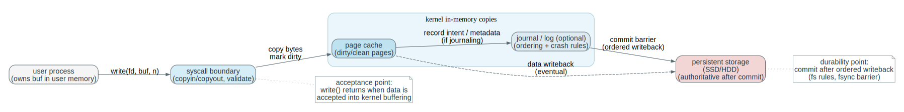

#### Fully Worked Example: Reading And Writing A File Is A Journey Through Copies

Consider a process that does:

1. `fd = open("notes.txt", O_RDWR)`
2. `read(fd, buf, 4096)`
3. modify `buf`
4. `write(fd, buf, 4096)`

We will narrate what must be true, not just what "usually happens."

1. **`open` resolves a name to an authoritative object.**
   The name "notes.txt" is not a physical location; it is a logical identifier. The filesystem must map the name to metadata (an inode or equivalent), check permissions, and return a handle (file descriptor) that the kernel can later interpret as "this open instance of this file."
2. **`read` may be satisfied from RAM without touching the disk.**
   If the requested bytes are already in the page cache, the kernel can copy data from cached pages to `buf` (after validating the user pointer). This is fast, but it is only correct if the cache validity rules are upheld.
   If the bytes are not in cache, the kernel initiates disk I/O, blocks the process, and later wakes it when the data arrives; then the bytes are placed in the cache and copied to the user buffer.
3. **Modifying `buf` does not modify the file yet.**
   `buf` is user memory. Until the process calls `write`, the kernel has not been asked to update authoritative file state.
4. **`write` often updates cached pages first, not the disk directly.**
   Many systems write into the page cache (marking pages dirty) and return before the data is durable. That is not a bug; it is an intentional trade that enables batching and reordering for throughput.
5. **Durability requires an explicit or implicit commit point.**
   The write becomes durable only when the filesystem writes the relevant data and metadata to persistent storage according to its crash-consistency rules. Some APIs expose this explicitly (`fsync`), and some durability is implicit at file close or other barriers, depending on system and configuration.

The general lesson is the pattern:

- user code manipulates private copies,
- syscalls request authoritative updates,
- caches introduce intermediate authoritative copies for performance,
- and the OS defines when and how authority transfers to persistent media.

#### Misconceptions (The Ones That Cause False Confidence)

Misconception 1: "If `write()` returns, the data is on disk."

- `write()` returning usually means "the OS accepted your data into its buffering/caching machinery." It does not necessarily mean "the disk has committed it." Durability is a stronger property than acceptance.

Misconception 2: "Caches are only about speed, so they cannot affect correctness."

- The moment there are multiple copies, correctness is at risk. A cache is safe only if validity and propagation rules are enforced.

Misconception 3: "A file is 'just bytes on disk.'"

- A file is a *name plus metadata plus a mapping to storage blocks plus rules*. Those rules include who may access it, how concurrent accesses interleave, and what survives crashes.

#### Connection To Later Material

This module is the conceptual runway for:

- Virtual memory and address translation: how the OS makes an address space stable even as physical memory is scarce.
- Page faults and demand paging: the mechanism by which the OS brings data into RAM when a process touches it.
- Filesystems and crash recovery: how the OS defines ordering and commit rules so a crash does not leave the filesystem meaningless.
- Synchronization: because caches and shared structures force concurrency control to preserve invariants under parallel access.

#### Retain / Do Not Confuse

Retain: performance comes from copies; copies force coherence and durability rules; those rules are part of correctness.

Do not confuse: "in memory / in cache" with "durable on persistent storage."

**Problem**

Execution requires fast, directly addressable memory, but persistence requires larger and slower storage.
The machine therefore has a hierarchy, not one perfect storage medium.

**Mechanism**

Programs execute from main memory.
Files provide a logical abstraction that hides raw storage layout.
Caches keep copies closer to the CPU.
Secondary storage extends persistence and capacity beyond what RAM can provide.

This creates the key OS problem:
not only where data is stored, but what *rules* define the current authoritative copy and the visibility of updates.

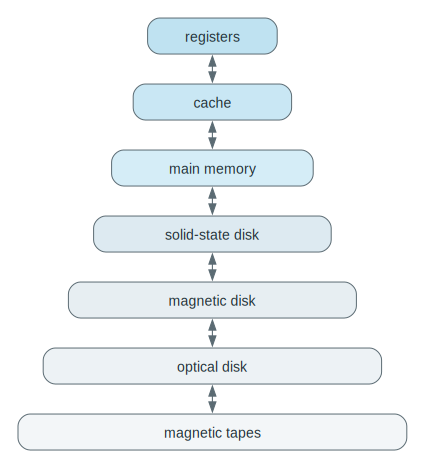

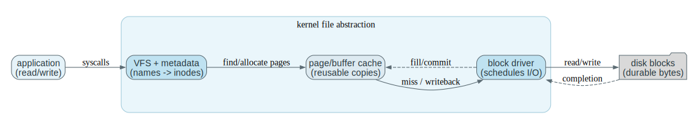

**Invariants**

- Code and data must be resident in executable memory before the CPU can use them directly.
- File naming and structure are logical abstractions, not raw device geometry.
- If data exists in multiple locations, there must be a coherence or writeback rule.
- Faster storage is usually smaller and more expensive per bit; slower storage is usually larger and more persistent.

**What Breaks If This Fails**

- Without residency in memory, code on disk does not execute directly.
- Without a file abstraction, software depends on physical storage layout.
- Without coherence/writeback rules, stale copies can silently win.
- Without free-space and allocation policy, storage becomes unusable even if bits remain available.

**One Trace: data moving through the hierarchy**

This table is about *copies* and *authority*, not about memorizing “disk vs RAM vs cache.”
Every row is a place where the system must define which copy is authoritative, when another copy is stale, and what rule makes an update visible or durable.
When you cover the table and recite it, force yourself to answer: “If the machine loses power right after this row, which copy wins and why?”

| Stage | Logical View | Physical Movement | Correctness Rule You Must Know |
| --- | --- | --- | --- |
| file exists | program sees a file | bytes on secondary storage | name -> metadata -> blocks defines the persistent mapping |
| data needed | program requests read | OS brings bytes into memory | kernel defines ownership and lifetime of the in-memory buffer/page |
| data used repeatedly | CPU hits a nearby fast copy | cache fills from memory | coherence rules decide whether cached data is valid |
| data modified | process writes | cache/memory becomes dirty | writeback/journaling rules define ordering and durability |
| persistence restored | OS writes back | memory updates disk copy | commit point defines when disk becomes authoritative |

The table is a reminder that “fast” in storage systems almost always means “there are more copies,” and more copies means you must define authority and ordering.
Later filesystem chapters are mostly details of this same story: which write becomes durable when, and what rule makes readers see the “right” version after crashes or reordering.

**Code Bridge**

- Later, study page tables, page faults, buffer cache, and filesystem metadata separately.
- They are layers of the same mapping problem: logical objects -> physical state with correctness.

**Drills (With Answers)**

1. **Q:** Why is storage management also a consistency problem?
**A:** Because performance relies on copies (caches, buffers). Once copies exist, the system must preserve a consistency model: which copy is authoritative, when others are stale, and how/when updates become visible and durable.

2. **Q:** Why is “the same data exists in several places” a correctness issue, not only performance?
**A:** Because reads can observe stale copies and writes can be lost or reordered. Without coherence and writeback invariants, the system can return correct-looking but wrong data, which is a correctness failure.

3. **Q:** What does the file abstraction hide that applications do not manage directly?
**A:** Physical block layout, free-space management, device scheduling, caching/writeback policy, and crash recovery rules (journaling/ordering). Apps operate on names/streams; the OS preserves the mapping and durability.

### 3.5 Scaling: SMP, NUMA, Clusters, Virtualization, Real-Time

#### Why This Section Exists

If you only ever study a single-core machine, many OS mechanisms look like "implementation details." Scaling forces you to confront what those mechanisms are really for. The moment you add more CPUs, add non-uniform memory, add a network boundary, add a hypervisor layer, or add deadlines, the system starts failing in qualitatively new ways:

- concurrency failures (races, deadlocks, contention) become dominant,
- locality and communication costs become first-order constraints,
- and failure is no longer all-or-nothing (especially across a network).

This section exists to give you the conceptual taxonomy that lets you read later chapters without confusing "more hardware" with "more of the same problem." The kernel's job changes shape as the machine organization changes, because the control problem changes shape.

#### The Object Being Introduced (A Scaling Model Is A Failure Model)

The object here is a **machine organization model**: a statement about what is shared and what is not.

What is fixed in each model:

- which memory is shared with uniform cost (SMP) or non-uniform cost (NUMA),
- whether there is one failure domain (one box) or many (cluster),
- whether the OS kernel is the top authority (bare metal) or a guest (virtualization),
- whether time is only a performance metric or part of correctness (real-time).

What varies:

- where your data is physically located,
- how quickly one CPU can observe another CPU's writes,
- whether "communication" is loads/stores or explicit messages,
- and what kinds of failures are possible (whole-machine failure vs partial failure).

The payoff is predictive power: if you can name the scaling model, you can predict the dominant OS problems before you see any code.

#### Formal Definitions (SMP, NUMA, Cluster, Virtualization, Real-Time)

Definition (SMP): Symmetric multiprocessor. Multiple CPUs share one physical address space and run one kernel instance. Communication between CPUs is fundamentally shared-memory communication, mediated by caches and coherence.

Definition (NUMA): Non-uniform memory access. The machine still has one shared address space, but the latency/bandwidth of memory access depends on where the memory is physically attached relative to the CPU. "Shared memory" exists, but it is not equally cheap everywhere.

Definition (cluster): A set of separate machines connected by a network. There is no shared physical memory image, so cross-node communication is explicit. Failure is partial: one node can fail while others continue.

Definition (virtualization): A system layer (hypervisor) multiplexes hardware across isolated guest OS instances. Guests run with the illusion of hardware authority, but some operations cause traps (VM exits) into the hypervisor, which is the real authority.

Definition (real-time system): A system in which correctness depends on meeting deadlines (often worst-case bounds), not merely on producing the right value eventually. Schedulers and resource managers are judged by their ability to meet timing constraints under load.

#### Interpretation (What Changes When You "Scale")

Scaling is not only about throughput. It is about which costs and which failures dominate.

- On SMP, the dominant new cost is **coordination on shared kernel state**. Locks, run queues, allocator metadata, and filesystem caches become contention points.
- On NUMA, the dominant new cost is **remote memory access** and the performance cliffs it creates. Placement and migration decisions become part of OS correctness in the practical sense that "the system works" depends on them.
- On clusters, the dominant new failure mode is **partial failure**. The OS and system software must define what it means for an operation to succeed when some participants can crash or become unreachable.
- Under virtualization, the dominant new twist is **a second control boundary beneath the kernel**. The guest kernel is no longer the final authority.
- Under real-time constraints, the dominant new requirement is **bounded latency**, not just average-case performance.

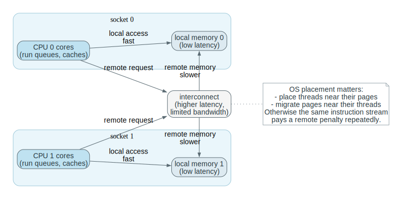

#### Fully Worked Example: Why NUMA Forces Placement Policy

Suppose a server has two CPU sockets, each with its own local memory. Two threads repeatedly update a shared in-memory queue. If both threads run on CPU 0 but the queue's pages live in CPU 1's memory, then every access becomes a remote memory access. The program still computes correct values, but performance collapses because the hardware must traverse an interconnect for every load/store.

Operationally, the OS has two levers:

1. **place/migrate threads** so the threads run near the data, or
2. **place/migrate pages** so the data lives near the threads.

If the OS ignores locality, the system can be "correct" in the abstract sense but unusable in the engineering sense. That is why NUMA-aware scheduling and memory placement are not minor optimizations; they are part of making the machine behave like the programmer expects.

#### Misconceptions

Misconception 1: "A cluster is just SMP with longer wires."

- In SMP/NUMA, communication is shared memory with coherence rules. In a cluster, there is no shared physical memory, so communication is explicit and failures are partial. Those differences force different algorithms and different guarantees.

Misconception 2: "Virtualization is just multiprogramming."

- Multiprogramming time-slices processes under one kernel. Virtualization introduces another privileged layer that can intercept and emulate privileged operations beneath a guest kernel. That changes observability, performance, and the meaning of "privileged."

Misconception 3: "Real-time is about being fast."

- Real-time is about being predictably on time. A system can be fast on average and still be real-time-incorrect if it occasionally misses a deadline.

#### Connection To Later Material

Later chapters will revisit the same mechanisms (scheduling, memory management, synchronization) in the presence of scaling constraints:

- CPU scheduling becomes multi-core scheduling (load balancing, affinity, per-CPU run queues).
- Synchronization becomes the bottleneck (lock contention, scalability, deadlocks).
- Memory management becomes about locality and migration, not only about allocation.
- Virtualization and containers reuse the same boundary concepts (privileged entry, authoritative state, enforced isolation) with an extra layer.

#### Retain / Do Not Confuse

Retain: a scaling model is a statement about what is shared and what failure/communication semantics you get "for free."

Do not confuse: shared-memory coherence (SMP/NUMA) with message passing (cluster), and kernel authority (bare metal) with guest authority (virtualization).

**Problem**

Once one CPU or one machine is not enough, the question changes from simple sharing to coordinated parallelism or distributed control.

**Mechanism**

`SMP` is a machine organization in which multiple CPUs share one physical memory space and one kernel image.
The kernel's role in an SMP system is to coordinate concurrent access to shared state and to place runnable work on CPUs.
`NUMA` is a machine organization in which CPUs still share an address space, but the cost of a memory access depends on which CPU accesses which memory region.
The kernel's role in a NUMA system is to place work and memory so that frequently interacting data stays near the CPU that uses it.
`Clusters` are collections of separate machines connected by a network.
The coordinating software in a cluster is responsible for communication, partial-failure handling, and cross-node agreement because there is no single shared physical memory image.
`Virtualization` adds a hypervisor beneath the guest operating system.
The hypervisor is the privileged component that multiplexes hardware across isolated guest kernels.
`Real-time` systems attach deadlines to work.
The scheduler or runtime in a real-time system is responsible for meeting those deadlines, so timing becomes part of correctness rather than only performance.

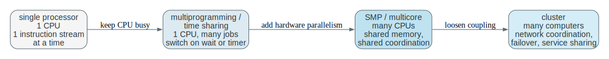

**Invariants**

- Shared memory requires explicit synchronization and coherence discipline.
- NUMA means locality matters; not all memory access costs are equal.
- Cluster nodes do not share one physical memory image just because they cooperate.
- A virtual machine manager controls hardware access beneath guests.
- In real-time systems, “eventually correct” can still be wrong if it misses the deadline.

**What Breaks If This Fails**

- Ignoring synchronization on SMP gives races and inconsistent shared state.
- Ignoring locality on NUMA gives disappointing performance even with many CPUs.
- Treating a cluster like one shared-memory box produces wrong assumptions about latency and failure.
- Treating virtualization like mere multiprogramming misses the extra control layer.
- Treating real-time like ordinary throughput optimization misses the deadline requirement entirely.

**One Trace: guest kernel hits the “kernel beneath the kernel” (VM exit)**

Virtualization is a control-boundary story.
The guest kernel may believe it is “the privileged authority,” but the hypervisor is the actual hardware authority.
This trace is the smallest operational picture of that: a sensitive operation becomes a forced control transfer below the guest.

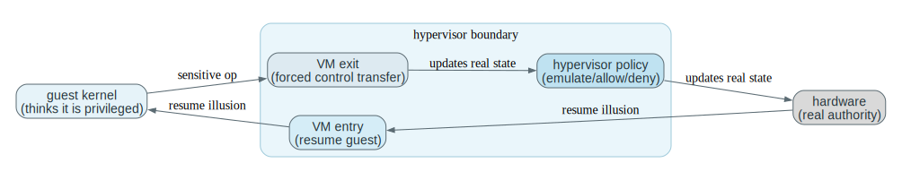

| Stage | Guest (inside VM) | Hypervisor / Hardware | Meaning |
| --- | --- | --- | --- |
| run | guest executes normally | hardware runs guest in a constrained mode | guest has the *illusion* of full machine control |
| sensitive op | guest touches privileged state or device surface | hardware triggers a VM exit | control transfers below the guest kernel |
| handle | guest is paused (state preserved) | hypervisor decides/emulates/updates virtual state | real authority and policy live here |
| resume | guest continues execution | hypervisor performs VM entry | illusion continues with enforced boundaries |

The mastery point is not the brand names.
It is to be able to say: “what event forces control to transfer, what state is preserved, and where the real policy/authority decision happens.”

**Code Bridge**

- When studying a hypervisor later, identify which privileges moved beneath the guest kernel.
- When studying multicore scheduling later, identify how locality affects placement and migration.

**Drills (With Answers)**

1. **Q:** Why does adding processors not guarantee linear speedup?
**A:** Serial portions, synchronization overhead, cache coherence traffic, memory bandwidth limits, and contention for shared structures all create diminishing returns (and sometimes regressions).

2. **Q:** Why is a cluster not just “SMP with longer wires”?
**A:** Clusters do not share one physical memory image. Communication is explicit, latency is much higher, failures are partial, and coordination requires distributed protocols rather than shared-memory synchronization.

3. **Q:** Why is real-time correctness stricter than ordinary throughput/latency optimization?
**A:** In real-time, missing a deadline is an incorrect outcome, not merely a slow one. Correctness is defined in part by worst-case timing bounds, not by average performance.

### 3.6 Protection And Security

**Problem**

A useful OS must share resources among mutually untrusted or simply buggy activities without surrendering control of the machine.

**Mechanism**

`Protection` specifies allowed access to resources (who may do what).
`Security` is broader: it includes protection but also authentication, resistance to hostile behavior, auditing, confidentiality, integrity, and recovery.

Mechanisms that make protection enforceable:

- user mode vs kernel mode
- privileged instructions
- system call validation
- timer-controlled regain of CPU control

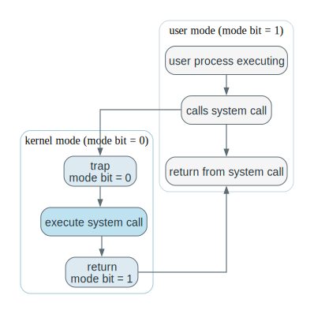

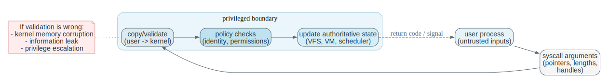

**Invariants**

- User code cannot directly execute privileged operations.
- Access checks must be tied to identity and policy, not only convenience.
- Protection is necessary but not sufficient for security.
- The kernel must distrust user-supplied inputs enough to validate them.

**What Breaks If This Fails**

- If user code can reach protected hardware state directly, the kernel loses authority.
- If identity is not tracked, policy cannot be enforced meaningfully.
- If the OS assumes user parameters are correct, system calls become attack surfaces.
- If valid credentials are stolen, correct permission bits still do not guarantee security.

**One Trace: forbidden operation**

Treat this as a “proof” that protection is enforcement, not convention.
The user process does not get to “try harder”; the hardware and kernel together define a boundary where illegal access turns into a trap, a policy decision, and an observable outcome (error code, signal, termination).
If you can explain why the kernel must validate even “well-intended” requests, you understand why syscall handling is an attack surface.

| Stage | User Process | Hardware / Kernel | Result |
| --- | --- | --- | --- |
| attempt | process tries privileged action or protected access | boundary crossing detected | request cannot proceed directly |
| entry | trap/syscall enters kernel control | kernel checks privilege and policy | authority centralized |
| decision | access denied or process faulted | kernel records failure and returns error / signal | enforcement visible |
| aftermath | process handles error or dies | system remains under kernel control | isolation preserved |

Protection becomes visible as a constrained failure mode: an error code, a signal, or a terminated process, rather than silent corruption of the whole machine.
If you can explain why “enforcement must be at the authority boundary,” you can later reason about why validating syscall input and checking permissions is not optional polish but the mechanism of isolation.

**Code Bridge**

- Later, inspect syscall argument validation, permission checks, and the path for faults caused by illegal access.

**Drills (With Answers)**

1. **Q:** Why is protection not the same thing as security?
**A:** Protection is access control enforcement. Security includes protection plus authentication, attack resistance, auditing, confidentiality/integrity, and recovery. You can have correct protection rules and still be insecure if credentials are stolen or privileged code is exploited.

2. **Q:** Why is the timer also a protection mechanism?
**A:** It guarantees the kernel regains CPU control. Without it, a user process could monopolize the machine by looping forever, preventing enforcement of scheduling and other control policies.

3. **Q:** Why does validating syscall input belong to OS security, not only application correctness?
**A:** The syscall boundary is a trust boundary. User pointers/lengths can be malicious. Validation prevents kernel memory corruption and privilege escalation, which are security failures even if the calling app “meant well.”

### 3.7 Kernel Data Structures As Policy In Disguise

**Problem**

The kernel spends a huge amount of time organizing, finding, and updating state.
A kernel data structure is the object that stores that state.
The role of the data structure is not only storage; it also determines scan cost, waiting order, locality, and contention behavior.
For that reason, a data-structure choice often expresses policy in operational form.

**Mechanism**

Common structures encode different access patterns and different policy consequences:

- lists: fast insertion/removal, linear search
- queues: waiting order (fairness policy lives here)
- stacks: nested LIFO behavior
- trees: hierarchy or ordered search
- hash maps: fast expected lookup under controlled collisions
- bitmaps: compact state for fixed-size resources

**Invariants**

- Every structure must preserve a correct mapping between abstract state and stored representation.
- Complexity claims depend on shape and load; they are not magical guarantees.
- Compact representations like bitmaps are only useful if the index-to-resource mapping stays correct.

**What Breaks If This Fails**

- A bad structure choice creates unnecessary scanning and contention.
- Unbalanced trees lose their expected search benefits.
- Hash collisions can turn “fast lookup” into a bottleneck.
- A corrupted bitmap or queue can misrepresent ownership or readiness.

**One Trace: bitmap allocation for fixed-size resources**

This is the “state representation becomes policy” trace.
Bitmaps are popular in kernels because they are compact and fast, but the scanning rule (first free bit, next-fit cursor, per-CPU cache) encodes a policy about locality, fairness, and contention.
When you cover this table, name the invariant you must preserve: “never hand out the same resource twice.”

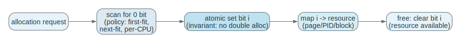

| Step | Bitmap | Kernel action | Meaning |
| --- | --- | --- | --- |
| request | some bits are 0 (free) | scan for a 0 bit | choose a candidate resource |
| claim | bit i is 0 | atomically set bit i to 1 | prevent double allocation under contention |
| return | i is now marked used | map i -> resource (page frame, PID, block) | index mapping defines what “i” means |
| free | bit i is 1 (used) | clear bit i to 0 | resource becomes available again |

If the claim is not atomic, you double-allocate.
If the index mapping is wrong, you “allocate” the wrong underlying thing.
If the scanning order is poor, you may get pathological contention or fragmentation even though the bitmap is correct.

**Code Bridge**

- When reading kernel code later, ask which access pattern forced the structure choice.
- That is often more useful than memorizing names.

**Drills (With Answers)**

1. **Q:** Why can the wrong data structure become a scheduling or allocation policy bug?
**A:** The data structure determines both cost and ordering. An O(n) scan under contention becomes latency; queue ordering becomes fairness policy; tree shape and locking become throughput policy. Structure choices surface as system-level behavior.

2. **Q:** Why are bitmaps attractive for resource availability?
**A:** They are compact and cache-friendly, and support fast test/set operations for fixed-size indexed resources (pages, PIDs, blocks). The tradeoff is that the index mapping must remain correct.

3. **Q:** What performance promise of hashing depends on collisions staying controlled?
**A:** Expected near-constant-time lookup. If collisions grow, operations degrade toward linear time and can become a bottleneck (or even a denial-of-service vector).

## 4. Canonical Traces To Reproduce From Memory

These traces are the smallest control stories that keep reappearing under new names: authority handoff at boot, synchronous request with asynchronous completion, forced preemption, and fault/repair vs fault/kill. Later chapters add details (more queues, more locks, more policies), but they do not change these fundamental shapes. If you can rehearse these traces, you have a stable mental "skeleton" to hang later material on.

Do not merely read these.
Cover the tables and reproduce the sequence from memory.

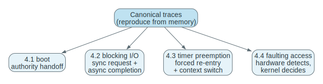

### 4.1 Boot To First User Process

Boot is a sequence of authority handoffs.
You are not memorizing brand names (“BIOS”, “UEFI”) here; you are tracking which code is trusted to run next before an OS exists, and when the kernel finally becomes the resident authority.
When reproducing this, make sure you can say what *must* be initialized for the next stage to be possible (disk access, memory setup, device discovery) and why that initialization cannot start inside the full OS yet.

| Step | Machine State | Kernel Role |
| --- | --- | --- |
| power on/reset | only firmware-resident code immediately available | kernel not yet in memory |
| bootstrap runs | enough hardware initialized to load kernel | early control path established |
| kernel loads | privileged core takes over | fundamental subsystems start |
| init/system process starts | user-space environment prepared | services begin |
| first user process runs | normal workloads possible | OS now in steady-state control |

Say explicitly what changed at each step: which code is trusted, which code is resident in memory, and what resources are now initialized enough to support the next stage.
If you cannot state why “kernel not yet in memory” forces firmware/bootstrap code to exist, you are memorizing labels rather than the authority story.

Use this figure to visualize the authority handoff and the minimal “control path” that must exist before any OS service can be requested.
If you can narrate the handoff without relying on brand names, you understand boot structurally.

### 4.2 Blocking I/O With Interrupt Completion

Use the “lanes” to prevent a common misunderstanding: the CPU lane and device lane proceed on different clocks.
While a process is blocked, the device may be actively transferring, and the CPU may be running something else entirely.
Mastery means you can explain where the waiting condition is recorded (kernel bookkeeping), what event makes it true (interrupt completion), and why this is better than spinning (saves CPU, improves throughput, preserves fairness).

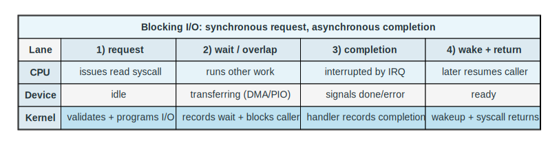

| Step | CPU Lane | Device Lane | Kernel Lane |
| --- | --- | --- | --- |
| request | user issues `read` | idle | validates request |
| start I/O | caller enters kernel | starts transfer or DMA | driver programs device |
| overlap | other work may run | transferring | caller sleeps/blocks |
| completion | CPU interrupted | raises interrupt | handler records completion |
| wakeup | scheduler may choose caller later | idle/ready | caller marked runnable |
| return | caller resumes | no longer needed for this request | syscall returns |

The “lanes” are the conceptual fix for the classic bug: thinking the CPU must sit idle during I/O.
The OS creates overlap by (1) recording a precise waiting condition, (2) scheduling other runnable work, and (3) using the interrupt completion path to re-admit the sleeper.

### 4.3 Timer Preemption

This is the minimal time-sharing loop.
The timer is the enforcement mechanism that prevents “CPU capture,” and the dispatcher is the mechanism that makes a scheduling decision real by saving and restoring architectural state.
When you rehearse it, explicitly name the non-negotiables: a privileged timer, a saved context that is sufficient to resume, and a consistent runnable set to choose from.

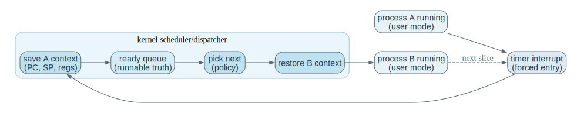

| Step | Running Process | Hardware | Kernel |
| --- | --- | --- | --- |
| slice active | process A runs | timer counts down | not on CPU yet |
| timeout | A interrupted | timer fires | kernel regains control |
| decision | A stops temporarily | timer reset | scheduler chooses next runnable |
| switch | B state loaded | ready for next timeout | kernel returns to user mode |

The timer is the control knob that turns “time sharing” into an invariant instead of a hope.
The scheduler chooses from a data structure representing runnable truth; the dispatcher is the machinery that makes the chosen context become the live CPU state.

### 4.4 Faulting Memory Access

This trace is the “hardware catches you, kernel decides your fate” pattern.
The CPU detects that an access violates the current mapping/protection rules, raises an exception, and the kernel decides whether the fault is repairable (e.g., demand paging) or fatal (e.g., illegal access).
If you can describe what state must be inspected to decide (faulting address, access type, mapping state) you are ready for virtual memory and page faults later.

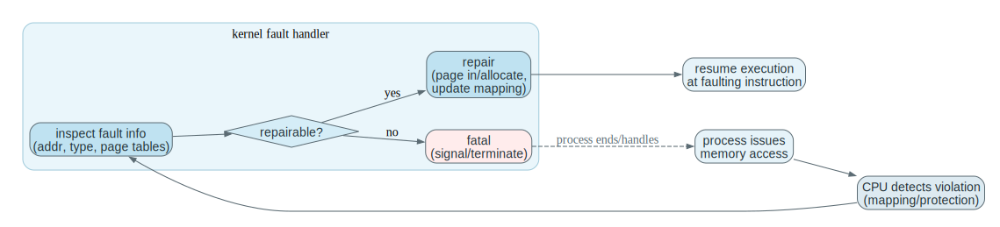

| Step | Process View | Hardware / Kernel View |
| --- | --- | --- |
| access issued | process attempts memory access | CPU checks mapping/protection |
| fault detected | instruction cannot complete | exception enters kernel |
| diagnosis | process paused | kernel decides repairable vs fatal |
| outcome | resume or terminate | protection and correctness preserved |

Faults are the “kernel decides your fate” pattern: hardware detects a violation, but only the kernel can interpret it against the current policy and mapping state.
This is why virtual memory is an OS topic: correctness depends on privileged metadata (page tables, permissions, residency) that user code cannot be allowed to forge.

## 5. Key Questions (Answered)

Treat these as checkpoints, not as trivia. Each question points back to a control mechanism in Chapters 1-2: timer preemption, interrupts/DMA, blocked vs runnable state, copies/authority, scaling failure models, protection boundaries, and the way data structures turn policy into performance. If you cannot answer one from memory, return to the nearest trace or module and rebuild the story.

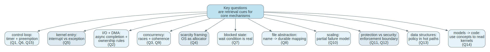

1. **Q:** Why is a timer both a fairness mechanism and a safety mechanism?
**A:** Fairness: it bounds how long one runnable task can monopolize the CPU before others get a chance. Safety: it guarantees the kernel regains control even if a task never yields, which is required to enforce protection and system-wide policy.

2. **Q:** Why can DMA reduce CPU cost while increasing the need for careful ownership rules?
**A:** DMA offloads copying, but now devices read/write memory directly. The OS must ensure buffers are pinned, not freed/reused early, not concurrently modified incorrectly, and that caches/visibility rules are respected. Less CPU work, more coordination duty.

3. **Q:** If two CPUs update related shared data without synchronization, what kind of bug appears even if both CPUs are “correct” in isolation?
**A:** A race condition: lost updates, inconsistent reads, and violated invariants due to interleavings and visibility effects. The bug is in the interaction, not in either CPU’s local logic.

4. **Q:** Why does “the OS is a resource allocator” explain scheduling, memory management, and disk management at the same time?
**A:** They are all instances of scarcity management: CPU time, memory frames, and I/O bandwidth are shared resources. The OS allocates them, enforces protection, and preserves system invariants while trying to optimize some metric.

5. **Q:** Why is the interrupt vs exception distinction conceptually useful even though both enter the kernel?
**A:** Interrupts are asynchronous external events (device/timer) that can preempt arbitrary code. Exceptions are synchronous outcomes of the current instruction stream (faults/traps). The difference determines cause, timing assumptions, and what state must be interpreted to handle correctly.

6. **Q:** If a process can be interrupted almost anywhere, what does that force the kernel to preserve or design carefully?
**A:** It forces resumable state (saved context/PCB), reentrancy/atomicity of kernel updates (locking and careful preemption points), and clear invariants about what can be partially updated. “Interrupt anywhere” is why the OS is fundamentally about careful state management.

7. **Q:** Why does a blocked process exist as real kernel state even while it is not using the CPU?
**A:** Because the OS must remember what it is waiting for, where it should resume, and what resources it owns. Blocked is not “gone”; it is “paused with obligations and a wakeup condition.”

8. **Q:** What exact problem does the file abstraction hide from applications?
**A:** It hides physical storage mapping (blocks/locations), free-space management, device scheduling, caching/writeback ordering, and crash consistency. Apps see stable names and streams while the OS preserves durability and mapping.

9. **Q:** Why does cache coherence become more important as hardware parallelism grows?
**A:** More cores means more caches and more concurrent access to shared data. Without coherence and careful synchronization, cores read stale values, reorder visibility, and violate invariants. The cost of maintaining coherence also becomes a dominant performance factor.

10. **Q:** Why is a cluster failure model fundamentally different from a single-machine failure model?
**A:** Clusters have partial failure: one node or link can fail while others run. Communication is delayed and unreliable compared to memory access. Coordination must handle timeouts, partitions, and inconsistent views, which do not exist in the same way inside one machine.

11. **Q:** Why is protection still meaningful even if there is only one logged-in user?
**A:** Bugs are as dangerous as attackers. Protection prevents accidental corruption between processes, contains faults, and preserves system integrity. It also protects the OS from compromised or malformed applications, regardless of “intent.”

12. **Q:** Why is “security is broader than protection” a practical engineering statement?
**A:** Because correct access control does not stop credential theft, side channels, kernel exploits, or malicious inputs. Security includes authentication, patching, auditing, cryptography, and recovery. Protection is one necessary slice, not the whole problem.

13. **Q:** Why can the wrong data structure become visible as a performance bug at the system level?
**A:** Kernel hot paths run constantly. An extra linear scan, bad cache locality, or high lock contention becomes system-wide latency and throughput collapse. Structure choice is performance policy.

14. **Q:** Why is source-code access valuable only if you already have strong conceptual models?
**A:** Without models, code is overwhelming detail. With models, you can map code paths to mechanisms (traps, scheduling, VM, I/O), locate invariants, and reason about failure modes. Models turn code into evidence.

15. **Q:** If you had to debug a hung system, which Chapter 1 mechanisms would you suspect first and why?
**A:** Start with “who can regain control and make progress”: timer/interrupt delivery (is preemption working), scheduler/run queue logic (is runnable work being chosen), memory pressure (is everything blocked on allocation), and device completion paths (are interrupts or wakeups missing). Those are the control loops that keep the system alive.

## 6. Suggested Bridge Into Real Kernels

The reading order below is not "learn the kernel in the same order as the source tree." It is a control-path order: start with privileged entry and return, then study how the kernel preserves resumable execution state, then study how it defines memory authority, then how it defines storage authority, and finally how asynchronous device completion re-enters the kernel and wakes waiters. This is the same authority story repeated across mechanisms.

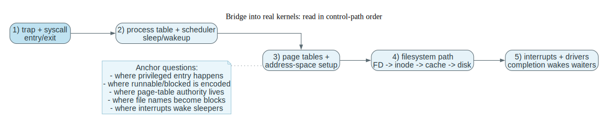

If your course later uses `xv6`, this is a good reading order:

1. trap and syscall path
2. process table, scheduler, `sleep`, and `wakeup`
3. page tables and address-space setup
4. filesystem path from file descriptor to disk block cache
5. interrupt and device-driver path

Conceptual anchors to look for:

- where privileged entry happens
- where process state is stored
- where runnable vs blocked state is encoded
- where page-table authority lives
- where file abstraction becomes block-level storage
- where a device completion wakes waiting work

If you later study Linux, look for the same ideas rather than expecting the same code shape.
The names change.
The control problems do not.

## 7. How To Use This File

Reading is not the skill. The skill is being able to reproduce the control story and name the invariant at each boundary. Use the diagrams to visualize the path, then cover the text and force yourself to reconstruct it.

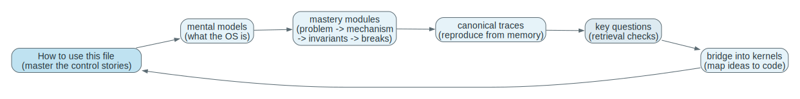

If you are short on time:

- Read `## 2. Mental Models To Know Cold` once.
- Reproduce `## 4. Canonical Traces To Reproduce From Memory`.
- Also reproduce the `One Trace: launching a program` table in `### 3.1` once (it is the simplest “authority boundary” trace).

If you want Chapter 1 to become reasoning skill:

- Work the `## 3. Mastery Modules` slowly: problem -> mechanism -> invariants -> failure modes.
- Reproduce the traces from memory and explain why each step exists.
- Use the answered questions in `## 5` as “explain it out loud” checkpoints.

A practical routine that works: (1) cover the table, (2) write the steps from memory, (3) annotate each step with "what authority/state changed," (4) check against the file, (5) repeat two days later. If you can do that for boot, blocking I/O, timer preemption, and a fault, you are ready for Chapter 3 because you can already reason about resumable execution and kernel bookkeeping.
