# Chapter 2 Operating-System Structures Mastery

Source: Chapter 2 of `textbook.pdf` (Operating System Concepts, 9th ed.).

This file is the mastery note for Chapter 2.
It treats operating-system structure as a control-boundary problem rather than as a vocabulary list.

Chapter 1 explained why the operating system must exist.
Chapter 2 explains the control chain in order: requests begin in user space, protected effects require kernel entry, and kernel organization determines the cost and fault scope of that entry.

## 1. What This File Optimizes For

The goal is not to remember a list of interfaces or kernel-organization models.
The goal is to be able to do the following without guessing:

- Explain why a service is not the same thing as an interface.
- Explain why an API is not the same thing as a system call.
- Predict how moving code across the kernel boundary changes both performance and fault scope.
- Explain why a shell shapes the OS user experience while still being an ordinary user process.
- Compare monolithic, layered, microkernel, modular, and hybrid systems in terms of fault scope and communication cost.
- Explain why debugging/observability, boot, and system generation are structural concerns rather than side topics.

For Chapter 2, mastery means:

- you can trace a request from user intent -> kernel entry -> return
- you can name the boundary crossed at each stage
- you can predict the performance and fault-scope cost created by each boundary
- you can explain why a structure choice improves extensibility, portability, or isolation and what it trades away
- you can map each layer to concrete code (shell, libc, trap handler, kernel subsystem)

## 2. Mental Models To Know Cold

### 2.1 Services, Interfaces, And Implementations Are Different Layers

An operating-system `service` is an OS-provided capability with defined semantics.
An `interface` is the request surface a human or program uses to ask for that service.
The `implementation` is the enforcing machinery that validates the request and commits its effect to authoritative state.

If you treat services, interfaces, and implementations as the same thing, Chapter 2 looks repetitive.
If you separate them, each term names a different layer of the system: capability, request surface, and enforcing machinery.

### 2.2 The Kernel Boundary Is Also A Cost Boundary

A transition from user space to kernel space has a cost.
That transition changes four things: the privilege level of the executing code, the need for argument validation, the system's ability to block or reschedule the caller, and the scope of damage if the executing code fails.

Many structural tradeoffs in Chapter 2 reduce to one placement question: which parts of the path run in user space, and which parts run in kernel space?
That placement determines communication cost, fault scope, and the amount of privilege available at each step.

### 2.3 APIs Package Intent; System Calls Transfer Authority

An API is a programmer-facing interface.
A system call is not the API itself; it is the controlled transfer from user mode to kernel mode that allows the kernel to perform a protected operation.

At runtime, an API invocation may complete in user space, or it may package arguments in a wrapper and perform a controlled kernel entry exactly once.

### 2.4 Structure Is About Damage Containment As Much As Organization

Kernel structure determines three things: the fault scope of a bug, the communication cost between subsystems, and the difficulty of replacing one subsystem without changing the rest of the operating system.
It determines those outcomes because structure changes which code shares a privileged address space and which components must communicate across boundaries.

### 2.5 Policy And Mechanism Must Be Separable Or The System Hardens In The Wrong Places

A mechanism is the system-provided apparatus that makes a class of actions or state transitions possible.
A policy is the rule that selects which allowed action the system should take in a particular situation.

If a policy is baked into the mechanism too early, the system becomes difficult to tune, port, or evolve because changing the decision requires rewriting the machinery that enforces it.

### 2.6 Terms Chapter 3 Assumes (Quick Definitions)

The later chapters use these words with specific meanings. If a sentence feels slippery, it is usually because one of these boundaries is being blurred.

- `authoritative state`: kernel-managed data structures that are the source of truth (e.g., ready queues, page tables, inode metadata, credentials).
- `fault scope`: the blast radius of a bug (user-space faults are often contained; privileged faults can corrupt or crash the whole system).
- `trusted computing base (TCB)`: the code you must trust for security (the kernel plus any privileged components); smaller is safer.
- `ABI`: the binary calling convention at a boundary (registers/stack layout, syscall numbers, return conventions).
- `mode switch`: user<->kernel transition for the same running execution context (syscall/trap/interrupt); it does not imply a different process runs next.
- `context switch`: saving one execution context and restoring another (often due to timer preemption or blocking); it changes *which* instruction stream runs.
- `execution context`: the schedulable resumable state (PC/registers/stack + kernel bookkeeping); often called a `thread`.
- `process`: a protected container: an address space + owned kernel resources + one or more execution contexts.
- `address space`: the virtual-memory mapping that defines which memory a process can access (conceptually: "which addresses mean what").
- `syscall surface`: the set of privileged entry points where user intent can request protected state changes (a chokepoint by design).

## 3. Mastery Modules

### 3.1 Services, Interfaces, And Implementations

**Problem**

The operating system must provide services such as running code, reading files, communicating, and controlling devices.
If the note does not separate the service from its request surface and from its enforcing implementation, the reader can no longer tell whether a sentence is about capability, interface, or authority.

**Mechanism**

The OS exports services such as:

- program execution
- I/O operations
- file-system manipulation
- communication
- error detection
- resource allocation
- accounting
- protection and security

Those services can be reached through different interfaces:

- a CLI command
- a GUI action
- a library API
- a system call wrapper

The end-to-end request path may involve user-space utilities, library wrappers, kernel code, drivers, file-system structures, and schedulers.
Those objects do not all play the same role: utilities and wrappers express or package the request, while the implementation is the machinery that validates the request and commits its protected effect.

A single OS service can be requested through multiple interfaces, such as a GUI action, a shell command, or a library call.
The interfaces differ, but they can all reach the same enforcement boundary and the same service semantics for the protected work.

**Invariants**

- A service is defined by capability, not by one user-visible command.
- An interface expresses intent; it does not by itself perform the protected work.
- Any operation that changes protected system state must eventually be validated at the privileged boundary and committed to authoritative system-managed state.
- Multiple interfaces may converge on the same service without changing the service itself.

**What Breaks If This Fails**

- If service and interface are confused, shell commands and system calls look like unrelated facts instead of different layers.
- If implementation is confused with interface, the system becomes harder to reason about and harder to port.
- If services are not centrally enforced, programs become dependent on ad hoc utility behavior instead of OS guarantees.

**One Trace: deleting a file through different interfaces**

This is a “one service, many interfaces” comparison.
The GUI, CLI, and API all package the same user intent, but each path reaches the same enforcement boundary: privileged kernel code must validate permissions and update authoritative file-system metadata.
When you cover this table, point to the first row where privilege is required and explain why no amount of user-space polish can replace that enforcement.

| Step | GUI Path | CLI Path | Programmatic Path | Shared OS Meaning |
| --- | --- | --- | --- | --- |
| intent expressed | user clicks delete | user runs `rm` | code calls an API | intent is file removal |
| user-space packaging | GUI emits action | shell starts utility | library wrapper prepares call | interface-specific packaging |
| privileged kernel entry | utility or wrapper enters kernel | utility enters kernel | wrapper enters kernel | kernel checks permissions |
| authoritative effect | file-system metadata updated | file-system metadata updated | file-system metadata updated | service semantics committed |

The key row is the first row in which execution enters kernel-controlled code.
Above that row, the request is only being expressed or packaged.
At that row and below it, the system can enforce permissions and modify authoritative state.

**Code Bridge**

- When reading a shell or utility, ask which parts are interface logic and which parts merely package a kernel request.
- When reading kernel code, ask which user-visible surfaces converge on the same enforcement path.

**Drills (With Answers)**

1. **Q:** Why is `rm` not the service itself?
**A:** `rm` is one user-space interface (a utility) that *requests* file removal. The service is the kernel-enforced capability: validate authority, update directory entries and metadata, and preserve filesystem invariants while committing the change to authoritative state. Operationally: (1) user-space tool expresses intent, (2) kernel validates permissions and arguments, (3) filesystem metadata is updated, (4) invariants are preserved and status is returned. You can replace `rm`, delete via a GUI, or call the syscall from another program; the service remains the same because the kernel semantics are the authority.

2. **Q:** How can one service have several interfaces without changing what the OS guarantees?
**A:** Interfaces differ in how they express user intent (a click, a command, an API call), but the operational meaning is fixed at the enforcement boundary: the kernel’s rules for permission checks, directory updates, and metadata changes. As long as each interface reaches the same privileged semantics, multiple interfaces can exist without changing what the delete operation does to authoritative filesystem state.

3. **Q:** Why is the implementation layer the real site of protection enforcement?
**A:** Because interface code can be bypassed. A user can write a program that never calls the GUI, never runs `rm`, and still requests deletion. The only place enforcement can be universal is where authoritative state is mutated: in privileged kernel code that validates identity, permissions, and filesystem integrity before committing changes.

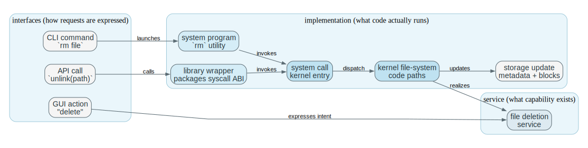

### 3.2 Human Interfaces And Why Shells Stay Out Of The Kernel

**Problem**

Humans need ways to express requests, but placing all human interface logic inside the kernel would enlarge the trusted computing base and make the OS harder to evolve.

**Mechanism**

A `CLI` accepts textual commands.
A `batch interface` runs commands non-interactively from a file or job stream.
A `GUI` packages requests through graphical controls.

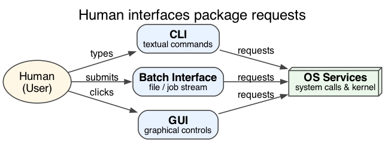

The `command interpreter`, usually a `shell`, is typically a user-space program.
It reads commands, parses them, locates programs, handles built-ins, and starts other programs as needed.

Keeping the shell outside the kernel means new commands can be added as ordinary executables rather than as privileged kernel changes.

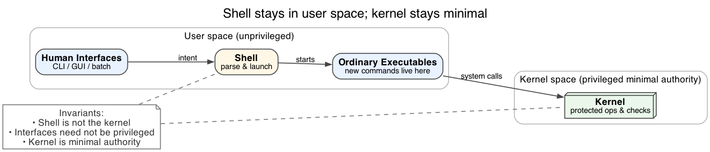

**Invariants**

- A shell is part of the operating-system experience, but it is not itself the kernel.
- Human interfaces should not require privileged execution merely to parse or present user intent.
- The kernel should remain the minimal authority needed to execute protected operations.

**What Breaks If This Fails**

- If command interpretation moves into the kernel, the trusted code base grows unnecessarily.
- If every new command requires kernel changes, extensibility collapses.
- If shells are confused with the kernel, the programmer misses where privilege actually lives.

**One Trace: shell command to launched program**

Read this as a boundary-placement trace.
Command parsing, scripting language features, and user interaction are intentionally kept in user space, while the kernel owns the authoritative act of creating an execution context and installing the initial privilege-separated state.
When you rehearse it, the pivot is: user intent first reaches privileged kernel code only when the shell issues the `exec`-style request.

| Step | Shell | Kernel | Why It Matters |
| --- | --- | --- | --- |
| command entered | shell reads and parses text | idle until asked | interface logic stays in user space |
| path resolution | shell finds executable or built-in | still not authoritative yet | front-end control remains unprivileged |
| launch request | shell issues exec-style request | validates executable and permissions | authority begins here |
| execution starts | shell may wait or continue | creates process and returns to user mode | user interface and privileged setup stay separate |

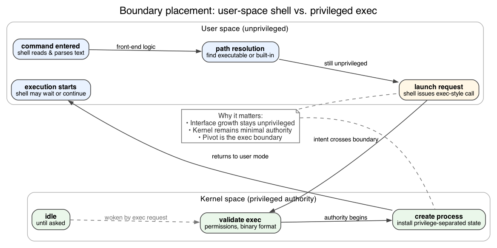

This is why shells stay out of the kernel: they are powerful interfaces, but the OS cannot afford to treat interface growth as privileged code growth.
The kernel owns the minimal, stable authority (create execution context safely); the shell owns the fast-evolving human interface.

**Code Bridge**

- In a teaching OS, inspect the path from shell parsing to program launch.
- Notice how much logic lives in user space before the kernel is asked to do anything authoritative.

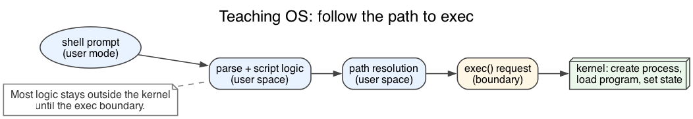

**Drills (With Answers)**

1. **Q:** Why is a shell script not evidence that the shell is part of the kernel?
**A:** A script is executed by a user-space interpreter (the shell or another runtime). The kernel is only involved through system calls (process creation, file I/O, waiting) and does not “understand” the script language. The shell has no privileged instructions; it cannot bypass kernel checks or directly control protected hardware state.

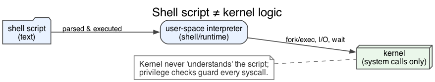

2. **Q:** What benefit appears when new commands are ordinary executables instead of kernel features?
**A:** Extensibility without privilege. New tools can be installed, updated, and replaced like normal programs without changing the trusted kernel core. That keeps the trusted computing base smaller, reduces the blast radius of bugs, and lets the command ecosystem evolve quickly without turning the kernel into a constantly changing UI platform.

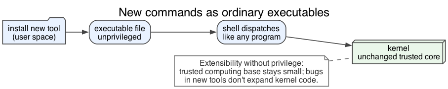

3. **Q:** Why is GUI support a different concern from kernel structure?
**A:** A GUI is an interface layer: it packages human intent into requests. Kernel structure is about how privileged mechanisms are organized and how authoritative state is protected and updated. You can swap GUIs entirely without changing the kernel’s semantics, but moving UI complexity into privileged code would increase security risk and maintenance cost.

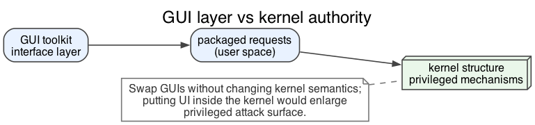

### 3.3 API, Library Wrappers, And System Calls

**Problem**

Programs need a stable way to request services, but protected operations cannot be performed directly in user mode.

**Mechanism**

An `API` is the programmer-visible function interface.
A `library wrapper` prepares arguments, follows the machine calling convention, and issues the actual privileged entry.
A `system call` is the kernel entry request itself.

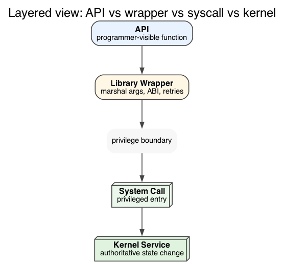

An API function may:

- do all work in user space
- issue one system call
- combine several system calls with user-space logic

Argument passing may use:

- registers
- a memory block or table
- the user stack

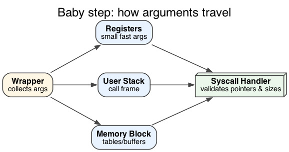

An API and a system call are different objects.
The API defines the programmer-facing function surface.
The system call performs the privilege transfer that allows the kernel to validate and update protected state.

**Invariants**

- User code may request protected work, but it cannot perform it directly.
- The kernel must validate arguments instead of trusting caller intent.
- API stability and syscall mechanism are related, but not identical, design layers.

**What Breaks If This Fails**

- If API and syscall are treated as the same thing, user-space support code becomes invisible.
- If arguments are not validated, the syscall path becomes an attack surface.
- If the kernel boundary is bypassed, protection collapses.

**One Trace: API call to kernel return**

Read this as three layers with different responsibilities.
The user program expresses intent, the library wrapper marshals that intent into an ABI-compatible privileged entry, and the kernel validates and performs the operation against authoritative state.
The wrapper exists so the kernel does not need to implement language- and libc-specific convenience behavior; the kernel stays the minimal authority, not a user API compatibility layer.

| Step | User Program | Library Wrapper | Kernel |
| --- | --- | --- | --- |
| request formed | code calls `open()`-style API | receives arguments | not executing yet |
| packaging | waits | places syscall number and args | still not authoritative yet |
| boundary crossing | special instruction executed | transfers control | enters privileged handler |
| dispatch | blocked on return | wrapper inactive | kernel identifies requested service |
| completion | receives result | converts return convention if needed | returns status or error |

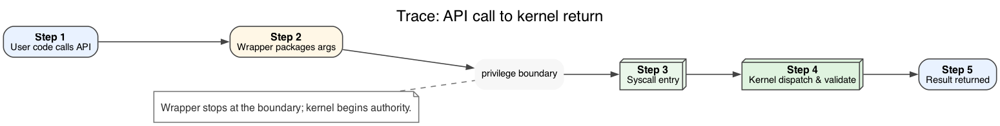

The wrapper is the user-space object that absorbs calling conventions, compatibility behavior, and convenience logic.
Responsibility for validating and updating protected state still lies in the kernel.

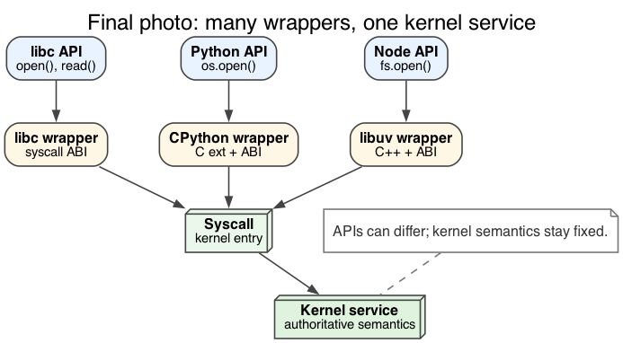

**Code Bridge**

- Compare a libc wrapper with the kernel syscall dispatcher.
- Ask where programmer-facing naming ends and where privileged enforcement begins.

**Drills (With Answers)**

1. **Q:** Why can two APIs expose the same service while using different wrapper code?
**A:** The service is defined by kernel semantics, not by one library’s implementation. Different language runtimes and libc versions can package arguments differently, add retries, implement convenience overloads, or translate error conventions while still converging on the same syscall (or syscall sequence). This is exactly why “API” and “syscall” are distinct layers: libraries can change without changing the kernel contract.

2. **Q:** What job does the library wrapper perform that the kernel should not do for it?
**A:** Marshaling and policy at the programming-language boundary: argument validation for user convenience, conversion of types/structures, retry logic, error mapping (`errno` style), and sometimes composition of multiple syscalls into one higher-level operation. Putting that into the kernel would inflate privileged code with fast-changing compatibility logic and create a larger attack surface.

3. **Q:** Why is syscall argument validation part of OS correctness and security?
**A:** The syscall boundary is a trust boundary. User pointers, sizes, and handles can be wrong by accident or malicious by design. Validation prevents kernel memory corruption, information leaks, and privilege escalation, and it also preserves correctness by ensuring that kernel invariants are updated only when inputs are well-formed and authorized.

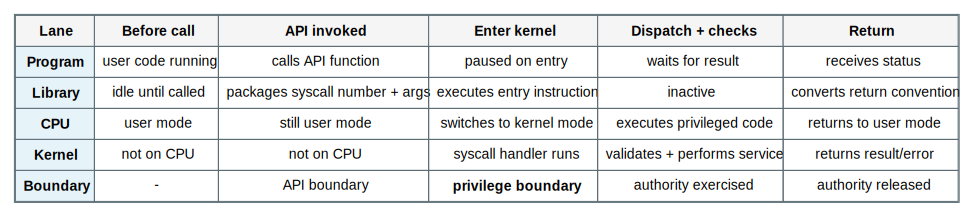

### 3.4 System-Call Categories As Control Surfaces

**Problem**

Syscalls are the only sanctioned crossings into privileged code. These six categories are the specific “control surfaces” where untrusted intent is converted into authoritative state change. If you do not know which surface you are touching, you cannot reason about protection, performance, or failure modes.

**Mechanism (read with the figure)**

Imagine walking around the kernel boundary in a circle. First you hit **process control**, which decides who runs and when contexts begin or end (`fork/exec/wait`). Sliding clockwise you reach **file management**, where named bytes and metadata live (`open/read/write/stat`). The path bends into **device management**—the tunnel into hardware-facing drivers via `ioctl` and related hooks. Next is **communication**: pipes, sockets, and other rendezvous points that connect principals. **Information maintenance** sits nearby; it reveals measured truth such as clocks and resource usage without letting callers mutate it (`gettimeofday`, `rusage`). Wrapping back toward the top is **protection**, which changes identities, permissions, and memory protections (`setuid`, `mprotect`, ACL updates). All six surfaces feed into the same kernel core, which validates arguments, enforces policy, and updates authoritative data structures.

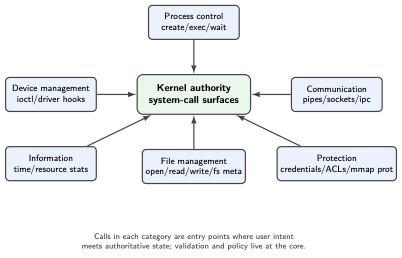

Thinking in surfaces, not isolated calls, makes the taxonomy useful. A single user workflow (copy a file to a USB device over SSH) touches process control (the copy tool), file management (source and destination paths), device management (USB mass-storage driver), communication (SSH stream), information (timestamps and progress stats), and protection (UID/permission checks). Every privileged mutation enters through one of these chokepoints; everything else is user-space convention layered on top.

**Invariants**

- Each category corresponds to kernel-managed state that ordinary code cannot safely control alone.
- Process, file, device, and protection surfaces are different because they affect different authoritative resources.
- The syscall interface exists because these state transitions require privileged enforcement.

**What Breaks If This Fails**

- If process creation is treated like a plain library call, you miss that the kernel must allocate a PID, wire the child into scheduling queues, inherit/close resources, and guarantee exit-time cleanup—none of which a user library can enforce.
- If devices are treated like unprotected byte streams, direct hardware control leaks into user space and bypasses the driver’s privilege checks and interrupt coordination.
- If protection calls are treated as optional metadata, access control becomes advisory; credentials, ACLs, and memory protections would no longer be authoritative.

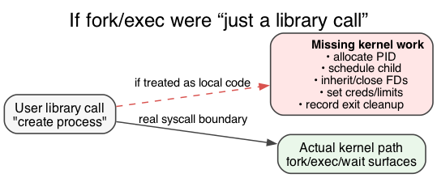

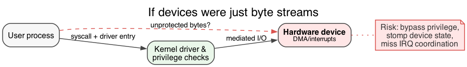

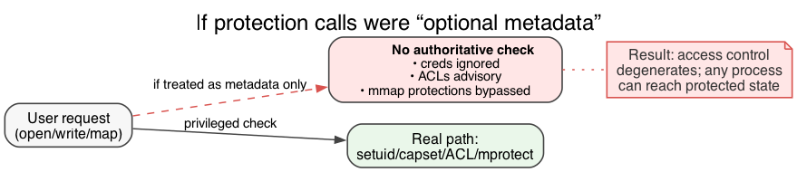

**Code Bridge**

- When reading a syscall table, classify each entry by which authoritative resource it manipulates.
- That classification is usually more useful than memorizing names alone.

**Drills (With Answers)**

1. **Q:** Why is file creation not just a string-processing event?
**A:** A filename is only the *name*. Creating a file allocates persistent metadata (inode/FCB), updates directory structures, reserves or later allocates storage blocks, sets ownership and permissions, and must preserve consistency even if the system crashes mid-operation. Those are system-wide invariants on shared persistent state, not local string manipulation.

2. **Q:** Why does device management remain conceptually different from file management even when both use `read()` and `write()`?
**A:** Devices have timing, interrupts, concurrency, and error semantics that are not “just bytes on disk.” A device endpoint may represent a live stream with backpressure, DMA, and driver-managed state. Files are persistent named objects with durability and allocation invariants. The API can look uniform, but the underlying authoritative state and correctness rules differ.

3. **Q:** Which syscall categories are really about changing execution, and which are about changing stored state?
**A:** Execution-changing calls include process control (create/exec/exit/wait) and protection-related operations that change what execution may do. Stored-state calls include file management and information maintenance (metadata, attributes). Communication spans both: it may create durable endpoints, but it also coordinates live execution and ordering across processes.

### 3.5 System Programs And Daemons As OS-Adjacent Layers

**Problem**

Most of what users call “the OS” is actually user-space code—utilities and daemons—layered on top of kernel mechanisms. Blurring that line hides where authority lives and where policy can be swapped out safely.

**Mechanism**

System programs (utilities, daemons, service managers) are regular user processes. They parse configs, apply policy, and call into the kernel via syscalls. The kernel owns protected state; the utility owns orchestration and presentation. Because they are just processes, they can be restarted, replaced, sandboxed, or updated without kernel changes.

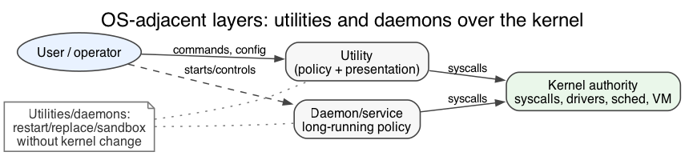

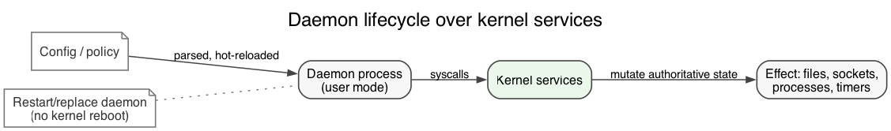

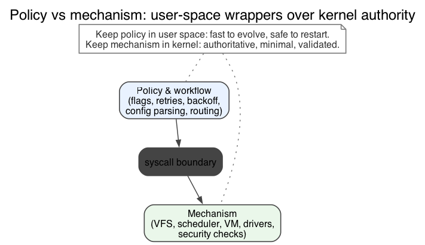

**Invariants**

- System programs may depend on many system calls without becoming part of the kernel.
- A daemon is still a process, not a kernel subsystem; it lives and dies by the scheduler and permission model.
- User experience of “the OS” is broader than the privileged core, but authority still resides in the kernel.

**What Breaks If This Fails**

- If you treat a daemon like a kernel subsystem, you over-trust it and underestimate the kernel’s guardrails.
- If you stuff utilities into kernel space “for speed,” you bloat the trusted base and make crashes catastrophic.
- If you assume user-facing tools are authoritative, you misdiagnose bugs and security issues—the kernel is the source of truth.

**One Trace: utility layered over kernel services**

Keep the boundary explicit: utilities orchestrate; the kernel authorizes and mutates state. In any workflow, mark which steps are policy (user space) and which steps require kernel authority.

| Stage | Utility / Daemon | Kernel | Structural Meaning |
| --- | --- | --- | --- |
| startup | user launches utility or boot starts daemon | creates process | utility gains an execution container |
| work request | utility reads config, args, or network input | waits for privileged requests | high-level logic remains outside kernel |
| service use | utility issues file, process, or device calls | enforces permission and performs work | utility packages policy around kernel mechanisms |
| completion | utility reports result or keeps serving | returns status and preserves system control | convenience layer stays distinct from authority layer |

If you keep this boundary clear, you can debug “the OS did X” statements precisely: was it a user-space daemon’s policy, or a kernel mechanism?
That distinction is also why many services can be restarted or replaced without rebooting, even though the kernel stays resident.

**Code Bridge**

- Inspect a daemon or utility and identify which work is policy, presentation, or orchestration, and which work is handed off to the kernel.

**Drills (With Answers)**

1. **Q:** Why is a compiler part of the system environment without being part of the kernel?
**A:** It is essential to a developer workflow, but it does not need hardware privilege to do its job. It consumes files, produces files, and uses ordinary system calls like any other application. Keeping it out of the kernel preserves a small trusted base and allows rapid improvement without risking privileged-system stability.

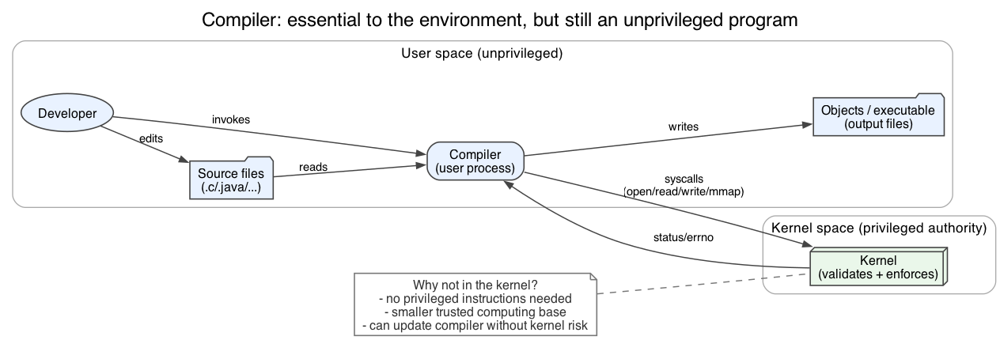

2. **Q:** What makes a daemon structurally different from a kernel thread or interrupt handler?
**A:** A daemon runs in user mode as a scheduled process, enters the kernel only through syscalls, and can be restarted or replaced without rebuilding the kernel. Kernel threads and interrupt handlers execute in privileged context and can directly manipulate protected state; if they crash or corrupt memory, the whole kernel is at risk.

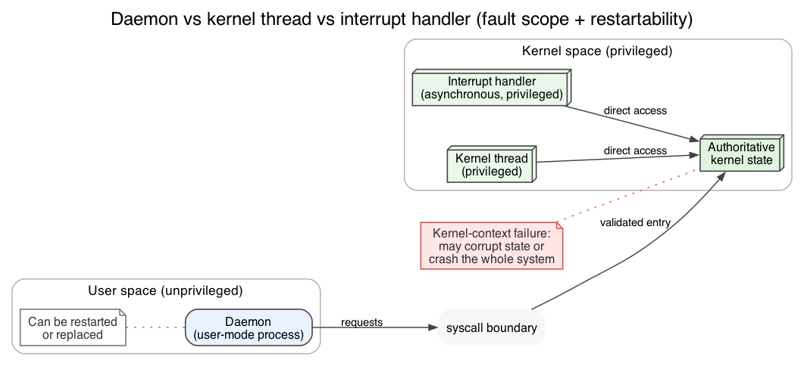

3. **Q:** Why do users often perceive utilities as “the OS” even though privilege lives elsewhere?
**A:** Because utilities are the visible control surfaces: they are what users type or click. They also encode lots of user-facing policy (flags, defaults, workflows). But visibility is not authority; the kernel is the invisible layer that actually enforces permissions and preserves system invariants.

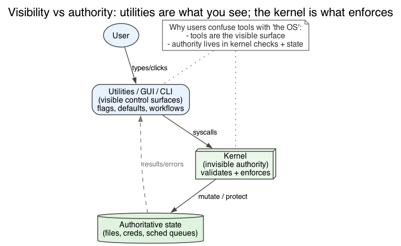

### 3.6 Policy, Mechanism, And Design Goals

**Problem**

An OS must be convenient, reliable, safe, fast, maintainable, and extensible, but these goals conflict. Without naming which goal you are optimizing (and what you are trading away), design discussions collapse into vague "better" claims.

**Mechanism**

This section gives you a clean classification tool:

- A `design goal` is a target outcome (latency, throughput, safety, simplicity, portability).
- A `mechanism` is what the system makes *possible*: a set of primitives and state transitions with invariants enforced by the kernel.
- A `policy` is the decision rule that chooses *which* allowed action the mechanism should take for a particular case.

The quick test is the swap test: if you can change the rule without changing the privileged machinery and its invariants, it is policy. If changing it requires new privileged state, new entry paths, or new invariants, it is mechanism.

Concrete examples (high fidelity, not slogan):

| Domain | Mechanism (what is possible) | Policy (which choice) |
| --- | --- | --- |
| CPU sharing | timer preemption + runnable queues + context switch | time-slice length, priority rules, fairness vs throughput |
| Virtual memory | page tables + faults + mapping/unmapping primitives | replacement algorithm, working-set heuristics, prefetch choices |
| Files/caching | page cache + writeback machinery + VFS rules | write-through vs write-back, eviction heuristics, dirty limits |

Good OS design keeps mechanisms general and stable so policies can change with hardware and workloads without rewriting (or expanding) privileged code.

**Invariants**

- Mechanisms enforce invariants regardless of policy (validation, isolation, accounting).
- Policies should be adjustable without widening the trusted computing base.
- When arguing about structure choices, state the goal being optimized and the cost being accepted (latency vs throughput, isolation vs overhead, flexibility vs complexity).

**What Breaks If This Fails**

- If policy is buried inside mechanism, tuning becomes a kernel rewrite problem and portability collapses (the "right" decisions differ across machines and workloads).
- If goals are unstated, the system accumulates inconsistent rules and becomes hard to reason about ("fast here, fragile there").
- If efficiency is optimized by entangling subsystems, the system can be fast but structurally brittle: small changes ripple through privileged code.

**Code Bridge**

- In scheduler/VM/FS code, separate "state + transitions + invariants" (mechanism) from "comparators + heuristics + knobs" (policy).

**Drills (With Answers)**

1. **Q:** Why is “shorter time slice for interactive work” policy rather than mechanism?
**A:** The mechanism is "the kernel can preempt via a timer, save context, and choose a runnable context." Slice length and which tasks get shorter slices are decision rules to trade latency against throughput/fairness. Changing the number does not change what is possible; it changes which outcomes you prefer.

2. **Q:** Why does keeping policy outside mechanism usually improve portability?
**A:** Different machines and workloads want different decisions: laptops vs servers, interactive vs batch, fast SSD vs slow disk. If the mechanism is general, the system can retune policy without changing the privileged invariants. Portability is being able to change decisions while keeping the enforcement boundary stable.

3. **Q:** How can a system be efficient and still structurally brittle?
**A:** It can hardcode assumptions (workload mix, CPU topology, I/O latency) into privileged code paths so that performance is great under one regime. The cost is coupling: changing a scheduler rule, VM heuristic, or driver behavior now risks breaking hidden invariants across subsystems. Brittle systems often "work fast" until the environment changes, then become difficult to modify safely.

### 3.7 Kernel Structures: Monolithic, Layered, Microkernel, Modular, Hybrid

**Problem**

As operating systems grow, they need internal structure.
But any structure choice changes both performance and fault behavior.

**Mechanism**

A `monolithic` style keeps most services in one kernel address space with direct internal calls.
A `layered` design arranges services into levels.
A `microkernel` keeps only the most fundamental privileged primitives in kernel space and moves many services to user-space servers.
`Loadable modules` keep a core kernel while allowing new privileged code to be linked dynamically.
`Hybrid systems` mix these ideas.

Each structure choice places code in a particular protection domain.
That placement determines the communication path, the communication cost, and the fault scope of a failure in that code.

**Invariants**

- Code inside kernel space has low communication cost but high fault scope.
- Code outside kernel space may improve isolation and replaceability but pays boundary-crossing cost.
- Layering is only useful if the dependency order matches reality.
- Hybrid systems still obey the same tradeoffs even when they mix patterns.

**What Breaks If This Fails**

- If too much code shares one privileged space, one bug can damage the whole kernel.
- If layers are forced where dependencies are cyclic, the design becomes awkward or dishonest.
- If too much is pushed to user-space servers, communication overhead can dominate.
- If modularity is confused with safety, dynamically loaded kernel code may still widen fault scope dramatically.

**One Trace: same logical request in different kernel organizations**

This table compares structures by tracing the request path.
The key variables are (1) how many boundary crossings occur, (2) where service logic executes, and (3) what happens if that service logic crashes.
When you memorize it, do not memorize names; memorize the trade: lower overhead tends to widen privileged fault scope, while stronger isolation tends to add communication and scheduling cost.

| Structure | Request Path | Main Advantage | Main Cost |
| --- | --- | --- | --- |
| monolithic | direct in-kernel call chain | low overhead | large privileged fault domain |
| layered | call descends through ordered levels | reasoning and separation | added path length and awkward dependencies |
| microkernel | message to user-space server via kernel IPC | fault isolation and replaceability | message and context-switch overhead |
| modular | direct in-kernel call into loaded module | extensibility with strong performance | module bug still runs privileged |

Code placement determines communication cost.
Code placement also determines fault scope.
Most arguments about kernel structure are arguments about how to trade those two consequences.

**Code Bridge**

- In a real kernel, identify which subsystems communicate by direct call, which by message-like handoff, and which can be loaded or removed independently.

**Drills (With Answers)**

1. **Q:** Why is a microkernel not just “a small operating system”?
**A:** “Microkernel” is not about being small for its own sake; it is about moving many services out of privileged space so failures are contained and services can be restarted or replaced. The kernel still provides essential primitives (address spaces, scheduling, IPC, low-level device mediation). The point is a change in fault boundaries and communication structure, not merely fewer lines of code.

2. **Q:** What performance cost appears when a service moves from kernel space to a user-space server?
**A:** Communication overhead: message passing, context switches, and often data copies or mapping operations. The request path can include more scheduling points and more cache/TLB disruption. You typically pay this cost to gain isolation, replaceability, and a smaller privileged fault domain.

3. **Q:** Why can a kernel be monolithic in execution style and still modular in deployment style?
**A:** “Monolithic execution” means services call each other directly in one privileged address space at runtime. “Modular deployment” means the set of privileged components can be loaded/unloaded or compiled separately (loadable modules). Even with modules, once loaded the code still runs with kernel privilege, so performance can be monolithic while safety/fault scope remains largely shared.

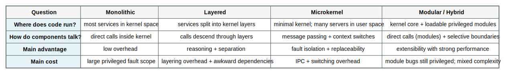

### 3.8 Debugging, Observability, System Generation, And Boot

**Problem**

An OS that cannot be observed, configured for a target machine, or started reliably is not operationally complete.

**Mechanism**

`Tracing`, `profiling`, and instrumentation probes expose system behavior over time.
`Core dumps` capture failed user-process state.
`Crash dumps` capture failed kernel state.

`SYSGEN` configures the operating system for a specific hardware or site environment.
`Booting` is the runtime startup path that begins at firmware, progresses through bootstrap code, and loads the kernel.

Tracing is the mechanism that records system behavior.
System generation is the mechanism that configures the OS image for a target machine.
Boot is the mechanism that transfers control from firmware to the kernel.
Chapter 2 groups these topics together because each one determines how the OS is observed, instantiated, or started.

**Invariants**

- Kernel failures require different collection and recovery machinery than user-process failures.
- Observability must expose behavior without requiring full kernel rewrites for each investigation.
- System generation happens before normal execution; boot happens at each startup.
- Firmware and bootstrap code must exist before the disk-resident kernel can run.

**What Breaks If This Fails**

- Without tracing or profiling, performance problems remain opaque.
- Without crash-dump support, kernel failures become far harder to diagnose.
- Without system generation, the OS may not match the hardware environment it is expected to run on.
- Without a reliable boot path, none of the higher-level structure matters because the kernel never starts.

**One Trace: boot from firmware to running kernel**

Boot is the ultimate proof that structure exists for operational reasons.
Before the kernel is in memory, there must be code that can initialize enough hardware to find and load it, and that early code must be trusted even though it is not “the OS” yet.
When you cover this trace, track the authority handoff: firmware -> bootstrap -> kernel -> user-space services, and name what each stage must make possible for the next one.

| Stage | Machine State | Structural Meaning |
| --- | --- | --- |
| power on | only firmware-resident code is immediately available | no disk-based OS code is running yet |
| firmware init | hardware is minimally prepared | startup authority exists before the kernel |
| bootstrap stage | loader locates bootable system image | control path to the kernel is established |
| kernel load | privileged core enters memory and starts subsystems | runtime OS structure begins |
| normal operation | services, daemons, and user programs start | system becomes usable |

This table is the “structure exists before services exist” proof: you cannot request an OS service until a trusted kernel is resident, but you cannot get the kernel resident without earlier trusted stages.
Boot is therefore part of OS structure, not an afterthought.

**Code Bridge**

- Later, inspect bootloader configuration, trap setup, syscall instrumentation, and crash reporting paths.
- Those are where Chapter 2 stops being “design vocabulary” and becomes executable machinery.

**Drills (With Answers)**

1. **Q:** Why is a crash dump structurally different from a core dump?
**A:** A core dump is collected for a user process while the kernel is still healthy enough to write files and manage I/O. A crash dump is collected when the kernel (the authority) fails, which means you cannot rely on normal subsystems being correct. Crash dumps often require reserved memory, special dump paths, or out-of-band mechanisms precisely because the OS is partially broken.

2. **Q:** Why is system generation not the same event as boot?
**A:** System generation configures or builds the OS image and its configuration for a target environment (drivers, modules, parameters). Boot is the runtime act of loading that configured system and starting it on a specific machine instance. One is “prepare the structure,” the other is “activate the structure.”

3. **Q:** Why does observability count as part of system structure instead of only tooling?
**A:** Because observability requires intentional placement of hooks at boundary points where state transitions occur (syscall entry, scheduling decisions, I/O completion, memory faults). If those hooks are missing, the system becomes opaque and expensive to diagnose, and changes are harder to validate safely. Instrumentation is not decoration; it is a structural capability for operating the system.

## 4. Canonical Traces To Reproduce From Memory

Do not merely read these.
Cover the tables and reproduce the sequence from memory.

### 4.1 CLI Command To Program Execution

This is the minimal shell path from user intent to a privileged kernel request, then to a newly constructed execution context, and then back to user mode.
When you recite it, say exactly when execution enters privileged code and what the kernel must construct (process + address space + initial context) before control can return safely.

| Step | User / Shell | Kernel |
| --- | --- | --- |
| command entered | shell parses command line | idle until asked |
| resolution | shell locates executable or built-in | not authoritative yet |
| launch request | shell issues exec-style request | validates file and permissions |
| setup | shell waits or continues | creates process and address-space state |
| return | shell regains control later if needed | returns to user mode |

When practicing, say what the kernel *constructs* (process identity, address-space mapping, initial register state) before the return to user mode is allowed.
That “constructed state” is the concrete meaning of “program execution service.”

### 4.2 API Call To System Call To Return

This is the “API is not a syscall” trace.
The wrapper is not an implementation detail to ignore; it is where user-facing conventions are reconciled with a privileged ABI boundary.

| Step | Program | Wrapper | Kernel |
| --- | --- | --- | --- |
| call site | API invoked | receives intent and args | inactive |
| packaging | waiting | prepares syscall ABI | inactive |
| entry | special instruction executes | transfers control | enters handler |
| service | blocked on result | inactive | checks, performs, records result |
| return | receives status | converts return form if needed | exits to user mode |

The syscall instruction is only the doorway; the real work is the protected bookkeeping on both sides: copy/validate arguments in, update authoritative state, and return results in a convention user code understands.
If you can name which layer owns which responsibility, you can reason about performance and security at the boundary.

### 4.3 Microkernel Client Request Path

This trace exists to force you to “feel” the extra boundary.
Service logic runs in a user-space server, which improves fault containment but adds communication and scheduling cost.
When you reproduce it, name where the kernel mediates IPC and where the server’s correctness becomes part of overall service correctness.

| Step | Client | Microkernel | User-Space Server |
| --- | --- | --- | --- |
| request formed | sends message | mediates IPC | waiting |
| delivery | blocked or continues | routes message | receives request |
| service work | waiting for reply | may schedule peers | performs service logic |
| response | receives result | mediates return | sends reply |

This trace uses the same service/interface/implementation layering with one extra twist: the service logic runs in a restartable user-space server while the kernel still mediates the protected boundary.
You gain fault containment, but you pay additional scheduling and IPC overhead and must treat the server as part of the service’s correctness story.

### 4.4 Boot Path From Firmware To Usable System

Boot is the start-up structure.
You are tracking who controls the CPU before the kernel exists and when the kernel becomes the resident authority that can then start user-space services.

| Step | Machine State | Controlling Code |
| --- | --- | --- |
| reset | hardware starts from predefined entry | firmware |
| minimal init | diagnostics and early device setup | firmware |
| loader stage | boot image located and loaded | bootstrap code |
| kernel stage | core subsystems initialize | kernel |
| normal use | services and user programs start | kernel plus user-space system programs |

Reproduce this as an authority chain: which code can run next, and what minimal prerequisites it must establish (memory, device discovery, disk access) for the next stage.
If you can narrate those prerequisites, “boot” stops being trivia and becomes the first structural trace in the OS.

## 5. Key Questions (Answered)

1. **Q:** Why is a service/interface distinction necessary for reasoning about OS design?
**A:** Because services are the OS guarantees (what capability exists and what semantics it has), while interfaces are just ways of expressing intent. One service can be exposed by many interfaces, and interfaces can change rapidly without changing what the kernel must enforce. If you confuse them, you will treat utilities and shell syntax as “the OS,” and you will miss where authority and invariants actually live.

2. **Q:** Why is the kernel boundary simultaneously a privilege boundary and a performance boundary?
**A:** Privilege: crossing into the kernel changes what instructions and state are legal to touch, and it is where the OS must validate untrusted input. Performance: the crossing has real costs (mode switch/trap overhead, cache and TLB disruption, potential scheduling effects) and changes fault scope (a bug in privileged code is more expensive). Chapter 2 exists largely to teach that you do not move code across this boundary casually.

3. **Q:** Why can an API be stable even when the underlying syscall mechanism changes?
**A:** Because libraries mediate. A stable API can be implemented by different syscalls, by sequences of syscalls, or even entirely in user space if the OS exposes a different primitive. Backward compatibility can be preserved by wrappers and versioning even as the kernel internals evolve. The kernel must preserve *service semantics*; the wrapper layer can adapt the call surface.

4. **Q:** What engineering cost appears when user-interface logic is placed too close to privileged code?
**A:** The trusted computing base grows. More privileged code means more security risk, more ways to crash the kernel, and more constraints on change, because kernel updates are riskier than user-space updates. It also tends to couple policy and presentation into the most difficult-to-change layer, making the whole system harder to evolve.

5. **Q:** Why does moving a service into user space improve isolation without being “free”?
**A:** Isolation improves because a server crash need not crash the kernel; the service can often be restarted. The cost is communication: IPC messages, context switches, scheduling points, and sometimes additional copying or mapping. You trade raw speed for fault containment and replaceability, and Chapter 2 teaches you to name that trade explicitly.

6. **Q:** Why is a shell a better place than the kernel for command-language growth?
**A:** Because shells are interfaces, and interfaces evolve quickly. Keeping that evolution in user space lets the system grow without expanding privileged code. It also makes interfaces replaceable: you can install a new shell, scripting engine, or CLI toolchain without changing the kernel’s authority or invariants.

7. **Q:** Why is a syscall category best understood as a control surface over authoritative state?
**A:** Categories correspond to the kinds of kernel-managed state that must remain authoritative: execution contexts, persistent named storage, device endpoints, communication channels, and access relationships. Syscalls are “the allowed mutations” of that state under validation and policy. If you treat categories as memorization bins, you miss that they are the map of what the kernel must own.

8. **Q:** Why does a daemon still count as an ordinary process even when it feels like part of the system?
**A:** Because it runs in user mode, is scheduled like other processes, and enters the kernel only through syscalls. It may run with elevated identity (e.g., as root), but it still cannot execute privileged instructions directly or bypass kernel validation. That is exactly why daemons are a structural tool: they can provide system behavior while keeping privilege in the kernel.

9. **Q:** Why is policy/mechanism separation a long-term maintenance advantage rather than only a clean-design slogan?
**A:** Workloads and hardware change faster than kernel invariants. If mechanisms are general, policies can evolve (tuning, scheduling choices, replacement strategies) without rewriting deep code. This reduces risk, improves testability, and makes it possible to adapt the system without turning every policy tweak into a privileged refactor.

10. **Q:** Why can layering improve reasoning while still worsening performance or structure in practice?
**A:** Layers can make dependencies and invariants explicit, which helps humans reason about the system. But they can also add call-path length, duplicate checks, and force unnatural dependency directions that real implementations violate. A layered diagram can be conceptually clean while the real system becomes slower or more contorted if the layers do not match true coupling.

11. **Q:** Why is a crash dump harder to capture than a core dump?
**A:** A core dump is produced while the kernel is alive and can use normal storage and I/O paths. A crash dump happens when the kernel itself failed, so you cannot assume filesystems, drivers, or buffers are trustworthy. Capturing state often requires pre-reserved memory, special dump devices, or minimal “last resort” code paths designed specifically for a broken system.

12. **Q:** Why do boot and system generation belong in a chapter about operating-system structure?
**A:** Because they show how the structure is instantiated. Boot defines the authority handoff and the minimal prerequisites required before any OS service can exist; system generation defines what components and configuration the OS will have when it starts. If you ignore them, you miss that OS structure is not only a runtime architecture but also a build/startup pipeline that determines what the system even is.

## 6. Suggested Bridge Into Real Kernels

If you later study a teaching kernel or Linux-like codebase, a good Chapter 2 reading order is:

1. shell or command-runner path
2. libc wrapper to syscall entry path
3. syscall dispatch table and handler boundary
4. boot and early init code
5. module loading or service registration paths
6. tracing, logging, or probe infrastructure

Conceptual anchors to look for:

- where a user-space request first enters privileged code
- where interface code hands off to enforcement or service logic
- where message or call boundaries widen or shrink fault scope
- where boot hands control from firmware to the kernel
- where debugging and performance visibility hooks are placed

If you later study a microkernel-style system, ask the same questions again.
The names change.
The boundary costs do not.

## 7. How To Use This File

If you are short on time:

- Read `## 2. Mental Models To Know Cold` once.
- Reproduce the traces in `## 4. Canonical Traces To Reproduce From Memory`.

Use this file when:

- you want Chapter 2 to feel like a set of control-boundary decisions
- you want to reason about syscall paths and kernel structure instead of memorizing categories
- you want to understand why different OS organizations make different tradeoffs

Read it slowly.
Reproduce the traces from memory.
When the chapter feels easy, try explaining one structure choice in terms of fault scope, communication cost, and replaceability without using the textbook wording.
