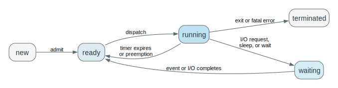

# Chapter 3 Processes Mastery

Source: Chapter 3 of `textbook.pdf` (Operating System Concepts, 9th ed.).

This file is the mastery note for Chapter 3.
It is written to make process management feel like live kernel control rather than like a list of terms and UNIX examples.

If Chapter 1 established why the OS must control execution and Chapter 2 explained how programs reach the kernel, Chapter 3 explains how the kernel keeps many computations alive at once without losing track of state, ownership, or coordination.

## 1. What This File Optimizes For

The goal is not to memorize process vocabulary.
The goal is to be able to answer questions like these without guessing:

- What makes a process more than a program file?
- Why are process states descriptions of what can happen next rather than labels to memorize?
- Why does the PCB have to exist if execution can be interrupted?
- Why is a context switch a save-decision-restore protocol rather than a magical jump?
- Why are creation and termination lifecycle protocols instead of isolated API calls?
- Why is IPC about preserving meaning and order, not just moving bytes?

For Chapter 3, mastery means:

- you can trace how a process is created, blocked, resumed, and cleaned up
- you can identify what state the kernel must preserve at each step
- you can explain which queues the scheduler cares about and why
- you can predict what breaks when lifecycle bookkeeping is missing
- you can connect the abstractions to scheduler code, sleep/wakeup paths, and IPC mechanisms in a real kernel

## 2. Mental Models To Know Cold

### 2.1 A Process Is Execution Plus Owned State

A program file is passive.
A process is the live execution of that program together with the machine state and kernel-managed resources that make the execution real.

### 2.2 Process State Means “What Can This Computation Do Next?”

`Ready`, `running`, `waiting`, and `terminated` are meaningful because they encode the process's current relationship to CPU service and future progress.

### 2.3 The PCB Is The Kernel’s Promise That Execution Can Resume

If a computation can be stopped and later continued, the kernel must have a durable record of identity, saved CPU context, scheduling metadata, and owned resources.

### 2.4 Scheduling Is Queue Selection Under Scarcity

The scheduler is not a mystical policy engine.
It is a mechanism that chooses among runnable work while other work is waiting for events, devices, or memory relief.

### 2.5 IPC Is Coordination, Not Just Data Transfer

The hard part of IPC is not only moving data.
It is preserving ordering, ownership, meaning, and progress across separate execution contexts.

## 3. Mastery Modules

### 3.1 A Process Is A Program In Execution Plus Owned State

**Problem**

The operating system must manage active computations, not just stored instructions.
A file on disk does not tell the kernel where execution currently is or what resources are in use.

**Mechanism**

A `process` is a program in execution together with:

- the `program counter`
- CPU `registers`
- the `stack`
- the `data section`
- the `heap`
- open kernel-managed resources such as files or devices

This is why one program file can correspond to many different processes.
Each execution has different live state even when the code is identical.

**Invariants**

- A process is more than code; it includes execution state and owned resources.
- The program counter and registers must be treated as part of the process's live identity.
- Multiple processes may share program text while still being distinct computations.

**What Breaks If This Fails**

- If a process is treated as only a file, scheduling and resumption become conceptually impossible.
- If live resource ownership is ignored, cleanup and isolation lose meaning.
- If active state is confused with stored code, process creation and duplication become mysterious.

**Code Bridge**

- When reading a kernel's process descriptor, identify which fields belong to CPU state, memory state, and owned resources.

**Drills**

1. Why can one executable file correspond to many processes?
2. Why is the heap part of the process but not part of the program file in the same way?
3. Why is a JVM process still a real process even though it hosts another runtime inside it?

### 3.2 Process States Describe What The Kernel Can Do Next

**Problem**

Once a process exists, it does not run continuously to completion.
The kernel must classify whether it can run now, later, or never again.

**Mechanism**

The classic states are:

- `new`
- `ready`
- `running`
- `waiting`
- `terminated`

These states are operational:

- `ready` means the process could run if given a CPU
- `running` means it is using a CPU now
- `waiting` means some event must occur before it can continue
- `terminated` means execution is over and cleanup is underway or complete

The scheduler and wakeup paths depend on these distinctions.

**Invariants**

- A ready process is eligible for CPU service now.
- A waiting process cannot make progress until an event occurs.
- A running process consumes CPU; a ready one does not.
- State transitions must reflect real causality such as dispatch, block, completion, or exit.

**What Breaks If This Fails**

- If waiting and ready are confused, the kernel wastes CPU on work that cannot progress.
- If running and ready are confused, scheduling decisions lose meaning.
- If termination is treated like just another waiting state, cleanup logic becomes inconsistent.

**One Trace: basic lifecycle under scheduler control**

| Step | State | Cause |
| --- | --- | --- |
| creation | `new` | process admitted |
| dispatch | `ready -> running` | scheduler selects it |
| block | `running -> waiting` | I/O request or event wait |
| wakeup | `waiting -> ready` | event completes |
| exit | `running -> terminated` | execution ends |

**Code Bridge**

- In scheduler code, ask where the process state field changes and which event justifies each transition.

**Drills**

1. Why is `ready` not just “almost running”?
2. Why is `waiting` not the same thing as “inactive”?
3. Why do state transitions need causes rather than just labels?

### 3.3 The PCB Is The Kernel’s Authoritative Record

**Problem**

If a process can be interrupted, blocked, preempted, or resumed, the kernel needs durable bookkeeping that survives those transitions.

**Mechanism**

The `process control block (PCB)` stores the information needed to treat the process as a resumable execution entity.
That typically includes:

- process identity
- saved execution state
- scheduling metadata
- memory-management information
- I/O and resource metadata

The exact field names differ by OS, but the role stays constant:
the PCB is where the kernel remembers enough to resume or clean up the process correctly.

**Invariants**

- Saved execution state must be sufficient for correct resumption.
- Scheduling metadata must allow the process to be placed in the right queues.
- Resource metadata must remain consistent with what the process actually owns or references.
- The PCB is authoritative; it cannot be replaced by vague assumptions about “the running program.”

**What Breaks If This Fails**

- Without saved context, resumption is incorrect.
- Without scheduling metadata, dispatch decisions become disconnected from process reality.
- Without resource metadata, cleanup and protection break.

**Code Bridge**

- In Linux-like code, ask how identity, saved CPU context, run-queue membership, and open-resource state are represented in the task structure.

**Drills**

1. Why is the PCB not just optional bookkeeping?
2. What is the minimum information a PCB must preserve for resumption?
3. Why is resource metadata part of the PCB story instead of only CPU state?

### 3.4 Threads Refine The Process Model Rather Than Replacing It

**Problem**

Modern systems often need multiple execution paths inside one application without duplicating every process-level resource.

**Mechanism**

A `thread` is an execution path inside a process.
The process remains the larger resource-owning container:

- address space
- open files
- other process-level kernel resources

Threads share those process-level resources while keeping distinct execution states.

This is why the process/thread distinction is really a distinction between:

- ownership and protection
- control flow and scheduling

**Invariants**

- Process and thread are not interchangeable abstractions.
- Threads inside one process share the process container.
- Distinct execution paths still require distinct execution state.

**What Breaks If This Fails**

- If threads are confused with processes, resource sharing and isolation logic become muddled.
- If process ownership is ignored, “lighter weight” execution is explained badly.
- If execution path and resource container are fused conceptually, later concurrency discussions become harder.

**Code Bridge**

- In thread-aware kernels or runtimes, ask which state belongs per-thread and which remains process-wide.

**Drills**

1. Why is a thread cheaper than a full process in many systems?
2. Why does shared address space not make two threads the same execution path?
3. Why does the process still matter after threads are introduced?

### 3.5 Queues And Schedulers Exist Because Processes Compete For Service

**Problem**

The CPU and devices are scarce.
The kernel therefore needs explicit waiting structures and selection logic.

**Mechanism**

Processes may appear in structures such as:

- the `job queue`
- the `ready queue`
- device-specific wait queues
- swap-related holding structures when memory pressure matters

The `short-term scheduler` chooses among ready processes.
The `long-term scheduler` influences how many processes are admitted into active competition.
The `medium-term scheduler` can reduce pressure by swapping processes out and back in.

This is best understood as queue selection under resource scarcity.

**Invariants**

- Ready work and blocked work must remain distinct.
- Device waits belong in event- or device-specific queues, not the ready queue.
- Long-term admission affects the degree of multiprogramming.
- Scheduler choice must operate on a truthful representation of who can run now.

**What Breaks If This Fails**

- If everything is thrown into one queue, scheduling loses semantic meaning.
- If the ready queue contains blocked processes, CPU time is wasted.
- If admission pressure is ignored, memory and responsiveness can both degrade.

**One Trace: queue movement under normal operation**

| Step | Queue / State Change | Meaning |
| --- | --- | --- |
| process admitted | enters job set then ready queue | now eligible for future CPU service |
| dispatched | leaves ready queue, becomes running | CPU assigned |
| blocks on I/O | enters device wait queue | cannot use CPU productively now |
| I/O completes | leaves device wait queue, reenters ready queue | runnable again |
| swapped out under pressure | leaves active competition temporarily | memory pressure managed |

**Code Bridge**

- In scheduler code, identify which queue corresponds to which kind of scarcity: CPU, device, or memory.

**Drills**

1. Why is a queue not just an implementation detail but part of the process model?
2. Why does the long-term scheduler change system behavior even though it runs infrequently?
3. Why is a healthy process mix important for overall utilization?

### 3.6 Context Switching Is Save, Decision, And Restore

**Problem**

The OS must stop one computation and later resume either the same one or a different one without corrupting execution.

**Mechanism**

A `context switch` saves the outgoing process state and restores the incoming process state.
It is triggered by events such as:

- timer interrupts
- blocking I/O
- explicit yield or sleep
- wakeup and scheduler choice

The scheduler's decision only becomes real because the context switch changes which process state is live on the CPU.

Context-switch cost is overhead in the narrow sense:
it preserves the illusion of concurrent progress rather than advancing user work directly.

**Invariants**

- Outgoing state must be saved before it is overwritten.
- Incoming state must be restored consistently.
- The scheduler must choose among runnable work, not arbitrary work.
- Switching too frequently can trade responsiveness for excessive overhead.

**What Breaks If This Fails**

- Without correct saves, resumed execution is corrupted.
- Without correct restore, the wrong computation continues.
- Without a scheduler decision between save and restore, switching is meaningless.
- Without overhead awareness, fairness improvements can become performance regressions.

**One Trace: timer-driven preemption**

| Step | Running Process | Kernel / Scheduler | Result |
| --- | --- | --- | --- |
| slice active | process A uses CPU | timer counts down | A makes progress |
| timeout | A is interrupted | kernel regains control | preemption point reached |
| save | A stops running | A's context stored in PCB | A becomes resumable |
| choose | scheduler selects B | runnable set examined | next process chosen |
| restore | B's state loaded | kernel returns to user mode | B becomes running |

**Code Bridge**

- In a teaching kernel, inspect the timer interrupt path and the scheduler handoff to see where save, decision, and restore each occur.

**Drills**

1. Why is a context switch not itself useful work for the user computation?
2. What exact state must survive preemption?
3. Why does timer-driven preemption require both interrupt logic and scheduler logic?

### 3.7 Process Creation Is Controlled Duplication And Divergence

**Problem**

Processes must be created dynamically, but creation raises questions of identity, inheritance, and independence.

**Mechanism**

When a parent creates a child, the OS must decide:

- what identity the child gets
- what resources are inherited
- whether parent and child continue concurrently
- whether the child starts as a copy of the parent image or quickly diverges to a new one

UNIX expresses this structurally with `fork()` and `exec()`:

- `fork()` duplicates the process image
- `exec()` replaces the current program image

That separation is the main conceptual point, not the exact API names.

**Invariants**

- Creation is not just “run another program”; it creates a new execution container.
- Parent-child ancestry and shared future behavior are not the same thing.
- Resource inheritance must be controlled or isolation becomes weak.
- Image duplication and image replacement are distinct lifecycle steps.

**What Breaks If This Fails**

- If creation and image replacement are fused conceptually, `fork/exec` becomes hard to reason about.
- If inheritance is uncontrolled, resource ownership and predictability degrade.
- If ancestry is confused with identity, process trees stop making sense.

**One Trace: fork then exec style divergence**

| Step | Parent | Child | Kernel Meaning |
| --- | --- | --- | --- |
| before creation | running existing image | absent | one execution context exists |
| creation request | asks for child | created with inherited state | new process identity allocated |
| post-fork | continues or waits | starts as copy-like execution image | ancestry established |
| exec | may remain unchanged | image replaced | child diverges into new program |

**Code Bridge**

- Inspect where the kernel copies process metadata, where it duplicates or references resources, and where `exec` replaces the address-space image.

**Drills**

1. Why are `fork()` and `exec()` structurally different actions?
2. Why is parent-child ancestry not the same thing as sharing a future program image?
3. What resource decisions must the OS make during process creation?

### 3.8 Termination, Wait, Zombies, And Orphans

**Problem**

Ending execution is not the same thing as instantly deleting every trace of the process.

**Mechanism**

Termination is a protocol:

1. execution ends
2. the process reports status, often through `exit`
3. some resources are reclaimed
4. the parent may later collect status with `wait`
5. final bookkeeping is removed

A `zombie` is a terminated process whose final status has not yet been collected.
An `orphan` is a child whose original parent has disappeared first.
On UNIX-like systems, orphans are typically reparented so someone can still collect status later.

**Invariants**

- Exit status may need to outlive execution itself.
- Parent-child relationships matter to cleanup.
- A zombie is not still computing; it is lingering bookkeeping.
- An orphan is not necessarily dead; it has only lost its original parent.

**What Breaks If This Fails**

- If exit status vanishes too early, parents cannot observe child outcome correctly.
- If dead entries never clear, process-table resources leak.
- If orphan handling is absent, cleanup responsibility becomes ambiguous.

**One Trace: exit to final cleanup**

| Step | Process State | Kernel Meaning |
| --- | --- | --- |
| execution ends | child stops running | status becomes final |
| zombie phase | not executing, table entry retained | parent may still collect outcome |
| parent waits | status retrieved | final cleanup authorized |
| removal | table entry deleted | lifecycle complete |

**Code Bridge**

- Look for where exit status is stored, where wait consumes it, and where the final table entry is removed.

**Drills**

1. Why is a zombie not just “a dead process” in the most naive sense?
2. Why are zombie and orphan different failure or lifecycle outcomes?
3. Why does final cleanup often happen after execution has already ended?

### 3.9 IPC Exists Because Isolation Alone Is Not Enough

**Problem**

Many useful systems are built from cooperating processes rather than one giant execution context.

**Mechanism**

Processes may cooperate for:

- information sharing
- speedup
- modularity
- convenience

That requires `interprocess communication (IPC)`.
The two foundational models are:

- `shared memory`
- `message passing`

The producer-consumer pattern matters here because it shows that shared data without synchronization or protocol is not enough.

**Invariants**

- Cooperation requires a disciplined communication mechanism.
- Shared data also requires agreement on timing, ownership, and interpretation.
- Communication is about preserving structured meaning, not only byte movement.

**What Breaks If This Fails**

- If decomposition occurs without IPC, modular structure becomes behaviorally useless.
- If processes share data without protocol, races and inconsistent interpretation appear.
- If message boundaries are unclear, coordination logic becomes fragile.

**Code Bridge**

- In OS labs, identify where the kernel sets up the communication channel and where user processes must enforce the higher-level protocol themselves.

**Drills**

1. Why is IPC necessary even on one machine?
2. Why is the producer-consumer problem about coordination as much as data storage?
3. Why is modularity one of the strongest reasons to allow process cooperation?

### 3.10 Shared Memory And Message Passing Move Complexity To Different Places

**Problem**

Once processes cooperate, the main design question becomes where the complexity lives: in the kernel-mediated boundary or in shared-state discipline between peers.

**Mechanism**

In `shared memory`, the kernel establishes and protects the shared region.
After that, communication proceeds through ordinary memory operations.

In `message passing`, the OS or runtime remains involved in each send and receive.
That makes the boundary explicit, but it raises per-exchange mediation cost.

This tradeoff compresses to:

`shared memory -> less per-exchange kernel work, more synchronization discipline in the processes`

`message passing -> more explicit communication boundaries, more per-exchange system mediation`

**Invariants**

- Shared memory reduces repeated kernel mediation but does not remove the need for coordination.
- Message passing makes communication events explicit.
- Neither model is universally superior; the best choice depends on locality, performance goals, and synchronization complexity.

**What Breaks If This Fails**

- If shared memory is treated as free communication, races and stale assumptions appear.
- If message passing is treated as only a distributed-systems mechanism, local IPC design becomes harder to read.
- If the location of coordination work is ignored, performance tradeoffs are misunderstood.

**One Trace: producer-consumer via shared memory**

| Step | Producer | Shared Buffer | Consumer |
| --- | --- | --- | --- |
| produce | creates item | empty or has space | waiting or doing other work |
| publish | writes item and updates shared protocol state | now contains valid data | not yet consumed |
| consume | idle or producing other data | holds readable item | reads item only when protocol says valid |
| release | may continue producing | slot becomes reusable | signals or records consumption |

**Code Bridge**

- In shared-memory examples, identify which parts the kernel set up once and which parts the processes must coordinate repeatedly.

**Drills**

1. Why can shared memory be faster and still be harder to get right?
2. Why does message passing shift some complexity back into the OS or runtime?
3. Where does synchronization responsibility live in each model?

### 3.11 Naming, Blocking, And Buffering Determine How Message Passing Behaves

**Problem**

Message passing is not one single mechanism.
Its behavior depends on who names whom, whether calls block, and how much buffering exists.

**Mechanism**

Message passing can vary along several axes:

- `direct` versus `indirect` communication
- `blocking` versus `nonblocking` send and receive
- `zero-capacity`, `bounded-capacity`, or `unbounded-capacity` channels

These choices determine whether communication behaves more like rendezvous, queued delivery, or asynchronous event exchange.

**Invariants**

- Naming rules determine how tightly sender and receiver are coupled.
- Blocking rules determine whether control waits for communication success immediately.
- Buffer capacity determines when backpressure appears.

**What Breaks If This Fails**

- If direct and indirect communication are confused, addressing and ownership assumptions become wrong.
- If blocking semantics are ignored, liveness bugs become likely.
- If buffering assumptions are wrong, senders or receivers may stall unexpectedly.

**Code Bridge**

- In any IPC API, ask three questions first: who names the peer, who can block, and where can messages accumulate?

**Drills**

1. Why does a zero-capacity channel behave like a rendezvous?
2. Why is indirect communication structurally looser than direct communication?
3. Why does bounded buffering create backpressure?

### 3.12 Client-Server, Sockets, RPC, And Pipes Extend IPC Across Larger Boundaries

**Problem**

Once communication crosses subsystem or machine boundaries, processes still need structured coordination rather than raw byte exchange alone.

**Mechanism**

`Sockets` expose communication endpoints.
`RPC` raises the abstraction level so communication resembles a procedure call.
`Pipes` support ordered byte-stream communication, often for related local processes.

These are not separate universes from IPC.
They are IPC mechanisms or abstraction layers pushed across larger boundaries.

The difficult issues remain the same:

- naming
- data representation
- synchronization
- failure handling
- protection

**Invariants**

- Local and remote communication still require structured agreement on meaning.
- RPC depends on packaging and reconstructing data correctly across endpoints.
- Pipes, sockets, and RPC differ in abstraction level more than in fundamental purpose.

**What Breaks If This Fails**

- If sockets are treated as only networking trivia, the underlying IPC model is obscured.
- If RPC is treated as magic, marshalling and failure modes become invisible.
- If pipes are treated as equivalent to all other IPC, their ordered-stream assumptions get overgeneralized.

**One Trace: request/reply over message-oriented IPC**

| Step | Client | Kernel / Runtime | Server |
| --- | --- | --- | --- |
| request formed | prepares operation and args | channel exists or is created | waiting |
| send | issues send or call | mediates delivery | receives request |
| service | waits for reply or continues | may buffer, schedule, or route | performs work |
| reply | receives result | returns message or reply | sends outcome |

**Code Bridge**

- In sockets or RPC code, ask where naming ends, where marshalling begins, and where failure or timeout becomes visible to the caller.

**Drills**

1. Why is RPC conceptually an IPC mechanism with a higher-level interface?
2. Why do sockets still need a protocol above raw bytes?
3. Why is the local-versus-remote distinction less important than many students first assume?

## 4. Canonical Traces To Reproduce From Memory

Do not merely read these.
Cover the table and reproduce the lifecycle or handoff from memory.

### 4.1 Ready To Running To Waiting To Ready

| Step | State | Cause |
| --- | --- | --- |
| admitted | `ready` | process is eligible for CPU service |
| dispatched | `running` | scheduler selects it |
| blocks | `waiting` | needs I/O or event |
| completion | `ready` | event occurs and wakeup happens |

### 4.2 Timer-Driven Preemption And Context Switch

| Step | Outgoing Process | Kernel | Incoming Process |
| --- | --- | --- | --- |
| before timeout | running | timer armed | ready |
| interrupt | interrupted | regains control | still waiting in ready set |
| save and choose | stopped temporarily | stores outgoing context and selects next | chosen |
| restore | not running | loads chosen context | now running |

### 4.3 Fork Then Exec Style Split

| Step | Parent | Child |
| --- | --- | --- |
| before split | existing execution | absent |
| after creation | continues or waits | begins with inherited execution context |
| after exec | may remain same program | image replaced with new program |

### 4.4 Exit To Zombie To Wait To Cleanup

| Step | Child | Parent | Kernel |
| --- | --- | --- | --- |
| exit | execution ends | may still be running | status preserved |
| zombie phase | not executing | has not waited yet | table entry retained |
| wait | inactive | collects status | authorizes cleanup |
| cleanup | fully removed | receives outcome | bookkeeping ends |

### 4.5 Shared-Memory Producer / Consumer Coordination

| Step | Producer | Buffer | Consumer |
| --- | --- | --- | --- |
| create item | ready to publish | has free slot | not yet reading |
| publish | writes and updates protocol state | contains valid data | can now consume |
| consume | may continue or wait | item removed or slot freed | reads only when valid |

### 4.6 Message-Passing Request / Reply

| Step | Sender | Channel / Kernel | Receiver |
| --- | --- | --- | --- |
| request | forms message | idle or ready | waiting |
| send | issues operation | buffers or routes | not yet handling |
| delivery | waiting or continuing | makes message visible | receives |
| reply | waits or receives response | routes result | returns outcome |

## 5. Questions That Push Beyond Recall

1. Why is a process conceptually closer to a resumable contract with the kernel than to a file on disk?
2. Why do process states describe future possibilities rather than past history?
3. Why is the PCB the kernel's authoritative record instead of just a convenient cache?
4. Why does the scheduler need queues that distinguish CPU scarcity from device scarcity?
5. Why is a context switch best understood as a protocol rather than as a single event?
6. Why does `fork` plus `exec` teach more about process structure than either call in isolation?
7. Why can a terminated process still need a table entry?
8. Why are zombie and orphan fundamentally different lifecycle outcomes?
9. Why is IPC about preserving meaning and order rather than just transferring bytes?
10. Why does shared memory reduce some kernel work while increasing application responsibility?
11. Why do blocking semantics and buffering rules materially change IPC behavior?
12. Why are sockets and RPC best understood as IPC across a larger boundary rather than as unrelated networking trivia?

## 6. Suggested Bridge Into Real Kernels

If you later study a teaching kernel or Linux-like codebase, a good Chapter 3 reading order is:

1. process descriptor / PCB representation
2. scheduler loop and ready-queue logic
3. sleep and wakeup paths
4. timer interrupt to context-switch handoff
5. fork/exec and exit/wait paths
6. local IPC or pipe implementation

Conceptual anchors to look for:

- where process identity is stored
- where runnable versus blocked state is encoded
- where save and restore happen during a switch
- where exit status survives after execution ends
- where IPC setup is done by the kernel and where higher-level protocol is left to processes

If you later study browsers, runtimes, or servers, ask the same Chapter 3 questions again.
The examples get more complex.
The process-control problems do not.

## 7. How To Use This File

If you are short on time:

- Read `## 2. Mental Models To Know Cold` once.
- Reproduce the traces in `## 4. Canonical Traces To Reproduce From Memory`.

Use this file when:

- you want Chapter 3 to feel like live state management rather than vocabulary
- you want to reason about process lifecycle, scheduling, and IPC without hiding behind API trivia
- you want a mental model strong enough to read process or scheduler code later

Read it slowly.
Reproduce the traces from memory.
If the chapter feels easy, try explaining one lifecycle bug, one scheduling bug, and one IPC bug purely in terms of state, ownership, and coordination.
