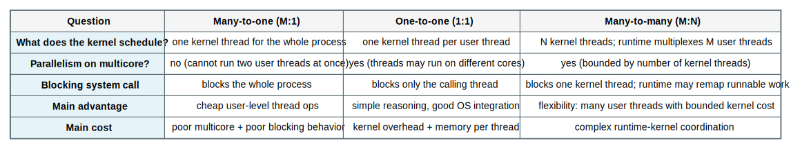
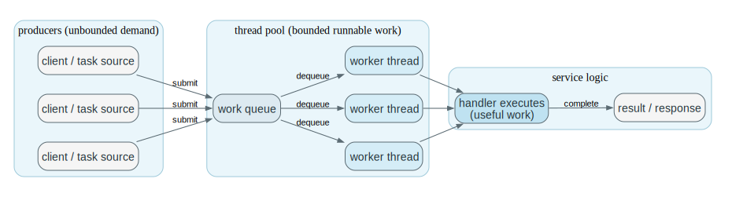

# Chapter 4 Threads and Concurrency Mastery

Source: Chapter 4 of `textbook.pdf` (Operating System Concepts, 9th ed.).

This file is the mastery note for Chapter 4.
It is written to make threading feel like a concrete control and structure choice, not a language feature.

If Chapter 3 taught you how the kernel tracks *one* execution container, Chapter 4 teaches how the kernel and runtime track *many* execution paths inside that container, and how multicore turns “concurrency” into real parallel hazards.

## 1. What This File Optimizes For

The goal is not to memorize thread API calls.
The goal is to be able to answer questions like these without guessing:

- What is *shared* between threads, and what is *not* shared?
- Why does “a blocked thread” sometimes imply “a blocked process” and sometimes not?
- Why does a multicore machine make correctness harder even when it makes performance possible?
- When should threads be created explicitly, and when should they be implicit (thread pools, tasks)?
- What is the real difference between many-to-one, one-to-one, and many-to-many threading models?
- Why do fork/exec, signals, and cancellation become “protocol problems” in multithreaded programs?

For Chapter 4, mastery means:

- you can trace what happens when a thread blocks, cancels, exits, or joins
- you can predict how a threading model changes parallelism and failure modes
- you can reason about speedup limits and performance cliffs on multicore
- you can connect the abstractions to real scheduler and runtime code later

## 2. Mental Models To Know Cold

### 2.1 A Thread Is a Schedulable Execution Context

A thread is the “control flow” piece:
program counter, registers, stack, and the scheduling identity needed to run.

A process is the “ownership” piece:
address space, open files, and other resources that persist across context switches.

This separation is the chapter.

### 2.2 Concurrency Is Structure; Parallelism Is Physics

Concurrency: you *structure* the program so multiple activities can make progress.
Parallelism: the machine *actually runs* multiple activities at the same time.

You can have concurrency without parallelism (single core).
You cannot have safe parallelism without correct concurrency structure (multicore).

### 2.3 The Threading Model Is Mostly About What Blocks

If the kernel schedules only *one* kernel execution entity for the whole process, then a blocking system call blocks *everyone* in the process.
If the kernel schedules multiple kernel threads, then one thread can block while others keep running.

This single idea explains most tradeoffs between user-level threads, kernel threads, and the many-to-one / one-to-one / many-to-many models.

### 2.4 “More Threads” Is Not Automatically “More Speed”

Threads create two new costs:

- coordination cost: locks, atomic operations, ordering constraints
- runtime cost: creation, context switches, cache effects, scheduling overhead

On multicore, a “correct” program can still become slow because contention forces threads to wait on each other.

### 2.5 Implicit Threading Is Admission Control

Explicit threading is letting the programmer create execution contexts directly.
Implicit threading is the system providing a higher-level unit of work (tasks) and controlling how many threads actually run at once.

Thread pools, fork-join frameworks, OpenMP, and GCD exist because “unbounded thread creation” is a real system failure mode.

## 3. Mastery Modules

### 3.1 Process vs Thread: Resource Container vs Execution Context

**Problem**

A modern program needs multiple flows of control (UI + I/O + background work, multiple client requests, pipelines).
Spawning a full process per activity is expensive and makes sharing state awkward.

**Mechanism**

A `process` is the resource-owning container:

- address space (code, data, heap, mapped files)
- open files and sockets
- permissions and identities

A `thread` is a schedulable execution context inside that container:

- program counter + registers
- stack (per-thread call frames)
- thread-local storage

Threads share the process’s address space and resources by default.
That is the feature and the danger.

**Invariants**

- A process may have multiple threads, but one address space.
- Threads share memory; therefore, “ordinary writes” become communication.
- Per-thread stacks must not overlap; shared heap data must be synchronized by design.

**What Breaks If This Fails**

- If you assume stacks are shared, you mis-explain correctness (“how did my local variable change?”).
- If you assume heap data is private, you create races by accident.
- If you assume files are per-thread, you mis-handle I/O ordering and close semantics.

**Code Bridge**

- In POSIX, identify what `pthread_create` must allocate (stack + thread metadata) versus what already exists (address space).
- In Linux-like kernels, notice that “threads” often look like “tasks that share an address space.”

**Drills**

1. Name three kinds of state that are per-thread and three that are shared across threads.
2. Why does “shared address space” make communication cheap but correctness hard?
3. If one thread calls `close(fd)`, what must other threads assume about that file descriptor?

### 3.2 Why Threads Exist (And What They Cost)

**Problem**

Programs want to overlap I/O with computation, stay responsive, and exploit multicore.
A single sequential control flow forces unnecessary waiting.

**Mechanism**

Classic motivations for multithreading:

- `responsiveness`: one thread can keep the UI/reactor alive while another blocks
- `resource sharing`: sharing memory is simpler than IPC for tightly coupled work
- `economy`: threads are typically cheaper than processes (less state to create/switch)
- `scalability`: threads are the unit that can map onto multiple cores

The cost is that threads turn shared memory into a correctness surface.
You do not “get concurrency”; you inherit the duty to preserve invariants under interleavings.

**Invariants**

- Shared invariants must hold across all possible interleavings, not just the “intended order.”
- Performance and correctness are linked: contention is both a speed problem and a design smell.

**What Breaks If This Fails**

- Races: wrong values, lost updates, stale reads.
- Deadlocks: progress stops because threads wait on each other in a cycle.
- Heisenbugs: timing-sensitive failures that vanish under debugging.

**Code Bridge**

- In a server, identify which data is per-request (safe to keep thread-local) and which data is global (requires synchronization).

**Drills**

1. Why can a single bug in a shared invariant produce “rare” failures instead of consistent failures?
2. What is one example where responsiveness improves but throughput worsens after adding threads?
3. What is the most common place you accidentally share data in a threaded program?

### 3.3 Multicore Programming: Turning Concurrency Into Parallel Work

**Problem**

Multicore provides hardware parallelism, but most work is not parallelizable without restructuring.
Even after restructuring, speedup is limited by serial sections and coordination overhead.

**Mechanism**

Two common decompositions:

- `task parallelism`: different tasks run in parallel (request handling, pipeline stages)
- `data parallelism`: the same operation runs over different data partitions

The simplest bound is `Amdahl’s Law`:

If fraction `S` is serial and fraction `1-S` is perfectly parallel, then with `N` cores:

`speedup <= 1 / (S + (1-S)/N)`

That bound ignores real overheads (locks, cache misses, communication), so real speedup is often lower.

**Invariants**

- Serial sections and contended critical sections cap speedup.
- Work must be balanced; idle cores are wasted parallelism.
- Communication and coordination are work too.

**What Breaks If This Fails**

- If a single lock guards “everything,” multicore becomes “fast waiting.”
- If tasks are unbalanced, one thread becomes the bottleneck and others idle.
- If shared-memory access patterns are poor, cache coherence traffic dominates.

**One Trace: Amdahl bound**

Assume `S = 0.10` (10% serial).

| Cores N | Ideal bound | Interpretation |
| --- | --- | --- |
| 1 | 1.0x | baseline |
| 2 | `1 / (0.10 + 0.90/2) = 1.82x` | not 2x because serial work remains |
| 4 | `1 / (0.10 + 0.90/4) = 3.08x` | diminishing returns |
| 16 | `1 / (0.10 + 0.90/16) = 6.40x` | even 16 cores cannot exceed 10x |

**Code Bridge**

- In a real system, find the “serial fraction” by locating shared locks, shared queues, or single-threaded subsystems.

**Drills**

1. Why can removing one contended lock outperform adding more cores?
2. What’s the difference between “parallelizable work exists” and “parallel speedup is achieved”?
3. Name one performance cliff that appears only after moving from 1 core to many cores.

### 3.4 User Threads vs Kernel Threads: Who Schedules What?

**Problem**

We want many threads, but involving the kernel in every thread operation can be expensive.
If the kernel does not know about threads, the runtime must simulate concurrency.

**Mechanism**

`User-level threads`:
the threading library creates and schedules threads in user space.

`Kernel threads`:
the kernel schedules threads directly; blocking, preemption, and multicore execution are handled naturally by the kernel.

The key distinction is what happens on a blocking system call:

- if the kernel thinks there is only one execution entity, it blocks the whole process
- if the kernel schedules multiple threads, it blocks only the calling thread

**Invariants**

- The kernel schedules kernel-visible entities, not “language abstractions.”
- A user-level scheduler can only run when it has CPU; it cannot run while the whole process is blocked in the kernel.

**What Breaks If This Fails**

- In a pure user-thread model, one blocking system call can freeze all threads.
- Preemption and fairness can degrade if the runtime lacks good signals from the kernel.

**One Trace: one thread blocks on I/O**

| Model | Thread A does blocking `read()` | Thread B outcome |
| --- | --- | --- |
| user threads, kernel sees 1 entity | process enters kernel and sleeps | B cannot run |
| kernel threads (1:1 or M:N with kernel support) | only A sleeps | B can keep running |

**Code Bridge**

- In POSIX, identify which calls are “cancellation points” or likely to block, then reason about how that interacts with the model.

**Drills**

1. Why is “fast thread creation” not enough to make user-only threads a good idea?
2. What new cost appears when the kernel schedules many threads directly?
3. How can a runtime avoid blocking the entire process in the presence of blocking I/O?

### 3.5 Multithreading Models: Many-to-One, One-to-One, Many-to-Many

**Problem**

We want the cheapness of user threads and the correctness/performance of kernel scheduling.
Different systems choose different mappings between user threads and kernel threads.

**Mechanism**

- `many-to-one (M:1)`: many user threads mapped to one kernel thread
- `one-to-one (1:1)`: each user thread mapped to a kernel thread
- `many-to-many (M:N)`: many user threads multiplexed over a smaller or equal set of kernel threads

Many-to-many often relies on kernel support to coordinate scheduling decisions between the runtime and the kernel (e.g., scheduler activations / upcalls).

**Invariants**

- True multicore parallelism requires at least as many kernel threads as cores you want to occupy.
- Blocking behavior is defined by kernel-visible entities.
- M:N is only practical when the runtime and kernel can coordinate.

**What Breaks If This Fails**

- M:1 fails to exploit multicore and suffers from “one blocks, all block.”
- 1:1 can suffer from high overhead if you create huge numbers of threads.
- M:N can be complex and fragile if the runtime can’t learn when kernel threads block or resume.

**Code Bridge**

- When you read a runtime later, ask: is it mapping tasks to kernel threads directly, or does it maintain its own user-level scheduler?

**Drills**

1. Why does M:1 fundamentally prevent parallelism on multicore?
2. Why can 1:1 become a memory and scheduling problem with “thread per request”?
3. What kernel signal would a user-level scheduler want to know about blocked kernel threads?

### 3.6 Thread Libraries: API vs Implementation

**Problem**

Programs need a portable interface for creating and coordinating threads, but different OSes implement threads differently.

**Mechanism**

Thread libraries typically provide:

- create/start
- join (wait for completion) or detach (no join expected)
- mutual exclusion and condition synchronization primitives (bridges to Chapter 5)
- per-thread storage

Common examples in the textbook:
`Pthreads`, `Windows`, and `Java` threads.

Your goal is not to memorize names.
Your goal is to understand what semantics the library is promising and what kernel machinery it must rely on.

**Invariants**

- Join is a lifecycle protocol: “I will wait and reap the thread’s outcome.”
- Detach is a cleanup protocol: “no join; free resources when done.”
- Thread identity and lifetime must be tracked reliably or resources leak.

**What Breaks If This Fails**

- If joins are missed, thread resources accumulate (leaks).
- If detach/join semantics are mixed incorrectly, you can double-free or lose completion information.

**Code Bridge**

- On Linux-like systems, follow `pthread_create` into the kernel boundary it uses (often `clone`-like).
- On JVMs, ask where threads become OS threads and where green-thread scheduling might occur (implementation-dependent).

**Drills**

1. Why does “join” feel like `wait()` from Chapter 3?
2. What’s one reason a thread library might avoid “create a kernel thread every time”?
3. What lifecycle invariant does detach enforce?

### 3.7 Implicit Threading: Pools, Tasks, and Fork-Join

**Problem**

If every request creates a new thread, the system can spend more time creating and scheduling threads than doing useful work.

**Mechanism**

Implicit threading approaches include:

- `thread pools`: a fixed or bounded set of worker threads pulls tasks from a queue
- `fork-join` / task frameworks: programmers express parallel structure, runtime schedules tasks
- `OpenMP`: compiler directives produce parallel regions and tasks
- `Grand Central Dispatch (GCD)`: queues of blocks/tasks scheduled onto a pool (macOS/iOS)

The unifying idea is that the system controls the *degree of concurrency*.

**Invariants**

- The system must bound runnable threads to avoid thrashing.
- Work submission must not become a single contended bottleneck.
- Task execution must preserve the program’s ordering and memory invariants.

**What Breaks If This Fails**

- Unbounded thread creation causes memory pressure and scheduler overload.
- A single global queue can become a hot lock.

**One Trace: thread pool request handling**

| Step | Component | Meaning |
| --- | --- | --- |
| submit | producer enqueues work item | request becomes schedulable work |
| pick up | worker thread dequeues | thread pool controls concurrency |
| execute | worker runs handler | useful work happens |
| respond | worker completes and returns | thread reused for next task |

**Code Bridge**

- In servers, look for “accept loop + work queue + worker threads” as the structural signature of a pool.

**Drills**

1. Why is a thread pool an OS-level performance and stability mechanism, not just a style choice?
2. What’s the difference between “tasks” and “threads” in a fork-join framework?
3. Why can a bounded pool reduce tail latency even if it reduces peak parallelism?

### 3.8 Threading Issues: Fork/Exec, Signals, Cancellation, TLS

**Problem**

Once a process has multiple threads, system events become ambiguous:
which thread should receive a signal, what does it mean to fork, and how do you safely stop a thread?

**Mechanism**

Key issue clusters:

- `fork` / `exec` in a multithreaded process:
  - a common rule is “after `fork`, only the calling thread exists in the child”
  - `exec` replaces the process image, so thread structure is rebuilt in the new program
- `signals`:
  - some signals are process-directed; the runtime/OS must pick a thread to deliver to
  - per-thread masks control which thread may receive which signals
- `cancellation`:
  - `asynchronous` cancellation stops immediately (dangerous)
  - `deferred` cancellation stops at defined cancellation points (safer)
  - cleanup handlers must release locks and resources
- `thread-local storage (TLS)`:
  - per-thread copies of data that would otherwise be shared and race-prone

**Invariants**

- After `fork` in a multithreaded program, the child must not assume locks are in a clean state.
- Cancellation must not leave shared invariants broken (e.g., a lock held forever).
- Signal handlers must be written with reentrancy and safety constraints in mind.

**What Breaks If This Fails**

- Fork + locks can deadlock: the child inherits lock state but not the threads that could release it.
- Async cancellation can corrupt invariants mid-critical-section.
- Signals delivered to an unexpected thread can violate assumptions and cause inconsistent state.

**One Trace: deferred cancellation**

| Step | Canceler | Target thread | Meaning |
| --- | --- | --- | --- |
| request | sends cancel request | continues running | cancellation is pending |
| reach point | - | hits cancellation point | safe stop location |
| cleanup | - | runs cleanup handlers | invariants restored |
| termination | - | exits | join/detach protocol completes |

**Code Bridge**

- In POSIX, find cancellation points in blocking calls and identify what cleanup must happen to preserve invariants.

**Drills**

1. Why is “only the calling thread remains after fork” a safety choice?
2. Why is deferred cancellation safer than asynchronous cancellation?
3. Name one use of TLS that reduces synchronization needs.

### 3.9 Operating-System Examples: What “Thread” Means In Practice

**Problem**

The word “thread” is stable, but OS implementations choose different internal representations and policies.

**Mechanism**

Practical anchors:

- Many modern general-purpose OSes implement a mostly `1:1` model in practice.
- The implementation detail that matters is: does the kernel schedule the thread independently, and can different threads truly run at once on different cores?

**Invariants**

- If the kernel schedules it, it has a kernel identity and kernel-saved context.
- If it shares an address space, it shares the memory invariants of that process.

**What Breaks If This Fails**

- If you confuse user-level tasks with kernel-scheduled threads, you mispredict blocking, fairness, and parallelism behavior.

**Code Bridge**

- In Linux-like kernels: search for task structures, clone/fork variants, and scheduler run queues.

**Drills**

1. If your runtime uses tasks, what is the kernel actually scheduling?
2. How would you detect “M:1 behavior” in performance symptoms?
3. Why is thread representation a kernel data-structure choice that can change performance?

## 4. Canonical Traces To Reproduce From Memory

Do not merely read these.
Cover the table and reproduce the sequence from memory.

### 4.1 Create -> Run -> Exit -> Join

| Step | Parent thread | Child thread | Kernel / runtime meaning |
| --- | --- | --- | --- |
| create | requests new thread | allocated with new stack/context | new schedulable context exists |
| run | continues | executes entry function | concurrent execution begins |
| exit | may keep running | returns/exits | completion status recorded |
| join | waits for child | already done or finishes | resources reclaimed deterministically |

### 4.2 Blocking System Call Under Different Models

| Model | Blocking call effect | Who can still run? |
| --- | --- | --- |
| M:1 user threads | blocks entire process | nobody in that process |
| 1:1 kernel threads | blocks only that thread | other threads in same process |
| M:N (with kernel support) | blocks one kernel thread | other kernel threads, runtime may remap |

### 4.3 Thread Pool Request Path

| Step | Producer | Queue | Worker |
| --- | --- | --- | --- |
| submit | creates work item | enqueued | idle |
| schedule | - | item visible | dequeues |
| execute | waits or continues | item consumed | runs handler |
| reuse | - | queue remains | worker returns to idle |

### 4.4 Parallel Speedup Bound (Amdahl)

| Step | Quantity | Meaning |
| --- | --- | --- |
| identify serial fraction | `S` | part that cannot be parallelized |
| choose cores | `N` | hardware parallelism |
| compute bound | `1/(S + (1-S)/N)` | maximum ideal speedup |
| interpret | diminishing returns | more cores help less as N grows |

### 4.5 Fork In A Multithreaded Process -> Exec

| Step | Parent (many threads) | Child after fork | After exec |
| --- | --- | --- | --- |
| fork issued | one thread calls fork | only calling thread exists | - |
| post-fork | parent continues | child must assume locks may be inconsistent | - |
| exec | optional | replaces image | new program defines new threading |

### 4.6 Deferred Cancellation With Cleanup

| Step | Canceler | Target | Invariant preserved |
| --- | --- | --- | --- |
| request cancel | sets pending flag | continues | state not torn mid-critical-section |
| cancellation point | - | checks pending | safe stop boundary |
| cleanup | - | releases locks/frees resources | shared invariants restored |
| termination | - | exits | lifecycle reaped by join/detach |

## 5. Questions That Push Beyond Recall

1. Why is “threads share memory” both the main performance advantage and the main correctness risk?
2. Why does “what blocks” explain most threading-model tradeoffs?
3. Why can adding cores reduce performance when contention grows?
4. Why is a thread pool an admission-control mechanism, not only an efficiency trick?
5. Why does 1:1 threading make blocking behavior easy to reason about but sometimes expensive?
6. Why is M:N hard to implement without kernel cooperation?
7. Why does fork in a multithreaded process require special rules?
8. Why is asynchronous cancellation dangerous even if it seems convenient?
9. Why do signals become a policy problem (who receives) in multithreaded programs?
10. Why does TLS reduce synchronization pressure, and what does it not solve?
11. What is one concrete way that cache coherence can dominate multicore performance?
12. If a parallel program is correct, why might it still be nondeterministic in timing and output order?

## 6. Suggested Bridge Into Real Kernels

If you later study Linux-like kernels and runtimes, a good Chapter 4 reading order is:

1. user thread API entry (`pthread_create`, join/detach) to kernel boundary
2. kernel thread/task creation (`clone`-like) and what is shared vs copied
3. scheduler runnable-queue logic for threads
4. blocking I/O path and wakeups (how sleeping threads resume)
5. cancellation, signals, and per-thread masks/TLS machinery

Conceptual anchors to look for:

- where a new stack is allocated and mapped
- where “thread identity” is stored in kernel structures
- where blocking sleeps, wakeups, and run-queue operations happen
- where the runtime bounds concurrency (pool size, queues, backpressure)

## 7. How To Use This File

If you are short on time:

- Read `## 2. Mental Models To Know Cold` once.
- Reproduce the traces in `## 4. Canonical Traces To Reproduce From Memory`.

If you want Chapter 4 to become reasoning skill:

- Work the `## 3. Mastery Modules` slowly: problem -> mechanism -> invariants -> failure modes.
- Do the drills without looking.
- Practice the canonical traces until you can reproduce them from memory and explain *why each step exists*.
