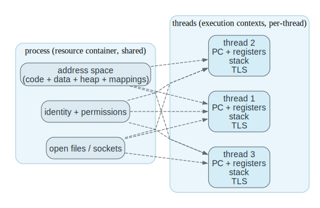
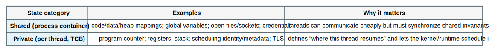
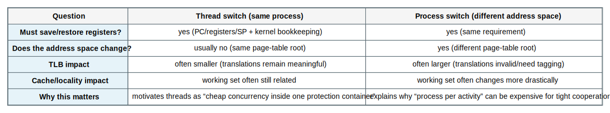
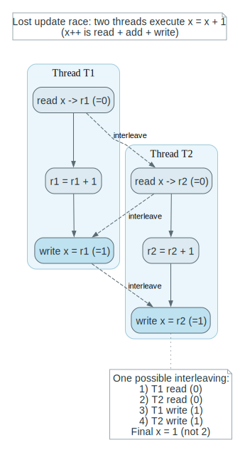
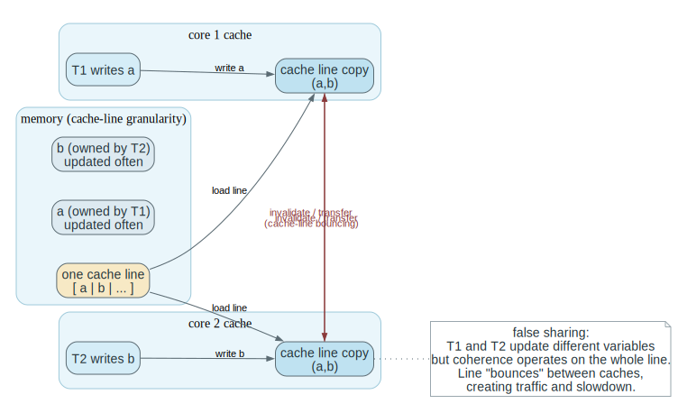
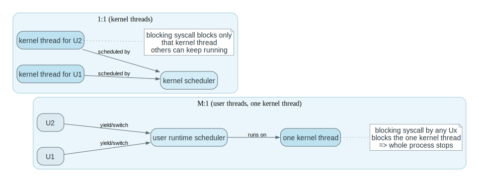
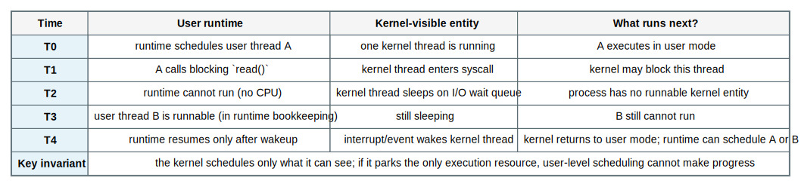
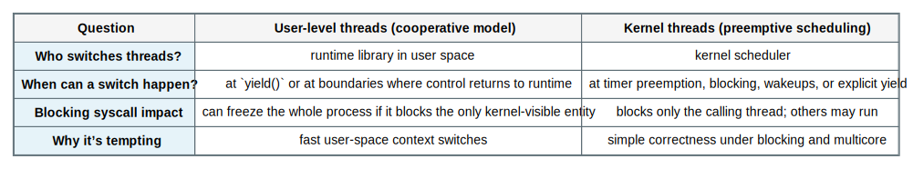
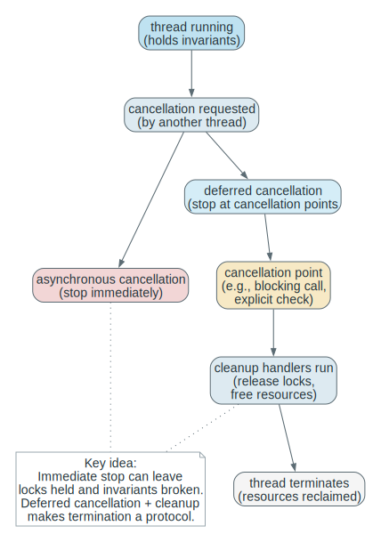
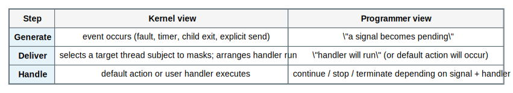

# Chapter 4 Threads and Concurrency Mastery

Source: Chapter 4 of `textbook.pdf` (Operating System Concepts, 9th ed.).

This file is the mastery note for Chapter 4.
It treats threading as a control-boundary and scheduling design choice, not as a language feature.

If Chapter 3 taught you how the kernel tracks *one* execution container, Chapter 4 teaches how the kernel and runtime track *many* execution paths inside that container, and how multicore turns “concurrency” into real parallel hazards.

## 1. What This File Optimizes For

The goal is not to memorize thread API calls.
The goal is to be able to do the following without guessing:

- Distinguish what is shared between threads and what remains per-thread state.
- Predict when “one thread blocks” implies “the whole process blocks” (and when it does not).
- Explain why multicore turns concurrency into real parallel correctness hazards and performance cliffs.
- Choose when to create threads explicitly versus using implicit threading (pools, tasks, fork-join).
- Compare M:1, 1:1, and M:N threading models by blocking behavior, overhead, and achievable parallelism.
- Explain why fork/exec, signals, and cancellation become lifecycle and protocol problems in multithreaded programs.

For Chapter 4, mastery means:

- you can trace what happens when a thread blocks, cancels, exits, or joins
- you can predict how a threading model changes parallelism and failure modes
- you can reason about speedup limits and performance cliffs on multicore
- you can connect the abstractions to real scheduler and runtime code later

## 2. Mental Models To Know Cold

### 2.1 A Thread Is a Schedulable Execution Context

A thread is the schedulable control-flow object:
program counter, registers, stack, and the scheduling identity needed to run.

A process is the resource-owning container:
address space, open files, and other resources that persist across context switches.

Chapter 4 depends on keeping those responsibilities separate: the process owns resources, while each thread carries one execution path through them.

### 2.2 Concurrency Is Structure; Parallelism Is Physics

Concurrency: you *structure* the program so multiple activities can make progress.
Parallelism: the machine *actually runs* multiple activities at the same time.

You can have concurrency without parallelism (single core).
You cannot have safe parallelism without correct concurrency structure (multicore).

Related terms from Lecture 2 that are easy to mix up:

- `multiprocessing`: the machine has multiple CPUs/cores
- `multiprogramming`: the OS keeps multiple jobs/processes in memory so the CPU stays busy
- `multithreading`: one process has multiple threads of execution

### 2.3 The Threading Model Is Mostly About What Blocks

If the kernel schedules only *one* kernel execution entity for the whole process, then a blocking system call blocks *everyone* in the process.
If the kernel schedules multiple kernel threads, then one thread can block while others keep running.

Most tradeoffs between user-level threads, kernel threads, and the many-to-one / one-to-one / many-to-many models reduce to one boundary question: which execution entities can the kernel see, schedule, block, and wake independently?

### 2.4 “More Threads” Is Not Automatically “More Speed”

Threads create two new costs:

- coordination cost: locks, atomic operations, ordering constraints
- runtime cost: creation, context switches, cache effects, scheduling overhead

On multicore, a “correct” program can still become slow because contention forces threads to wait on each other.

### 2.5 Implicit Threading Is Admission Control

Explicit threading is letting the programmer create execution contexts directly.
Implicit threading is the system providing a higher-level unit of work (tasks) and controlling how many threads actually run at once.

Thread pools, fork-join frameworks, OpenMP, and GCD exist because unbounded thread creation overwhelms memory, the scheduler, and shared resources.

## 3. Mastery Modules

### 3.1 Process vs Thread: Resource Container vs Execution Context

**Problem**

A modern program needs multiple flows of control (UI + I/O + background work, multiple client requests, pipelines).
Spawning a full process per activity is expensive and makes sharing state awkward.

**Mechanism**

A `process` is the resource-owning container:

- address space (code, data, heap, mapped files)
- open files and sockets
- permissions and identities

A `thread` is a schedulable execution context inside that container:

- program counter + registers
- stack (per-thread call frames)
- thread-local storage

Threads share the process’s address space and resources by default.
That sharing is the performance advantage and the correctness hazard.

**Invariants**

- A process may have multiple threads, but one address space.
- Threads share memory; therefore, one thread's writes can become another thread's observations and must be treated as communication.
- Per-thread stacks must not overlap; shared heap data must be synchronized by design.

**What Breaks If This Fails**

- If you assume stacks are shared, you mis-explain correctness (“how did my local variable change?”).
- If you assume heap data is private, you create races by accident.
- If you assume files are per-thread, you mis-handle I/O ordering and close semantics.

**Code Bridge**

- In POSIX, identify what `pthread_create` must allocate (stack + thread metadata) versus what already exists (address space).
- In Linux-like kernels, notice that “threads” often look like “tasks that share an address space.”

**Drills (With Answers)**

1. **Q:** Name three kinds of state that are per-thread and three that are shared across threads.
**A:** Per-thread examples: (1) registers/PC (the live control state), (2) the stack (call frames and locals), (3) TLS and per-thread scheduler identity/state. Shared examples: (1) the address space contents (heap/global data), (2) process-wide open file table/descriptor namespace, (3) process credentials and many kernel-owned resources attached to the process container. The exact list varies by OS, but “control flow state is per-thread; ownership/protection state is mostly per-process” is the invariant.

2. **Q:** Why does “shared address space” make communication cheap but correctness hard?
**A:** Cheap because threads can exchange data through plain loads and stores with no per-message kernel mediation or copying. Hard because those same memory operations can interleave across threads: one thread can observe another thread's partial update, overwrite a value, or read data before the required ordering is established. Shared memory removes an explicit boundary, so the program must create its own correctness boundary with locks, atomics, and protocols.

3. **Q:** If one thread calls `close(fd)`, what must other threads assume about that file descriptor?
**A:** They must assume it can become invalid immediately and can even be *reused* for a different file/socket shortly after. Continuing to use it without coordination can cause EBADF at best and incorrect I/O to the wrong underlying object at worst (if the number is reused). Correct designs either synchronize close/use, duplicate file descriptors for independent lifetimes, or use higher-level ownership rules to prevent “use-after-close.”

In many OS texts and kernels, the per-thread kernel bookkeeping is described as a `thread control block (TCB)`:
the record that stores each thread’s private execution context (PC/registers/stack pointer + scheduling metadata).
The key “Lecture 2” mental split is simply: shared process container state versus private per-thread execution state.

### 3.1.1 Why Thread Switching Can Be Cheaper Than Process Switching

Lecture 2 makes a concrete performance claim: switching between two threads in the *same* process does not require “memory-management work” in the same way a process switch does.
Here is the first-principles reason.

**Mechanism**

Every context switch must save and restore a schedulable execution context (PC/registers/stack pointers).
But a **process switch** typically also changes the *address space* (the page-table root or equivalent), which implies:

- the meaning of virtual addresses changes
- cached translations (TLB entries) may be invalidated or require tagging rules
- caches and memory locality may suffer because the working set shifts to a different address space

A **thread switch within one process** still switches registers/stack, but it usually keeps the same address space, so the expensive “change what addresses mean” work is reduced.

### 3.2 Why Threads Exist (And What They Cost)

#### Why This Section Exists

Chapter 3 made "one process" feel like a coherent unit: one container that can be created, scheduled, blocked, and cleaned up. The moment you build real applications, that unit is too coarse. A single process often needs multiple independent flows of control:

- a UI loop that must stay responsive,
- background I/O and parsing,
- multiple client requests in a server,
- timeouts, retries, and periodic maintenance work.

If you attempt to express all of that as one sequential control flow, you either waste time (waiting for I/O) or you write an event-driven program that manually simulates concurrency and becomes difficult to reason about. Threads exist to provide a first-class OS/runtime object for "another flow of control" without forcing you to duplicate the entire process container.

This section exists to make the *trade* explicit: threads buy you cheap sharing and parallelism, but they also turn shared memory into a correctness surface that your program must defend.

#### The Object Being Introduced (A New Place In The Design Where Invariants Can Break)

Threads introduce a new object in your mental model:

- **a shared address space** used by multiple independent instruction streams.

That means memory is no longer just "my program's data." It becomes a communication medium between threads. Any invariant that involves shared data must now hold across *all possible interleavings* of thread steps.

What is fixed:

- The OS/runtime may schedule threads in any order (preemption).
- On multicore, threads may run simultaneously (true parallelism).

What varies:

- which interleaving actually occurs on a given run (timing-dependent),
- and which shared objects are touched by which threads.

The conclusion this licenses is the most important one for a serious student:

Correctness is not "my intended order." Correctness is "every permitted schedule preserves the invariant."

#### Formal Definitions (Interleaving, Data Race, Critical Section)

Definition (interleaving): A particular ordering of the steps of multiple threads. On one core, concurrency means the OS interleaves steps; on many cores, interleavings happen in real time as well.

Definition (data race): Two threads access the same memory location concurrently, at least one access is a write, and there is no synchronization that orders the accesses. Data races produce undefined or unintuitive results because the language/runtime/hardware are not required to provide a coherent "single order" of operations.

Definition (critical section): A region of code that accesses shared state in a way that must not be interleaved with other critical sections on the same state, or the shared invariant can be violated. Critical sections are protected by synchronization mechanisms (locks, atomics, condition variables) introduced in later chapters.

#### Boundary Conditions / Assumptions / Failure Modes

Assumptions:

- The scheduler is allowed to preempt at "inconvenient" points, including between any two instructions that are not protected by the kernel or runtime.
- Many operations you think of as "one action" are multi-step at the machine level (for example, `x++` is a read, an add, and a write).

Failure modes:

- lost updates (two increments become one),
- stale reads (one thread never observes another's write in the expected order),
- deadlocks (threads wait in a cycle once you add locks),
- and "Heisenbugs" where debugging output changes timing and hides the issue.

#### Fully Worked Example: The Smallest Lost-Update Race

Shared variable `x = 0`. Two threads each execute `x = x + 1`.

A possible interleaving:

1. T1 reads x (gets 0)
2. T2 reads x (gets 0)
3. T1 writes x (writes 1)
4. T2 writes x (writes 1)

Final value is 1, even though "two increments happened." Nothing supernatural occurred; the increments were not atomic, and there was no synchronization to force ordering. The general pattern is what you should retain: invariants fail when a multi-step update is interleaved with another multi-step update on the same shared state.

#### Misconceptions

Misconception 1: "If I don't see the bug, it isn't there."

- Races are schedule-dependent. A program can be wrong and still appear to work on light load, on one core, or under one timing regime.

Misconception 2: "I/O is the only reason for threads."

- I/O overlap is one motivation, but multicore parallelism and responsiveness are equally fundamental. Threads are the unit the kernel can schedule on multiple CPUs.

#### Connection To Later Material

This section is the conceptual doorway into synchronization:

- Chapter 5 will provide the mechanisms (mutexes, semaphores, monitors) that make critical sections enforceable and give you disciplined ways to avoid races and deadlocks.
- Later scheduling material will explain how the OS's choices amplify or reduce contention and how thread counts interact with run queues and cache locality.

#### Retain / Do Not Confuse

Retain: threads make memory shared by default; shared memory is communication; correctness requires invariants across all interleavings.

Do not confuse: "it usually runs fine" with "it is correct."

**Problem**

Programs want to overlap I/O with computation, stay responsive, and exploit multicore.
A single sequential control flow forces unnecessary waiting.

**Mechanism**

Classic motivations for multithreading:

- `responsiveness`: one thread can keep the UI/reactor alive while another blocks
- `resource sharing`: sharing memory is simpler than IPC for tightly coupled work
- `economy`: threads are typically cheaper than processes (less state to create/switch)
- `scalability`: threads are the unit that can map onto multiple cores

The cost is that shared memory becomes a correctness surface the program must defend.
Adding threads creates more possible interleavings, so the program becomes responsible for preserving invariants across those interleavings.

**Invariants**

- Shared invariants must hold across all possible interleavings, not just the “intended order.”
- Performance and correctness are linked: contention is both a speed problem and a design smell.

**What Breaks If This Fails**

- Races: wrong values, lost updates, stale reads.
- Deadlocks: progress stops because threads wait on each other in a cycle.
- Heisenbugs: timing-sensitive failures that vanish under debugging.

**Code Bridge**

- In a server, identify which data is per-request (safe to keep thread-local) and which data is global (requires synchronization).

**Drills (With Answers)**

1. **Q:** Why can a single bug in a shared invariant produce “rare” failures instead of consistent failures?
**A:** Because the bug is triggered by a specific interleaving, not by deterministic single-thread logic. Most schedules may “accidentally” avoid the harmful ordering, especially on light load or on a single core. As load, core count, or timing changes, the probability of the bad interleaving rises, which is why races often look like “rare, spooky failures.”

2. **Q:** What is one example where responsiveness improves but throughput worsens after adding threads?
**A:** A UI or request handler that spawns background threads can remain responsive, but overall throughput can drop if threads contend on a lock, thrash caches, or spend time context-switching instead of computing. Another classic case is “thread per request” under load: latency for early requests may improve, but as concurrency explodes, the scheduler overhead and memory pressure reduce total completed work per second.

3. **Q:** What is the most common place you accidentally share data in a threaded program?
**A:** Anything that looks “global” or reusable: shared caches, singletons, static variables, shared queues, and shared buffers reused across requests. File descriptors and sockets are also frequently shared implicitly (because they are process-scoped). The failure mode is usually not “I meant to share”; it is “I forgot this object outlives one thread and is touched by another.”

### 3.3 Multicore Programming: Turning Concurrency Into Parallel Work

#### Why This Section Exists

Threads by themselves only give you *the possibility* of concurrent structure. Multicore hardware turns that possibility into a new kind of correctness and performance environment: now two threads can genuinely run at the same time and genuinely contend on shared memory and shared kernel structures.

This section exists for two reasons:

1. to ground speedup expectations (Amdahl's Law is not a slogan; it's a boundary on what is achievable), and
2. to surface the hidden physics of shared-memory machines (caches, coherence traffic, false sharing) that can make a "more parallel" design slower.

#### The Object Being Introduced (Where Time Goes On Multicore)

On multicore, time is spent in several places that single-thread mental models ignore:

- doing useful work (the part you want),
- waiting for locks or queues (contention),
- waiting for memory or coherence (latency and traffic),
- and paying runtime overhead (scheduling, context switching, thread management).

If you want a portable mental model, treat "serial fraction" as:

"everything that is effectively serialized by design, including contended critical sections and communication bottlenecks."

#### Boundary Conditions / Assumptions / Failure Modes

Assumptions:

- Cache coherence exists, but it has a cost: writes must become visible to other cores, and that visibility requires coordination.
- Memory bandwidth is finite; adding cores can saturate it.

Failure modes:

- lock convoying: many threads wait on one lock, causing long tail latency,
- false sharing: threads update different variables that happen to share a cache line, forcing unnecessary coherence traffic,
- and load imbalance: cores idle because work distribution is uneven.

#### Misconceptions

Misconception 1: "If the code is parallel, it will scale."

- Parallel structure is necessary but not sufficient. Contention, memory traffic, and imbalance can dominate.

Misconception 2: "Coherence makes shared memory free."

- Coherence makes shared memory *possible*, not free. The cost is paid in invalidations, cache-line bouncing, and sometimes global ordering constraints.

**Problem**

Multicore provides hardware parallelism, but most work is not parallelizable without restructuring.
Even after restructuring, speedup is limited by serial sections and coordination overhead.

**Mechanism**

Two common decompositions:

- `task parallelism`: different tasks run in parallel (request handling, pipeline stages)
- `data parallelism`: the same operation runs over different data partitions

The simplest bound is `Amdahl’s Law`:

If fraction `S` is serial and fraction `1-S` is perfectly parallel, then with `N` cores:

`speedup <= 1 / (S + (1-S)/N)`

The formula describes an ideal upper bound.
Real systems run below that bound because locks, cache misses, queueing, and communication add extra serialized or contended work.

**Invariants**

- Serial sections and contended critical sections cap speedup.
- Work must be balanced; idle cores are wasted parallelism.
- Communication and coordination are work too.

**What Breaks If This Fails**

- If a single lock guards “everything,” multicore becomes “fast waiting.”
- If tasks are unbalanced, one thread becomes the bottleneck and others idle.
- If shared-memory access patterns are poor, cache coherence traffic dominates.

**One Trace: Amdahl bound**

Assume `S = 0.10` (10% serial).

Read this table as a warning about *where* your speedup goes.
The serial fraction (including contended locks, single-threaded subsystems, and unavoidable sequential work) is a hard cap: as `N` grows, the parallel portion shrinks in marginal value and the serial portion dominates.
When you apply this in real systems, treat “serial fraction” as “everything that is effectively serialized by design,” not just one obvious loop.

| Cores N | Ideal bound | Interpretation |
| --- | --- | --- |
| 1 | 1.0x | baseline |
| 2 | `1 / (0.10 + 0.90/2) = 1.82x` | not 2x because serial work remains |
| 4 | `1 / (0.10 + 0.90/4) = 3.08x` | diminishing returns |
| 16 | `1 / (0.10 + 0.90/16) = 6.40x` | even 16 cores cannot exceed 10x |

Use these numbers as a debugging compass, not as a performance guarantee.
If you cannot point to what is acting as “serial fraction” in your system (a lock, a queue, a single-threaded subsystem, I/O serialization), adding cores will mostly add waiting.

**Code Bridge**

- In a real system, find the “serial fraction” by locating shared locks, shared queues, or single-threaded subsystems.

**Drills (With Answers)**

1. **Q:** Why can removing one contended lock outperform adding more cores?
**A:** A contended lock turns large regions of work into an effectively serial section, increasing the serial fraction `S` that caps speedup. Adding cores cannot break a serialization bottleneck; it can only add more threads waiting on it. Removing or narrowing the lock reduces the serialized region, lowers `S`, and can unlock real parallel speedup that additional hardware alone cannot deliver.

2. **Q:** What’s the difference between “parallelizable work exists” and “parallel speedup is achieved”?
**A:** Parallelizable work exists when the algorithm can be decomposed into independent pieces. Speedup is achieved only when the runtime execution actually keeps cores busy with low overhead: balanced work distribution, minimal contention, good locality, and bounded coordination cost. Many programs have parallelizable work on paper but fail to speed up due to synchronization, cache coherence, or imbalance.

3. **Q:** Name one performance cliff that appears only after moving from 1 core to many cores.
**A:** Cache-coherence and contention cliffs. For example, a single shared counter or queue that is fine on one core can become a coherence hot spot on many cores, causing massive cache-line bouncing. False sharing (independent variables on the same cache line) is another classic multicore-only cliff: logic is correct, but performance collapses as cores fight over coherence ownership.

### 3.4 User Threads vs Kernel Threads: Who Schedules What?

#### Why This Section Exists

Once you accept that threads are the schedulable unit of control flow, a design choice appears immediately:

"Are threads *real* entities the kernel schedules, or are they a user-space illusion created by a runtime library?"

This is not an implementation detail. It determines which events can stop one thread without stopping others, whether threads can run on multiple cores at the same time, and who is responsible for saving/restoring state when a thread yields or blocks.

The entire user-vs-kernel thread discussion is about one boundary:

Which execution entities can the kernel see, preempt, block, and wake independently?

#### The Object Being Introduced (Visibility + Blocking Semantics)

The object is the mapping between:

- **user-level threads** (what the program/runtimes think are threads), and
- **kernel schedulable entities** (what the OS can schedule and block).

What is fixed:

- The kernel can only schedule and block what it knows exists.
- A user-space scheduler can only run when the process is running in user mode.

What varies:

- whether a thread switch is a user-space function call (cheap) or a kernel-mediated context switch (more expensive),
- and whether a blocking system call blocks one thread or the entire process.

#### Formal Definitions (User-Level Thread, Kernel Thread)

Definition (user-level thread): A thread implemented and scheduled in user space by a runtime library. The kernel may see only one kernel thread representing the whole process, while the runtime multiplexes many user threads on top of it.

Definition (kernel thread): A schedulable entity the kernel knows about and schedules directly. Kernel threads can be blocked and woken independently by kernel events (I/O completion, timers) and can run simultaneously on multiple cores.

#### Interpretation (What A Blocking Syscall Really Means)

The critical fact is: the kernel does not "block a user thread." It blocks a kernel-visible execution entity. If that entity represents the entire process (M:1), then a blocking syscall stops all user-level threads because the kernel has no idea they exist. If the kernel sees multiple threads (1:1 or M:N), then a blocking syscall can stop only the calling thread while others continue.

This is why the lecture framing "the threading model is mostly about what blocks" is not a slogan. It is literally how the boundary behaves when the process crosses into privileged code.

#### Boundary Conditions / Assumptions / Failure Modes

Assumptions:

- User-level threading requires cooperation: either explicit yields or runtime-managed safe points. If a user thread runs forever without yielding and the kernel sees only one entity, the runtime cannot schedule other user threads.
- Kernel-level threading requires kernel support and per-thread bookkeeping (TCB), so thread creation and switching costs are higher.

Failure modes:

- M:1 can collapse under blocking I/O: one thread blocks and everything stops.
- User-level scheduling can break under multicore: if the kernel sees only one entity, you cannot achieve true parallel execution within one process.

#### Fully Worked Example: Why M:1 Looks Great Until It Touches The Kernel

Consider a process with two user-level threads:

- T1 computes.
- T2 issues a blocking `read()` on a socket.

Under M:1:

1. The kernel schedules one kernel thread for the process.
2. The runtime switches between T1 and T2 in user space quickly.
3. When T2 executes `read()`, the process enters the kernel.
4. The kernel blocks the *kernel thread* waiting for the socket.
5. Now T1 cannot run, because the runtime cannot run while the whole process is blocked in the kernel.

Under 1:1:

1. T1 and T2 are kernel threads.
2. T2 blocks in `read()`; kernel marks T2 waiting.
3. T1 remains runnable and continues.

Same program, different semantics, because the kernel's visibility changed.

#### Misconceptions

Misconception 1: "User threads are always better because switches are cheaper."

- Cheaper switching is real, but if the kernel cannot block/wake threads independently, real workloads that block (I/O, page faults, locks) can suffer catastrophic loss of concurrency.

Misconception 2: "Kernel threads always mean better performance."

- Kernel threads enable parallelism and independent blocking, but they also increase overhead and contention in kernel scheduling structures. The right design depends on workload, core count, and blocking behavior.

#### Connection To Later Material

This section sets up:

- multithreading model comparison (M:1, 1:1, M:N) as boundary placement,
- scheduling and wakeup behavior in later chapters,
- and synchronization correctness (what can be preempted, when, and by whom).

#### Retain / Do Not Confuse

Retain: the kernel schedules kernel-visible entities; user-level threads are an abstraction layered on top.

Do not confuse: "thread exists in my program" with "thread exists to the kernel."

**Problem**

We want many threads, but involving the kernel in every thread operation can be expensive.
If the kernel does not know about threads, the runtime must simulate concurrency.

**Mechanism**

`User-level threads`:
the threading library creates and schedules threads in user space.

`Kernel threads`:
the kernel schedules threads directly; blocking, preemption, and multicore execution are handled naturally by the kernel.

User-level threading libraries are often (at least conceptually) `cooperative`:
user threads may be scheduled non-preemptively relative to each other, and a switch happens only when a thread `yield()`s or performs an operation that returns control to the runtime.
This is the core reason M:1 can look great in microbenchmarks (fast user-space switching) and still fail badly under real blocking and multicore demands.

The key distinction is what happens on a blocking system call:

- if the kernel thinks there is only one execution entity, it blocks the whole process
- if the kernel schedules multiple threads, it blocks only the calling thread

**Invariants**

- The kernel schedules kernel-visible entities, not “language abstractions.”
- A user-level scheduler can only run when it has CPU; it cannot run while the whole process is blocked in the kernel.

**What Breaks If This Fails**

- In a pure user-thread model, one blocking system call can freeze all threads.
- Preemption and fairness can degrade if the runtime lacks good signals from the kernel.

**One Trace: one thread blocks on I/O**

Use this table to reason about “who can run next” when one thread blocks.
If the kernel sees only one schedulable entity for the process, then a blocking syscall parks that entity and all user-level threads stall; if the kernel schedules threads, only the calling thread sleeps.
When you memorize it, focus on the kernel-visible schedulable unit, because that alone determines blocking behavior.

| Model | Thread A does blocking `read()` | Thread B outcome |
| --- | --- | --- |
| user threads, kernel sees 1 entity | process enters kernel and sleeps | B cannot run |
| kernel threads (1:1 or M:N with kernel support) | only A sleeps | B can keep running |

The table is why “cheap user threads” can still be an expensive design mistake: the kernel cannot schedule what it cannot see.
Reason about blocking by naming the kernel-visible schedulable unit first; everything else follows.

**Worked Example: Two “Green Threads,” One Blocking `read()`, And A Frozen Server**

Imagine an application runtime that implements user-level threads (M:1) inside one process.
Thread A handles a request that needs to read from a socket.
Thread B handles a different request that is ready to compute and respond.

What the program *wants* is: “A can wait on I/O while B continues.”
What the OS *actually sees* is: “this process has one kernel-visible thread, and it is about to block.”

Step by step:

1. The runtime schedules A and A issues a blocking `read()` syscall.
2. The kernel puts the *only* kernel-visible thread to sleep on the socket’s wait queue.
3. Because the process has no runnable kernel thread, the runtime is not executing, so it cannot run B even though B is “runnable” in the runtime’s own bookkeeping.
4. The process becomes runnable again only after an interrupt/event makes the socket readable and the kernel wakes the sleeping kernel thread.
5. Only then does user space regain CPU time and the runtime can pick either A (to complete the read) or B (to run other work).

This is the concrete meaning of “one blocks, all block.”
The failure is not that the runtime is stupid; it is that the runtime cannot schedule what the kernel has parked.
To get the intended behavior you need either (a) kernel threads the kernel can block independently (1:1), or (b) nonblocking/async I/O so the kernel never parks the only execution resource, or (c) an M:N design with kernel cooperation so blocked kernel threads can be replaced with runnable ones.

Misconception to avoid: “user-level threads are just like kernel threads but cheaper.”
They can be cheaper for creation and user-space switching, but they are not equivalent in the presence of blocking syscalls and preemption, because the kernel is still the authority over which execution contexts may run.

**Code Bridge**

- In POSIX, identify which calls are “cancellation points” or likely to block, then reason about how that interacts with the model.

**Drills (With Answers)**

1. **Q:** Why is “fast thread creation” not enough to make user-only threads a good idea?
**A:** Because the failure mode is not creation cost; it is blocking and preemption. If the kernel schedules only one entity, any blocking system call blocks the whole process, and the user-level scheduler cannot run to “switch threads” while blocked. You also lose true multicore parallelism because the kernel can run only one kernel-visible entity at a time.

2. **Q:** What new cost appears when the kernel schedules many threads directly?
**A:** Kernel-visible threads consume kernel resources: per-thread kernel stacks/metadata, scheduler run-queue operations, and more context switches under oversubscription. More runnable threads also increase contention on scheduling and synchronization paths. You gain correct blocking and true parallelism, but you pay in memory footprint and scheduling overhead if you create too many.

3. **Q:** How can a runtime avoid blocking the entire process in the presence of blocking I/O?
**A:** By ensuring blocking I/O does not park the only kernel-visible execution entity. Options include using kernel threads (1:1), using nonblocking or async I/O so user threads do not enter a blocking sleep, or using an M:N model with kernel cooperation so the runtime can remap user threads onto kernel threads that remain runnable. The key is: preserve at least one runnable kernel-visible entity when one thread blocks.

### 3.5 Multithreading Models: Many-to-One, One-to-One, Many-to-Many

#### Why This Section Exists

The user-vs-kernel thread distinction (previous section) tells you that "thread" can mean two different things: a language/runtime abstraction and a kernel scheduling entity. Multithreading models exist to specify how those two layers are mapped.

This section exists because the mapping is where the biggest practical tradeoffs live:

- Whether blocking stops one thread or the whole process.
- Whether the program can actually use multiple cores at once.
- Whether "create many threads" explodes kernel overhead.

If you treat M:1 / 1:1 / M:N as taxonomy trivia, you miss that this is a boundary placement decision: it decides how much concurrency logic lives in user space versus how much the kernel enforces.

#### The Object Being Introduced (A Mapping From User Threads To Kernel Execution Resources)

The object is a mapping:

`(user threads)  ->  (kernel-visible execution entities)`

What is fixed:

- The kernel schedules only kernel-visible entities.
- Blocking syscalls block kernel-visible entities.

What varies:

- how many kernel entities exist relative to user threads,
- and how the runtime learns about kernel blocking/resumption events (needed for M:N).

The right way to read each model is: "what happens to progress if one user thread blocks in the kernel?"

#### Formal Definitions (M:1, 1:1, M:N)

Definition (M:1): Many user threads are multiplexed onto one kernel thread. Fast user-space switching is possible, but blocking and multicore parallelism are constrained by the single kernel execution resource.

Definition (1:1): Each user thread corresponds to a kernel thread. Blocking and multicore parallelism behave naturally, but large thread counts create kernel overhead (stacks, scheduling, bookkeeping).

Definition (M:N): Many user threads are multiplexed over N kernel threads (N can be less than, equal to, or greater than number of cores). This aims to combine cheap user-level scheduling with enough kernel resources to avoid whole-process blocking and to use multicore. It typically requires kernel-runtime coordination to handle blocking correctly.

#### Fully Worked Example: Same Server, Different Model, Different Failure Mode

Imagine a server that handles requests by:

1. parsing a request (CPU work),
2. reading from disk/network (blocking I/O),
3. updating shared in-memory state (synchronization),
4. replying (I/O).

Under M:1:

- If any request thread blocks in I/O, the whole process may block because the one kernel thread is asleep. Throughput collapses under real I/O waits unless you use nonblocking/asynchronous I/O and keep the kernel thread runnable.

Under 1:1:

- One request thread can block while others continue. But if you create a thread per request under heavy load, you may oversubscribe CPUs and thrash: too many stacks, too much context switching, and severe cache contention.

Under M:N:

- Some threads can block without stopping the whole process because other kernel threads remain runnable. But correctness depends on coordination: the runtime must know when a kernel thread has blocked so it can schedule other user threads onto remaining runnable kernel threads.

The transfer lesson: the model you choose moves waiting between layers. If you do not explicitly manage waiting, the system will still wait, but in a less controllable place (kernel scheduler thrash, or whole-process blocking).

#### Misconceptions

Misconception 1: "M:N is always best because it combines the advantages."

- M:N is a goal, not a free lunch. It is complex and depends on kernel cooperation. Poor coordination can produce subtle stalls and priority inversions that are harder to debug than 1:1.

Misconception 2: "1:1 means unlimited threads are fine."

- 1:1 makes blocking semantics clean, but the kernel still has finite resources. Past some point, adding threads mostly adds overhead and contention.

#### Connection To Later Material

This model discussion becomes practical in:

- implicit threading (pools and tasks are often "M tasks to N kernel threads"),
- scheduling (oversubscription and run-queue behavior),
- and synchronization (contention costs dominate when there are too many runnable threads).

#### Retain / Do Not Confuse

Retain: M:1 cannot do true multicore parallelism and is vulnerable to whole-process blocking.

Retain: 1:1 has clean semantics but can thrash under high thread counts.

Do not confuse: concurrency (many user threads) with parallelism (many kernel threads running on many cores).

**Problem**

We want the cheapness of user threads and the correctness/performance of kernel scheduling.
Different systems choose different mappings between user threads and kernel threads.

**Mechanism**

- `many-to-one (M:1)`: many user threads mapped to one kernel thread
- `one-to-one (1:1)`: each user thread mapped to a kernel thread
- `many-to-many (M:N)`: many user threads multiplexed over a smaller or equal set of kernel threads

Many-to-many often relies on kernel support to coordinate scheduling decisions between the runtime and the kernel (e.g., scheduler activations / upcalls).
Historically, systems like Solaris 2 are often cited as a “hybrid” approach that implements both user-level and kernel-supported threads.

**Invariants**

- True multicore parallelism requires at least as many kernel threads as cores you want to occupy.
- Blocking behavior is defined by kernel-visible entities.
- M:N is only practical when the runtime and kernel can coordinate.

**What Breaks If This Fails**

- M:1 fails to exploit multicore and suffers from “one blocks, all block.”
- 1:1 can suffer from high overhead if you create huge numbers of threads.
- M:N can be complex and fragile if the runtime can’t learn when kernel threads block or resume.

**Code Bridge**

- When you read a runtime later, ask: is it mapping tasks to kernel threads directly, or does it maintain its own user-level scheduler?

**Drills (With Answers)**

1. **Q:** Why does M:1 fundamentally prevent parallelism on multicore?
**A:** Because all user threads are multiplexed onto one kernel thread. The kernel can schedule that one kernel thread on only one core at a time, so even if your user-level scheduler time-slices among user threads, you cannot occupy multiple cores simultaneously. Concurrency exists (interleaving), but parallelism is impossible.

2. **Q:** Why can 1:1 become a memory and scheduling problem with “thread per request”?
**A:** Each thread typically has a sizable stack and kernel bookkeeping, so thousands of threads become a memory-pressure problem. Oversubscription also turns into a scheduling problem: the kernel spends time context-switching and managing run queues rather than executing useful work, and caches thrash as many thread working sets compete. Throughput can fall even though you “added parallelism.”

3. **Q:** What kernel signal would a user-level scheduler want to know about blocked kernel threads?
**A:** It would want to know when a kernel thread blocks and when it becomes runnable again, so it can remap user threads and avoid stalling the runtime. Historically this appears as scheduler activations / upcalls or other kernel-to-runtime notifications: “this execution resource is now unavailable/available.” Without such signals, M:N becomes fragile because the runtime cannot make correct scheduling decisions under blocking.

### 3.6 Thread Libraries: API vs Implementation

**Problem**

Programs need a portable interface for creating and coordinating threads, but different OSes implement threads differently.

**Mechanism**

Thread libraries typically provide:

- create/start
- join (wait for completion) or detach (no join expected)
- mutual exclusion and condition synchronization primitives (bridges to Chapter 5)
- per-thread storage

Common examples in the textbook:
`Pthreads`, `Windows`, and `Java` threads.

The important question is not which library name appears in the textbook.
The important question is which lifecycle and synchronization semantics the library promises and which kernel machinery it relies on to keep those promises.

**Invariants**

- Join is a lifecycle protocol: “I will wait and reap the thread’s outcome.”
- Detach is a cleanup protocol: “no join; free resources when done.”
- Thread identity and lifetime must be tracked reliably or resources leak.

**What Breaks If This Fails**

- If joins are missed, thread resources accumulate (leaks).
- If detach/join semantics are mixed incorrectly, you can double-free or lose completion information.

**Code Bridge**

- On Linux-like systems, follow `pthread_create` into the kernel boundary it uses (often `clone`-like).
- On JVMs, ask where threads become OS threads and where green-thread scheduling might occur (implementation-dependent).

**Drills (With Answers)**

1. **Q:** Why does “join” feel like `wait()` from Chapter 3?
**A:** Because it is the thread lifecycle analog of reaping: “wait until the child finishes, then reclaim its resources and (often) retrieve its outcome.” Like `wait`, join is about coordinating termination and cleanup so resources are reclaimed deterministically. The conceptual pattern is the same: completion information may need to outlive execution.

2. **Q:** What’s one reason a thread library might avoid “create a kernel thread every time”?
**A:** Creation overhead and resource pressure. Spawning kernel threads repeatedly can allocate stacks, kernel objects, and scheduling state, and it can create bursty load and cache disruption. Pools and task schedulers amortize this by reusing threads, bounding runnable concurrency, and smoothing demand.

3. **Q:** What lifecycle invariant does detach enforce?
**A:** Detach enforces “no join will occur,” so the system is allowed (and required) to reclaim thread resources automatically at termination. It prevents leaks caused by forgotten joins, but it also means you cannot later synchronize on that thread’s completion via join. The invariant is a clear ownership rule for cleanup responsibility.

### 3.7 Implicit Threading: Pools, Tasks, and Fork-Join

**Problem**

If every request creates a new thread, the system can spend more time creating and scheduling threads than doing useful work.

**Mechanism**

Implicit threading approaches include:

- `thread pools`: a fixed or bounded set of worker threads pulls tasks from a queue
- `fork-join` / task frameworks: programmers express parallel structure, runtime schedules tasks
- `OpenMP`: compiler directives produce parallel regions and tasks
- `Grand Central Dispatch (GCD)`: queues of blocks/tasks scheduled onto a pool (macOS/iOS)

The unifying idea is that the runtime accepts units of work but controls how many kernel-schedulable execution contexts compete at once.

**Invariants**

- The system must bound runnable threads to avoid thrashing.
- Work submission must not become a single contended bottleneck.
- Task execution must preserve the program’s ordering and memory invariants.

**What Breaks If This Fails**

- Unbounded thread creation causes memory pressure and scheduler overload.
- A single global queue can become a hot lock.

**One Trace: thread pool request handling**

This is the admission-control story in four moves.
A pool turns unbounded demand (“requests arrive arbitrarily”) into bounded runnable concurrency (“only this many workers contend for CPU at once”), trading some queueing delay for stability.
When you cover this table, be explicit about where backpressure lives: the queue is the pressure valve that prevents the scheduler and memory system from being overloaded by unlimited thread creation.

| Step | Component | Meaning |
| --- | --- | --- |
| submit | producer enqueues work item | request becomes schedulable work |
| pick up | worker thread dequeues | thread pool controls concurrency |
| execute | worker runs handler | useful work happens |
| respond | worker completes and returns | thread reused for next task |

The queue is the intentional backpressure surface.
If you delete the queue by spawning unbounded threads, you do not eliminate waiting; you push it into the scheduler and memory system as thrash, which is harder to control and often worse for tail latency.

**Code Bridge**

- In servers, look for “accept loop + work queue + worker threads” as the structural signature of a pool.

**Drills (With Answers)**

1. **Q:** Why is a thread pool an OS-level performance and stability mechanism, not just a style choice?
**A:** Because it bounds the number of runnable kernel threads that compete for CPU, memory, and locks. Without that bound, the OS scheduler and memory system can be overwhelmed (too many stacks, too many context switches, too much contention), causing throughput collapse and extreme tail latency. A pool is therefore an admission-control layer that shapes load into something the kernel can schedule predictably.

2. **Q:** What’s the difference between “tasks” and “threads” in a fork-join framework?
**A:** A task is a unit of work; a thread is an execution resource (a schedulable context with a stack and registers). Fork-join frameworks create many tasks but run them on a bounded set of threads, using work-stealing or queues to balance load. This separation is the key: you can express abundant parallel structure without creating abundant OS threads.

3. **Q:** Why can a bounded pool reduce tail latency even if it reduces peak parallelism?
**A:** Because unlimited parallelism under load often creates contention and scheduling thrash that makes the slowest requests extremely slow. Bounding concurrency reduces lock contention, cache churn, and run-queue overload, which can make per-request service time more predictable. Tail latency is often dominated by overload behaviors, and pools prevent those overload pathologies.

### 3.8 Threading Issues: Fork/Exec, Signals, Cancellation, TLS

#### Why This Section Exists

Threads turn many OS operations into protocols. In a single-threaded process, `fork`, signals, and `exit` have relatively straightforward meanings: there is one control flow, so "the process does X" is unambiguous.

In a multithreaded process, that unambiguity disappears:

- If the process forks, do we duplicate *all* threads, or only one? What happens to locks held by threads that do not exist in the child?
- If a signal arrives, which thread should run the handler? What if different threads mask different signals?
- If a thread is canceled, how do we ensure it does not leave shared invariants broken (locks held, partially updated state)?

This section exists because these are exactly the places where a "working" multithreaded program becomes fragile or insecure if the protocols are not understood.

#### The Object Being Introduced (Asynchronous Events + Shared Invariants)

The shared object across fork/signals/cancellation is the same:

Asynchrony introduces actions that can occur "in the middle" of your program's intended sequence.

Fork introduces a whole new process that inherits state that may have been mid-update.
Signals inject a handler at an arbitrary point.
Cancellation stops a thread at a point the original code did not intend to stop.

Your only defense is to design explicit invariants and define safe points: places where the runtime/OS is allowed to inject or stop control without leaving shared state inconsistent.

#### Boundary Conditions / Assumptions / Failure Modes

Assumptions:

- "Stop a thread" is dangerous unless you know which invariants it is currently responsible for.
- Fork semantics typically assume single-threaded execution in the child immediately after fork (only the calling thread continues) to avoid duplicating complex runtime state.

Failure modes:

- deadlocks after fork: the child inherits locks as "held" but the owning threads do not exist, so progress is impossible.
- inconsistent shared state after async cancellation: a thread is canceled while holding a lock or mid-update.
- signal handler races: handler touches shared state without synchronization, creating a race from an unexpected direction.

#### Retain / Do Not Confuse

Retain: these are protocol problems because they involve asynchronous control interacting with shared invariants.

Do not confuse: "process-level event" (signal delivered to the process) with "thread-level execution" (some specific thread will run the handler).

**Problem**

Once a process has multiple threads, the OS and runtime must decide which thread receives a signal, what state survives `fork`, and at which boundary a thread may stop safely.

**Mechanism**

Key issue clusters:

- `fork` / `exec` in a multithreaded process:
  - a common rule is “after `fork`, only the calling thread exists in the child”
  - `exec` replaces the process image, so thread structure is rebuilt in the new program
- `signals`:
  - some signals are process-directed; the runtime/OS must pick a thread to deliver to
  - per-thread masks control which thread may receive which signals
- `cancellation`:
  - `asynchronous` cancellation stops immediately (dangerous)
  - `deferred` cancellation stops at defined cancellation points (safer)
  - cleanup handlers must release locks and resources
- `thread-local storage (TLS)`:
  - per-thread copies of data that would otherwise be shared and race-prone

**Invariants**

- After `fork` in a multithreaded program, the child must not assume locks are in a clean state.
- Cancellation must not leave shared invariants broken (e.g., a lock held forever).
- Signal handlers must be written with reentrancy and safety constraints in mind.

**What Breaks If This Fails**

- Fork + locks can deadlock: the child inherits lock state but not the threads that could release it.
- Async cancellation can corrupt invariants mid-critical-section.
- Signals delivered to an unexpected thread can violate assumptions and cause inconsistent state.

**One Trace: deferred cancellation**

Deferred cancellation is “stop, but only at a safe boundary.”
The cancel request is not the termination; termination happens at a cancellation point where the thread can run cleanup code to release locks and restore invariants.
When you cover this table, the mastery check is: can you name which invariants would be destroyed by asynchronous cancellation at each stage?

| Step | Canceler | Target thread | Meaning |
| --- | --- | --- | --- |
| request | sends cancel request | continues running | cancellation is pending |
| reach point | - | hits cancellation point | safe stop location |
| cleanup | - | runs cleanup handlers | invariants restored |
| termination | - | exits | join/detach protocol completes |

The distinction between “request cancel” and “terminate” is the point: safe cancellation is not immediate; it is deferred to a boundary where invariants can be restored.
If you cannot name what cleanup must happen (release which locks, free which resources), you cannot safely use cancellation.

**One Trace: UNIX signal lifecycle (baseline)**

Signals are the OS-visible “something happened” notifications.
The baseline lifecycle is: generate -> deliver to process -> handle (default or user-defined).
Multithreading complicates only the delivery choice (which thread runs the handler), not the existence of the lifecycle itself.

| Phase | OS / kernel | Process / runtime meaning |
| --- | --- | --- |
| generate | event occurs (fault, timer, child exit, user send) | a signal becomes pending |
| deliver | kernel selects a target thread (subject to masks) | handler will run at a safe boundary |
| handle | default action or user-defined handler executes | process may continue, stop, or terminate |

**Code Bridge**

- In POSIX, find cancellation points in blocking calls and identify what cleanup must happen to preserve invariants.

**Drills (With Answers)**

1. **Q:** Why is “only the calling thread remains after fork” a safety choice?
**A:** Because `fork` copies the process image, including lock states, but it does not copy other threads in a way that guarantees consistent invariants in the child. The child could inherit a mutex as “locked” by a thread that no longer exists, creating immediate deadlock or invariant corruption. Restricting the child to one thread minimizes the inconsistent-state surface and encourages the safe pattern: `fork` then immediately `exec`.

2. **Q:** Why is deferred cancellation safer than asynchronous cancellation?
**A:** Deferred cancellation stops a thread only at defined safe points, where it can run cleanup handlers and release shared resources. Asynchronous cancellation can terminate in the middle of a critical section, leaving locks held, partially updated data structures, and broken invariants that other threads depend on. Safety comes from choosing a stop boundary that preserves global correctness.

3. **Q:** Name one use of TLS that reduces synchronization needs.
**A:** Per-thread scratch buffers (formatting, parsing, temporary storage) are a common TLS use: each thread has its own buffer, so there is no shared mutable object to lock. Thread-local error state (like `errno`-style patterns) is another. TLS reduces sharing pressure, but it does not solve synchronization for truly shared data structures or invariants that must be global.

### 3.9 Operating-System Examples: What “Thread” Means In Practice

**Problem**

The word “thread” is stable, but OS implementations choose different internal representations and policies.

**Mechanism**

Practical anchors:

- Many modern general-purpose OSes implement a mostly `1:1` model in practice.
- The implementation detail that matters is: does the kernel schedule the thread independently, and can different threads truly run at once on different cores?

**Invariants**

- If the kernel schedules it, it has a kernel identity and kernel-saved context.
- If it shares an address space, it shares the memory invariants of that process.

**What Breaks If This Fails**

- If you confuse user-level tasks with kernel-scheduled threads, you mispredict blocking, fairness, and parallelism behavior.

**Code Bridge**

- In Linux-like kernels: search for task structures, clone/fork variants, and scheduler run queues.

**Drills (With Answers)**

1. **Q:** If your runtime uses tasks, what is the kernel actually scheduling?
**A:** Kernel-visible threads (OS threads / kernel threads). Tasks are multiplexed in user space onto that bounded set of threads, so the kernel only sees the underlying schedulable entities. This is why task schedulers exist: you can have millions of tasks while the kernel schedules dozens of threads.

2. **Q:** How would you detect “M:1 behavior” in performance symptoms?
**A:** You would see limited core utilization (often one core pegged) even when there is abundant “logical concurrency,” and you would see “one blocks, all stall” behavior when any task performs a blocking system call. Latency spikes under blocking I/O are a tell, as is an inability to scale throughput with additional cores despite having many user-level threads/tasks.

3. **Q:** Why is thread representation a kernel data-structure choice that can change performance?
**A:** Because the scheduler’s hot path is largely data-structure operations: run-queue management, wakeups, priority updates, load balancing, and context save/restore metadata. Layout affects cache locality, contention, and the cost of common operations. A representation that is correct but lock-heavy or cache-unfriendly can dominate runtime cost even if the application logic is efficient.

## 4. Canonical Traces To Reproduce From Memory

Do not merely read these.
Cover the tables and reproduce the sequence from memory.

### 4.1 Create -> Run -> Exit -> Join

This is the minimal thread lifecycle protocol.
When you reproduce it, separate the *control* events (start running, stop running) from the *cleanup* events (status recorded, resources reclaimed).
Join is not “waiting because you feel like it”; it is the reaping step that makes lifecycle resources deterministic.

| Step | Parent thread | Child thread | Kernel / runtime meaning |
| --- | --- | --- | --- |
| create | requests new thread | allocated with new stack/context | new schedulable context exists |
| run | continues | executes entry function | concurrent execution begins |
| exit | may keep running | returns/exits | completion status recorded |
| join | waits for child | already done or finishes | resources reclaimed deterministically |

The lifecycle does not end at `exit`; it ends when resources are reclaimed (join/detach).
This is why leaked joins or detached threads can become real resource leaks and stability bugs even when “the work is done.”

### 4.2 Blocking System Call Under Different Models

This table is the core of “what blocks” reasoning.
To master it, you must be able to say which schedulable entity the kernel sees, because that alone determines whether blocking parks one thread or the entire process.

| Model | Blocking call effect | Who can still run? |
| --- | --- | --- |
| M:1 user threads | blocks entire process | nobody in that process |
| 1:1 kernel threads | blocks only that thread | other threads in same process |
| M:N (with kernel support) | blocks one kernel thread | other kernel threads, runtime may remap |

Practice this as a single question: what does the kernel schedule?
If the kernel schedules one entity, blocking sleeps the whole process; if it schedules many, blocking is localized and the process can still make progress through other runnable threads.

### 4.3 Thread Pool Request Path

Reproduce this as “demand shaping.”
The pool bounds runnable concurrency and uses a queue to absorb bursts, preventing overload collapse in the scheduler and memory subsystem.

| Step | Producer | Queue | Worker |
| --- | --- | --- | --- |
| submit | creates work item | enqueued | idle |
| schedule | - | item visible | dequeues |
| execute | waits or continues | item consumed | runs handler |
| reuse | - | queue remains | worker returns to idle |

Mentally separate “arrival burst” from “runnable burst.”
Thread pools trade queueing delay for bounded runnable concurrency, which prevents scheduler overload and makes service time more predictable under load.

### 4.4 Parallel Speedup Bound (Amdahl)

This is the “compute the cap, then go hunt the serial fraction” trace.
When you reproduce it, explicitly name what counts as serial in real code (contended locks, single-threaded queues, I/O serialization), not only “a loop that can’t be parallelized.”

| Step | Quantity | Meaning |
| --- | --- | --- |
| identify serial fraction | `S` | part that cannot be parallelized |
| choose cores | `N` | hardware parallelism |
| compute bound | `1/(S + (1-S)/N)` | maximum ideal speedup |
| interpret | diminishing returns | more cores help less as N grows |

This is why performance work so often becomes “reduce contention” work.
In practice, shrinking the effective serial fraction usually means narrowing critical sections, sharding queues, improving locality, or redesigning a single shared bottleneck.

### 4.5 Fork In A Multithreaded Process -> Exec

This trace exists because `fork` is not “copy the whole process and keep going” in a multithreaded world.
After `fork`, the child has one thread but inherits memory and lock state, so it must treat the inherited state as potentially inconsistent until `exec` replaces the image.

| Step | Parent (many threads) | Child after fork | After exec |
| --- | --- | --- | --- |
| fork issued | one thread calls fork | only calling thread exists | - |
| post-fork | parent continues | child must assume locks may be inconsistent | - |
| exec | optional | replaces image | new program defines new threading |

The safety rule is: `fork` gives the child inherited memory and lock state, but it does not give the child the other threads that made that state consistent.
The standard mitigation is “fork then exec quickly,” minimizing the amount of code the child runs in a potentially inconsistent lock state.

### 4.6 Deferred Cancellation With Cleanup

This is the “request, then stop safely” protocol.
Cancellation is safe only if it happens at a boundary where cleanup can restore shared invariants (locks released, resources freed, protocol state consistent).

| Step | Canceler | Target | Invariant preserved |
| --- | --- | --- | --- |
| request cancel | sets pending flag | continues | state not torn mid-critical-section |
| cancellation point | - | checks pending | safe stop boundary |
| cleanup | - | releases locks/frees resources | shared invariants restored |
| termination | - | exits | lifecycle reaped by join/detach |

Treat cancellation as a two-part mechanism: a request flag and a safe stopping boundary.
The cancellation point is the boundary where the target thread can run cleanup code and release shared resources; without that boundary, cancellation can leave shared state corrupted.

## 5. Key Questions (Answered)

1. **Q:** Why is “threads share memory” both the main performance advantage and the main correctness risk?
**A:** The advantage is that one thread can make data visible to another through plain memory operations with no per-exchange kernel mediation or copying. The risk is that those same operations can interleave and reorder: one thread can observe partial updates, overwrite shared state, or read data before the required ordering is established. Shared memory removes an explicit communication boundary, so correctness requires the program to reintroduce one with locks, atomics, and protocols.

2. **Q:** Why does “what blocks” explain most threading-model tradeoffs?
**A:** Because blocking reveals where scheduling responsibility actually lies. If the kernel sees one schedulable entity for the whole process, one blocking syscall parks that entity and all user-level threads stall with it. If the kernel schedules multiple threads independently, only the calling thread sleeps and the others can keep making progress. Most threading-model tradeoffs reduce to this boundary: which execution entities can the kernel block and wake independently?

3. **Q:** Why can adding cores reduce performance when contention grows?
**A:** More cores can increase contention on shared locks and data, turning “parallel work” into “parallel waiting.” Coherence traffic and lock handoff can dominate, and oversubscription can increase context switching and cache thrash. Past a point, adding cores increases coordination work faster than it increases useful work.

4. **Q:** Why is a thread pool an admission-control mechanism, not only an efficiency trick?
**A:** Because it bounds how many kernel-schedulable threads compete for CPU and memory at one time. Without that bound, thread-per-request can explode stack memory, scheduler overhead, and lock contention, producing throughput collapse and extreme tail latency. A pool moves excess demand into an explicit queue, so waiting happens in a controlled admission structure instead of as uncontrolled runnable-thread growth.

5. **Q:** Why does 1:1 threading make blocking behavior easy to reason about but sometimes expensive?
**A:** Easy because each user thread maps to a kernel-scheduled entity, so “thread blocks” means “that thread sleeps” in a straightforward way, and multicore parallelism is natural. Expensive because kernel threads cost memory and scheduling overhead, and large numbers of threads create oversubscription, run-queue contention, and cache thrash. 1:1 shifts complexity from “model ambiguity” to “resource scaling.”

6. **Q:** Why is M:N hard to implement without kernel cooperation?
**A:** Because the runtime must know when its kernel execution resources block or resume to make correct scheduling decisions for user threads. Without kernel-to-runtime signals (upcalls/activations), the runtime can believe it has runnable capacity while all kernel threads are sleeping, causing stalls and unfairness. Cooperation is needed to align user scheduling with kernel blocking and preemption realities.

7. **Q:** Why does fork in a multithreaded process require special rules?
**A:** Because the child inherits memory and lock state but does not inherit a consistent “snapshot” of other threads’ progress. Locks can be held by threads that no longer exist in the child, leaving invariants permanently broken. Special rules (only calling thread exists; fork-then-exec patterns) reduce the inconsistent-state surface and restore a clean execution image quickly.

8. **Q:** Why is asynchronous cancellation dangerous even if it seems convenient?
**A:** Because it can terminate a thread in the middle of a critical section or while holding a lock, leaving shared invariants broken. Other threads may then deadlock or read partially updated state. Convenience is “stop now”; safety requires “stop at a point where cleanup can restore invariants.”

9. **Q:** Why do signals become a policy problem (who receives) in multithreaded programs?
**A:** Because some signals target the process as a whole rather than a specific thread, so the OS or runtime must choose which eligible thread will run the handler. Different threads may have different masks, lock states, and reentrancy risks, so that choice changes which invariants can be touched safely. Signal delivery is therefore not only a delivery mechanism; it is also a policy decision about which thread should take responsibility for the event.

10. **Q:** Why does TLS reduce synchronization pressure, and what does it not solve?
**A:** TLS reduces sharing by giving each thread its own instance of otherwise-global state (scratch buffers, per-thread error state), eliminating the need to lock that state. It does not solve synchronization for truly shared resources and invariants: shared queues, shared caches, shared file descriptors, and shared protocol state still require coordination. TLS is a tool for shrinking the shared surface, not erasing it.

11. **Q:** What is one concrete way that cache coherence can dominate multicore performance?
**A:** A shared hot variable (like a global counter or a lock-protected queue head) can cause a cache line to bounce between cores on every update. The program remains correct, but performance collapses because cores spend time on coherence traffic rather than on computation. False sharing is a particularly nasty version: independent variables on the same cache line create coherence storms even though logic never “shares” the variables intentionally.

12. **Q:** If a parallel program is correct, why might it still be nondeterministic in timing and output order?
**A:** Correctness often permits multiple valid interleavings. The OS scheduler, core timing, and cache effects can change which thread runs first and when, so timing and output order (logs, response ordering) can vary even when invariants are preserved. Determinism requires stronger constraints than correctness (explicit ordering), and those constraints often cost performance.

## 6. Suggested Bridge Into Real Kernels

If you later study Linux-like kernels and runtimes, a good Chapter 4 reading order is:

1. user thread API entry (`pthread_create`, join/detach) to kernel boundary
2. kernel thread/task creation (`clone`-like) and what is shared vs copied
3. scheduler runnable-queue logic for threads
4. blocking I/O path and wakeups (how sleeping threads resume)
5. cancellation, signals, and per-thread masks/TLS machinery

Conceptual anchors to look for:

- where a new stack is allocated and mapped
- where “thread identity” is stored in kernel structures
- where blocking sleeps, wakeups, and run-queue operations happen
- where the runtime bounds concurrency (pool size, queues, backpressure)

## 7. How To Use This File

If you are short on time:

- Read `## 2. Mental Models To Know Cold` once.
- Reproduce the traces in `## 4. Canonical Traces To Reproduce From Memory`.

If you want Chapter 4 to become reasoning skill:

- Work the `## 3. Mastery Modules` slowly: problem -> mechanism -> invariants -> failure modes.
- Do the drills without looking.
- Practice the canonical traces until you can reproduce them from memory and explain *why each step exists*.
