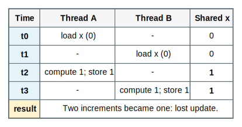
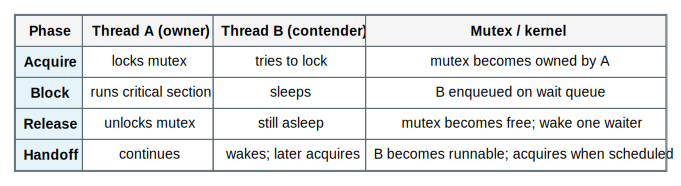
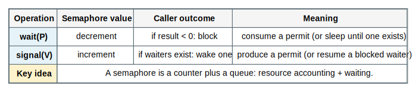

# Chapter 5 Process Synchronization Mastery

Source: Chapter 5 of `textbook.pdf` (Operating System Concepts, 9th ed.).

This file is the mastery note for Chapter 5.
It is written to make synchronization feel like *invariant preservation under adversarial interleavings*, not like “use a lock here.”

If Chapter 4 taught you what threads are, Chapter 5 teaches what threads *do to correctness* and what protocols the OS/runtime use to keep shared state coherent.

## 1. What This File Optimizes For

The goal is not to memorize API calls or classic-problem solutions.
The goal is to be able to answer questions like these without guessing:

- What invariant is being protected, and what is the critical section that can break it?
- What is the *exact* failure mode: lost update, torn read, deadlock, starvation, or priority inversion?
- When should waiting be blocking (sleep) versus spinning (busy-wait)?
- Why do semaphores, mutexes, and condition variables solve different coordination problems?
- Why does “works on my machine” often mean “my scheduler didn’t hit the bad interleaving”?
- Why is synchronization also about *memory visibility* and not only mutual exclusion?

For Chapter 5, mastery means:

- you can reason in interleavings and invariants, not in source-code line order
- you can trace lock, semaphore, and condition-variable protocols step by step
- you can predict how contention changes performance (and why)
- you can connect the abstractions to kernel primitives (atomic RMW, sleep/wakeup, run queues)

## 2. Mental Models To Know Cold

### 2.1 The Scheduler Is an Adversary

Assume the worst-case interleaving.
If correctness depends on “usually the other thread won’t run right here,” the program is incorrect.

### 2.2 The Critical Section Is the Smallest Region That Can Break an Invariant

The critical section is not “the code near the lock.”
It is the minimal region that must execute as if no interfering thread exists.

If you can shrink it, you reduce contention.
If you can’t define it, you can’t synchronize correctly.

### 2.3 Synchronization Is a Contract With 3 Requirements

The canonical critical-section problem requires:

- `mutual exclusion`: at most one thread is in the critical section
- `progress`: if no one is in the critical section, someone who wants in can eventually enter
- `bounded waiting`: no thread waits forever while others repeatedly enter

Most “almost correct” code violates progress or bounded waiting under contention.

### 2.4 Locks Provide Mutual Exclusion; Condition Variables Provide Waiting on Meaning

A mutex answers: “may I enter the critical section?”

A condition variable answers: “is the predicate I need true yet, and if not, can I sleep without missing the change?”

Semaphores blend both ideas by coupling a counter (resource availability) with a waiting queue.

### 2.5 Spinning vs Blocking Is a Cost Model Choice

Spinning wastes CPU but can be cheaper than sleeping if the wait is extremely short.
Blocking yields CPU but pays context-switch and wakeup latency.

You should be able to justify which one you want, and why.

### 2.6 Memory Visibility Is Part of Correctness

Even if two threads never “run at the same time” in your head, modern CPUs and compilers can reorder operations.

In practice, acquiring a lock is also a memory-ordering event:
it must make preceding writes visible to other threads that later acquire the same lock.

## 3. Mastery Modules

### 3.1 Race Conditions and the Critical-Section Problem

**Problem**

When threads share memory, ordinary reads and writes become communication.
If that communication is not controlled, invariants can be violated by interleavings.

**Mechanism**

A `race condition` exists when program correctness depends on the relative timing of events.
A critical section is the region that must appear atomic with respect to the shared invariant.

The three requirements (mutual exclusion, progress, bounded waiting) define what it means for a critical-section protocol to be correct.

**Invariants**

- Shared invariants must hold across all possible interleavings.
- Reads that decide based on shared state must not be separated from writes that “commit” the decision without protection.

**What Breaks If This Fails**

- lost updates (two increments become one)
- inconsistent reads (observing partial state)
- corrupted structures (linked list pointers torn by interleaving)

**One Trace: lost update on `x++`**

| Step | Thread A | Thread B | Shared x |
| --- | --- | --- | --- |
| 1 | load x (0) | - | 0 |
| 2 | - | load x (0) | 0 |
| 3 | store 1 | - | 1 |
| 4 | - | store 1 | 1 |

**Code Bridge**

- If you see `x = x + 1` on shared data, assume it is a multi-step read-modify-write that must be protected or made atomic.

**Drills**

1. Identify the invariant violated in the lost-update trace.
2. Find the smallest critical section that would prevent it.
3. Name a real data structure that would corrupt under an uncontrolled interleaving.

### 3.2 Peterson’s Solution: A Correct Protocol (With Strong Assumptions)

**Problem**

We need a provably correct mutual-exclusion protocol to learn what “correct” means before we rely on hardware primitives.

**Mechanism**

Peterson’s algorithm solves mutual exclusion for two threads using:

- two intent flags (`want[i]`)
- a shared `turn` variable (who should yield when both want to enter)

The key idea is polite competition:
if both want to enter, `turn` breaks symmetry and one yields.

**Invariants**

- If both threads are contending, at least one will observe `turn` and wait.
- If a thread is inside the critical section, the other cannot pass the entry condition.

**What Breaks If This Fails**

- On real machines, compiler/CPU reordering and weak memory models can violate the assumptions unless you add fences.
- It does not scale beyond two threads without more complex machinery.
- It is busy-waiting: it burns CPU while waiting.

**One Trace: both try to enter**

| Step | Thread A | Thread B | Shared state |
| --- | --- | --- | --- |
| intent | sets `want[A]=true` | sets `want[B]=true` | both want |
| symmetry break | sets `turn=B` | sets `turn=A` | last writer decides |
| wait | checks `want[B] && turn==B` | checks `want[A] && turn==A` | one waits |
| enter | one proceeds | other spins | mutual exclusion holds |

**Code Bridge**

- Treat Peterson as a proof artifact: it teaches what must be true, not what you should ship.

**Drills**

1. Which requirement is easiest to violate: progress or bounded waiting?
2. Why is the memory-ordering assumption the real reason Peterson is not widely used?
3. Why is “correct but spins” still sometimes unacceptable?

### 3.3 Hardware Primitives: Building Atomicity in the Machine

**Problem**

Software-only protocols are fragile on modern hardware.
We need atomic primitives that remain correct under preemption, multicore, and reordering.

**Mechanism**

Hardware typically provides atomic read-modify-write (RMW) primitives such as:

- `test-and-set`
- `compare-and-swap (CAS)`
- `fetch-and-add`

These are used to build spinlocks and higher-level locks.
On multiprocessors, memory barriers / acquire-release semantics are part of making those locks correct.

**Invariants**

- The primitive must be atomic with respect to all cores.
- A lock acquire must make prior writes by the previous owner visible (acquire semantics).
- A lock release must publish writes performed in the critical section (release semantics).

**What Breaks If This Fails**

- Without real atomicity, two threads can both “acquire” the lock.
- Without memory ordering, threads can see stale data even with mutual exclusion.

**One Trace: TAS spinlock under contention**

| Step | Thread A | Thread B | Lock |
| --- | --- | --- | --- |
| 1 | TAS returns 0, sets 1 | - | acquired |
| 2 | in critical section | TAS returns 1, stays 1 | B spins |
| 3 | releases lock (sets 0) | TAS returns 0, sets 1 | B acquires |

**Code Bridge**

- Look for lock implementations that separate a fast atomic path from a slow waiting path (queueing, sleeping).

**Drills**

1. Why does a spinlock become a performance bug if held while doing I/O?
2. What is the minimum atomic guarantee a lock primitive must provide?
3. What does a memory barrier do that a “normal store” does not?

### 3.4 Mutex Locks: Mutual Exclusion With Blocking Semantics

**Problem**

Busy-waiting wastes CPU if critical sections are long or if contention is high.

**Mechanism**

A `mutex` provides mutual exclusion, but a contending thread blocks:
it yields the CPU and sleeps on a wait queue until the lock becomes available.

Operationally, a mutex has:

- a fast path: acquire when unlocked
- a slow path: enqueue and sleep when locked
- a wakeup path: unlock and wake one or more waiters

**Invariants**

- At most one owner holds the lock at once.
- Waiters must not miss wakeups: enqueue before sleeping, wake after unlock.
- The unlock path must publish writes performed in the critical section.

**What Breaks If This Fails**

- missed wakeup: waiter sleeps forever
- starvation: some thread never acquires under unfair scheduling
- priority inversion: a low-priority owner delays a high-priority waiter

**One Trace: contended mutex**

| Step | Thread A | Thread B | Kernel / lock state |
| --- | --- | --- | --- |
| acquire | locks mutex | tries to lock | B enqueued + sleeps |
| critical | runs | blocked | owner=A |
| release | unlocks | wakes | B made runnable |
| handoff | continues | acquires after scheduled | owner=B |

**Code Bridge**

- In kernel code, find “sleep on wait queue” and “wakeup” paths; they are the mechanism behind blocking locks.

**Drills**

1. Why must “enqueue then sleep” be atomic with respect to unlock?
2. What is the cost tradeoff between mutex and spinlock?
3. Give one scenario that causes priority inversion.

### 3.5 Semaphores: Counting Resources With Waiting

**Problem**

We often need to coordinate access to *N identical resources* (buffer slots, permits), not just mutual exclusion.

**Mechanism**

A `semaphore` holds an integer value and a waiting queue.

- `wait (P)` decrements; if the result is negative (or not enough resources), the caller blocks
- `signal (V)` increments; if waiters exist, one is woken

Binary semaphores can act like mutexes.
Counting semaphores represent available units of a resource.

**Invariants**

- Semaphore value tracks available capacity consistently with the wait queue.
- The wakeup protocol must not lose signals.

**What Breaks If This Fails**

- wrong initialization causes immediate deadlock or unintended concurrency
- missing `signal` leaks capacity forever
- using a semaphore as a mutex without ownership discipline can hide bugs

**One Trace: bounded buffer skeleton**

Use three semaphores:

- `empty` initialized to buffer size
- `full` initialized to 0
- `mutex` initialized to 1

Producer:
`wait(empty); wait(mutex); insert; signal(mutex); signal(full)`

Consumer:
`wait(full); wait(mutex); remove; signal(mutex); signal(empty)`

**Code Bridge**

- Semaphores are “resource counters + queue,” which is why they show up in kernels (permits, slots, credits).

**Drills**

1. Why is `empty/full` the real synchronization, and `mutex` the structural glue?
2. What invariant do `empty + full` maintain about buffer occupancy?
3. Why can semaphores be harder to reason about than mutex + condition variables?

### 3.6 Classic Problems Are Templates for Invariants

**Problem**

Classic synchronization problems are not trivia; they are compressed forms of common invariants:

- bounded resources (bounded buffer)
- asymmetric access (readers-writers)
- cyclic resource needs (dining philosophers)

**Mechanism**

Treat each classic problem as:

1. define the invariant precisely
2. decide what must be mutually exclusive
3. decide what must wait, and on what predicate
4. decide how to prevent starvation (if required)

**Invariants**

- The invariant must be expressible as a predicate over shared state.
- The waiting rule must only sleep when the predicate is false, and must re-check after wakeup.

**What Breaks If This Fails**

- deadlock: cyclic waiting on resources
- starvation: unfair admission under repeated contention
- convoying: one slow thread makes many others slow

**Code Bridge**

- In real kernels, these show up as “credits,” “queues,” “permits,” and “ordered acquisition,” not as textbook stories.

**Drills**

1. For bounded buffer, write the invariant about item count.
2. For readers-writers, decide whether fairness is required and what that changes.
3. For dining philosophers, name two different ways to prevent deadlock.

### 3.7 Monitors and Condition Variables: Waiting Without Losing the Lock Invariant

**Problem**

Threads often need to wait for a condition (“buffer not empty”), but they must do so without:

- holding the mutex forever
- missing the moment when another thread makes the condition true

**Mechanism**

A `monitor` packages:

- a mutex (mutual exclusion for monitor state)
- condition variables (wait queues associated with predicates)

The critical protocol is `cond_wait`:

1. atomically release the mutex and sleep on the condition queue
2. when woken, re-acquire the mutex before returning

Most real systems use Mesa-style semantics:
`signal` makes a waiter runnable, but the waiter must re-check the predicate when it eventually reacquires the lock.

**Invariants**

- The predicate is checked while holding the mutex.
- Waiting must release the mutex, otherwise progress fails.
- Woken threads must re-check the predicate (use `while`, not `if`).

**What Breaks If This Fails**

- missed wakeups or lost signals
- waking on a stale predicate and proceeding incorrectly
- deadlock if the mutex is not released on wait

**One Trace: condition variable wait/signal**

| Step | Waiter | Signaler | Mutex + condition |
| --- | --- | --- | --- |
| check | holds mutex, sees predicate false | - | protected state |
| wait | enqueues, releases mutex, sleeps | - | waiter sleeping |
| make true | - | acquires mutex, updates state | predicate becomes true |
| signal | - | signals condition | waiter runnable |
| resume | wakes, reacquires mutex, re-checks | releases mutex | safe progress |

**Code Bridge**

- Look for `sleep`/`wakeup` that is tied to a lock: that is the core monitor idea in kernel form.

**Drills**

1. Why must wait release the mutex atomically with enqueueing?
2. Why must a woken thread re-check the predicate?
3. Give a “lost wakeup” bug in one sentence.

### 3.8 Alternative Approaches: From Locks to Transactions (What Problem Changes?)

**Problem**

Locks are correct but can be hard to compose and can create deadlocks.

**Mechanism**

Alternative approaches include:

- lock-free algorithms using CAS loops
- transactional memory (optimistic execution with commit/abort)

These approaches change *where* you pay for coordination: explicit locking versus retries/aborts.

**Invariants**

- Lock-free correctness is still about invariants; it just encodes them differently.
- Transactional systems must define conflict detection and commit atomicity.

**What Breaks If This Fails**

- ABA problems and subtle races in lock-free code
- livelock (everyone retries forever under contention)

**Code Bridge**

- If you later read lock-free structures, look for the invariant that is preserved by each CAS.

**Drills**

1. Why can a lock-free algorithm still starve a thread?
2. What kind of contention makes “retry” approaches fall over?
3. Why is the invariant still the central idea even without locks?

## 4. Canonical Traces To Reproduce From Memory

Do not merely read these.
Cover the table and reproduce the protocol from memory.

### 4.1 Lost Update (Race)

| Step | A | B | x |
| --- | --- | --- | --- |
| load | 0 | - | 0 |
| load | - | 0 | 0 |
| store | 1 | - | 1 |
| store | - | 1 | 1 |

### 4.2 Contended Mutex Acquire

| Step | Owner | Waiter | Meaning |
| --- | --- | --- | --- |
| acquire | A locks | B tries | B enqueues |
| sleep | A runs | B sleeps | CPU not wasted |
| release | A unlocks | B wakes | handoff point |
| acquire | - | B locks | mutual exclusion preserved |

### 4.3 Semaphore Wait/Signal

| Step | wait(P) | signal(V) | Meaning |
| --- | --- | --- | --- |
| modify | decrement | increment | resource accounting |
| block/wake | if unavailable, sleep | if waiters, wake one | queue semantics |

### 4.4 Bounded Buffer With `empty/full/mutex`

| Step | Producer | Consumer | Invariant |
| --- | --- | --- | --- |
| capacity | `wait(empty)` | `wait(full)` | occupancy stays in bounds |
| exclusion | `wait(mutex)` | `wait(mutex)` | buffer structure safe |
| publish | `signal(full)` | `signal(empty)` | handoff is explicit |

### 4.5 Condition Variable Wait

| Step | Thread | Mutex | Condition |
| --- | --- | --- | --- |
| check | holds mutex | held | predicate false |
| wait | releases + sleeps | released | queued |
| wake | reacquires | held again | predicate re-checked |

## 5. Questions That Push Beyond Recall

1. Why is “the scheduler is adversarial” the correct mental stance for concurrency?
2. Why do mutual exclusion and memory visibility travel together in correct lock implementations?
3. Why is “enqueue then sleep” the core correctness constraint for blocking primitives?
4. Why can a correct spinlock still be a system performance bug?
5. Why are semaphores powerful but error-prone compared to mutex + condition variables?
6. Why must condition variables be paired with a predicate and a loop, not just a signal?
7. Why do classic problems matter even if you never implement them verbatim?
8. What is one concrete scenario that causes priority inversion?
9. Why can lock-free algorithms livelock under contention?
10. Which Chapter 5 mechanism is most likely to cause a “works in debug, fails in prod” bug and why?
11. Why does “bounded waiting” matter to human-perceived system behavior?
12. Why is deadlock prevention often a *design-time* choice rather than a runtime fix?

## 6. Suggested Bridge Into Real Kernels

If you later study a teaching kernel or Linux-like codebase, a good Chapter 5 reading order is:

1. atomic primitives and memory-ordering helpers
2. spinlocks and “disable interrupts” regions (short critical sections)
3. blocking mutexes and futex-like waiting (sleep/wakeup)
4. condition-variable or wait-queue primitives (wait with lock release)
5. classic producer-consumer paths (I/O queues, buffer caches, request queues)

Conceptual anchors to look for:

- where the kernel *parks* a thread (sleep state) and how it is *woken*
- where “ownership” is recorded for debugging and correctness
- where fairness is encoded (or ignored) in queue selection

## 7. How To Use This File

If you are short on time:

- Read `## 2. Mental Models To Know Cold` once.
- Reproduce the traces in `## 4. Canonical Traces To Reproduce From Memory`.

If you want Chapter 5 to become reasoning skill:

- For each mastery module, write the invariant in one sentence before reading the mechanism.
- Reproduce the trace from memory, then explain why each step exists.
- Do the drills without looking, and if you miss one, rebuild the mechanism rather than re-reading the answer.

