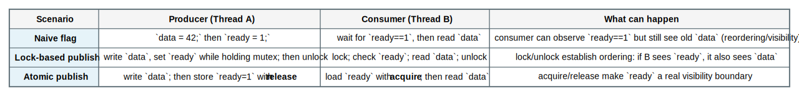
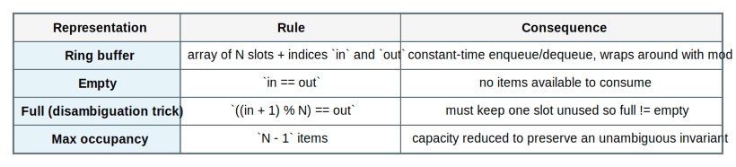
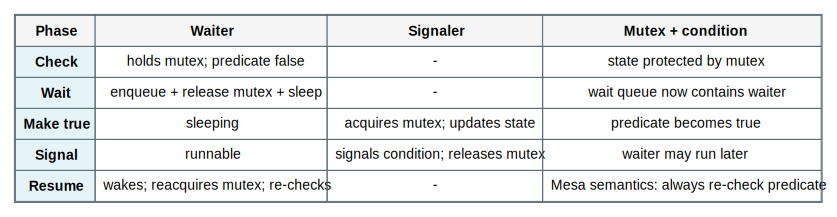

# Chapter 5 Process Synchronization Mastery

Source: Chapter 5 of `textbook.pdf` (Operating System Concepts, 9th ed.).

This file is the mastery note for Chapter 5.
It is written to make synchronization feel like *invariant preservation under adversarial interleavings*, not like “use a lock here.”

If Chapter 4 taught you what threads are, Chapter 5 teaches what threads *do to correctness* and what protocols the OS/runtime use to keep shared state coherent.

## 1. What This File Optimizes For

The goal is not to memorize API calls or classic-problem solutions.
The goal is to be able to do the following without guessing:

- State the invariant being protected and identify the smallest critical section that can break it.
- Name the exact failure mode (lost update, torn read, deadlock, starvation, priority inversion) instead of saying “race.”
- Choose when waiting should be blocking (sleep) versus spinning (busy-wait), based on a cost model.
- Distinguish what semaphores, mutexes, and condition variables each *mean* (and what misuse looks like).
- Explain why “works on my machine” often means “the scheduler didn’t hit the bad interleaving.”
- Explain why synchronization is also about memory visibility and ordering, not only mutual exclusion.

For Chapter 5, mastery means:

- you can reason in interleavings and invariants, not in source-code line order
- you can trace lock, semaphore, and condition-variable protocols step by step
- you can predict how contention changes performance (and why)
- you can connect the abstractions to kernel primitives (atomic RMW, sleep/wakeup, run queues)

## 2. Mental Models To Know Cold

### 2.1 The Scheduler Is an Adversary

Assume the worst-case interleaving.
If correctness depends on “usually the other thread won’t run right here,” the program is incorrect.

### 2.2 The Critical Section Is the Smallest Region That Can Break an Invariant

The critical section is not “the code near the lock.”
It is the minimal region that must execute as if no interfering thread exists.

If you can shrink it, you reduce contention.
If you can’t define it, you can’t synchronize correctly.

### 2.3 Synchronization Is a Contract With 3 Requirements

The canonical critical-section problem requires:

- `mutual exclusion`: at most one thread is in the critical section
- `progress`: if no one is in the critical section, someone who wants in can eventually enter
- `bounded waiting`: no thread waits forever while others repeatedly enter

Most “almost correct” code violates progress or bounded waiting under contention.

### 2.4 Locks Provide Mutual Exclusion; Condition Variables Provide Waiting on Meaning

A mutex answers: “may I enter the critical section?”

A condition variable answers: “is the predicate I need true yet, and if not, can I sleep without missing the change?”

Semaphores blend both ideas by coupling a counter (resource availability) with a waiting queue.

### 2.5 Spinning vs Blocking Is a Cost Model Choice

Spinning wastes CPU but can be cheaper than sleeping if the wait is extremely short.
Blocking yields CPU but pays context-switch and wakeup latency.

You should be able to justify which one you want, and why.

### 2.6 Memory Visibility Is Part of Correctness

Even if two threads never “run at the same time” in your head, modern CPUs and compilers can reorder operations.

In practice, acquiring a lock is also a memory-ordering event:
it must make preceding writes visible to other threads that later acquire the same lock.

Why this section exists: earlier sections make synchronization sound like “only one thread at a time.”
But many real bugs are not “both were in the critical section” bugs.
They are “the reader observed a flag but not the data the flag was supposed to mean” bugs.
If you do not understand visibility and ordering, you will mistakenly believe that correct logic implies correct communication.

The object being introduced is a **happens-before relationship** created by synchronization operations.
You can think of it as the rule that turns “writes happened” into “other threads are allowed to rely on seeing them.”
Locks and atomics do not merely prevent simultaneous execution; they define a communication contract that constrains reordering and caching effects.

**Worked Example: Publishing Data With A Flag (And Why It Can Fail Without Ordering)**

Suppose thread A produces data and thread B consumes it:

```c
// shared:
int ready = 0;
int data = 0;

// Thread A (producer):
data = 42;
ready = 1;

// Thread B (consumer):
while (ready == 0) { /* spin */ }
printf("%d\n", data);
```

Read the programmer intention: `ready==1` is meant to *mean* “data is now valid.”
The fixed object is the intended protocol (“flag implies data is visible”).
The varying object is the hardware/compiler execution: loads/stores may be reordered, cached, or observed in different orders by different cores.

What can go wrong:

1. The compiler or CPU reorders stores so `ready=1` becomes visible before `data=42` becomes visible to the other core.
2. Thread B observes `ready==1` and exits the loop.
3. Thread B reads `data` and still sees the old value (e.g., `0`) because visibility did not match the protocol’s meaning.

No mutual exclusion was “violated.” The bug is that the program used a shared flag as a communication boundary without a mechanism that actually establishes the required ordering.

How to make it correct:

- Put both the data write and the flag write behind a mutex, and read behind the same mutex.
  The lock/unlock operations establish the ordering boundary.
- Or use atomics with `release` on the producer store to `ready` and `acquire` on the consumer load of `ready`.
  This makes `ready` a real publish/observe boundary.



Misconception block: “volatile fixes it.”
`volatile` can stop some compiler optimizations, but it does not create the cross-core ordering and visibility guarantees required for correct synchronization on modern CPUs.
Correctness needs a synchronization primitive whose contract includes ordering (mutex/cond, semaphores, atomics with acquire/release, etc.).

Connection to later material: this is the hidden reason “shared memory is hard.”
In Chapter 3, shared memory looks like “just load/store.”
In Chapter 5, you learn that “just load/store” is only safe after you introduce a real boundary that gives those loads/stores a stable interpretation across cores.

Retain / do not confuse: “mutual exclusion” is about who may update at once; “visibility/ordering” is about what another thread is allowed to conclude from what it observes.
Locks often give both; ad-hoc flags give neither unless you use correct atomic semantics.

## 3. Mastery Modules

### 3.1 Race Conditions and the Critical-Section Problem

**Problem**

When threads share memory, ordinary reads and writes become communication.
If that communication is not controlled, invariants can be violated by interleavings.

**Mechanism**

A `race condition` exists when program correctness depends on the relative timing of events.
A critical section is the region that must appear atomic with respect to the shared invariant.

The three requirements (mutual exclusion, progress, bounded waiting) define what it means for a critical-section protocol to be correct.

**Invariants**

- Shared invariants must hold across all possible interleavings.
- Reads that decide based on shared state must not be separated from writes that “commit” the decision without protection.

**What Breaks If This Fails**

- lost updates (two increments become one)
- inconsistent reads (observing partial state)
- corrupted structures (linked list pointers torn by interleaving)

**One Trace: lost update on `x++`**

This trace exists to burn one lesson in permanently: `x++` is not one operation.
It is a read-modify-write sequence, and if two threads interleave those steps without protection, one update is lost even though both threads “did the right thing” locally.
When you cover the table, point to the gap between “read the old value” and “commit the new value” as the exact surface where races are born.

| Step | Thread A | Thread B | Shared x |
| --- | --- | --- | --- |
| 1 | load x (0) | - | 0 |
| 2 | - | load x (0) | 0 |
| 3 | store 1 | - | 1 |
| 4 | - | store 1 | 1 |

The important observation is that both threads were “locally correct” but globally wrong because the read-modify-write was not atomic.
Whenever you see an update that depends on a prior read of shared state, assume there is a race surface unless a lock or atomic RMW closes it.

**Code Bridge**

- If you see `x = x + 1` on shared data, assume it is a multi-step read-modify-write that must be protected or made atomic.

**Drills (With Answers)**

1. **Q:** Identify the invariant violated in the lost-update trace.
**A:** The invariant is that two increments of the same shared counter must result in a net increase of 2. In other words, “each increment is linearizable and not lost.” The trace violates that because both threads base their update on the same stale read, so the second write overwrites the first instead of composing with it.

2. **Q:** Find the smallest critical section that would prevent it.
**A:** The minimal critical section is the entire read-modify-write sequence: read `x`, compute `x+1`, and store back to `x`. If that region executes as if no other thread can interleave, then each increment observes the latest committed value. You can enforce this with a mutex, or by using an atomic RMW primitive (fetch-and-add) that makes the whole sequence one atomic operation.

3. **Q:** Name a real data structure that would corrupt under an uncontrolled interleaving.
**A:** A linked-list insertion/removal (two threads updating `next` pointers) can easily corrupt the list and lose nodes. Reference counts can be wrong (double-free or leak) under lost updates. Queue head/tail pointers are another common failure: one thread can overwrite another’s pointer update and silently drop elements.


### 3.2 Peterson’s Solution: A Correct Protocol (With Strong Assumptions)

**Problem**

We need a provably correct mutual-exclusion protocol to learn what “correct” means before we rely on hardware primitives.

**Mechanism**

Peterson’s algorithm solves mutual exclusion for two threads using:

- two intent flags (`want[i]`)
- a shared `turn` variable (who should yield when both want to enter)

The key idea is polite competition:
if both want to enter, `turn` breaks symmetry and one yields.

**Invariants**

- If both threads are contending, at least one will observe `turn` and wait.
- If a thread is inside the critical section, the other cannot pass the entry condition.

**What Breaks If This Fails**

- On real machines, compiler/CPU reordering and weak memory models can violate the assumptions unless you add fences.
- It does not scale beyond two threads without more complex machinery.
- It is busy-waiting: it burns CPU while waiting.

**One Trace: both try to enter**

Peterson’s algorithm is a teaching “proof object.”
The point of the trace is to see how a protocol can force mutual exclusion using only shared variables, and also to see what assumptions that requires (strong ordering/visibility and two-thread limitation).
When you cover the table, focus on the symmetry break: both can want in, but `turn` forces one to yield so they cannot both pass the entry condition.

| Step | Thread A | Thread B | Shared state |
| --- | --- | --- | --- |
| intent | sets `want[A]=true` | sets `want[B]=true` | both want |
| symmetry break | sets `turn=B` | sets `turn=A` | last writer decides |
| wait | checks `want[B] && turn==B` | checks `want[A] && turn==A` | one waits |
| enter | one proceeds | other spins | mutual exclusion holds |

This is mutual exclusion as a *protocol proof*, not as a performance recipe.
It shows that correctness can come from symmetry breaking and explicit waiting conditions, and also why modern systems rely on hardware atomics and memory-ordering primitives rather than software-only assumptions.

**Code Bridge**

- Treat Peterson as a proof artifact: it teaches what must be true, not what you should ship.

**Drills (With Answers)**

1. **Q:** Which requirement is easiest to violate: progress or bounded waiting?
**A:** Bounded waiting is easiest to violate in real systems because it is essentially a fairness guarantee: it is easy to build a system where someone can always cut in line or where one thread is repeatedly unlucky. Progress can also be violated (deadlock/livelock), but many mutual exclusion mechanisms ensure progress under simple assumptions while still allowing starvation. Chapter 5 cares about bounded waiting because starvation is a user-visible failure.

2. **Q:** Why is the memory-ordering assumption the real reason Peterson is not widely used?
**A:** Peterson’s correctness proof assumes a strong memory model: reads/writes become visible in the intended order to the other core. Real CPUs and compilers reorder operations and can keep values in registers/caches unless you use fences or atomic operations with acquire/release semantics. Once you add the required memory-ordering machinery, the “software-only” simplicity disappears and hardware primitives become the practical foundation.

3. **Q:** Why is “correct but spins” still sometimes unacceptable?
**A:** Spinning consumes CPU while waiting, which is wasted work if the lock holder is delayed (e.g., descheduled, doing I/O, or running on another core for a long time). Under contention, spinlocks can turn a machine into “fast waiting,” starving other work and increasing tail latency. Spinning can be acceptable for very short critical sections in kernel/hot paths, but it is not a free correctness win.

### 3.3 Hardware Primitives: Building Atomicity in the Machine

**Problem**

Software-only protocols are fragile on modern hardware.
We need atomic primitives that remain correct under preemption, multicore, and reordering.

**Mechanism**

Hardware typically provides atomic read-modify-write (RMW) primitives such as:

- `test-and-set`
- `compare-and-swap (CAS)`
- `fetch-and-add`

These are used to build spinlocks and higher-level locks.
On multiprocessors, memory barriers / acquire-release semantics are part of making those locks correct.

**Invariants**

- The primitive must be atomic with respect to all cores.
- A lock acquire must make prior writes by the previous owner visible (acquire semantics).
- A lock release must publish writes performed in the critical section (release semantics).

**What Breaks If This Fails**

- Without real atomicity, two threads can both “acquire” the lock.
- Without memory ordering, threads can see stale data even with mutual exclusion.

**One Trace: TAS spinlock under contention**

This trace shows the essential cost of spinning: one thread makes progress, the other repeatedly performs an atomic operation and burns CPU until the lock flips.
The lock variable is not the interesting part; the cost is that contention turns waiting into active work (coherence traffic and CPU time).
When you cover the table, make sure you can explain when this is acceptable (very short critical sections) and when it is a system bug (anything that can block or take long).

| Step | Thread A | Thread B | Lock |
| --- | --- | --- | --- |
| 1 | TAS returns 0, sets 1 | - | acquired |
| 2 | in critical section | TAS returns 1, stays 1 | B spins |
| 3 | releases lock (sets 0) | TAS returns 0, sets 1 | B acquires |

The key cost is visible here: contention turns waiting into repeated atomic operations and cache-line bouncing.
That is why spinlocks are reserved for short, bounded critical sections (often in kernel contexts) and why long waits demand blocking locks.

**Code Bridge**

- Look for lock implementations that separate a fast atomic path from a slow waiting path (queueing, sleeping).

**Drills (With Answers)**

1. **Q:** Why does a spinlock become a performance bug if held while doing I/O?
**A:** Because I/O can be long-latency and can deschedule the lock holder. While the holder is stalled, every contender keeps spinning, consuming CPU and generating coherence traffic, but no useful work can proceed because the lock cannot be released. Blocking locks exist specifically so the waiter sleeps instead of burning the machine during long waits.

2. **Q:** What is the minimum atomic guarantee a lock primitive must provide?
**A:** The acquire operation must be an atomic read-modify-write with respect to all cores so that at most one thread can observe “unlocked” and claim ownership. In other words, “test and set” (or CAS) must be indivisible, not two separate actions. Practically, lock primitives also need acquire/release visibility guarantees so that mutual exclusion implies a consistent view of shared memory.

3. **Q:** What does a memory barrier do that a “normal store” does not?
**A:** It constrains reordering and visibility. A barrier (or acquire/release atomic) prevents the compiler/CPU from moving loads/stores across the boundary in ways that would violate the synchronization contract, and it ensures that writes performed in a critical section become visible before another thread acquires the lock. A normal store may become visible later and may be reordered, which is why “just set a flag” is not sufficient synchronization.

### 3.4 Mutex Locks: Mutual Exclusion With Blocking Semantics

**Problem**

Busy-waiting wastes CPU if critical sections are long or if contention is high.

**Mechanism**

A `mutex` provides mutual exclusion, but a contending thread blocks:
it yields the CPU and sleeps on a wait queue until the lock becomes available.

Operationally, a mutex has:

- a fast path: acquire when unlocked
- a slow path: enqueue and sleep when locked
- a wakeup path: unlock and wake one or more waiters

**Invariants**

- At most one owner holds the lock at once.
- Waiters must not miss wakeups: enqueue before sleeping, wake after unlock.
- The unlock path must publish writes performed in the critical section.

**What Breaks If This Fails**

- missed wakeup: waiter sleeps forever
- starvation: some thread never acquires under unfair scheduling
- priority inversion: a low-priority owner delays a high-priority waiter

**One Trace: contended mutex**

This table is the “don’t waste CPU while waiting” protocol.
The crucial correctness constraint is that the waiter must become visible on the wait queue before it actually sleeps; otherwise an unlocker can “signal” when nobody is visibly waiting and the waiter can sleep forever (missed wakeup).
When you cover the table, narrate the two-phase structure: fast path for uncontended acquire, slow path for queueing and sleeping.

| Step | Thread A | Thread B | Kernel / lock state |
| --- | --- | --- | --- |
| acquire | locks mutex | tries to lock | B enqueued + sleeps |
| critical | runs | blocked | owner=A |
| release | unlocks | wakes | B made runnable |
| handoff | continues | acquires after scheduled | owner=B |

This is the “waiting becomes state” transition: B stops burning CPU and becomes a queued kernel object until the unlock path re-admits it.
The subtle correctness requirement is the enqueue-before-sleep ordering; get that wrong and the system can lose wakeups even though the lock itself is “correct.”

**Code Bridge**

- In kernel code, find “sleep on wait queue” and “wakeup” paths; they are the mechanism behind blocking locks.

**Drills (With Answers)**

1. **Q:** Why must “enqueue then sleep” be atomic with respect to unlock?
**A:** To prevent missed wakeups. If a thread checks the lock, decides to sleep, but has not yet enqueued itself as a waiter, an unlocker can release and “wake” nobody. The waiter then goes to sleep and can remain asleep forever even though the lock is available. Atomicity (or careful ordering under a lock) ensures that either the waiter is visible before sleeping or it will observe the unlocked state and not sleep.

2. **Q:** What is the cost tradeoff between mutex and spinlock?
**A:** Spinlocks have low latency for very short waits because they avoid sleep/wakeup overhead, but they waste CPU under contention and generate coherence traffic. Mutexes add overhead (queueing, context switches, wakeups), but they preserve CPU time when waits are long or unpredictable and reduce system-wide contention cost. The correct choice depends on expected critical-section duration and contention patterns.

3. **Q:** Give one scenario that causes priority inversion.
**A:** Low-priority thread L holds a mutex needed by high-priority thread H. A medium-priority thread M (which does not need the mutex) runs and preempts L, preventing L from running and releasing the mutex. H is blocked waiting on L, so H’s effective progress is “inverted” below M. Priority inheritance is a common mechanism to mitigate this.


### 3.5 Semaphores: Counting Resources With Waiting

**Problem**

We often need to coordinate access to *N identical resources* (buffer slots, permits), not just mutual exclusion.

**Mechanism**

A `semaphore` holds an integer value and a waiting queue.

- `wait (P)` decrements; if the result is negative (or not enough resources), the caller blocks
- `signal (V)` increments; if waiters exist, one is woken

Binary semaphores can act like mutexes.
Counting semaphores represent available units of a resource.

**Invariants**

- Semaphore value tracks available capacity consistently with the wait queue.
- The wakeup protocol must not lose signals.

**What Breaks If This Fails**

- wrong initialization causes immediate deadlock or unintended concurrency
- missing `signal` leaks capacity forever
- using a semaphore as a mutex without ownership discipline can hide bugs

**One Trace: bounded buffer skeleton**

Use three semaphores:

- `empty` initialized to buffer size
- `full` initialized to 0
- `mutex` initialized to 1

Producer:
`wait(empty); wait(mutex); insert; signal(mutex); signal(full)`

Consumer:
`wait(full); wait(mutex); remove; signal(mutex); signal(empty)`

**Bounded buffer nuance (ring buffer form): why you sometimes only get N-1 usable slots**

Many lecture slides show a “shared-memory bounded buffer” using only two indices `in` and `out` in a circular array.
With that representation, `in == out` is naturally used to mean “empty.”
But then you need a different condition for “full,” and the common trick is:

- empty: `in == out`
- full: `((in + 1) % N) == out`

That rule prevents ambiguity between empty and full, but it also means the maximum occupancy is `N-1` (one slot is sacrificed as a disambiguation marker).
An alternative is to keep an explicit `count` (or separate full/empty flags), which allows all `N` slots to be used but adds additional shared state that must remain consistent.
If you see slide code that uses `while (full) ;` or `while (empty) ;`, treat it as a correctness sketch, not as a good OS design: it is busy-waiting (spinning) and will waste CPU unless replaced with proper blocking synchronization (semaphores, condition variables, futex-style waits).



**Code Bridge**

- Semaphores are “resource counters + queue,” which is why they show up in kernels (permits, slots, credits).

**Drills (With Answers)**

1. **Q:** Why is `empty/full` the real synchronization, and `mutex` the structural glue?
**A:** `empty` and `full` encode the true coordination constraints: producers must not overfill and consumers must not underflow, so they must wait on capacity/availability. `mutex` protects the internal buffer structure (indices, pointers, bookkeeping) so insert/remove operations do not interleave and corrupt the structure. Without `empty/full`, you violate the resource invariant; without `mutex`, you violate structural integrity.

2. **Q:** What invariant do `empty + full` maintain about buffer occupancy?
**A:** They maintain a conservation law: `empty` counts free slots and `full` counts occupied slots, so `empty + full = buffer_size` should remain true (modulo the exact semaphore semantics). The boundedness invariant is `0 <= full <= buffer_size` and `0 <= empty <= buffer_size`. If that invariant is broken, you get overwrites (producer writes into a “full” slot) or underflows (consumer reads from an “empty” slot).

3. **Q:** Why can semaphores be harder to reason about than mutex + condition variables?
**A:** Semaphores combine counting and wakeup effects into one primitive, and they have no ownership concept like “this thread holds the mutex.” A misplaced `signal` can create extra permits (incorrect concurrency), and a missing `signal` can leak permits forever (deadlock). Mutex+condition variables separate concerns: mutex protects state, condition variables wait on a predicate over that state, which tends to make invariants easier to express and verify.


### 3.6 Classic Problems Are Templates for Invariants

**Problem**

Classic synchronization problems are not trivia; they are compressed forms of common invariants:

- bounded resources (bounded buffer)
- asymmetric access (readers-writers)
- cyclic resource needs (dining philosophers)

**Mechanism**

Treat each classic problem as:

1. define the invariant precisely
2. decide what must be mutually exclusive
3. decide what must wait, and on what predicate
4. decide how to prevent starvation (if required)

**Invariants**

- The invariant must be expressible as a predicate over shared state.
- The waiting rule must only sleep when the predicate is false, and must re-check after wakeup.

**What Breaks If This Fails**

- deadlock: cyclic waiting on resources
- starvation: unfair admission under repeated contention
- convoying: one slow thread makes many others slow

**Code Bridge**

- In real kernels, these show up as “credits,” “queues,” “permits,” and “ordered acquisition,” not as textbook stories.

**Drills (With Answers)**

1. **Q:** For bounded buffer, write the invariant about item count.
**A:** Let `count` be the number of items currently in the buffer and `N` be capacity. The invariant is `0 <= count <= N`. Producer steps must preserve `count < N` before inserting; consumer steps must preserve `count > 0` before removing. The entire purpose of the protocol is to make every interleaving preserve this inequality.

2. **Q:** For readers-writers, decide whether fairness is required and what that changes.
**A:** If fairness is required, you must prevent starvation of either readers or writers, which typically requires queueing discipline or a “turnstile” that orders arrivals. If fairness is not required, you can optimize for throughput (e.g., reader preference) but accept that writers may starve under a steady stream of readers. The fairness choice changes the invariant from “mutual exclusion only” to “bounded waiting for both classes.”

3. **Q:** For dining philosophers, name two different ways to prevent deadlock.
**A:** (1) Impose a strict resource ordering: always pick up the lower-numbered fork first, which makes cycles impossible. (2) Use an arbiter/waiter: allow at most `N-1` philosophers to try to eat at once or require permission before picking up forks. Both approaches break the circular-wait condition, but they have different performance and fairness tradeoffs.

### 3.7 Monitors and Condition Variables: Waiting Without Losing the Lock Invariant

**Problem**

Threads often need to wait for a condition (“buffer not empty”), but they must do so without:

- holding the mutex forever
- missing the moment when another thread makes the condition true

**Mechanism**

A `monitor` packages:

- a mutex (mutual exclusion for monitor state)
- condition variables (wait queues associated with predicates)

The critical protocol is `cond_wait`:

1. atomically release the mutex and sleep on the condition queue
2. when woken, re-acquire the mutex before returning

Most real systems use Mesa-style semantics:
`signal` makes a waiter runnable, but the waiter must re-check the predicate when it eventually reacquires the lock.

**Invariants**

- The predicate is checked while holding the mutex.
- Waiting must release the mutex, otherwise progress fails.
- Woken threads must re-check the predicate (use `while`, not `if`).

**What Breaks If This Fails**

- missed wakeups or lost signals
- waking on a stale predicate and proceeding incorrectly
- deadlock if the mutex is not released on wait

**One Trace: condition variable wait/signal**

This table is the “sleep without losing correctness” protocol.
The purpose of `wait` is not “pause”; it is “atomically (enqueue + release mutex + sleep) so that a signal cannot be missed.”
When you cover it, say the predicate out loud (what must become true), and explain why the mutex and predicate check must surround both waiting and waking.

| Step | Waiter | Signaler | Mutex + condition |
| --- | --- | --- | --- |
| check | holds mutex, sees predicate false | - | protected state |
| wait | enqueues, releases mutex, sleeps | - | waiter sleeping |
| make true | - | acquires mutex, updates state | predicate becomes true |
| signal | - | signals condition | waiter runnable |
| resume | wakes, reacquires mutex, re-checks | releases mutex | safe progress |

Condition variables are about waiting on *meaning* (the predicate), not on signals.
Under Mesa semantics, `signal` only makes the waiter runnable; correctness comes from re-checking the predicate under the mutex, which is why the loop is non-negotiable.

**Code Bridge**

- Look for `sleep`/`wakeup` that is tied to a lock: that is the core monitor idea in kernel form.

**Drills (With Answers)**

1. **Q:** Why must wait release the mutex atomically with enqueueing?
**A:** To avoid missed wakeups. If the waiter releases the mutex but is not yet enqueued, a signaler can make the predicate true, signal, and observe no waiters. The waiter then goes to sleep and may never be woken even though the condition is already true. Atomic “enqueue + release + sleep” ensures either the waiter is visible before sleeping or it will re-check and avoid sleeping.

2. **Q:** Why must a woken thread re-check the predicate?
**A:** Because wakeup is not proof that the predicate is true by the time you run. Under Mesa semantics, `signal` only makes the waiter runnable; other threads can run first and change the state again. Spurious wakeups can also occur. The correct rule is: wait in a loop and proceed only when the predicate is observed true while holding the mutex.

3. **Q:** Give a “lost wakeup” bug in one sentence.
**A:** A thread checks the predicate, finds it false, releases the lock, and goes to sleep, but another thread signals between the check and the enqueue, so the signal is lost and the waiter sleeps forever.



### 3.8 Alternative Approaches: From Locks to Transactions (What Problem Changes?)

**Problem**

Locks are correct but can be hard to compose and can create deadlocks.

**Mechanism**

Alternative approaches include:

- lock-free algorithms using CAS loops
- transactional memory (optimistic execution with commit/abort)

These approaches change *where* you pay for coordination: explicit locking versus retries/aborts.

**Invariants**

- Lock-free correctness is still about invariants; it just encodes them differently.
- Transactional systems must define conflict detection and commit atomicity.

**What Breaks If This Fails**

- ABA problems and subtle races in lock-free code
- livelock (everyone retries forever under contention)

**Code Bridge**

- If you later read lock-free structures, look for the invariant that is preserved by each CAS.

**Drills (With Answers)**

1. **Q:** Why can a lock-free algorithm still starve a thread?
**A:** Lock-free means “some thread makes progress,” not “every thread makes progress.” Under contention, one thread can repeatedly win CAS races while another repeatedly loses, especially under unfair scheduling or unlucky timing. Without an explicit fairness mechanism, starvation is possible even though the system as a whole keeps moving.

2. **Q:** What kind of contention makes “retry” approaches fall over?
**A:** High contention on the same hot location: many threads repeatedly attempt CAS on the same memory word, causing constant invalidation and retries. This can create livelock-like behavior where everyone does work (retry loops) but throughput collapses. Backoff and contention management exist because naive retry under heavy contention is a performance disaster.

3. **Q:** Why is the invariant still the central idea even without locks?
**A:** Because correctness is still defined by “what must always be true about shared state.” Lock-free code encodes the invariant into atomic update steps: each CAS transition must move the structure from one valid state to another valid state. Removing locks changes the mechanism of coordination, not the fact that invariants are the foundation of correctness.

## 4. Canonical Traces To Reproduce From Memory

Do not merely read these.
Cover the tables and reproduce the protocol from memory.

### 4.1 Lost Update (Race)

This is the smallest interleaving that breaks “obvious” code.
When you reproduce it, explicitly say that the bug is not “both stored 1,” but that both threads computed based on the same stale read because read-modify-write was not atomic.

| Step | A | B | x |
| --- | --- | --- | --- |
| load | 0 | - | 0 |
| load | - | 0 | 0 |
| store | 1 | - | 1 |
| store | - | 1 | 1 |

Rehearse this as “RMW is not atomic.”
The bug is the interleaving window between read and write; the fix is to make that window disappear via a mutex or an atomic fetch-and-add style primitive.

### 4.2 Contended Mutex Acquire

This is the blocking-lock correctness core.
The skill is to be able to explain how the waiter does not waste CPU, and why “enqueue then sleep” is the critical atomicity constraint that prevents missed wakeups.

| Step | Owner | Waiter | Meaning |
| --- | --- | --- | --- |
| acquire | A locks | B tries | B enqueues |
| sleep | A runs | B sleeps | CPU not wasted |
| release | A unlocks | B wakes | handoff point |
| acquire | - | B locks | mutual exclusion preserved |

The mastery checkpoint is to explain why B sleeps instead of spins, and why it cannot miss the wakeup.
The whole protocol exists to make “I am waiting” a kernel-recorded fact before the thread stops running.

### 4.3 Semaphore Wait/Signal

Semaphores are “counter + queue” as one mechanism.
When you reproduce this, explicitly say what the counter means (available units) and what the queue means (who is owed progress when units become available).

| Step | wait(P) | signal(V) | Meaning |
| --- | --- | --- | --- |
| modify | decrement | increment | resource accounting |
| block/wake | if unavailable, sleep | if waiters, wake one | queue semantics |

Say what each component *means*: the counter is “available units,” and the queue is “who is owed progress when units appear.”
This is why semaphores can represent capacity, permits, and bounded buffers, but are also easy to misuse if you lose track of what the counter is counting.

### 4.4 Bounded Buffer With `empty/full/mutex`

This is the canonical “three constraints” template.
`empty/full` enforce capacity and availability; `mutex` enforces structural integrity of the buffer; the signals encode the handoff rule.
When you cover it, you should be able to explain which semaphore protects which invariant, not just recite the call sequence.

| Step | Producer | Consumer | Invariant |
| --- | --- | --- | --- |
| capacity | `wait(empty)` | `wait(full)` | occupancy stays in bounds |
| exclusion | `wait(mutex)` | `wait(mutex)` | buffer structure safe |
| publish | `signal(full)` | `signal(empty)` | handoff is explicit |

This is three invariants in one pattern: capacity, exclusion, and handoff ordering.
If you can map each semaphore to the invariant it protects, you can derive the correct sequence rather than memorizing “producer calls these functions.”

### 4.5 Condition Variable Wait

Condition variables are “wait on meaning,” not “wait on time.”
The protocol is: check predicate under mutex, then release+sleep atomically, then reacquire and re-check.
When you reproduce it, say why `while` is required (Mesa semantics and spurious wakeups).

| Step | Thread | Mutex | Condition |
| --- | --- | --- | --- |
| check | holds mutex | held | predicate false |
| wait | releases + sleeps | released | queued |
| wake | reacquires | held again | predicate re-checked |

The table is intentionally minimal: it highlights that `wait` is an atomic “release mutex + sleep” and that wakeup is not permission to proceed.
If you remember only one rule: always re-check the predicate under the mutex, because the signal is not a guarantee that the condition still holds.

## 5. Key Questions (Answered)

1. **Q:** Why is “the scheduler is adversarial” the correct mental stance for concurrency?
**A:** Because the OS can interleave threads in almost any order, and multicore makes many interleavings physically real. Correctness cannot depend on “usually it runs like this”; it must hold for all admissible schedules. Treating the scheduler as adversarial forces you to prove invariants under worst-case timing rather than under wishful execution order.

2. **Q:** Why do mutual exclusion and memory visibility travel together in correct lock implementations?
**A:** Mutual exclusion without visibility is useless: you can serialize access and still read stale values if writes are not published and reads are not ordered. Correct locks therefore include acquire/release semantics (or barriers) so that entering the critical section implies seeing the previous owner’s writes, and leaving implies publishing your writes. That is why “just a flag” is not a correct lock on modern hardware.

3. **Q:** Why is “enqueue then sleep” the core correctness constraint for blocking primitives?
**A:** Because it prevents missed wakeups. If a thread can go to sleep without being visible as a waiter, a wakeup can happen “to nobody,” and the sleeper can remain asleep forever even though the condition is true. Correct blocking primitives make the waiter visible (enqueue) before sleeping, and they synchronize that with unlock/signal so the wakeup cannot be lost.

4. **Q:** Why can a correct spinlock still be a system performance bug?
**A:** Because spinning turns waiting into active CPU consumption and coherence traffic. Under contention or long critical sections, spinlocks waste cores that could do useful work and can amplify latency dramatically. Spinlocks are a *cost model choice*: correct for short regions where sleep overhead dominates, but pathological for anything that can block or take long.

5. **Q:** Why are semaphores powerful but error-prone compared to mutex + condition variables?
**A:** They are powerful because they can express counting resources, permits, and capacity directly. They are error-prone because ownership is not explicit and the relationship between `wait`/`signal` and a predicate over shared state is easier to break by misuse: wrong initialization, missing signals, extra signals, or mixing “mutex-like” use without an ownership discipline. Mutex+cond tends to make “lock protects state; predicate defines waiting” more explicit and therefore easier to audit.

6. **Q:** Why must condition variables be paired with a predicate and a loop, not just a signal?
**A:** Because a signal is not a promise that the condition remains true when the waiter runs. Under Mesa semantics, the waiter merely becomes runnable and must compete to reacquire the mutex; another thread can consume the resource first. Spurious wakeups can also occur. The loop re-checks the predicate under mutual exclusion so correctness depends on state, not on wakeup timing.

7. **Q:** Why do classic problems matter even if you never implement them verbatim?
**A:** Because they are templates for invariants and coordination patterns that appear everywhere: bounded resources, asymmetry, cyclic resource needs, and fairness constraints. Real systems rebrand them as “credits,” “queues,” “permits,” “backpressure,” and “ordered acquisition.” The textbook stories are just compressed ways to practice invariant-first reasoning.

8. **Q:** What is one concrete scenario that causes priority inversion?
**A:** A low-priority thread holds a mutex needed by a high-priority thread, and a medium-priority thread runs and preempts the low-priority holder. The high-priority thread is blocked waiting for the low-priority thread, but the low-priority thread can’t run to release the lock because the medium-priority thread keeps running. Priority inheritance mitigates this by temporarily boosting the lock holder’s priority.

9. **Q:** Why can lock-free algorithms livelock under contention?
**A:** Many lock-free designs rely on retry loops (CAS failure -> retry). Under heavy contention, threads can repeatedly invalidate each other and fail CAS indefinitely, doing work but making little progress. With enough symmetry and bad timing, the system can look like “everyone is running, nobody is completing,” which is livelock-like behavior.

10. **Q:** Which Chapter 5 mechanism is most likely to cause a “works in debug, fails in prod” bug and why?
**A:** Missing synchronization and memory-ordering assumptions are the classic culprit: data races that “seem fine” when debug builds are slower (different timing) but fail under optimized builds (more reordering, different cache behavior, more parallelism). Misused condition variables also commonly show this pattern: debug timing may avoid the missed wakeup window that production load hits reliably.

11. **Q:** Why does “bounded waiting” matter to human-perceived system behavior?
**A:** Because starvation shows up as unpredictable tail latency: one request “never finishes,” a UI “sometimes hangs,” or a service “occasionally times out forever.” Bounded waiting is a fairness guarantee that turns “eventually” into “within a bound,” which is essential for responsiveness and operational predictability. Humans experience worst-case behavior, not averages.

12. **Q:** Why is deadlock prevention often a design-time choice rather than a runtime fix?
**A:** Because once the system is built around cyclic resource acquisition, runtime fixes (detection/recovery) can be expensive, disruptive, or impossible without violating invariants. Preventing deadlock via ordering, hierarchy, and disciplined acquisition protocols is cheaper and more reliable than trying to diagnose and unwind cycles at runtime. Many real systems choose prevention because it simplifies reasoning and avoids catastrophic recovery paths.

## 6. Suggested Bridge Into Real Kernels

If you later study a teaching kernel or Linux-like codebase, a good Chapter 5 reading order is:

1. atomic primitives and memory-ordering helpers
2. spinlocks and “disable interrupts” regions (short critical sections)
3. blocking mutexes and futex-like waiting (sleep/wakeup)
4. condition-variable or wait-queue primitives (wait with lock release)
5. classic producer-consumer paths (I/O queues, buffer caches, request queues)

Conceptual anchors to look for:

- where the kernel *parks* a thread (sleep state) and how it is *woken*
- where “ownership” is recorded for debugging and correctness
- where fairness is encoded (or ignored) in queue selection

## 7. How To Use This File

If you are short on time:

- Read `## 2. Mental Models To Know Cold` once.
- Reproduce the traces in `## 4. Canonical Traces To Reproduce From Memory`.

If you want Chapter 5 to become reasoning skill:

- For each mastery module, write the invariant in one sentence before reading the mechanism.
- Reproduce the trace from memory, then explain why each step exists.
- Do the drills without looking, and if you miss one, rebuild the mechanism rather than re-reading the answer.
