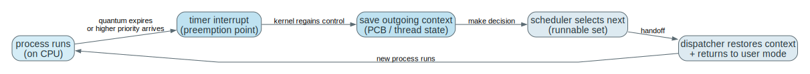
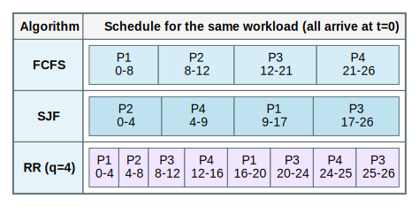
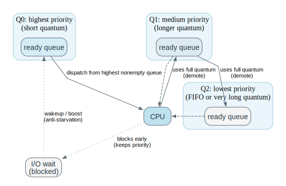
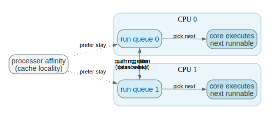

# Chapter 6 CPU Scheduling Mastery

Source: Chapter 6 of `textbook.pdf` (Operating System Concepts, 9th ed.).

This file is the mastery note for Chapter 6.
It is written to make CPU scheduling feel like a control problem under scarcity, not like “memorize FCFS/SJF/RR.”

If Chapter 4 explained threads and Chapter 5 explained correctness under interleavings, Chapter 6 explains how the system decides *who runs next*, how preemption is enforced, and why “performance” is always a trade between latency, throughput, and fairness.

## 1. What This File Optimizes For

The goal is not to memorize algorithm names.
The goal is to be able to answer questions like these without guessing:

- What exactly is the scheduler optimizing: response time, throughput, fairness, or deadlines?
- Why does preemption require both a timer and a context-switch protocol?
- How do different algorithms trade off starvation risk, overhead, and predictability?
- Why does multicore scheduling become a locality-versus-balance problem?
- How do you compute waiting/turnaround/response time from a schedule and use them to compare policies?

For Chapter 6, mastery means:

- you can trace a scheduling decision from “interrupt happens” to “new thread runs”
- you can compute metrics from a schedule and explain what they imply
- you can predict failure modes (starvation, convoy effect, thrashing, cache migration)
- you can connect algorithm ideas to kernel mechanisms (run queues, wakeups, migration)

## 2. Mental Models To Know Cold

### 2.1 Scheduling Is Queue Selection Under Constraints

The scheduler is not a magic optimizer.
It selects from the runnable set under constraints:

- limited CPUs
- context-switch overhead
- fairness expectations
- latency targets
- sometimes deadlines

The most important question is always:
what is the unit being scheduled, and what counts as “runnable”?

### 2.2 Preemption Is a Control Loop

Preemption is not “stop and switch.”
It is a loop:

1. timer interrupt (or a higher-priority event) forces kernel control
2. kernel saves outgoing context
3. scheduler chooses next runnable entity
4. dispatcher restores context and returns to user mode

If any part of that loop is missing, the system is not preemptive in the strong sense.

### 2.3 Metrics Are About Distributions, Not Just Averages

Average waiting time can improve while tail latency becomes worse.
Interactive systems care about response time and jitter.
Batch systems care about throughput and turnaround.

A scheduler is a policy decision about which pain you accept.

### 2.4 “CPU Burst” Is the Right Primitive

Scheduling decisions happen between bursts of CPU execution.
I/O-bound work tends to have short CPU bursts; CPU-bound work tends to have long bursts.

Most scheduling heuristics are attempts to favor the kind of bursts you care about:
short bursts for responsiveness, long bursts for throughput.

### 2.5 Multicore Adds Locality as a First-Class Constraint

On one CPU, you mainly choose an order.
On many CPUs, you also choose where work runs.

Migration can improve balance, but it can destroy cache locality.
A good multiprocessor scheduler is always trading balance against affinity.

### 2.6 Real-Time Is “Meet Deadlines,” Not “Have Good Averages”

Real-time scheduling is defined by timeliness constraints.
“The average response time was good” is irrelevant if a deadline was missed.

## 3. Mastery Modules

### 3.1 The Scheduling Stack: Ready Set, Run Queue, Dispatcher

**Problem**

The OS must share CPU time among many runnable computations while preserving the illusion of progress.
If it cannot regain control and switch correctly, fairness and responsiveness collapse.

**Mechanism**

Core pieces:

- `ready set`: runnable work that could use the CPU now
- `run queue(s)`: data structures that represent the ready set
- `scheduler`: chooses the next runnable entity (policy + mechanism)
- `dispatcher`: performs the context switch and returns to user mode

The scheduling unit might be a process or a thread, but the structure is the same:
save outgoing, choose incoming, restore incoming.

**Invariants**

- The runnable set must represent reality (blocked work must not be considered runnable).
- The context switch must save enough state to resume correctly.
- The kernel must regain control periodically (timer) or on events (I/O completion, faults).

**What Breaks If This Fails**

- Without periodic regain of control, one CPU hog can starve others.
- Without correct save/restore, execution resumes corrupted.
- Without truthful runnable accounting, the scheduler becomes either unfair or wasteful.

**One Trace: event-driven scheduling loop**

| Step | Trigger | Kernel action | Meaning |
| --- | --- | --- | --- |
| 1 | timer or I/O completion | interrupt enters kernel | kernel regains control |
| 2 | make runnable / update queues | wakeup enqueues runnable work | ready set changes |
| 3 | select next | scheduler chooses from run queue | policy applied |
| 4 | switch | dispatcher saves/restores context | decision becomes real |
| 5 | return | kernel returns to user mode | chosen thread runs |

**Code Bridge**

- Find: timer interrupt path, `schedule()`-like function, run-queue structure, context-switch assembly.

**Drills**

1. Why must the scheduler be able to trust “runnable” vs “blocked” classification?
2. What minimum CPU state must be saved to resume execution correctly?
3. Why is the dispatcher separate from the policy logic in many OS designs?

### 3.2 Scheduling Criteria: What “Good” Means

**Problem**

You cannot optimize all goals simultaneously.
Different workloads demand different success criteria.

**Mechanism**

Common criteria (be precise about definitions):

- `CPU utilization`: fraction of time CPU is doing useful work
- `throughput`: completed jobs per unit time
- `turnaround time`: completion time minus arrival time
- `waiting time`: time spent in the ready queue(s) (not running)
- `response time`: time from arrival to first CPU service (first run)

Response time is the interactive metric.
Turnaround time is the batch metric.
Throughput is the system metric.

**Invariants**

- Metrics must be computed from the schedule, not assumed.
- One metric can improve while another worsens; that is not a bug, it is the tradeoff.

**What Breaks If This Fails**

- If you optimize throughput while users care about response time, the system feels “hung.”
- If you optimize response time at all costs, throughput may collapse under overhead.

**One Trace: compute metrics from a schedule**

Given arrival at `t=0`, completion at `t=C`, first run at `t=R`, and total CPU burst `B`:

- turnaround = `C - 0`
- response = `R - 0`
- waiting = `turnaround - B` (for a single CPU burst workload)

**Code Bridge**

- When you benchmark, decide which metric you are actually measuring (mean vs tail, steady-state vs cold-start).

**Drills**

1. Why can a scheduler improve average waiting time while worsening response time?
2. In a time-sharing system, which metric is the “feel” metric?
3. Why is tail latency often more important than average latency?

### 3.3 Preemptive vs Nonpreemptive Scheduling (And Why the Timer Matters)

**Problem**

If the system waits for a thread to yield voluntarily, fairness and responsiveness are not guaranteed.

**Mechanism**

`Nonpreemptive` scheduling:
the running thread keeps the CPU until it blocks, exits, or yields.

`Preemptive` scheduling:
the kernel can interrupt the running thread and switch to another runnable one.

Preemption requires:

- a `timer` to force kernel entry even if user code never yields
- a correct save/choose/restore protocol
- careful protection of kernel critical sections (you cannot preempt in the middle of breaking invariants)

**Invariants**

- Preemption points must not violate kernel invariants (locks held, partial updates).
- The timer must be reliable enough that no thread can run forever unobserved.

**What Breaks If This Fails**

- Without preemption, interactive latency becomes unbounded under CPU hogs.
- If you preempt in unsafe kernel regions, the kernel corrupts itself.

**One Trace: timer-driven preemption**

| Step | Running thread | Kernel | Result |
| --- | --- | --- | --- |
| slice active | thread A runs | timer counts down | A progresses |
| interrupt | A interrupted | kernel regains control | preemption point |
| save | A stopped | A context saved | A resumable |
| choose | scheduler runs | next selected | policy applied |
| restore | B context restored | return to user mode | B runs |

**Code Bridge**

- Look for: tick handler, reschedule flag, and the place the kernel decides to switch before returning to user mode.

**Drills**

1. Why does preemption require a timer and not only “yield calls”?
2. Why does preemptive scheduling interact with synchronization correctness (Chapter 5)?
3. What does “context switch overhead” mean in a performance model?

### 3.4 Core Algorithms: FCFS, SJF/SRTF, and Round Robin

**Problem**

Given a set of runnable jobs, in what order should the CPU serve them?

**Mechanism**

Three core families:

- `FCFS`: first come, first served
  - simple, but can cause convoy effects when long jobs arrive early
- `SJF`: shortest job first (or shortest CPU burst first)
  - minimizes average waiting time *if* burst lengths are known or well-predicted
- `SRTF`: shortest remaining time first (preemptive SJF)
  - improves responsiveness for short jobs but can increase switching
- `RR`: round robin with time quantum `q`
  - balances response time and fairness for time-sharing

The important variables are not the names.
They are:

- how the ready set is ordered
- whether preemption occurs
- what the quantum is

**Invariants**

- RR’s quantum must be chosen relative to context-switch cost.
- SJF/SRTF require prediction; perfect knowledge is a teaching assumption.
- Any algorithm can starve a job if its admission rules allow permanent disadvantage.

**What Breaks If This Fails**

- Too-small quantum: system spends time switching instead of working.
- Too-large quantum: RR degenerates into FCFS in “feel.”
- Pure SRTF can starve long jobs if short jobs keep arriving.

**One Trace: choosing a quantum**

| If quantum q is… | Then… | Symptom |
| --- | --- | --- |
| very small | more preemptions | high overhead, cache churn |
| very large | less preemption | poor interactivity |
| comparable to typical burst | balanced | acceptable response + throughput |

**Code Bridge**

- In real schedulers, look for: timeslice accounting, vruntime/weighting, and heuristics for interactive tasks.

**Drills**

1. Why is SJF “optimal” only under the strong assumption that bursts are known?
2. What is the convoy effect, and why does FCFS trigger it?
3. How does RR trade off response time against overhead?

### 3.5 Priority and Feedback: Priority Scheduling, MLQ, MLFQ, Aging

**Problem**

Systems want to differentiate classes of work (interactive vs batch, kernel vs user, real-time vs best-effort).
But priority systems can starve low-priority jobs forever.

**Mechanism**

`Priority scheduling`:
choose the runnable job with the highest priority.

To prevent starvation:

- `aging`: gradually increase the priority of waiting jobs

`Multilevel queue (MLQ)`:
multiple distinct queues (classes); each queue has its own policy; strict priority between queues.

`Multilevel feedback queue (MLFQ)`:
jobs move between queues based on observed behavior (useful heuristic for “interactive has short bursts”).

Typical MLFQ shape:

- high priority queues have short quantum (favor responsiveness)
- using a full quantum demotes you (assume CPU-bound)
- blocking early keeps you high (assume interactive / I/O-bound)
- periodic boosts prevent starvation

**Invariants**

- Without explicit anti-starvation, strict priority scheduling can starve indefinitely.
- Feedback rules must not be gameable by trivial behavior (e.g., yielding just before quantum ends).
- Priority changes must be consistent with the intended performance model.

**What Breaks If This Fails**

- Starvation: some job never runs.
- Priority inversion: a high-priority job waits on a lock held by a low-priority job (Chapter 5).
- Unstable behavior: small changes in load cause large latency changes.

**One Trace: MLFQ intuition**

| Job behavior | Scheduler inference | Result |
| --- | --- | --- |
| short bursts, blocks often | interactive / I/O-bound | stays high priority |
| long bursts, uses full quantum | CPU-bound | demoted to lower queues |
| waits too long in low queue | risk of starvation | boosted upward periodically |

**Code Bridge**

- Real schedulers often implement “feedback” indirectly (weights, vruntime, interactivity heuristics), not as textbook MLFQ, but the same idea appears.

**Drills**

1. Why does strict priority scheduling starve without aging?
2. How can a scheduler accidentally encourage bad behavior (gaming)?
3. What is one concrete mechanism to prevent starvation in feedback systems?

### 3.6 Thread Scheduling: What Is the Scheduling Unit?

**Problem**

Chapter 4 introduced threads, but scheduling decisions must choose a concrete unit.
User-level threads and kernel threads behave differently under blocking and multicore.

**Mechanism**

Key distinctions:

- Kernel schedules `kernel-visible` entities (kernel threads / tasks).
- User-level threading libraries can multiplex user threads on top of a smaller kernel-visible set.

Consequences:

- If the kernel sees one runnable entity, one blocking syscall blocks the process.
- If the kernel schedules many threads, one thread can block while others run.

**Invariants**

- Scheduling fairness is defined over kernel-visible entities.
- User-level scheduling cannot make progress while the entire process is blocked in the kernel.

**What Breaks If This Fails**

- M:1-style behavior destroys parallelism and can destroy responsiveness under blocking I/O.

**Code Bridge**

- In POSIX/Linux-like systems, find how thread creation maps to kernel primitives (clone/fork variants).

**Drills**

1. Why does “user threads are cheap” not guarantee good system behavior?
2. How does thread scheduling change the meaning of “ready queue” from Chapter 3?
3. What symptom would you see if a system is effectively M:1 under the hood?

### 3.7 Multiple-Processor Scheduling: Load Balancing vs Affinity

**Problem**

On multicore systems, the scheduler must decide both:

- which job runs next
- on which CPU it runs

Moving a job can reduce load imbalance, but it can harm cache locality and NUMA locality.

**Mechanism**

Common patterns:

- per-CPU run queues
- load balancing via migration:
  - `push`: overloaded CPU moves work away
  - `pull`: idle CPU steals work
- `processor affinity`: prefer keeping a job on the same CPU to reuse cache state
- NUMA-aware placement: prefer CPUs near the memory a job uses

**Invariants**

- Balance improves throughput only if migration overhead does not dominate.
- Affinity improves performance only if it does not cause persistent imbalance.
- Migration must preserve correctness of runnable accounting and locking.

**What Breaks If This Fails**

- Excess migration: cache thrash, worse performance on more cores.
- Persistent imbalance: one CPU overloaded while others idle.
- NUMA blindness: remote memory access dominates.

**One Trace: balancing decision**

| Step | Observation | Action | Tradeoff |
| --- | --- | --- | --- |
| measure | CPU0 run queue long, CPU1 idle | migrate or steal work | better balance, worse locality |
| run | CPU1 executes migrated work | - | throughput up if locality cost small |
| stabilize | keep affinity if stable | reduce migrations | avoid thrash |

**Code Bridge**

- Find: per-CPU run queues, migration paths, and the knobs that influence affinity (weights, pinning, NUMA policy).

**Drills**

1. Why can “more cores” reduce performance if migration is excessive?
2. Why is processor affinity a performance mechanism, not a correctness mechanism?
3. What is the scheduling symptom of a NUMA-unaware system under memory-heavy load?

### 3.8 Real-Time CPU Scheduling: Deadlines and Admission

**Problem**

Some work must complete by a deadline.
Average performance is not enough; worst-case behavior matters.

**Mechanism**

Real-time systems are often classified as:

- `hard real-time`: missing a deadline is unacceptable
- `soft real-time`: occasional misses degrade quality but are tolerable

Two classic policies:

- `rate-monotonic (RM)`: fixed priority based on period (shorter period => higher priority)
- `earliest deadline first (EDF)`: dynamic priority; earliest deadline runs first

Real-time scheduling often includes `admission control`:
do not accept new real-time work if it would make existing deadlines impossible.

**Invariants**

- Deadlines must be expressed in the scheduling model, not as an afterthought.
- Overload must be handled explicitly (admission control or graceful degradation).

**What Breaks If This Fails**

- The system behaves “fine on average” but misses critical deadlines.
- Overload leads to cascading misses (everything becomes late).

**One Trace: EDF intuition**

| Step | Runnable tasks | Policy | Result |
| --- | --- | --- | --- |
| choose | tasks have deadlines | pick earliest deadline | minimizes imminent miss risk |
| run | execute until completion or preemption | deadline order changes as time passes | dynamic priorities |

**Code Bridge**

- In real systems, “real-time” classes often coexist with best-effort classes. Look for how the kernel isolates those classes.

**Drills**

1. Why does EDF require dynamic priorities?
2. Why is admission control a correctness mechanism in hard real-time?
3. What failure mode appears if a real-time system is overloaded?

### 3.9 Algorithm Evaluation: Knowing When a Policy Will Work

**Problem**

No scheduling algorithm is best for all workloads.
You need methods to evaluate and compare policies honestly.

**Mechanism**

Evaluation approaches:

- deterministic modeling (given workload, compute schedule and metrics)
- queueing models (stochastic workloads)
- simulation (trace-driven)
- implementation and measurement (most realistic, most expensive)

The key is to match your evaluation method to the question you are asking.

**Invariants**

- The model must match the workload features that matter (arrival patterns, burst distribution, I/O).
- The metric must match what you care about (response vs throughput vs deadlines).

**What Breaks If This Fails**

- You choose a policy based on a model that ignores the real bottleneck.
- You “optimize” a metric that users do not experience.

**Code Bridge**

- When reading scheduler papers or kernel docs, look for: the assumed workload model, the metrics, and the failure modes they admit.

**Drills**

1. Why is simulation often more informative than deterministic examples?
2. Why can a benchmark mislead if it excludes I/O and blocking?
3. Which metric would you choose for: interactive shell, web server, batch compiler farm, hard real-time control loop?

## 4. Canonical Traces To Reproduce From Memory

Do not merely read these.
Cover the table and reproduce the reasoning and sequence from memory.

### 4.1 Dispatch and Preemption Loop

| Step | Trigger | Kernel action |
| --- | --- | --- |
| regain control | timer / interrupt | enter kernel |
| choose | runnable set examined | select next |
| switch | save/restore | dispatcher runs |
| run | return to user | chosen thread executes |

### 4.2 Compute Waiting/Turnaround/Response from a Gantt Chart

| Quantity | Definition |
| --- | --- |
| response | arrival -> first run |
| turnaround | arrival -> completion |
| waiting | turnaround - CPU burst (single-burst model) |

### 4.3 RR Quantum Tradeoff

| If q is… | Then response time… | And overhead… |
| --- | --- | --- |
| smaller | improves | worsens |
| larger | worsens | improves |

### 4.4 Starvation and Aging (Priority Scheduling)

| Step | Observation | Fix |
| --- | --- | --- |
| strict priority | low-priority waits forever | starvation |
| aging | waiting raises priority | bounded waiting restored |

### 4.5 MLFQ Movement Rules

| Behavior | Queue movement |
| --- | --- |
| uses full quantum | demote |
| blocks early | keep (or promote) |
| waits too long | periodic boost |

### 4.6 Multiprocessor Balancing

| Step | CPU0 | CPU1 |
| --- | --- | --- |
| imbalance | long run queue | idle |
| migration | push/pull work | receives work |
| stabilize | avoid thrash | preserve locality |

### 4.7 EDF Choice

| Step | Tasks | Decision |
| --- | --- | --- |
| evaluate | compare deadlines | pick earliest |
| run | execute | adjust as deadlines approach |

## 5. Questions That Push Beyond Recall

1. Why is preemption fundamentally a *control* mechanism, not only a fairness mechanism?
2. Why do response time and throughput often conflict?
3. Why does SJF minimize average waiting time only under strong assumptions?
4. Why is “quantum selection” a core design decision in RR?
5. Why does strict priority scheduling need anti-starvation (aging/boost)?
6. Why does multiprocessor scheduling add the locality-versus-balance tradeoff?
7. Why can adding cores reduce performance when migration and contention dominate?
8. Why does real-time scheduling require admission control under overload?
9. Why are averages often misleading for user-perceived performance?
10. What mechanism prevents a blocked thread from being treated as runnable?
11. If a scheduler is “fair,” what does that mean precisely: CPU time, progress, or bounded waiting?
12. Why is scheduler evaluation inseparable from a workload model?

## 6. Suggested Bridge Into Real Kernels

If you later study a teaching kernel or Linux-like codebase, a good Chapter 6 reading order is:

1. run queue structures and “runnable” classification
2. timer tick handler and reschedule trigger
3. core selection function (policy)
4. dispatcher/context-switch code (mechanism)
5. wakeup paths (I/O completion -> runnable)
6. multiprocessor balancing and affinity code

Conceptual anchors to look for:

- where timeslices are accounted and enforced
- where fairness is encoded (weights, vruntime, priorities)
- where migration happens and what prevents thrash
- where scheduler decisions are made relative to interrupts and locks

## 7. How To Use This File

If you are short on time:

- Read `## 2. Mental Models To Know Cold` once.
- Reproduce the traces in `## 4. Canonical Traces To Reproduce From Memory`.

If you want Chapter 6 to become reasoning skill:

- For each algorithm, write down the failure mode you fear most (starvation, overhead, convoy effect) before reading the explanation.
- Reproduce one schedule from memory and compute its metrics without looking.
- When you make a claim (“RR is fair”), force yourself to state the invariant that makes it true.

