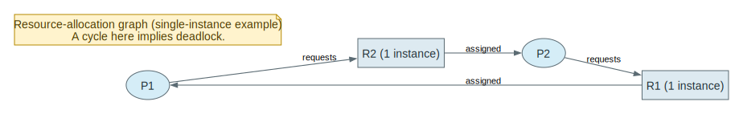

# Chapter 7 Deadlocks Mastery

Source: Chapter 7 of `textbook.pdf` (Operating System Concepts, 9th ed.).

This file is the mastery note for Chapter 7.
It is written to make deadlocks feel like a *state-space* and *invariant* problem, not like a vocabulary list.

If Chapter 5 taught you how to coordinate correctly, Chapter 7 teaches what happens when coordination protocols compose into a cycle that prevents progress.

## 1. What This File Optimizes For

The goal is not to memorize the four conditions as a chant.
The goal is to be able to do the following without guessing:

- Model a story as processes/threads, resources, instances, and wait edges, then identify the exact cycle.
- Decide which of the four conditions is easiest to break in a given system and explain the cost.
- Explain when “cycle implies deadlock” is sufficient (single-instance model) and when it is not (multi-instance).
- Distinguish deadlock vs starvation vs livelock by their progress properties and signatures.
- Choose when it is rational to ignore deadlocks and when it is reckless, based on frequency and recovery cost.
- Explain why Banker’s algorithm is mostly a teaching avoidance model, not a generic kernel runtime technique.

For Chapter 7, mastery means:

- you can model the situation as processes, resources, and waits
- you can trace prevention/avoidance/detection/recovery protocols step by step
- you can predict both correctness and cost consequences (overhead, reduced utilization, complexity)

## 2. Mental Models To Know Cold

### 2.1 Deadlock Is “No One Can Make Progress” Because of a Cycle

Deadlock is not “things are slow.”
Deadlock is a state where a set of threads/processes are each waiting for events that only other members of the set can cause.

The signature is a *cycle of dependence*.

### 2.2 The Four Conditions Are Necessary, Not Automatically Sufficient

Deadlock requires all four:

- mutual exclusion
- hold and wait
- no preemption
- circular wait

Break any one condition and deadlock is impossible for that model.

### 2.3 “Cycle Implies Deadlock” Depends on Resource Instances

With **single-instance resources**, a wait cycle implies deadlock.
With **multiple-instance resources**, a cycle may exist while the system can still escape (another instance becomes available and breaks the cycle).

So: graph reasoning is model-dependent.

### 2.4 Deadlock vs Starvation vs Livelock

- `deadlock`: cyclic waiting, no progress.
- `starvation`: some thread never gets service, but others do.
- `livelock`: threads keep “doing something” but fail to make progress (often due to politeness/backoff).

You must diagnose which one you have before proposing a fix.

### 2.5 Handling Deadlock Is a Policy Choice

You can:

- ignore it (common for general OS resources)
- prevent it (deny one of the conditions)
- avoid it (admit only safe requests)
- detect and recover (allow it but clean it up)

Every choice pays somewhere: utilization, complexity, or user-visible failure.

## 3. Mastery Modules

### 3.1 System Model: Resources, Instances, and Protocols

**Problem**

To reason about deadlocks, we need a model of what resources are, how they are requested, and when they are released.

**Mechanism**

Model resources as types with instances:

- R1 has w instances, R2 has x instances, ...

Processes (or threads) follow a protocol:

1. request
2. use (hold)
3. release

Deadlock is about what happens when requests are conditional on resources held by others.

**Invariants**

- Requests and assignments must be representable as state transitions.
- “Holding” implies exclusivity for that instance (for the duration).

**What Breaks If This Fails**

- If you can’t model the resources, you can’t prove prevention/avoidance/detection claims.

**Code Bridge**

- In real systems, “resources” include locks, file descriptors, memory pages, database row locks, and kernel objects.

**Drills (With Answers)**

1. **Q:** Name three OS resources that are naturally single-instance and three that are multi-instance.
**A:** Single-instance examples: a specific mutex/spinlock, an exclusive device lock (e.g., one printer device), a file lock on a specific inode/record. Multi-instance examples: physical memory frames (many frames), buffer/cache slots, a pool of identical permits such as “N worker slots” or “N DB connections.” The key is whether the resource is “one unique thing” or “a count of interchangeable instances.”

2. **Q:** What does “release” mean for a lock vs for memory pages vs for a file descriptor?
**A:** Lock: `unlock` transfers ownership to nobody and may wake a waiter (release is a wakeup-enabling event). Memory pages: unmap/free frames back to an allocator (release is returning capacity to a pool). File descriptor: `close` drops a reference in the process table; underlying object is released only when the last reference goes away (release is refcount-based and may trigger cleanup).

3. **Q:** Why is modeling “instances” the difference between easy and hard deadlock reasoning?
**A:** Because cycles behave differently. With single-instance resources, a cycle in the wait-for graph is sufficient: each edge represents a unique held resource, so the cycle means nobody can proceed. With multi-instance resources, a cycle can exist while the system can still grant a request using another free instance, breaking the cycle. Avoidance/detection then requires tracking availability and maximum needs, not just edges.

### 3.2 Deadlock Characterization: Four Conditions as a Single Cycle Story

**Problem**

You want a *diagnostic* that explains why deadlocks happen, not just a list of words.

**Mechanism**

The four conditions are best read as “how a cycle becomes stable”:

- mutual exclusion creates exclusive ownership edges
- hold and wait creates partial progress states
- no preemption makes ownership sticky
- circular wait creates a closed cycle of dependencies

Once the cycle exists, no member can proceed without external intervention.

**Invariants**

- If any condition is broken, the cycle cannot become a stable deadlock.
- Deadlock is about progress impossibility, not about slow scheduling.

**What Breaks If This Fails**

- You propose fixes that do not actually remove the possibility of a cycle.

**One Trace: two-lock deadlock**

This is the minimal deadlock: two exclusive resources, opposite acquisition order.
When you cover this table, explicitly name the cycle: A holds L1 and waits for L2; B holds L2 and waits for L1.
Deadlock is not “slow”; it is “no member can make progress without an external break.”

| Step | Thread A | Thread B |
| --- | --- | --- |
| 1 | acquires L1 | acquires L2 |
| 2 | requests L2 (blocks) | requests L1 (blocks) |
| 3 | waiting on B | waiting on A |

The point is the cycle, not the timing.
Once both edges exist, no amount of “better scheduling” fixes it; you must break one of the deadlock conditions (usually by changing acquisition order or by avoiding hold-and-wait).

**Code Bridge**

- In bug reports, reconstruct the *lock order* actually taken, not the intended order.

**Drills (With Answers)**

1. **Q:** Which of the four conditions does “global lock ordering” break?
**A:** Circular wait. If every thread acquires resources in a single global increasing order, the wait edges can never form a cycle because they always point “up” the order.

2. **Q:** Why does “trylock + backoff” avoid deadlock but risk livelock?
**A:** It avoids deadlock by refusing to block while holding resources: if a trylock fails, the thread releases what it holds and retries later, breaking hold-and-wait (or preventing stable circular wait). But if multiple threads collide and repeatedly release/retry in lockstep, they can keep doing work without making progress, which is livelock.

3. **Q:** Give an example of starvation that is not deadlock.
**A:** A low-priority thread waiting for CPU time while higher-priority work keeps arriving (it never runs), even though no cycle exists. Another example is strict priority scheduling without aging: a low-priority job waits forever because it is always outranked, not because it is in a resource cycle.

### 3.3 Resource-Allocation Graphs (RAG) and Wait-For Graphs (WFG)

**Problem**

We need a representation that makes cycles visible.

**Mechanism**

`Resource-allocation graph (RAG)`:

- process nodes: P1, P2, ...
- resource nodes: R1, R2, ...
- request edge: P -> R
- assignment edge: R -> P

For **single-instance** resources, a cycle in the RAG implies deadlock.

`Wait-for graph (WFG)` is a simplified graph for single-instance resources:

- nodes are processes only
- edge Pi -> Pj means Pi waits for a resource held by Pj

Cycle detection in WFG becomes deadlock detection.

**Invariants**

- A WFG is valid only when each resource has a single instance (or you model it as such).
- A cycle is a *necessary* condition for deadlock (always), but only *sufficient* in certain models.

**What Breaks If This Fails**

- You declare deadlock from a cycle in a multi-instance system when the system can actually still escape.

**One Trace: build a WFG edge**

This is how you turn “resource waiting” into “process waiting.”
The WFG edge Pi -> Pj means “Pi is blocked until Pj releases something,” which makes cycle detection a direct deadlock test in the single-instance model.
When you cover this, be explicit about the assumption: single-instance resources; otherwise an edge does not capture “one free instance could still satisfy the request.”

| Step | Observation | Add edge |
| --- | --- | --- |
| 1 | Pi requests Rk | - |
| 2 | Rk assigned to Pj | Pi -> Pj |
| 3 | if cycle exists | deadlock (single-instance model) |

This is the minimal data you need for deadlock detection: who owns what, and who is waiting on whom.
In real systems this information is often distributed across lock owner fields and wait queues; the conceptual move is the same even when the graph is implicit.

**Code Bridge**

- In real kernels, a “wait-for graph” is often implicit: it’s distributed across lock ownership and wait queues.

**Drills (With Answers)**

1. **Q:** Why is WFG cheaper than RAG for detection?
**A:** Because it eliminates resource nodes and reduces the graph to only processes and wait edges. For single-instance resources, every “wait for resource” becomes “wait for owner process,” so cycle detection is performed on a smaller graph with simpler edges. In practice this also maps better to real systems where ownership and wait queues already identify “who waits on whom.”

2. **Q:** Give one case where a cycle is present but deadlock is not (multi-instance intuition).
**A:** Suppose R has 2 identical instances. P1 holds one instance and requests another; P2 holds one instance and requests another; that looks like a cycle of “each waits,” but if a third free instance exists (or if one request can be satisfied by a free instance), one process can proceed, release, and break the cycle. In multi-instance systems, a “cycle” can represent a temporary dependency that can still be resolved by allocating a free instance or by completing a process that releases instances.

3. **Q:** What state would you need to track to build a WFG in a real system?
**A:** For each resource (lock/object), you need current owner identity (which thread/process holds it) and the set of waiters (who is blocked requesting it). You also need to know what each blocked entity is waiting on at the moment (so you don’t count stale waits) and how to map that wait to an owner. In kernels this state is often distributed across lock owner fields and wait-queue structures rather than a central “graph.”

### 3.4 Methods for Handling Deadlocks: Ignore, Prevent, Avoid, Detect+Recover

**Problem**

Deadlocks are possible in many designs, but you must pick a policy about them.

**Mechanism**

Four policy families:

1. `ignore` (ostrich): assume rare, rely on restart/admin intervention
2. `prevention`: break a necessary condition by design
3. `avoidance`: only grant requests that keep the system in a safe state
4. `detection + recovery`: allow deadlocks, then find and break them

**Invariants**

- “Ignore” is a policy, not a bug, when deadlocks are rare and recovery is cheap.
- Avoidance requires a model of maximum resource needs.

**What Breaks If This Fails**

- You build a system that deadlocks often without any recovery story.

**Code Bridge**

- Databases commonly implement detection + recovery (abort a transaction).
- OS kernels often use prevention for internal locks (ordering rules), and ignore for user-level resource mixes.

**Drills (With Answers)**

1. **Q:** Why can “ignore deadlock” be rational in a general OS?
**A:** Because the space of user-level resource combinations is huge, and preventing all deadlocks can impose high overhead or reduce utilization drastically. If deadlocks are rare and recovery is cheap (restart an app, reboot a service), it can be rational to accept the risk. “Ignore” becomes reckless only when deadlocks are frequent or when recovery destroys important state.

2. **Q:** Why is “detection + kill” often acceptable for transactions but painful for threads?
**A:** Transactions are designed to be abortable: rollback is part of the semantics, and the system can discard partial progress safely. Killing a thread in an OS process is not naturally rollbackable; it can leave locks held, invariants broken, and shared state corrupted. Recovery for threads often requires careful compensation logic, which is why “just kill something” is much harder than aborting a transaction.

3. **Q:** Which policy is easiest to reason about? Which is easiest to implement correctly?
**A:** Easiest to reason about: prevention via breaking a necessary condition (especially global ordering) because you can prove “cycles cannot exist” under the rule. Easiest to implement at all: ignore (do nothing), but it provides no guarantee. Easiest to implement correctly *with a guarantee* in many OS lock systems is prevention (ordering/discipline); avoidance requires maximum-need declarations and correct safety checks, and detection+recovery requires a robust, safe recovery story.

### 3.5 Deadlock Prevention: Breaking a Necessary Condition

**Problem**

We want to rule out deadlock completely.

**Mechanism**

Break one condition:

- break `hold and wait`: request all resources up front, or release before requesting new
- break `no preemption`: preempt resources (rarely possible for locks)
- break `circular wait`: impose a global order on resource acquisition
- break `mutual exclusion`: make resources sharable (often impossible for correctness)

In OS practice, the most common reliable approach for locks is **global ordering**.

**Invariants**

- Global ordering prevents cycles because edges always go “up” the order.
- Up-front allocation prevents partial hold states but reduces utilization.

**What Breaks If This Fails**

- Ordering that is not globally enforced becomes “mostly ordered,” which is deadlock-prone.

**One Trace: ordering prevents cycles**

This is the deadlock-prevention workhorse for lock-based systems.
If every lock acquisition edge goes in one global direction (increasing ID), a cycle is structurally impossible because you cannot return “downward” to close the loop.
When you cover this table, connect it directly to the four conditions: ordering does not remove mutual exclusion, but it prevents circular wait.

| Rule | Effect |
| --- | --- |
| always acquire locks in increasing ID order | cycles impossible |
| release in reverse order | avoid exposing partial states |

Ordering works because it turns “possible waits” into a directed acyclic graph.
The rule must be global and enforced everywhere (including error paths); one violation is enough to reintroduce a possible cycle under contention.

**Code Bridge**

- In kernel code, look for lock classes and lockdep-like assertions that encode ordering rules.

**Drills (With Answers)**

1. **Q:** Why does “request everything at once” reduce concurrency?
**A:** Because it makes processes hold resources longer than necessary and prevents partial progress. Threads that could have run while waiting for a later resource instead hoard early resources, reducing overall utilization and increasing waiting for others. Up-front allocation breaks hold-and-wait, but the cost is reduced parallelism and often worse throughput.

2. **Q:** Why is “preemption” hard for mutex locks?
**A:** Because a lock is not just a token; it protects an invariant while shared state may be mid-update. Forcibly taking a mutex away from its owner can expose partially updated state to another thread, breaking correctness. Preemption is feasible for resources that have rollback or can be safely interrupted, but mutex-protected critical sections generally do not have that property.

3. **Q:** What bug appears if two subsystems disagree on lock ordering?
**A:** A deadlock. If subsystem A acquires L1 then L2, but subsystem B acquires L2 then L1, the system now admits a cycle under contention. “Mostly ordered” is not ordered; one ordering violation is enough to reintroduce deadlock possibility.

### 3.6 Deadlock Avoidance: Safe State and Banker’s Algorithm

**Problem**

Prevention can be too restrictive.
Avoidance tries to be permissive while guaranteeing the system can still finish.

**Mechanism**

A state is `safe` if there exists a `safe sequence` in which each process can obtain its remaining needs and complete, releasing resources as it finishes.

Banker’s algorithm:

- assumes each process declares its maximum demand
- on each request, simulate granting it and check if the resulting state is safe
- grant only if safe; otherwise delay

**Invariants**

- Max demand must be known and honored.
- Safety check must be correct; it is a proof obligation, not a heuristic.

**What Breaks If This Fails**

- If max demand is unknown or dishonest, avoidance loses its guarantee.
- Safety checks add overhead and can reduce utilization by being conservative.

**One Trace: safety check sketch**

This is the “prove there exists a finishing order” computation.
The algorithm does not try to predict the future exactly; it checks whether there exists a sequence in which processes could complete if granted resources in some order.
When you cover this table, emphasize that `safe` is an existence proof and `unsafe` is a risk state, not a claim that the system is deadlocked right now.

| Step | State variable | Action |
| --- | --- | --- |
| 1 | `Need = Max - Allocation` | compute remaining needs |
| 2 | `Work = Available` | simulate free resources |
| 3 | find i with `Need[i] <= Work` | “pretend” it can finish |
| 4 | `Work += Allocation[i]` | release on completion |
| 5 | if all finishable | safe; else unsafe |

This is avoidance as a proof obligation: you are checking for the existence of a completion order, not declaring the system deadlocked.
The key distinction to keep saying out loud is: `unsafe` means “risk without guarantee,” not “no progress now.”

**Code Bridge**

- Banker shows up more in teaching, databases, and specialized admission-control systems than in general OS kernels.

**Drills (With Answers)**

1. **Q:** Why is “unsafe” not the same thing as “deadlocked right now”?
**A:** Unsafe means “there exists some future request sequence that could lead to deadlock,” not “no progress is possible now.” The system can be operating fine in an unsafe state as long as the particular future requests that would trap it do not occur (or are delayed). Deadlock is an actual cycle of waiting with no escape; unsafe is a warning that you no longer have a guarantee.

2. **Q:** What real systems can reasonably demand a max claim up front?
**A:** Systems with predictable workloads and strong admission control: embedded/hard real-time control loops, batch job schedulers, and some resource-reservation environments (HPC jobs reserving CPU/memory). In these settings, “declare worst-case need” is feasible and part of the contract. General-purpose OS applications do not have this predictability, which is why Banker is not a universal kernel technique.

3. **Q:** Why does avoidance trade utilization for guaranteed progress?
**A:** Because it may delay or deny a request even when resources are currently available, purely to keep the system in a provably safe state. That conservatism can leave resources idle and reduce throughput. You pay that utilization cost to buy the guarantee that accepted requests cannot push the system into deadlock.

### 3.7 Deadlock Detection and Recovery: Allow, Find, Break

**Problem**

Avoidance requires too much foreknowledge.
So instead: let the system run, then detect deadlocks and recover.

**Mechanism**

Detection:

- for single-instance resources: cycle detection in WFG
- for multiple instances: a Work/Finish algorithm similar in spirit to Banker safety checking

Recovery:

- terminate processes (kill all deadlocked, or kill one at a time)
- resource preemption + rollback (if state can be rolled back safely)

**Invariants**

- Detection must not confuse “waiting” with “deadlocked” (some waits are normal).
- Recovery must choose victims in a way that doesn’t starve one process forever.

**What Breaks If This Fails**

- You repeatedly kill the same unlucky job (starvation through recovery policy).
- Resource preemption without rollback can corrupt application-level invariants.

**One Trace: recovery by killing one victim**

This is the “allow deadlock, then break it” loop.
The detection part identifies a deadlocked set; recovery chooses a victim and forces progress by releasing resources, but at the cost of lost work and user-visible failure.
When you cover this table, emphasize that recovery policy can itself become a starvation policy if the same victim is repeatedly chosen.

| Step | Action | Effect |
| --- | --- | --- |
| 1 | detect cycle / deadlocked set | identify candidates |
| 2 | choose victim | policy: least progress, lowest priority, smallest cost |
| 3 | abort/kill victim | resources released |
| 4 | re-run detection | repeat until no deadlock |

Detection plus recovery turns deadlock into an operational policy problem: which work do you destroy to regain progress?
Without rollback/compensation and without fairness history, “kill to recover” can trade deadlock for corruption or starvation.

**Code Bridge**

- DBs: abort transaction is a clean rollback mechanism.
- OS processes: “kill -9” is recovery but is user-visible failure; therefore OSes often prefer prevention for internal locks.

**Drills (With Answers)**

1. **Q:** Why is detection frequency a tradeoff (overhead vs time-to-recover)?
**A:** Frequent detection burns CPU and requires consistent snapshots of ownership/waiting state (which can be expensive). Infrequent detection reduces overhead but allows deadlocks to persist longer, wasting resources and increasing user-visible outage time. The right frequency depends on expected deadlock rate and the cost of being stuck.

2. **Q:** Why is rollback the real difficulty of resource preemption?
**A:** Because preempting a resource often means interrupting a partially completed operation that has already mutated shared state. If you cannot undo those mutations safely, you trade deadlock for corruption. Rollback (or compensation) is what makes preemption a correctness-preserving mechanism; without it, forced release is unsafe for many resources.

3. **Q:** Which victim-selection policy is least likely to cause repeated harm?
**A:** One that minimizes cost *and* incorporates fairness history. “Kill the cheapest” alone can repeatedly sacrifice the same low-cost victim, creating starvation through recovery. Practical policies track prior victims or increase a victim’s “cost” after repeated kills, balancing recovery cost against repeated harm.

## 4. Canonical Traces To Reproduce From Memory

Do not merely read these.
Cover the tables and reproduce the reasoning/protocol from memory.

### 4.1 Two-Lock Deadlock

Reproduce this as a cycle, not as a schedule.
Name the edges: A holds L1 and requests L2; B holds L2 and requests L1; the cycle is stable without external intervention.

| Step | A | B |
| --- | --- | --- |
| acquire | L1 | L2 |
| request | L2 | L1 |
| result | A waits on B | B waits on A |

Reproduce this as two edges that close a cycle.
If you can narrate the edges, you can also narrate the prevention rule: impose a lock order so edges cannot ever point “backward.”

### 4.2 Global Lock Ordering Prevents Cycles

This is the simplest prevention proof.
If every acquisition follows one total order, you cannot form a cycle because you cannot “come back down” to close the loop.

| Rule | Consequence |
| --- | --- |
| acquire in increasing order | circular wait impossible |
| release in reverse | keeps invariants tidy |

Think of ordering as building a partial order over locks that makes cycles structurally impossible.
The tricky part in real code is completeness: every acquisition path, including nested calls and error handling, must obey the same order.

### 4.3 WFG Cycle Detection

This is deadlock detection in the single-instance model.
Build wait edges from “waits for owner,” then run cycle detection (DFS/SCC) to identify deadlocked sets.

| Step | Graph | Conclusion |
| --- | --- | --- |
| build edges | Pi -> Pj if Pi waits on Pj | WFG |
| detect cycle | DFS / SCC | deadlock (single-instance model) |

This is graph theory applied to ownership state: build edges from waiter to owner, then run cycle detection.
In production systems, the hard part is capturing a consistent snapshot of “who waits on whom” without perturbing the system too much.

### 4.4 Banker Safety Check

This is avoidance as an existence proof.
You are not proving “no deadlock now”; you are checking whether there exists a sequence in which everyone could finish if granted resources in some order.

| Step | Variable | Meaning |
| --- | --- | --- |
| compute Need | Max-Alloc | remaining demand |
| simulate Work | Available | pretend free pool |
| find finishable | Need<=Work | can complete |
| release | Work += Allocation | on completion |

Rehearse this as a simulation: you pretend to finish someone, then grow `Work`, and repeat.
The guarantee is only as good as the max-claim assumption; without truthful max claims, the “safe sequence” proof does not apply.

### 4.5 Detect + Kill Loop

This is recovery by force.
The system regains progress by destroying work (killing a victim) and freeing resources; correctness depends on having a safe rollback/failure model.

| Step | Action |
| --- | --- |
| detect | find deadlocked set |
| choose victim | minimize cost |
| abort | release resources |
| repeat | until no deadlock |

This is progress by force: you break the cycle by destroying some work.
When you reproduce it, always state the two policy questions: “who to kill” (min cost, fairness) and “how to make killing safe” (rollback or acceptable failure semantics).

## 5. Key Questions (Answered)

1. **Q:** Why are the four deadlock conditions best understood as one cycle story?
**A:** Because they describe how a stable wait cycle is constructed. Mutual exclusion creates exclusive ownership; hold-and-wait creates partial progress states; no preemption makes ownership sticky; circular wait closes the dependency loop. Read together, they explain why the system becomes “stuck forever” unless something external breaks the cycle.

2. **Q:** Why is “cycle implies deadlock” model-dependent?
**A:** With single-instance resources, a wait cycle means each edge points to a unique held resource, so nobody can proceed and the cycle is sufficient for deadlock. With multi-instance resources, a cycle can exist while a request can still be satisfied by a free instance, allowing progress that breaks the cycle. Sufficiency depends on whether “one held resource” is truly the only way forward.

3. **Q:** Why is “unsafe” not equal to “deadlocked” in avoidance?
**A:** Unsafe means you no longer have a proof that all processes can finish under all future request sequences. The system can still make progress right now; it is just in a state where some future choices could trap it. Deadlock is an actual progress impossibility now; unsafe is a loss of guarantee.

4. **Q:** Why is max-claim a realistic requirement in some systems but unrealistic in general OSes?
**A:** It is realistic in constrained systems with predictable workloads (embedded, hard real-time, batch jobs) where declaring worst-case needs is part of the contract. In general-purpose OSes, applications are dynamic and often cannot honestly declare maximum future resource needs (files, memory, locks) without gross overestimation. Without truthful max claims, Banker-style guarantees collapse.

5. **Q:** Why does global ordering work so well for locks?
**A:** Because it breaks circular wait with a simple, enforceable rule. It is cheap at runtime (mostly discipline and assertions) and does not require knowing future needs. It preserves mutual exclusion and correctness while giving a strong structural guarantee: no cycles, therefore no deadlock in the lock model.

6. **Q:** Why can deadlock prevention reduce utilization dramatically?
**A:** Many prevention techniques force conservative behavior: request all resources up front, release everything before requesting new, or forbid certain interleavings. That can make threads hold resources longer than needed or wait unnecessarily, reducing parallelism and throughput. You trade utilization for a hard guarantee.

7. **Q:** Why is rollback the core difficulty of recovery by preemption?
**A:** Because taking a resource away is only safe if you can undo or compensate for the partial work that happened while it was held. Without rollback, you may free the lock but leave shared state inconsistent, which is worse than deadlock. Rollback (or transactional semantics) is what turns “kill/preempt” into correctness-preserving recovery.

8. **Q:** Why does deadlock detection risk starvation through repeated victim choice?
**A:** Because “recover by killing one” is itself a scheduling policy. If the system always picks the cheapest or lowest-priority victim, the same entity can be sacrificed repeatedly, effectively starving it. Recovery must therefore incorporate fairness/history if you want bounded harm.

9. **Q:** How can a system avoid deadlock but still suffer starvation?
**A:** Deadlock avoidance/prevention removes cycles, but it does not guarantee fairness. For example, trylock+backoff can avoid deadlock while one unlucky thread repeatedly loses and makes no progress. Strict ordering prevents deadlock but a low-priority thread can still starve under priority scheduling or under unfair lock admission.

10. **Q:** Why is “ignore deadlock” sometimes the right engineering choice?
**A:** When deadlocks are rare and recovery is cheap, the overhead and complexity of prevention/avoidance/detection may cost more than the occasional restart. Many general OSes choose prevention for internal locks (high frequency, high cost of kernel deadlock) but effectively ignore many user-level deadlocks because user processes can be restarted without compromising kernel integrity.

11. **Q:** What symptom distinguishes deadlock from extreme CPU contention?
**A:** In deadlock, the involved threads are blocked waiting and overall useful progress stops; CPU may even be mostly idle if everyone is sleeping. In extreme contention, CPU is often busy (spinning, context switching, lock thrash) and some progress may still occur, just slowly. Deadlock has a stable wait cycle; contention has pressure, not impossibility.

12. **Q:** How would you instrument a real system to reconstruct a wait-for graph after a hang?
**A:** Record ownership and waiting relationships: for each lock/resource, track current owner and waiters, and capture stack traces at acquisition and at block points. Add tracing hooks around lock acquisition, lock release, and sleep/wakeup, and persist recent events in a ring buffer so you can inspect after a hang. With that data, you can build edges “waiter -> owner” and run cycle detection to identify the deadlocked set.

## 6. Suggested Bridge Into Real Kernels

If you later study a teaching kernel or Linux-like codebase, a good Chapter 7 reading order is:

1. lock primitives and ownership tracking
2. wait queues / sleep-wakeup paths (how waiting is represented)
3. lock ordering rules (and any lock-dependency checker)
4. any deadlock detection logic (more common in debugging builds than in production)

Conceptual anchors to look for:

- where “who holds what” is recorded
- where “who is waiting on what” is recorded
- how the system enforces ordering (or why it chooses not to)

## 7. How To Use This File

If you are short on time:

- Read `## 2. Mental Models To Know Cold` once.
- Reproduce the traces in `## 4. Canonical Traces To Reproduce From Memory`.

If you want Chapter 7 to become reasoning skill:

- For each prevention/avoidance/detection technique, name the *assumption* it relies on.
- Practice diagnosing: given a lock acquisition log, reconstruct the cycle.
- Practice designing: given a subsystem, propose one prevention rule and one detection+recovery plan, and state the tradeoffs.
