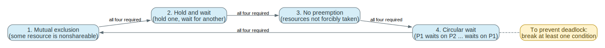
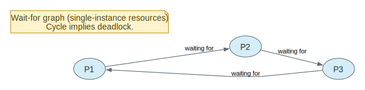
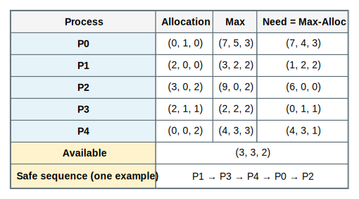

# Chapter 7 Deadlocks Mastery

Source: Chapter 7 of `textbook.pdf` (Operating System Concepts, 9th ed.).

This file is the mastery note for Chapter 7.
It is written to make deadlocks feel like a *state-space* and *invariant* problem, not like a vocabulary list.

If Chapter 5 taught you how to coordinate correctly, Chapter 7 teaches what happens when coordination protocols compose into a cycle that prevents progress.

## 1. What This File Optimizes For

The goal is not to memorize the four conditions as a chant.
The goal is to be able to answer questions like these without guessing:

- Given a story (locks, DB transactions, file handles), can you identify the exact wait cycle?
- Which of the four deadlock conditions is easiest to break *in this system* and why?
- Why is “a cycle in a resource-allocation graph” sometimes sufficient for deadlock and sometimes not?
- What is the difference between a `deadlock`, `starvation`, and `livelock`?
- When is it rational to ignore deadlocks, and when is it reckless?
- Why is Banker’s algorithm not a generic runtime technique for most OS kernels?

For Chapter 7, mastery means:

- you can model the situation as processes, resources, and waits
- you can trace prevention/avoidance/detection/recovery protocols step by step
- you can predict both correctness and cost consequences (overhead, reduced utilization, complexity)

## 2. Mental Models To Know Cold

### 2.1 Deadlock Is “No One Can Make Progress” Because of a Cycle

Deadlock is not “things are slow.”
Deadlock is a state where a set of threads/processes are each waiting for events that only other members of the set can cause.

The signature is a *cycle of dependence*.

### 2.2 The Four Conditions Are Necessary, Not Automatically Sufficient

Deadlock requires all four:

- mutual exclusion
- hold and wait
- no preemption
- circular wait

Break any one condition and deadlock is impossible for that model.

### 2.3 “Cycle Implies Deadlock” Depends on Resource Instances

With **single-instance resources**, a wait cycle implies deadlock.
With **multiple-instance resources**, a cycle may exist while the system can still escape (another instance becomes available and breaks the cycle).

So: graph reasoning is model-dependent.

### 2.4 Deadlock vs Starvation vs Livelock

- `deadlock`: cyclic waiting, no progress.
- `starvation`: some thread never gets service, but others do.
- `livelock`: threads keep “doing something” but fail to make progress (often due to politeness/backoff).

You must diagnose which one you have before proposing a fix.

### 2.5 Handling Deadlock Is a Policy Choice

You can:

- ignore it (common for general OS resources)
- prevent it (deny one of the conditions)
- avoid it (admit only safe requests)
- detect and recover (allow it but clean it up)

Every choice pays somewhere: utilization, complexity, or user-visible failure.

## 3. Mastery Modules

### 3.1 System Model: Resources, Instances, and Protocols

**Problem**

To reason about deadlocks, we need a model of what resources are, how they are requested, and when they are released.

**Mechanism**

Model resources as types with instances:

- R1 has w instances, R2 has x instances, ...

Processes (or threads) follow a protocol:

1. request
2. use (hold)
3. release

Deadlock is about what happens when requests are conditional on resources held by others.

**Invariants**

- Requests and assignments must be representable as state transitions.
- “Holding” implies exclusivity for that instance (for the duration).

**What Breaks If This Fails**

- If you can’t model the resources, you can’t prove prevention/avoidance/detection claims.

**Code Bridge**

- In real systems, “resources” include locks, file descriptors, memory pages, database row locks, and kernel objects.

**Drills**

1. Name three OS resources that are naturally single-instance and three that are multi-instance.
2. What does “release” mean for a lock vs for memory pages vs for a file descriptor?
3. Why is modeling “instances” the difference between easy and hard deadlock reasoning?

### 3.2 Deadlock Characterization: Four Conditions as a Single Cycle Story

**Problem**

You want a *diagnostic* that explains why deadlocks happen, not just a list of words.

**Mechanism**

The four conditions are best read as “how a cycle becomes stable”:

- mutual exclusion creates exclusive ownership edges
- hold and wait creates partial progress states
- no preemption makes ownership sticky
- circular wait creates a closed cycle of dependencies

Once the cycle exists, no member can proceed without external intervention.

**Invariants**

- If any condition is broken, the cycle cannot become a stable deadlock.
- Deadlock is about progress impossibility, not about slow scheduling.

**What Breaks If This Fails**

- You propose fixes that do not actually remove the possibility of a cycle.

**One Trace: two-lock deadlock**

| Step | Thread A | Thread B |
| --- | --- | --- |
| 1 | acquires L1 | acquires L2 |
| 2 | requests L2 (blocks) | requests L1 (blocks) |
| 3 | waiting on B | waiting on A |

**Code Bridge**

- In bug reports, reconstruct the *lock order* actually taken, not the intended order.

**Drills**

1. Which of the four conditions does “global lock ordering” break?
2. Why does “trylock + backoff” avoid deadlock but risk livelock?
3. Give an example of starvation that is not deadlock.

### 3.3 Resource-Allocation Graphs (RAG) and Wait-For Graphs (WFG)

**Problem**

We need a representation that makes cycles visible.

**Mechanism**

`Resource-allocation graph (RAG)`:

- process nodes: P1, P2, ...
- resource nodes: R1, R2, ...
- request edge: P -> R
- assignment edge: R -> P

For **single-instance** resources, a cycle in the RAG implies deadlock.

`Wait-for graph (WFG)` is a simplified graph for single-instance resources:

- nodes are processes only
- edge Pi -> Pj means Pi waits for a resource held by Pj

Cycle detection in WFG becomes deadlock detection.

**Invariants**

- A WFG is valid only when each resource has a single instance (or you model it as such).
- A cycle is a *necessary* condition for deadlock (always), but only *sufficient* in certain models.

**What Breaks If This Fails**

- You declare deadlock from a cycle in a multi-instance system when the system can actually still escape.

**One Trace: build a WFG edge**

| Step | Observation | Add edge |
| --- | --- | --- |
| 1 | Pi requests Rk | - |
| 2 | Rk assigned to Pj | Pi -> Pj |
| 3 | if cycle exists | deadlock (single-instance model) |

**Code Bridge**

- In real kernels, a “wait-for graph” is often implicit: it’s distributed across lock ownership and wait queues.

**Drills**

1. Why is WFG cheaper than RAG for detection?
2. Give one case where a cycle is present but deadlock is not (multi-instance intuition).
3. What state would you need to track to build a WFG in a real system?

### 3.4 Methods for Handling Deadlocks: Ignore, Prevent, Avoid, Detect+Recover

**Problem**

Deadlocks are possible in many designs, but you must pick a policy about them.

**Mechanism**

Four policy families:

1. `ignore` (ostrich): assume rare, rely on restart/admin intervention
2. `prevention`: break a necessary condition by design
3. `avoidance`: only grant requests that keep the system in a safe state
4. `detection + recovery`: allow deadlocks, then find and break them

**Invariants**

- “Ignore” is a policy, not a bug, when deadlocks are rare and recovery is cheap.
- Avoidance requires a model of maximum resource needs.

**What Breaks If This Fails**

- You build a system that deadlocks often without any recovery story.

**Code Bridge**

- Databases commonly implement detection + recovery (abort a transaction).
- OS kernels often use prevention for internal locks (ordering rules), and ignore for user-level resource mixes.

**Drills**

1. Why can “ignore deadlock” be rational in a general OS?
2. Why is “detection + kill” often acceptable for transactions but painful for threads?
3. Which policy is easiest to reason about? Which is easiest to implement correctly?

### 3.5 Deadlock Prevention: Breaking a Necessary Condition

**Problem**

We want to rule out deadlock completely.

**Mechanism**

Break one condition:

- break `hold and wait`: request all resources up front, or release before requesting new
- break `no preemption`: preempt resources (rarely possible for locks)
- break `circular wait`: impose a global order on resource acquisition
- break `mutual exclusion`: make resources sharable (often impossible for correctness)

In OS practice, the most common reliable approach for locks is **global ordering**.

**Invariants**

- Global ordering prevents cycles because edges always go “up” the order.
- Up-front allocation prevents partial hold states but reduces utilization.

**What Breaks If This Fails**

- Ordering that is not globally enforced becomes “mostly ordered,” which is deadlock-prone.

**One Trace: ordering prevents cycles**

| Rule | Effect |
| --- | --- |
| always acquire locks in increasing ID order | cycles impossible |
| release in reverse order | avoid exposing partial states |

**Code Bridge**

- In kernel code, look for lock classes and lockdep-like assertions that encode ordering rules.

**Drills**

1. Why does “request everything at once” reduce concurrency?
2. Why is “preemption” hard for mutex locks?
3. What bug appears if two subsystems disagree on lock ordering?

### 3.6 Deadlock Avoidance: Safe State and Banker’s Algorithm

**Problem**

Prevention can be too restrictive.
Avoidance tries to be permissive while guaranteeing the system can still finish.

**Mechanism**

A state is `safe` if there exists a `safe sequence` in which each process can obtain its remaining needs and complete, releasing resources as it finishes.

Banker’s algorithm:

- assumes each process declares its maximum demand
- on each request, simulate granting it and check if the resulting state is safe
- grant only if safe; otherwise delay

**Invariants**

- Max demand must be known and honored.
- Safety check must be correct; it is a proof obligation, not a heuristic.

**What Breaks If This Fails**

- If max demand is unknown or dishonest, avoidance loses its guarantee.
- Safety checks add overhead and can reduce utilization by being conservative.

**One Trace: safety check sketch**

| Step | State variable | Action |
| --- | --- | --- |
| 1 | `Need = Max - Allocation` | compute remaining needs |
| 2 | `Work = Available` | simulate free resources |
| 3 | find i with `Need[i] <= Work` | “pretend” it can finish |
| 4 | `Work += Allocation[i]` | release on completion |
| 5 | if all finishable | safe; else unsafe |

**Code Bridge**

- Banker shows up more in teaching, databases, and specialized admission-control systems than in general OS kernels.

**Drills**

1. Why is “unsafe” not the same thing as “deadlocked right now”?
2. What real systems can reasonably demand a max claim up front?
3. Why does avoidance trade utilization for guaranteed progress?

### 3.7 Deadlock Detection and Recovery: Allow, Find, Break

**Problem**

Avoidance requires too much foreknowledge.
So instead: let the system run, then detect deadlocks and recover.

**Mechanism**

Detection:

- for single-instance resources: cycle detection in WFG
- for multiple instances: a Work/Finish algorithm similar in spirit to Banker safety checking

Recovery:

- terminate processes (kill all deadlocked, or kill one at a time)
- resource preemption + rollback (if state can be rolled back safely)

**Invariants**

- Detection must not confuse “waiting” with “deadlocked” (some waits are normal).
- Recovery must choose victims in a way that doesn’t starve one process forever.

**What Breaks If This Fails**

- You repeatedly kill the same unlucky job (starvation through recovery policy).
- Resource preemption without rollback can corrupt application-level invariants.

**One Trace: recovery by killing one victim**

| Step | Action | Effect |
| --- | --- | --- |
| 1 | detect cycle / deadlocked set | identify candidates |
| 2 | choose victim | policy: least progress, lowest priority, smallest cost |
| 3 | abort/kill victim | resources released |
| 4 | re-run detection | repeat until no deadlock |

**Code Bridge**

- DBs: abort transaction is a clean rollback mechanism.
- OS processes: “kill -9” is recovery but is user-visible failure; therefore OSes often prefer prevention for internal locks.

**Drills**

1. Why is detection frequency a tradeoff (overhead vs time-to-recover)?
2. Why is rollback the real difficulty of resource preemption?
3. Which victim-selection policy is least likely to cause repeated harm?

## 4. Canonical Traces To Reproduce From Memory

Do not merely read these.
Cover the table and reproduce the reasoning/protocol from memory.

### 4.1 Two-Lock Deadlock

| Step | A | B |
| --- | --- | --- |
| acquire | L1 | L2 |
| request | L2 | L1 |
| result | A waits on B | B waits on A |

### 4.2 Global Lock Ordering Prevents Cycles

| Rule | Consequence |
| --- | --- |
| acquire in increasing order | circular wait impossible |
| release in reverse | keeps invariants tidy |

### 4.3 WFG Cycle Detection

| Step | Graph | Conclusion |
| --- | --- | --- |
| build edges | Pi -> Pj if Pi waits on Pj | WFG |
| detect cycle | DFS / SCC | deadlock (single-instance model) |

### 4.4 Banker Safety Check

| Step | Variable | Meaning |
| --- | --- | --- |
| compute Need | Max-Alloc | remaining demand |
| simulate Work | Available | pretend free pool |
| find finishable | Need<=Work | can complete |
| release | Work += Allocation | on completion |

### 4.5 Detect + Kill Loop

| Step | Action |
| --- | --- |
| detect | find deadlocked set |
| choose victim | minimize cost |
| abort | release resources |
| repeat | until no deadlock |

## 5. Questions That Push Beyond Recall

1. Why are the four deadlock conditions best understood as one cycle story?
2. Why is “cycle implies deadlock” model-dependent?
3. Why is “unsafe” not equal to “deadlocked” in avoidance?
4. Why is max-claim a realistic requirement in some systems but unrealistic in general OSes?
5. Why does global ordering work so well for locks?
6. Why can deadlock prevention reduce utilization dramatically?
7. Why is rollback the core difficulty of recovery by preemption?
8. Why does deadlock detection risk starvation through repeated victim choice?
9. How can a system avoid deadlock but still suffer starvation?
10. Why is “ignore deadlock” sometimes the right engineering choice?
11. What symptom distinguishes deadlock from extreme CPU contention?
12. How would you instrument a real system to reconstruct a wait-for graph after a hang?

## 6. Suggested Bridge Into Real Kernels

If you later study a teaching kernel or Linux-like codebase, a good Chapter 7 reading order is:

1. lock primitives and ownership tracking
2. wait queues / sleep-wakeup paths (how waiting is represented)
3. lock ordering rules (and any lock-dependency checker)
4. any deadlock detection logic (more common in debugging builds than in production)

Conceptual anchors to look for:

- where “who holds what” is recorded
- where “who is waiting on what” is recorded
- how the system enforces ordering (or why it chooses not to)

## 7. How To Use This File

If you are short on time:

- Read `## 2. Mental Models To Know Cold` once.
- Reproduce the traces in `## 4. Canonical Traces To Reproduce From Memory`.

If you want Chapter 7 to become reasoning skill:

- For each prevention/avoidance/detection technique, name the *assumption* it relies on.
- Practice diagnosing: given a lock acquisition log, reconstruct the cycle.
- Practice designing: given a subsystem, propose one prevention rule and one detection+recovery plan, and state the tradeoffs.

