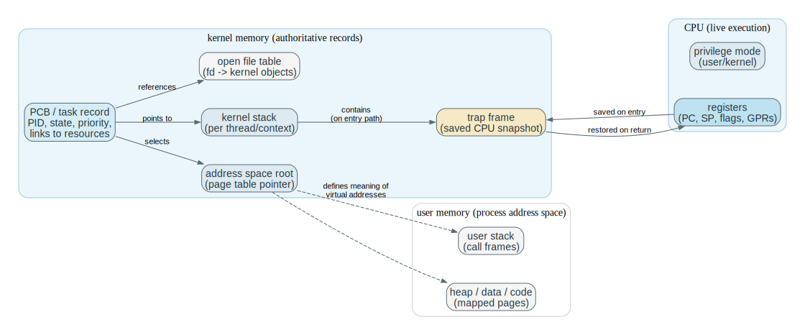
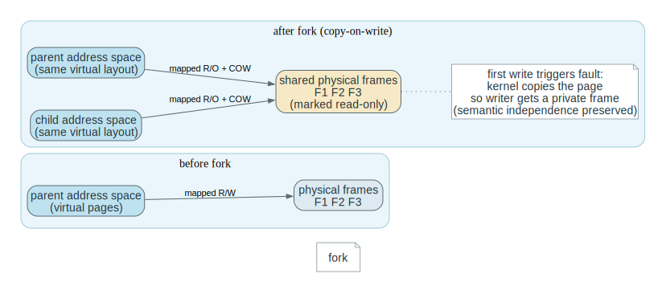
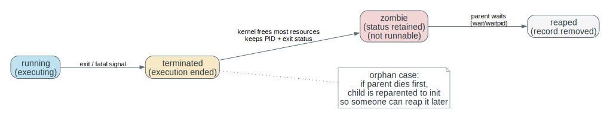
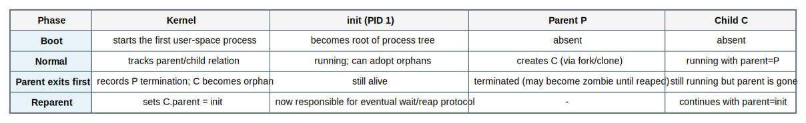
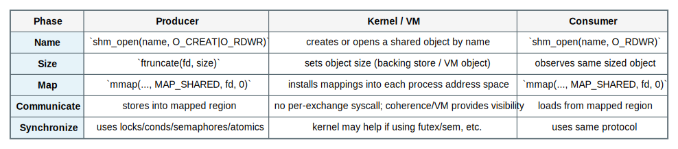
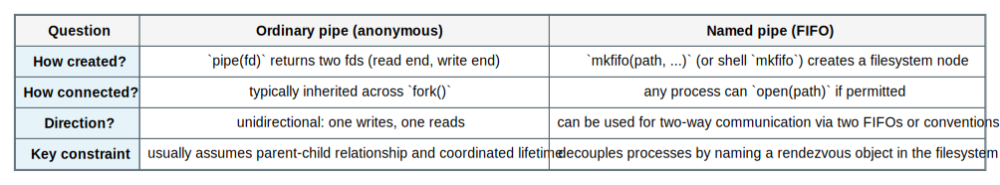
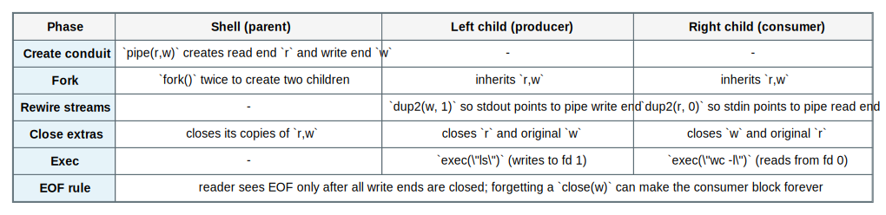
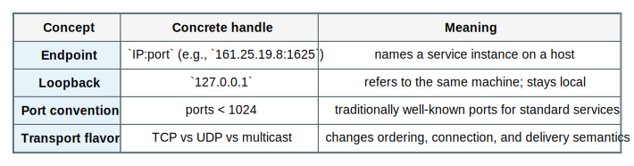

# Chapter 3 Processes Mastery

Source: Chapter 3 of `../../textbook.pdf` (Operating System Concepts, 9th ed.).

This file is the mastery note for Chapter 3.
It treats process management as kernel control over resumable computations rather than as a vocabulary list organized around UNIX examples.

If Chapter 1 established why the OS must control execution and Chapter 2 explained how programs reach the kernel, Chapter 3 explains how the kernel keeps many computations alive at once without losing track of state, ownership, or coordination.

## 1. What This File Optimizes For

The goal is not to memorize process vocabulary.
The goal is to be able to do the following without guessing:

- Explain what makes a process more than a program file.
- Explain why process states describe what the computation can do next, not what it did last.
- Explain why the PCB must exist if execution can be interrupted, blocked, or resumed.
- Trace a context switch as a save-decision-restore protocol with explicit kernel responsibilities.
- Trace creation and termination as lifecycle protocols (identity, inheritance, cleanup), not isolated API trivia.
- Explain why IPC is about preserving meaning, order, and progress, not just moving bytes.

For Chapter 3, mastery means:

- you can trace how a process is created, blocked, resumed, and cleaned up
- you can identify what state the kernel must preserve at each step
- you can explain which queues the scheduler cares about and why
- you can predict what breaks when lifecycle bookkeeping is missing
- you can connect the abstractions to scheduler code, sleep/wakeup paths, and IPC mechanisms in a real kernel

## 2. Mental Models To Know Cold

### 2.1 A Process Is Execution Plus Owned State

A program file is passive.
A process is the live execution of that program together with the machine state and kernel-managed resources that make the execution real.

### 2.2 Process State Means “What Can This Computation Do Next?”

`Ready`, `running`, `waiting`, and `terminated` are meaningful because they encode the process's current relationship to CPU service and future progress.

### 2.3 The PCB Is The Kernel’s Promise That Execution Can Resume

If a computation can be stopped and later continued, the kernel must have a durable record of identity, saved CPU context, scheduling metadata, and owned resources.

### 2.4 Scheduling Is Queue Selection Under Scarcity

The scheduler is a kernel mechanism for choosing which runnable process or thread receives CPU service next.
It operates over explicit queues while other work waits for device completion, timer expiration, or memory relief.

### 2.5 IPC Is Coordination, Not Just Data Transfer

IPC is the mechanism isolated processes use to exchange information and coordinate progress.
The difficult part is preserving ordering, ownership, meaning, and liveness across separate execution contexts.

## 3. Mastery Modules

### 3.1 A Process Is A Program In Execution Plus Owned State

**Problem**

The operating system must manage computations that are currently executing and owning resources, not just program files stored on disk.
A file on disk cannot tell the kernel which instruction is live, which registers hold state, or which resources are currently owned.

**Mechanism**

A `process` is a program in execution together with:

- the `program counter`
- CPU `registers`
- the `stack`
- the `data section`
- the `heap`
- open kernel-managed resources such as files or devices

This is why one program file can correspond to many different processes.
Each execution has different live state even when the code is identical.

**Invariants**

- A process is more than code; it includes execution state and owned resources.
- The program counter and registers must be treated as part of the process's live identity.
- Multiple processes may share program text while still being distinct computations.

**What Breaks If This Fails**

- If a process is treated as only a file, scheduling and resumption become conceptually impossible.
- If live resource ownership is ignored, cleanup and isolation lose meaning.
- If active state is confused with stored code, process creation and duplication become mysterious.

**Code Bridge**

- When reading a kernel's process descriptor, identify which fields belong to CPU state, memory state, and owned resources.

**Drills (With Answers)**

1. **Q:** Why can one executable file correspond to many processes?
**A:** The executable file is a template: code plus initial data. A process is an *instance* with its own live CPU context (PC/registers/stack), its own kernel identity (PID, scheduling state), and its own owned resources (open files, credentials, mappings). Many processes can map the same program text while remaining distinct computations because the instance state is what differentiates them.

2. **Q:** Why is the heap part of the process but not part of the program file in the same way?
**A:** The program file contains the initial image: code and static data. The heap is created and grown at runtime through allocation, demand paging, and mapping decisions, and its contents depend on the program’s execution history. The kernel must track the heap as part of the address space, but it is not a static artifact that exists “in the file” before execution.

3. **Q:** Why is a JVM process still a real process even though it hosts another runtime inside it?
**A:** Because the kernel still schedules and isolates the outer process, not the language runtime. The JVM is user-space code living inside one OS process; its threads and GC are ultimately implemented using OS threads, syscalls, and memory mappings. The presence of a runtime does not weaken the kernel’s role: the OS process remains the unit of protection, resource ownership, and kernel-resumable state.


### 3.2 Process States Describe What The Kernel Can Do Next

#### Why This Section Exists

Once you accept that a process is a resumable computation, you immediately face a practical question: at any given instant, what is the kernel allowed to do with it?

The kernel cannot simply "run everything." CPUs are scarce, devices complete asynchronously, and processes routinely reach moments where they *cannot* make progress even if you gave them a CPU (for example, waiting for a disk block, a network packet, a child to exit, or a lock to be released). If the kernel does not represent those moments explicitly, scheduling degenerates into guesswork: the OS will waste CPU time on processes that cannot advance, or it will lose track of who should be woken when an event occurs.

Process states exist to fill that exact gap. They are not labels for what happened in the past; they are a contract about *what can happen next* and therefore which kernel mechanisms apply: dispatch, preempt, block, wake, or clean up.

#### The Object Being Introduced (Eligibility For Service + A Waiting Condition)

The object is a **state classification** that the kernel uses to partition processes into sets with different rules.

What is fixed:

- The scheduler can only choose among work that is eligible to run now.
- Devices and timers generate events asynchronously; wakeups must be tied to those events.
- Cleanup must be done even though "the process" is no longer executing.

What varies:

- Whether the process is eligible for CPU service now.
- If it is not eligible, *what exact condition* must occur for it to become eligible again.

The state model is therefore inseparable from two concrete kernel structures:

- a **ready queue** (runnable set) for processes eligible to run, and
- one or more **wait queues** keyed by the event/resource being awaited (device completion, timer, lock, child exit).

If you keep only one sentence: "state" is the kernel's way of turning progress into queue membership plus a wakeup condition.

#### Formal Definitions (Ready, Running, Waiting, Terminated)

Definition (ready): A process is ready if it is eligible to run as soon as the scheduler chooses it. It is not currently executing, but if you restored its context onto a CPU, it would make progress immediately.

Definition (running): A process is running if its execution context is currently loaded on some CPU and it is consuming CPU cycles.

Definition (waiting / blocked): A process is waiting if it is not eligible for CPU service because it is waiting for an external event or resource. The key is that "waiting" implies a *specific wakeup condition* that the kernel can test and signal.

Definition (terminated): A process is terminated when its execution is over. Importantly, termination does not mean "instantly erased." The kernel may need to preserve minimal bookkeeping (exit status, accounting) until a parent or supervisor collects it.

#### Interpretation (State Is A Kernel Promise About Scheduling And Wakeup Semantics)

The distinction between ready and waiting is what makes multiprogramming real. A waiting process is removed from CPU competition so the scheduler can give the CPU to someone who can actually execute. Meanwhile the kernel must remember *where to resume* and *why resumption is currently illegal*. That "why" is not philosophical; it is the pointer to the queue or event structure that will wake the process later.

If you forget this, you will fall into the most damaging beginner intuition: "the CPU waits for the disk." The CPU never has to wait for the disk. A process waits, and the kernel chooses other runnable work. The whole point of the state model is to ensure that "waiting" becomes an actionable kernel fact.

#### Boundary Conditions / Assumptions / Failure Modes

Assumptions you should surface explicitly:

- A blocked process has a well-defined wakeup condition (interrupt completion, lock release, timer expiry, message arrival). If the kernel cannot name the condition, it cannot wake it reliably.
- State transitions must be synchronized with queue operations. A state field that says "waiting" is meaningless if the process is still on the run queue, and vice versa.

Failure modes (these show up later as deadlocks, missed signals, and performance cliffs):

- **lost wakeup**: the event occurs, but the process is not moved back to ready because queue membership and signaling got out of sync.
- **spurious runnable**: a blocked process remains runnable and is scheduled repeatedly, wasting CPU.
- **incorrect termination protocol**: the kernel frees state too early and the parent cannot observe the child’s exit status, or frees too late and process-table resources leak.

#### Fully Worked Example: Blocked On I/O Is Not "Inactive"

Consider a process that calls `read(fd, buf, 4096)` on a disk-backed file when the data is not in cache.

1. The process starts in `running` (it is executing).
2. It issues the syscall; the kernel validates arguments and initiates disk I/O.
3. The process cannot complete the syscall until the device finishes. The kernel therefore:
   - saves the process context (so it can resume),
   - records the wait condition (this disk request completion),
   - moves the process to `waiting`, and
   - dispatches some other `ready` process.
4. Later, the disk completes and interrupts the CPU. The interrupt handler records the completion and moves the blocked process from `waiting` to `ready`.
5. Eventually, the scheduler dispatches it again; it becomes `running` and returns from the syscall.

What you should notice is the invariant pattern: progress is regulated by queues and events, not by the CPU "pausing."

#### Misconceptions (Because They Produce Wrong Debugging Instincts)

Misconception 1: "`waiting` means the process is swapped out."

- Waiting is about CPU eligibility, not memory residency. A waiting process may be resident in RAM or not; swapping is a separate scarcity mechanism. Confusing them leads to wrong performance explanations ("it was slow because it was waiting") and wrong fixes.

Misconception 2: "`ready` means it will run soon."

- Ready means eligible, not guaranteed. Under load, ready time can be long due to scheduling policy, priority, and competition. This is why response time is a queueing problem, not just a CPU-speed problem.

Misconception 3: "State transitions are just bookkeeping."

- They are enforcement. If the kernel does not enforce the rule "waiting processes do not consume CPU," the entire multiprogramming story collapses.

#### Connection To Later Material

You will reuse this state-and-queue framing everywhere:

- CPU scheduling chapters refine how the ready set is ordered and selected.
- Threading chapters refine what the schedulable entity is (process vs thread) but keep the same ready/waiting logic.
- Synchronization chapters explain why locks create waiting states and how to avoid deadlocks.
- IPC chapters explain how message arrival becomes a wakeup event and how buffering changes waiting behavior.

#### Retain / Do Not Confuse

Retain: process state is defined by CPU eligibility and explicit wakeup conditions, not by historical narration.

Do not confuse: waiting (not runnable) with swapped out (not resident), or ready (eligible) with running (currently consuming CPU).

**Problem**

Once a process exists, it does not run continuously to completion.
The kernel must classify whether it can run now, later, or never again.

**Mechanism**

The classic states are:

- `new`
- `ready`
- `running`
- `waiting`
- `terminated`

These states are operational:

- `ready` means the process could run if given a CPU
- `running` means it is using a CPU now
- `waiting` means some event must occur before it can continue
- `terminated` means execution is over and cleanup is underway or complete

The scheduler and wakeup paths depend on these distinctions.

**Invariants**

- A ready process is eligible for CPU service now.
- A waiting process cannot make progress until an event occurs.
- A running process consumes CPU; a ready one does not.
- State transitions must reflect real causality such as dispatch, block, completion, or exit.

**What Breaks If This Fails**

- If waiting and ready are confused, the kernel wastes CPU on work that cannot progress.
- If running and ready are confused, scheduling decisions lose meaning.
- If termination is treated like just another waiting state, cleanup logic becomes inconsistent.

**One Trace: basic lifecycle under scheduler control**

Read this as a “what can happen next” trace.
Each transition corresponds to a kernel-recognized cause (dispatch, block, completion, exit), and the state label is only meaningful because it constrains what the scheduler and wakeup paths are allowed to do next.
When you cover the table, do not recite labels; recite the cause that justifies each transition and the invariant it preserves (no CPU time for blocked work, no progress without dispatch).

| Step | State | Cause |
| --- | --- | --- |
| creation | `new` | process admitted |
| dispatch | `ready -> running` | scheduler selects it |
| block | `running -> waiting` | I/O request or event wait |
| wakeup | `waiting -> ready` | event completes |
| exit | `running -> terminated` | execution ends |

This is a kernel contract, not a labeling scheme.
The state names matter only because they constrain what the OS is allowed to do next: who can be scheduled, who must wait, and which event can legally re-admit the process.
If you cannot name the event that will wake a waiting process, you do not yet have an operational process model.

**Code Bridge**

- In scheduler code, ask where the process state field changes and which event justifies each transition.

**Drills (With Answers)**

1. **Q:** Why is `ready` not just “almost running”?
**A:** `Ready` means “eligible to run if scheduled,” not “already running with a delay.” The distinction matters because only `running` consumes CPU now, while `ready` competes for CPU through the scheduler. Treating them as the same erases the meaning of dispatch and makes it impossible to reason about fairness, queueing, and response time.

2. **Q:** Why is `waiting` not the same thing as “inactive”?
**A:** `Waiting` has a specific wakeup condition: some event (I/O completion, lock release, timer) must occur before progress is possible. The kernel must remember *what* the process is waiting for and place it in the right wait structure; it is paused but not gone. “Inactive” is vague; `waiting` is operationally precise.

3. **Q:** Why do state transitions need causes rather than just labels?
**A:** Because the kernel’s invariants depend on causality. A process becomes `waiting` because it cannot proceed until an event occurs; it becomes `ready` because that event happened and the kernel recorded it. If you allow arbitrary relabeling, you can schedule blocked work, lose wakeups, or clean up live processes, all of which are correctness failures.


### 3.3 The PCB Is The Kernel’s Authoritative Record

#### Why This Section Exists

Process state labels only become real if the kernel has somewhere trustworthy to store the facts that make a process resumable: where it will resume (PC), what it will resume with (registers), what memory layout gives addresses meaning (page table root / address space), and what resources it owns (open files, credentials, pending signals).

Those facts cannot live only "in the process," because the process is precisely the thing that might be stopped, blocked, or even malicious. The kernel needs a protected, durable record that (1) survives preemption and blocking, (2) can be safely read and updated by the scheduler and other kernel subsystems, and (3) cannot be forged by user code.

That record is the PCB (or, in many real kernels, a closely related family of task/thread structures). This section exists because without a PCB-level mental model, context switches and lifecycle protocols become magic.

#### The Object Being Introduced (Kernel-Resident Records That Index Execution)

The object is a **kernel-resident descriptor** that binds together three worlds:

- the CPU world: the saved execution context that can be restored,
- the memory world: the address-space mapping that gives the context meaning,
- and the resource world: the kernel objects the process is allowed to use.

What is fixed:

- The kernel must be able to find and restore an execution context without trusting user memory.
- The kernel must be able to account and enforce policy using these records (scheduling, limits, credentials).

What varies:

- The specific fields and names across OS implementations.
- Whether the OS splits process vs thread state into separate structures (common) or combines them (also common in teaching kernels).

#### Formal Definitions (PCB, Trap Frame, Kernel Stack)

Definition (PCB): The process control block is the kernel’s authoritative record for a process, storing identity, state, pointers to memory-management structures, scheduling metadata, and references to owned resources.

Definition (trap frame): The saved CPU register snapshot created on a trap/interrupt/syscall entry so the kernel can later return to the interrupted context correctly. In many kernels, the trap frame lives on the kernel stack of the current thread/process.

Definition (kernel stack): A privileged stack used while executing kernel code on behalf of a process/thread. It is separate from the user stack, because kernel code must remain runnable even when user memory is invalid or untrusted.

The important interpretation is that "PCB contains everything" is an oversimplification. A PCB is often an index: it points to the trap frame and kernel stack, points to the address-space root, and points to tables of resources. But the PCB is the anchor that keeps those pieces coherent.



#### Boundary Conditions / Assumptions / Failure Modes

Assumptions:

- The PCB and related scheduler structures live in kernel memory and are protected from user writes. If user code can forge PCB fields, protection collapses.
- Context-save/restore protocols are correct with respect to the CPU ABI and interrupt/trap entry rules. If you save the wrong set, restore returns to nonsense.

Failure modes:

- Save/restore bugs produce corruption that is timing-sensitive: it may appear only under interrupts or heavy switching.
- Resource bookkeeping bugs leak kernel objects (file descriptors, VM mappings) or create use-after-free when a PID/descriptor is reused.
- If exit cleanup races with a parent `wait`, you get zombies that never clear or status that disappears.

#### Fully Worked Example: Timer Preemption Uses PCB + Trap Frame Together

Consider a running process A that is preempted by a timer interrupt.

1. The timer interrupt occurs asynchronously. Hardware transfers control to the kernel and pushes/saves a register snapshot (exact details depend on the ISA).
2. The kernel entry path completes the saving protocol, producing a trap frame that is now the authoritative snapshot of A’s interrupted user context.
3. The kernel updates A’s PCB fields: it records state transition (`running -> ready`), accounts CPU time, and enqueues A on the ready queue.
4. The scheduler chooses a different runnable process B. The kernel switches "current" pointers to B’s PCB/thread record and loads B’s saved context.
5. The kernel returns from interrupt/trap using B’s trap frame, restoring registers and resuming B’s user-mode instruction stream.

Notice the division of labor: the trap frame is the raw CPU snapshot; the PCB is the durable kernel record that ties that snapshot to queues, memory mappings, and resources.

#### Misconceptions

Misconception 1: "The PCB is just for the scheduler."

- The PCB is shared infrastructure. The scheduler cares about run-queue membership and priorities, but the memory manager cares about the address-space pointer, the signal subsystem cares about pending signals, and the file subsystem cares about open-file tables. The PCB is the rendezvous point for kernel subsystems that must coordinate around one process identity.

Misconception 2: "User space could store its own context, so PCBs are optional."

- User space can store some logical state, but it cannot store the privileged facts that make resumption safe: mode bits, validated mappings, kernel object references, and unforgeable credentials. The kernel must store those.

#### Connection To Later Material

PCB reasoning is the backbone of:

- CPU scheduling (what fields the scheduler reads/writes, how queue membership is represented),
- threading (splitting process vs per-thread execution records),
- signals and cancellation (how asynchronous events attach to a target execution context),
- and IPC (how blocked state is represented and what wakeups mutate).

#### Retain / Do Not Confuse

Retain: the PCB is the kernel’s authoritative anchor for a process identity across interruption, blocking, and cleanup.

Do not confuse: the raw saved register snapshot (trap frame) with the higher-level kernel record (PCB) that ties it to scheduling and resources.

**Problem**

If a process can be interrupted, blocked, preempted, or resumed, the kernel needs durable bookkeeping that survives those transitions.

**Mechanism**

The `process control block (PCB)` stores the information needed to treat the process as a resumable execution entity.
That typically includes:

- process identity
- saved execution state
- scheduling metadata
- memory-management information
- I/O and resource metadata

The exact field names differ by OS, but the role stays constant:
the PCB is where the kernel remembers enough to resume or clean up the process correctly.

**Invariants**

- Saved execution state must be sufficient for correct resumption.
- Scheduling metadata must allow the process to be placed in the right queues.
- Resource metadata must remain consistent with what the process actually owns or references.
- The PCB is authoritative; it cannot be replaced by vague assumptions about “the running program.”

**What Breaks If This Fails**

- Without saved context, resumption is incorrect.
- Without scheduling metadata, dispatch decisions become disconnected from process reality.
- Without resource metadata, cleanup and protection break.

**Code Bridge**

- In Linux-like code, ask how identity, saved CPU context, run-queue membership, and open-resource state are represented in the task structure.

**Drills (With Answers)**

1. **Q:** Why is the PCB not just optional bookkeeping?
**A:** Because preemption and blocking make execution discontinuous. If the kernel can stop a computation and later resume it, the kernel must have an authoritative record that survives the stop. The PCB is that record: it is the kernel’s representation of the process as a resumable entity, and without it the OS cannot safely schedule, block, wake, or clean up processes.

2. **Q:** What is the minimum information a PCB must preserve for resumption?
**A:** Enough architectural and kernel state to continue the same instruction stream correctly: saved CPU context (PC, SP, registers, status flags), identity (PID), and the address-space handle (page table pointer or equivalent). In practice it also includes kernel stack/context, scheduling metadata (state, priority, run-queue links), and pointers to the process’s owned resources so invariants remain consistent after resumption.

3. **Q:** Why is resource metadata part of the PCB story instead of only CPU state?
**A:** Because a process is a resource-owning contract, not only a CPU snapshot. Open files, memory mappings, IPC endpoints, credentials, and pending signals determine what the computation is allowed to do and what it is waiting on. If you only save registers, you can “resume” into a world where ownership and protection are wrong, which breaks isolation and cleanup.

### 3.4 Threads Refine The Process Model Rather Than Replacing It

**Problem**

Modern systems often need multiple execution paths inside one application without duplicating every process-level resource.

**Mechanism**

A `thread` is an execution path inside a process.
The process remains the larger resource-owning container:

- address space
- open files
- other process-level kernel resources

Threads share those process-level resources while keeping distinct execution states.

The process/thread distinction is a distinction between two kernel responsibilities:

- the process owns the address space and protection boundary
- the thread carries one schedulable control flow through that boundary

**Invariants**

- Process and thread are not interchangeable abstractions.
- Threads inside one process share the process container.
- Distinct execution paths still require distinct execution state.

**What Breaks If This Fails**

- If threads are confused with processes, resource sharing and isolation logic become muddled.
- If process ownership is ignored, “lighter weight” execution is explained badly.
- If execution path and resource container are fused conceptually, later concurrency discussions become harder.

**Code Bridge**

- In thread-aware kernels or runtimes, ask which state belongs per-thread and which remains process-wide.

**Drills (With Answers)**

1. **Q:** Why is a thread cheaper than a full process in many systems?
**A:** Threads share the process container: address space, open files, and other resources are not duplicated. Creating and switching threads often avoids the heaviest costs of process creation (new address space, large metadata, full isolation setup) and can reduce context-switch cost (less MMU/TLB churn). The trade is that sharing increases coordination burden and failure coupling inside the process.

2. **Q:** Why does shared address space not make two threads the same execution path?
**A:** Because “execution path” is defined by control state, not only by memory. Each thread has its own PC/register set and its own stack, and the scheduler can run them independently, at different points in the code, or simultaneously on different cores. Shared memory is shared *ownership*, not shared *control flow*.

3. **Q:** Why does the process still matter after threads are introduced?
**A:** The process remains the unit of protection and resource ownership: it defines what memory is accessible, which files are open, and what privileges apply. Threads are schedulable execution contexts living inside that container. Without the process abstraction, you cannot explain isolation boundaries, address-space management, or why threads can corrupt each other’s invariants by racing on shared state.

### 3.5 Queues And Schedulers Exist Because Processes Compete For Service

**Problem**

The CPU and devices are scarce.
The kernel therefore needs explicit waiting structures and selection logic.

**Mechanism**

Processes may appear in structures such as:

- the `job queue`
- the `ready queue`
- device-specific wait queues
- swap-related holding structures when memory pressure matters

The `short-term scheduler` chooses among ready processes.
The `long-term scheduler` influences how many processes are admitted into active competition.
The `medium-term scheduler` can reduce pressure by swapping processes out and back in.

These structures exist because the kernel must represent different scarcity conditions explicitly: CPU scarcity in the ready queue, device scarcity in wait queues, and memory scarcity in swap-related structures.

**Invariants**

- Ready work and blocked work must remain distinct.
- Device waits belong in event- or device-specific queues, not the ready queue.
- Long-term admission affects the degree of multiprogramming.
- Scheduler choice must operate on a truthful representation of who can run now.

**What Breaks If This Fails**

- If everything is thrown into one queue, scheduling loses semantic meaning.
- If the ready queue contains blocked processes, CPU time is wasted.
- If admission pressure is ignored, memory and responsiveness can both degrade.

**One Trace: queue movement under normal operation**

This trace is about the operational meaning of “state.”
Queue membership is not bookkeeping trivia; it encodes which scarcity the process is currently subject to (CPU scarcity in the ready queue, device scarcity in a wait queue, memory scarcity when swapped).
When you cover the table, say why each move is allowed: dispatch consumes CPU service, block records a wait condition, completion re-admits runnable work, and swapping changes who competes under memory pressure.

| Step | Queue / State Change | Meaning |
| --- | --- | --- |
| process admitted | enters job set then ready queue | now eligible for future CPU service |
| dispatched | leaves ready queue, becomes running | CPU assigned |
| blocks on I/O | enters device wait queue | cannot use CPU productively now |
| I/O completes | leaves device wait queue, reenters ready queue | runnable again |
| swapped out under pressure | leaves active competition temporarily | memory pressure managed |

Notice that the table is really “scarcity -> bookkeeping.”
CPU scarcity is encoded by ready/running; device scarcity by wait queues; memory scarcity by swap pressure mechanisms.
Good OS structure keeps these meanings separated so one bottleneck does not destroy the semantics of scheduling and wakeup.

**Code Bridge**

- In scheduler code, identify which queue corresponds to which kind of scarcity: CPU, device, or memory.

**Drills (With Answers)**

1. **Q:** Why is a queue not just an implementation detail but part of the process model?
**A:** Because queue membership is how the kernel represents *what kind of progress is possible*. A ready queue means “eligible for CPU service now”; a device wait queue means “cannot progress until this event fires”; a swap structure means “not currently competing due to memory pressure.” If you treat queues as implementation detail, you lose the semantics that make scheduling, wakeups, and fairness explainable.

2. **Q:** Why does the long-term scheduler change system behavior even though it runs infrequently?
**A:** Admission controls the degree of multiprogramming: how many processes are actively competing for RAM and CPU. Even rare decisions change the system’s steady-state mix, which affects paging pressure, cache behavior, throughput, and interactive latency. A “too many admitted” system can thrash even if short-term scheduling is perfect.

3. **Q:** Why is a healthy process mix important for overall utilization?
**A:** Because different processes stress different resources. A mix of CPU-bound and I/O-bound work lets the OS overlap CPU execution with device latency instead of leaving one resource idle. If all work blocks on the same scarce device, the CPU can go idle; if all work is CPU-bound, devices can be underutilized and interactive response can degrade.


### 3.6 Context Switching Is Save, Decision, And Restore

#### Why This Section Exists

The process model is only real if the kernel can *actually* stop one computation and later resume it exactly, potentially after running many other computations in between. Context switching is the mechanism that makes that promise true.

This section exists because "the scheduler chooses who runs next" is not yet an operational statement. A choice is not a physical event. It becomes physical only when the kernel performs a save-decision-restore protocol that changes what registers, stack pointer, and address-space mapping are live on the CPU. If you cannot narrate that protocol, you will not be able to reason about preemption, blocking syscalls, or later synchronization behavior under interrupts.

#### The Object Being Introduced (A Protocol With Explicit Responsibilities)

Treat a context switch as a protocol with responsibilities, not as one magical instruction.

What is fixed:

- The CPU can execute only one instruction stream at a time per core.
- Traps/interrupts create controlled kernel entry points.
- The kernel is responsible for preserving resumability and enforcing scheduling rules.

What varies:

- Which event triggered the switch (timer interrupt, I/O block, yield, higher-priority wakeup).
- Whether the switch also changes the address space (process switch) or keeps it (thread switch inside one process, later).

What conclusions it licenses:

- You can explain why "blocking" is compatible with CPU utilization: the blocked entity is saved and removed from the runnable set, and a different entity is restored.
- You can explain why context switching has overhead (and why too much preemption can reduce throughput).

#### Formal Definition (Context Switch As State Transfer)

Definition (context switch): A kernel-mediated transfer of CPU execution from one schedulable entity to another, consisting of:

1. saving enough outgoing CPU state into kernel-owned storage so the entity is resumable,
2. updating kernel scheduling/bookkeeping state to reflect the outgoing entity's new status,
3. selecting an incoming runnable entity according to scheduling policy, and
4. restoring the incoming entity's saved state (and associated memory mapping) so it becomes live on the CPU.

#### Interpretation (The Switch Is Where "Policy" Touches Hardware)

Scheduling policy lives in decision rules: priorities, fairness, deadlines, affinity. Context switching is where those rules become physical reality. The kernel turns "B should run next" into:

- B's registers and stack pointer are loaded,
- B's address space is installed (if needed),
- and the CPU returns to user mode at B's program counter.

This is why context-switch code is among the most delicate code in an OS: it is where abstract policy turns into concrete machine state.

#### Boundary Conditions / Assumptions / Failure Modes

Assumptions:

- The saved state is complete with respect to the ABI and trap entry/exit protocol.
- The kernel updates queue membership and state atomically with respect to interrupts (and later, with respect to other CPUs).

Failure modes:

- partial saves produce corruption that is hard to reproduce (depends on timing and which registers were live).
- state/queue mismatches produce lost wakeups or duplicated runnable entities.
- excessive switching produces performance collapse: even if "fair," the system spends too much time switching and too little time executing useful instructions.

#### Fully Worked Example: Blocking Syscall Switches For A Different Reason Than Timer Preemption

Compare two switches:

Timer preemption:

1. A is running; timer fires.
2. Kernel saves A, requeues it as ready.
3. Scheduler chooses B.
4. Kernel restores B and returns to user mode.

Blocking syscall:

1. A is running; A issues `read()` and the data is not ready.
2. Kernel saves A, but does **not** requeue it as ready. Instead it enqueues A on a wait queue associated with the I/O completion event and marks it waiting.
3. Scheduler chooses B from the ready queue.
4. Kernel restores B and returns to user mode.

The structural difference is the state transition. In preemption, A remains runnable; in blocking, A becomes non-runnable until a wakeup event occurs.

#### Misconceptions

Misconception 1: "A context switch always means a different process."

- Not necessarily. It can be a switch between threads inside the same process (later). The common part is saving/restoring execution context; whether the address space changes is a separate axis.

Misconception 2: "The scheduler is the switch."

- The scheduler chooses; the context switch makes that choice real. Conflating them hides where correctness obligations live (save/restore) versus where policy lives (choose).

#### Connection To Later Material

Context switching is the mechanical substrate for:

- CPU scheduling policies (the decision that triggers which restore),
- synchronization and preemption safety (what must be atomic around queue operations),
- and thread models (user threads vs kernel threads change what entities can be switched independently).

#### Retain / Do Not Confuse

Retain: switching is a protocol: save -> update state/queues -> choose -> restore.

Do not confuse: timer preemption (runnable -> runnable) with blocking (runnable -> waiting).

**Problem**

The OS must stop one computation and later resume either the same one or a different one without corrupting execution.

**Mechanism**

A `context switch` saves the outgoing process state and restores the incoming process state.
It is triggered by events such as:

- timer interrupts
- blocking I/O
- explicit yield or sleep
- wakeup and scheduler choice

The scheduler's decision only becomes real because the context switch changes which process state is live on the CPU.

Context-switch cost is kernel overhead because the switch preserves resumability and fairness rather than advancing the user program's instruction stream directly.

**Invariants**

- Outgoing state must be saved before it is overwritten.
- Incoming state must be restored consistently.
- The scheduler must choose among runnable work, not arbitrary work.
- Switching too frequently can trade responsiveness for excessive overhead.

**What Breaks If This Fails**

- Without correct saves, resumed execution is corrupted.
- Without correct restore, the wrong computation continues.
- Without a scheduler decision between save and restore, switching is meaningless.
- Without overhead awareness, fairness improvements can become performance regressions.

**One Trace: timer-driven preemption**

This is the minimal save-decision-restore loop that makes time sharing real.
The timer interrupt creates a forced kernel entry, then the kernel must (1) save enough state to resume A, (2) decide which runnable context is next, and (3) restore B so the decision becomes real.
When you rehearse it, explicitly name where the saved state lives (PCB / kernel stack) and why “choose” must occur between save and restore.

| Step | Running Process | Kernel / Scheduler | Result |
| --- | --- | --- | --- |
| slice active | process A uses CPU | timer counts down | A makes progress |
| timeout | A is interrupted | kernel regains control | preemption point reached |
| save | A stops running | A's context stored in PCB | A becomes resumable |
| choose | scheduler selects B | runnable set examined | next process chosen |
| restore | B's state loaded | kernel returns to user mode | B becomes running |

The correctness pressure here is atomicity: saving state, changing queues/state, and restoring the next context must be consistent even under interrupts and (in later chapters) multiple CPUs.
Context-switch code is small and tightly structured because it is the point where scheduling policy becomes machine state: the kernel must translate "B should run next" into B's registers, stack, and address space becoming live on the CPU.

**Code Bridge**

- In a teaching kernel, inspect the timer interrupt path and the scheduler handoff to see where save, decision, and restore each occur.

**Drills (With Answers)**

1. **Q:** Why is a context switch not itself useful work for the user computation?
**A:** Because it does not advance the user program’s instruction stream; it preserves and transfers control so *someone* can run. Saving and restoring registers, updating kernel bookkeeping, and switching stacks are overhead paid to create the illusion of concurrent progress and to enforce fairness and responsiveness. You do it to share the machine, not to compute the program’s output.

2. **Q:** What exact state must survive preemption?
**A:** The architectural CPU context needed to resume correctly: PC, SP, general registers, and status/flags (often plus FP/SIMD state). The kernel must also preserve the identity and execution container mapping: which address space to restore (page table pointer) and the kernel bookkeeping that makes the thread schedulable (state, priority, run-queue links, kernel stack). “Saved registers only” is not enough if the restored mapping and identity are wrong.

3. **Q:** Why does timer-driven preemption require both interrupt logic and scheduler logic?
**A:** Interrupt logic provides the forced entry that regains control even if the process never yields. Scheduler logic decides which runnable work should run next. Without interrupts, you cannot enforce preemption; without scheduling, you can preempt but you cannot choose a correct next owner of the CPU (or maintain fairness and responsiveness).


### 3.7 Process Creation Is Controlled Duplication And Divergence

#### Why This Section Exists

Once you understand that a process is the kernel's unit of execution and ownership, "creation" becomes one of the most load-bearing mechanisms in the OS. Creation is where the kernel mints a new identity that will compete for CPU/memory/I/O, inherits (or does not inherit) access to resources, and must later be cleaned up without leaks.

This section exists because process creation is frequently taught as API trivia (`fork`, `exec`, `spawn`) when the real intellectual content is the protocol:

- identity allocation (PID + kernel records),
- inheritance rules (what carries over),
- divergence (how parent and child do different work),
- and efficiency (how creation can be cheap enough to use constantly in shells and servers).

Lecture 2's `fork`/`exec` split is the canonical way to see that "create a container" and "choose a program image" are different problems. Even on systems that offer a one-shot `spawn`, the same conceptual separation exists internally.

#### The Object Being Introduced (Lifecycle Protocol: Identity + Inheritance + Divergence)

The object here is a **creation protocol** that preserves invariants across multiple subsystems:

- scheduling: insert a new runnable entity without duplicating or losing bookkeeping,
- memory: create an address-space image that is coherent and protected,
- files: define what file descriptors and open-file descriptions are shared or duplicated,
- security: ensure the child does not accidentally inherit more authority than intended,
- cleanup: ensure every allocated object is reclaimed at termination.

What varies is the *policy* of inheritance and the *API* exposed to user space; what stays fixed is that the kernel must implement the protocol safely.

#### Formal Definitions (fork, exec, Copy-on-Write)

Definition (fork-style creation): A primitive that creates a child process whose initial execution context is a near-copy of the parent, differing in identity (PID) and return value. Divergence happens through control flow.

Definition (exec-style replacement): A primitive that replaces the current process's program image (code/data/stack layout and entry point) while preserving the process identity and selected inherited resources.

Definition (copy-on-write, COW): An optimization where parent and child initially share physical pages marked read-only; on the first write to a shared page, the kernel copies the page so the writer receives a private copy. The logical model is "copied address spaces"; the physical model is "shared until written."



#### Interpretation (Why Creation Is Harder Than "Run Another Program")

Creation is not "start executing some code." It is the act of creating a new execution container whose future syscalls, faults, scheduling decisions, and resource usage will be meaningful. That requires the kernel to tie together:

- a new identity (PID + PCB/task record),
- a consistent initial CPU context (where does the child begin executing?),
- an address-space mapping (what do addresses mean for this new computation?),
- and a controlled set of inherited kernel object references (files, pipes, credentials).

If you translate `fork` to "copy memory," you will miss the most important parts: kernel object inheritance rules and the existence of shared-but-mutable objects (like open-file descriptions).

#### Boundary Conditions / Assumptions / Failure Modes

Assumptions:

- The kernel can allocate and initialize a new process record under concurrency without corrupting global structures.
- Inheritance rules are explicit and enforced (close-on-exec flags, credential changes).

Failure modes:

- Incorrect inheritance can leak authority (child inherits privileged descriptors or credentials).
- Incorrect sharing semantics can cause surprising interference (shared file offsets, shared working directories).
- Over-eager deep copying can make creation too expensive; this is why COW and spawn-style APIs exist.

#### Fully Worked Example: File-Descriptor Inheritance Is About Kernel Objects, Not Integers

Suppose the parent opens a file and then forks:

1. Parent calls `open("data.log")` and receives fd=3.
2. Parent calls `fork()`.

At the user level, both processes now have an integer 3. The kernel question is what object that integer names.

In many Unix designs:

- the parent has a per-process fd table mapping `3 -> (pointer to an open-file description)`,
- `fork` duplicates the fd table entries so the child also has `3 -> same open-file description object`.

That open-file description often includes a current file offset. If it is shared, parent and child writes advance a shared offset and therefore interleave unless coordinated. This is why "inheritance" is not a casual feature; it is a semantic choice that affects ordering and correctness.

#### Misconceptions

Misconception 1: "`exec` creates a new process."

- `exec` replaces the program image inside an existing process identity. PID often stays the same; the "container" persists while its contents change.

Misconception 2: "`fork` always duplicates everything immediately."

- The logical model is "two independent processes," but the kernel can implement that with sharing (COW) and with shared kernel objects. Independence is a semantic guarantee, not an instruction that bytes must be copied now.

#### Connection To Later Material

Creation is the foundation for:

- shells and pipelines (inherit pipes, then `exec` into stages),
- server models (prefork vs thread pools),
- scheduling and accounting (new entities enter queues and resource limits),
- and security (least privilege via controlled inheritance).

#### Retain / Do Not Confuse

Retain: creation mints identity and initial bindings; divergence is a separate step (often via `exec` or control flow).

Do not confuse: copying an address space (semantic) with copying all bytes immediately (implementation).

**Problem**

Processes must be created dynamically, but creation raises questions of identity, inheritance, and independence.

**Mechanism**

When a parent creates a child, the OS must decide:

- what identity the child gets
- what resources are inherited
- whether parent and child continue concurrently
- whether the child starts as a copy of the parent image or quickly diverges to a new one

UNIX expresses this structurally with `fork()` and `exec()`:

- `fork()` duplicates the process image
- `exec()` replaces the current program image

The conceptual point is that process creation and program-image replacement are separate kernel actions, regardless of the exact API names a system uses.

**Invariants**

- Creation is not just “run another program”; it creates a new execution container.
- Parent-child ancestry and shared future behavior are not the same thing.
- Resource inheritance must be controlled or isolation becomes weak.
- Image duplication and image replacement are distinct lifecycle steps.

**What Breaks If This Fails**

- If creation and image replacement are fused conceptually, `fork/exec` becomes hard to reason about.
- If inheritance is uncontrolled, resource ownership and predictability degrade.
- If ancestry is confused with identity, process trees stop making sense.

**One Trace: fork then exec style divergence**

This trace exists to separate “new identity” from “new program image.”
`fork` (conceptually) creates a new execution container with inherited context and resources, while `exec` replaces the address-space image so the child can become a different program.
When you cover the table, force yourself to say: which aspects are inherited (files/credentials by default) and which aspect changes at `exec` (the code/data image and entry point).

| Step | Parent | Child | Kernel Meaning |
| --- | --- | --- | --- |
| before creation | running existing image | absent | one execution context exists |
| creation request | asks for child | created with inherited state | new process identity allocated |
| post-fork | continues or waits | starts as copy-like execution image | ancestry established |
| exec | may remain unchanged | image replaced | child diverges into new program |

The practical payoff is that user-space tools (shells, servers) can build pipelines by controlling inheritance (open files, pipes, credentials) and then selecting the program image via `exec`.
The kernel exports the container and replacement mechanism; user space owns the orchestration policy.

**Code Bridge**

- Inspect where the kernel copies process metadata, where it duplicates or references resources, and where `exec` replaces the address-space image.

**Drills (With Answers)**

1. **Q:** Why are `fork()` and `exec()` structurally different actions?
**A:** `fork` is about creating a new identity and execution container: a new PID, new schedulable entity, and inherited resource bindings. `exec` is about replacing the program image inside an existing container: new code/data, new entry point, potentially new address-space layout. Separating them makes the model compositional: “create a process” and “choose what it runs” are different problems.

2. **Q:** Why is parent-child ancestry not the same thing as sharing a future program image?
**A:** Ancestry is the creation relationship: who created whom, and therefore who can `wait` for whom and who inherits what initially. The future program image is a runtime choice: after `exec`, the child may run a completely different program than the parent. Confusing these leads to wrong assumptions like “child runs parent’s code forever,” which breaks reasoning about shells, pipelines, and servers.

3. **Q:** What resource decisions must the OS make during process creation?
**A:** Which open files and descriptors are inherited (and which are marked close-on-exec), what credentials/identity are inherited, what memory mappings are duplicated or shared (copy-on-write vs deep copy), what scheduling attributes apply, and how parent/child relationships are recorded. These decisions define both correctness (what the child can access) and performance (how expensive “duplication” actually is).


### 3.8 Termination, Wait, Zombies, And Orphans

#### Why This Section Exists

"Process termination" sounds like an instantaneous event: the program ends, the process disappears. In real kernels, termination is a protocol because other processes may need to learn the outcome (exit status), resources must be reclaimed in a safe order, and parent/child relationships create obligations (who is allowed to wait for whom).

This section exists to prevent two common confusions that break later reasoning:

- mistaking a *terminated computation* for a *deleted kernel record*, and
- treating parent/child relations as narrative trivia rather than as a cleanup protocol that preserves kernel invariants and avoids leaks.

#### The Object Being Introduced (A Two-Phase Death: Execution Ends, Bookkeeping Persists)

The object here is the **termination protocol**.

What is fixed:

- The kernel must reclaim resources (address space mappings, open descriptors, kernel objects).
- The kernel must preserve the child's exit status long enough for an authorized observer (parent) to collect it.

What varies:

- which resources are reclaimed immediately versus deferred,
- which process becomes responsible when the original parent disappears (reparenting).

The key interpretive move is to separate:

1. the *end of execution* (no more instructions will run), from
2. the *end of existence as a kernel-recorded identity* (PCB entry fully removed).

The gap between (1) and (2) is exactly what "zombie" names.

#### Formal Definitions (Exit Status, Zombie, Orphan, Reparenting)

Definition (exit status): A small result code recorded by the kernel that summarizes why the process ended (normal exit code, killed by signal, etc.).

Definition (zombie): A process that has finished executing but still has a kernel record retained solely so the parent can collect its exit status and accounting. A zombie is not runnable and does not hold an address space like a live process, but it occupies a slot/entry in process bookkeeping.

Definition (orphan): A process whose parent has terminated before it did. Orphans still execute normally; the "orphan" property is about cleanup responsibility, not about whether the process is alive.

Definition (reparenting): The kernel operation that assigns an orphaned process a new parent (often `init`/PID 1) so that there is always a live process that can eventually perform the wait/cleanup handshake.



#### Interpretation (Why Zombies Are Not A Bug)

Zombies exist because "parent observes child outcome" is a real semantic promise. If the kernel deleted all traces immediately at `exit`, the parent would have no reliable way to learn whether the child succeeded, failed, or crashed. So the kernel keeps minimal identity + status until the parent executes `wait` (or equivalent) to acknowledge it.

This is the OS version of a handshake: the child reports "I'm done" and the parent eventually acknowledges "I have received your status," after which the kernel can reclaim the final record.

#### Boundary Conditions / Assumptions / Failure Modes

Assumptions:

- Only authorized parents (or supervisors) may collect a child's status; otherwise status becomes an information leak.
- The kernel must prevent PID reuse from confusing observers (a late `wait` must not collect status from a different process that reused the PID).

Failure modes:

- If parents never `wait`, zombies accumulate and exhaust process-table resources (leak of identities/bookkeeping).
- If the kernel deletes status too early, parents lose correctness (cannot determine child result).
- If reparenting is absent, orphans can become uncollectable, causing leaks or broken semantics.

#### Fully Worked Example: Zombie Lifecycle As A Wait-Handshaking Problem

1. Child calls `exit(0)` (or crashes).
2. Kernel marks child as terminated, reclaims most resources (address space, many kernel objects), but retains:
   - PID and minimal process record,
   - exit status and accounting.
3. Child is now a zombie: not runnable, but still present as a kernel record.
4. Parent later calls `waitpid(child_pid, &status, ...)`.
5. Kernel copies out the exit status to the parent and then removes the final zombie record. Only now is the identity fully reclaimed.

The general lesson is: zombies are a consequence of a *useful contract* (observable child outcome), and the cure is not "delete zombies" but "complete the wait handshake."

#### Misconceptions

Misconception 1: "A zombie is a running process consuming CPU."

- A zombie is not runnable. It is a bookkeeping entry waiting for the parent’s acknowledgment.

Misconception 2: "An orphan is dead."

- An orphan is alive; it has simply lost its original parent. It continues executing and will still exit normally later.

Misconception 3: "Reparenting is optional sugar."

- Reparenting is the kernel guaranteeing that cleanup responsibility is always assigned so process-table resources do not leak permanently.

#### Connection To Later Material

Termination protocol details matter later for:

- shells and job control (`wait` semantics, pipelines),
- threading (what it means for one thread to exit vs the whole process to exit),
- and security (who can observe process outcomes and when).

#### Retain / Do Not Confuse

Retain: termination is a protocol; zombies are a deliberate interim state for status collection; orphans are reparented to preserve cleanup.

Do not confuse: "no longer executing" with "no longer represented in kernel bookkeeping."

**Problem**

Ending execution is not the same thing as instantly deleting every trace of the process.

**Mechanism**

Termination is a protocol:

1. execution ends
2. the process reports status, often through `exit`
3. some resources are reclaimed
4. the parent may later collect status with `wait`
5. final bookkeeping is removed

A `zombie` is a terminated process whose final status has not yet been collected.
An `orphan` is a child whose original parent has disappeared first.
On UNIX-like systems, orphans are typically reparented so someone can still collect status later.

Concretely, this “someone” is usually `init` (PID 1):
the kernel creates `init` at boot time, and it sits at the root of the process tree.
When a parent dies before its child, the kernel reassigns the child’s parent pointer to `init` so there is always a live process responsible for eventual status collection and cleanup protocol completion.

**Invariants**

- Exit status may need to outlive execution itself.
- Parent-child relationships matter to cleanup.
- A zombie is not still computing; it is lingering bookkeeping.
- An orphan is not necessarily dead; it has only lost its original parent.

**What Breaks If This Fails**

- If exit status vanishes too early, parents cannot observe child outcome correctly.
- If dead entries never clear, process-table resources leak.
- If orphan handling is absent, cleanup responsibility becomes ambiguous.

**One Trace: exit to final cleanup**

Termination is a lifecycle protocol, not an instant erase.
The key structural reason for the “zombie” phase is that the parent may need to observe outcome (exit status, resource usage) after the child has already stopped executing.
When you cover the table, identify what remains after exit (a small kernel record) and what must already be gone (CPU execution, most resources).

| Step | Process State | Kernel Meaning |
| --- | --- | --- |
| execution ends | child stops running | status becomes final |
| zombie phase | not executing, table entry retained | parent may still collect outcome |
| parent waits | status retrieved | final cleanup authorized |
| removal | table entry deleted | lifecycle complete |

This is why zombies consume process-table space despite doing no computation: the kernel is preserving observability, not execution.
The final deletion boundary is `wait`, which turns process cleanup into an explicit, ordered protocol step instead of an implicit side effect of “stopping.”

**Code Bridge**

- Look for where exit status is stored, where wait consumes it, and where the final table entry is removed.

**Drills (With Answers)**

1. **Q:** Why is a zombie not just “a dead process” in the most naive sense?
**A:** A zombie is dead in the sense that it no longer executes and cannot be scheduled. But it still has a kernel table entry because its exit status (and possibly accounting info) must remain observable to the parent. It is “lingering bookkeeping,” not “lingering computation,” and that distinction matters for resource leaks and lifecycle correctness.

2. **Q:** Why are zombie and orphan different failure or lifecycle outcomes?
**A:** Zombie means “child terminated first; parent has not reaped status yet.” Orphan means “parent disappeared first; child may still be running or may later exit.” They have different fixes and invariants: zombies are cleaned by `wait` (or reaping), while orphans require reassignment of cleanup responsibility (reparenting) so someone can eventually observe and reap status.

3. **Q:** Why does final cleanup often happen after execution has already ended?
**A:** Because cleanup is coordinated with observation. The kernel cannot discard all traces if the parent has a right to collect outcome, and the parent may not call `wait` immediately. The OS therefore splits “stop executing” from “reclaim the final record,” ensuring both correctness (status observable) and bounded resource reclamation (eventually reaped).




### 3.9 IPC Exists Because Isolation Alone Is Not Enough

**Problem**

Many useful systems are built from cooperating processes rather than one giant execution context.

**Mechanism**

Processes may cooperate for:

- information sharing
- speedup
- modularity
- convenience

That requires `interprocess communication (IPC)`.
The two foundational models are:

- `shared memory`
- `message passing`

The producer-consumer pattern matters here because it shows that shared data without synchronization or protocol is not enough.

**Invariants**

- Cooperation requires a disciplined communication mechanism.
- Shared data also requires agreement on timing, ownership, and interpretation.
- Communication is about preserving structured meaning, not only byte movement.

**What Breaks If This Fails**

- If decomposition occurs without IPC, modular structure becomes behaviorally useless.
- If processes share data without protocol, races and inconsistent interpretation appear.
- If message boundaries are unclear, coordination logic becomes fragile.

**Code Bridge**

- In OS labs, identify where the kernel sets up the communication channel and where user processes must enforce the higher-level protocol themselves.

**Drills (With Answers)**

1. **Q:** Why is IPC necessary even on one machine?
**A:** Because processes are isolated by design. If you split a system into multiple processes for modularity, fault containment, or privilege separation, those processes still need to exchange information and coordinate progress. IPC is the disciplined way to cooperate without dissolving isolation by “just sharing everything.”

2. **Q:** Why is the producer-consumer problem about coordination as much as data storage?
**A:** Because the correctness hazard is not “where do we put bytes,” but “when is an item valid,” “who owns the slot,” and “what ordering and capacity guarantees exist.” Without a protocol, the consumer can read uninitialized/stale data or miss updates, and the producer can overwrite unread items. Producer-consumer is the minimal model that forces you to reason about visibility, atomicity, and bounded capacity.

3. **Q:** Why is modularity one of the strongest reasons to allow process cooperation?
**A:** Modular decomposition lets you isolate failures, restart components, and limit privilege (a service can run with only the rights it needs). IPC is the mechanism that lets those separately protected components coordinate without erasing their boundaries. Without IPC, modularity gives you isolated programs rather than cooperating system components.

### 3.10 Shared Memory And Message Passing Move Complexity To Different Places

**Problem**

Once processes cooperate, the main design question becomes where the complexity lives: in the kernel-mediated boundary or in shared-state discipline between peers.

**Mechanism**

In `shared memory`, the kernel establishes and protects the shared region.
After setup, the communicating processes exchange data through loads and stores to that region, and user-space synchronization becomes responsible for correctness.

In `message passing`, the OS or runtime remains involved in each send and receive operation.
That keeps the communication boundary explicit, but it adds mediation cost to each exchange.

The responsibility split is:

`shared memory -> the kernel sets up the region once; the processes own repeated synchronization and ordering`

`message passing -> the system mediates each exchange; the channel semantics stay explicit at send/receive time`

**Invariants**

- Shared memory reduces repeated kernel mediation but does not remove the need for coordination.
- Message passing makes communication events explicit.
- Neither model is universally superior; the best choice depends on locality, performance goals, and synchronization complexity.

**What Breaks If This Fails**

- If shared memory is treated as free communication, races and stale assumptions appear.
- If message passing is treated as only a distributed-systems mechanism, local IPC design becomes harder to read.
- If the location of coordination work is ignored, performance tradeoffs are misunderstood.

**One Trace: producer-consumer via shared memory**

Shared memory makes the data path cheap, but it makes the protocol path your responsibility.
The important step is `publish`: you must establish an ordering rule that makes “data is in the slot” become true *before* “the slot is marked valid” becomes visible to the consumer (and vice versa for release).
When you cover this table, say what synchronization primitive you would use to enforce those orderings (mutex+cond, semaphores, atomics), and what breaks if `publish` is not atomic with respect to the consumer's checks.

| Step | Producer | Shared Buffer | Consumer |
| --- | --- | --- | --- |
| produce | creates item | empty or has space | waiting or doing other work |
| publish | writes item and updates shared protocol state | now contains valid data | not yet consumed |
| consume | idle or producing other data | holds readable item | reads item only when protocol says valid |
| release | may continue producing | slot becomes reusable | signals or records consumption |

A fast mental check after reproducing this trace is to name the invariant you fear most: overwriting unread data, consuming unpublished data, or losing a wakeup.
Shared memory buys performance by removing per-exchange mediation, so you must “pay back” that missing mediation with explicit ordering and synchronization rules.

**Code Bridge**

- In shared-memory examples, identify which parts the kernel set up once and which parts the processes must coordinate repeatedly.

**Drills (With Answers)**

1. **Q:** Why can shared memory be faster and still be harder to get right?
**A:** It is faster because communication becomes loads/stores after setup, avoiding per-exchange syscalls and copies. It is harder because correctness now depends on synchronization and memory-ordering discipline between peers: you must prevent races, preserve invariants, and ensure visibility ordering across cores. The kernel stops mediating each exchange, so the application must supply the protocol.

2. **Q:** Why does message passing shift some complexity back into the OS or runtime?
**A:** Because each send/receive becomes an explicit mediated event: the system may buffer, block, queue, route, and wake threads. That adds overhead, but it can simplify application correctness because there is less shared mutable state and the communication boundary is explicit. Complexity moves from “shared memory discipline” to “channel semantics and scheduling behavior.”

3. **Q:** Where does synchronization responsibility live in each model?
**A:** In shared memory, most synchronization responsibility lives in the communicating processes (locks/atomics/conditions) because the kernel is not involved per exchange. In message passing, some synchronization is embedded in the mechanism (blocking send/receive, buffering capacity, ordered delivery), but higher-level protocol responsibility still remains in user space (what a message means, when to retry, how to handle timeouts/failures).

### 3.11 Naming, Blocking, And Buffering Determine How Message Passing Behaves

**Problem**

Message passing is not one single mechanism.
Its behavior depends on who names whom, whether calls block, and how much buffering exists.

**Mechanism**

Message passing can vary along several axes:

- `direct` versus `indirect` communication
- `blocking` versus `nonblocking` send and receive
- `zero-capacity`, `bounded-capacity`, or `unbounded-capacity` channels

These choices determine whether communication behaves more like rendezvous, queued delivery, or asynchronous event exchange.

**Invariants**

- Naming rules determine how tightly sender and receiver are coupled.
- Blocking rules determine whether control waits for communication success immediately.
- Buffer capacity determines when backpressure appears.

**What Breaks If This Fails**

- If direct and indirect communication are confused, addressing and ownership assumptions become wrong.
- If blocking semantics are ignored, liveness bugs become likely.
- If buffering assumptions are wrong, senders or receivers may stall unexpectedly.

**Code Bridge**

- In any IPC API, ask three questions first: who names the peer, who can block, and where can messages accumulate?

**Drills (With Answers)**

1. **Q:** Why does a zero-capacity channel behave like a rendezvous?
**A:** With zero buffering, a send cannot “deposit” a message and leave. The send must wait until a receiver is present to take the message immediately, which couples the two parties in time. This is a synchronization event as much as a data transfer.

2. **Q:** Why is indirect communication structurally looser than direct communication?
**A:** Direct communication names the peer explicitly, coupling sender and receiver identities. Indirect communication targets a mailbox/port/channel, so senders and receivers can change independently as long as they agree on the mailbox identity and semantics. This decoupling is powerful, but it also raises questions about ownership, access control, and message routing policy.

3. **Q:** Why does bounded buffering create backpressure?
**A:** Because when the buffer fills, senders must either block, fail, or drop messages. That pressure forces producers to slow down or coordinate with consumers, preventing unbounded memory growth. Bounded buffering turns “capacity” into a correctness and performance property, not just a storage detail.

### 3.12 Client-Server, Sockets, RPC, And Pipes Extend IPC Across Larger Boundaries

**Problem**

Once communication crosses subsystem or machine boundaries, the communicating processes still need explicit rules for naming, ordering, failure handling, and interpretation rather than raw byte exchange alone.

**Mechanism**

`Sockets` expose communication endpoints.
`RPC` raises the abstraction level so communication resembles a procedure call.
`Pipes` support ordered byte-stream communication, often for related local processes.

These mechanisms are all IPC forms or IPC-derived abstraction layers.
The main difference is the boundary they cross and how much protocol structure they provide above raw transport.

The difficult issues remain the same:

- naming
- data representation
- synchronization
- failure handling
- protection

**Invariants**

- Local and remote communication still require structured agreement on meaning.
- RPC depends on packaging and reconstructing data correctly across endpoints.
- Pipes, sockets, and RPC differ in abstraction level more than in fundamental purpose.

**What Breaks If This Fails**

- If sockets are treated as only networking trivia, the underlying IPC model is obscured.
- If RPC is treated as magic, marshalling and failure modes become invisible.
- If pipes are treated as equivalent to all other IPC, their ordered-stream assumptions get overgeneralized.

**One Trace: request/reply over message-oriented IPC**

This is the generic client-server coordination pattern.
The channel/kernel/runtime mediates delivery (and often buffering and wakeups), while the server supplies the service semantics; the reply makes the request meaningful to the caller as an atomic-looking operation.
When you cover the table, explicitly state where a client could block (on send, on reply), where buffering could hide latency, and what ordering assumptions the server relies on to interpret requests correctly.

| Step | Client | Kernel / Runtime | Server |
| --- | --- | --- | --- |
| request formed | prepares operation and args | channel exists or is created | waiting |
| send | issues send or call | mediates delivery | receives request |
| service | waits for reply or continues | may buffer, schedule, or route | performs work |
| reply | receives result | returns message or reply | sends outcome |

Treat this as a protocol with explicit blocking points and buffering policies, not as “bytes moved.”
If you cannot point to where correlation (which reply matches which request) and failure/timeout handling belong, you will build systems that are fast in the happy path but brittle in the real world.

**Code Bridge**

- In sockets or RPC code, ask where naming ends, where marshalling begins, and where failure or timeout becomes visible to the caller.

**Drills (With Answers)**

1. **Q:** Why is RPC conceptually an IPC mechanism with a higher-level interface?
**A:** RPC is still request/reply message passing, but it hides message framing behind a procedure-call illusion. It adds marshaling/unmarshaling, naming/binding, and failure/timeout handling conventions. The core IPC problem remains: you are coordinating two execution contexts across a boundary while preserving meaning, order, and progress.

2. **Q:** Why do sockets still need a protocol above raw bytes?
**A:** A socket gives you a byte stream (or datagrams), not structured meaning. Applications must define framing, message boundaries (if needed), request identifiers, and semantic contracts (what a sequence of bytes represents). Without a protocol, you can transmit bytes successfully and still have a broken system because the receiver cannot interpret, order, or validate them consistently.

3. **Q:** Why is the local-versus-remote distinction less important than many students first assume?
**A:** Remote communication adds latency and partial failure, but the conceptual problems begin locally: naming, buffering, blocking, ordering, backpressure, and interpretation. If you cannot design correct local IPC, “networking” will not rescue you. RPC and sockets are IPC pushed across a larger boundary; they amplify existing coordination issues rather than replacing them with a new category of problems.


### 3.13 Concrete IPC On POSIX: Shared Memory, Pipes, Sockets

This chapter optimizes for mental models, but Lecture 2 also expects you to recognize a few canonical POSIX shapes.
Treat these as “minimal API traces” that anchor the abstractions in concrete mechanisms.

Why this section exists: the earlier IPC modules explain *models* (shared memory vs message passing), but real systems force you to reason about where the boundary is drawn in actual code.
POSIX mechanisms are not important because you will memorize their signatures; they are important because they embody the same conceptual splits the whole chapter relies on:

- “setup once, then communicate cheaply” (shared memory)
- “stream bytes through a kernel-managed conduit” (pipes)
- “name endpoints and speak a protocol over a transport” (sockets)

If you can explain *why* each mechanism looks the way it does, the API details become learnable rather than arbitrary.

#### 3.13.1 POSIX Shared Memory: `shm_open` + `ftruncate` + `mmap`

Shared memory has two phases:

1. kernel-mediated setup (name a segment, size it, map it)
2. user-space loads/stores plus synchronization (Chapter 5)

In POSIX-style APIs, the setup often looks like:

```c
int shm_fd = shm_open(name, O_CREAT | O_RDWR, 0666);
ftruncate(shm_fd, 4096);
void *addr = mmap(NULL, 4096, PROT_READ | PROT_WRITE, MAP_SHARED, shm_fd, 0);
```

After `mmap`, the “send/receive” path is just memory reads/writes.
That is why shared memory can be fast and also why it demands correct synchronization discipline.



Interpretation: `shm_open` and `mmap` are not “communication operations” in the same sense as `send/receive`.
They establish a shared *place* where communication can happen.
After that, the OS is no longer mediating each exchange, which is why shared memory shifts the burden onto the program: you must define what each byte means, when it is valid, and how readers and writers synchronize visibility.
Chapter 5 exists largely to teach how to do that without races and without burning CPU.

#### 3.13.2 Pipes: Ordinary vs Named

Pipes are an IPC mechanism optimized for *ordered byte-stream* communication.

- `ordinary pipe` (anonymous): typically used between parent/child; unidirectional; created with `pipe()` and inherited across `fork()`
- `named pipe` (FIFO): has a filesystem name; can be used without a parent-child relationship; often treated as bidirectional at the “who can open it” level even though each open endpoint is still read-only or write-only

The ordinary-pipe control pattern is:

```c
int fd[2];
pipe(fd);
pid_t pid = fork();
if (pid > 0) {           // parent: producer
  close(fd[0]);          // close read end
  write(fd[1], msg, len);
  close(fd[1]);
} else {                 // child: consumer
  close(fd[1]);          // close write end
  read(fd[0], buf, n);
  close(fd[0]);
}
```



Interpretation: the key semantic feature of pipes is not “they pass bytes,” but “they impose an ordering and a blocking rule.”
A read from a pipe can block until data exists; a write can block until buffer space exists; and end-of-file is expressed structurally by **closing** the write end so readers can conclude “no more bytes will ever arrive.”
That is why the `close()` calls in the sketch are not cleanup trivia; they are part of the communication protocol.

**Worked Example: Why `ls | wc -l` Is A Process + Pipe + Descriptor-Rewiring Story**

Shell pipelines look like “one command feeds another,” but the OS truth is: *two processes* cooperate through a pipe whose ends are installed into standard streams.
A minimal trace (names vary across OSes, but the structure is stable):

1. The shell creates a pipe: two file descriptors exist, one for reading and one for writing.
2. The shell forks twice to create two children.
3. In the left child (`ls`), the shell duplicates the pipe write end onto `stdout` (fd 1), then closes both original pipe fds, then `exec`s `ls`.
4. In the right child (`wc -l`), the shell duplicates the pipe read end onto `stdin` (fd 0), then closes both original pipe fds, then `exec`s `wc`.
5. The parent closes its copies of the pipe fds, so it does not accidentally keep the pipe alive.

Now the programs are ordinary user-space code:
`ls` writes to fd 1, `wc` reads from fd 0.
The only reason “fd 1 means pipe” is because the parent rewired the descriptor table before `exec`.



Misconception to avoid: “pipes are bidirectional because data can flow between processes.”
An ordinary pipe is fundamentally one-directional at the byte-stream level; full-duplex patterns use two pipes (or a socketpair) for two directions.

#### 3.13.3 Sockets: Addressing As `IP:port` and Common Port Conventions

A socket endpoint is commonly named as `IP:port`.

- Ports below `1024` are traditionally “well-known” ports used by standard services.
- `127.0.0.1` is the loopback address: it refers to “this same machine.”
- The transport flavor changes semantics: TCP (connection-oriented stream) versus UDP (connectionless datagrams), plus multicast patterns.

The “client shape” for a TCP socket typically looks like:

```c
int sockfd = socket(AF_INET, SOCK_STREAM, 0);
connect(sockfd, (struct sockaddr *)&addr, sizeof(addr));
read(sockfd, buf, n);
close(sockfd);
```



Interpretation: sockets add two things that pipes do not emphasize:

1. **naming and binding**: “which peer do I mean?” becomes explicit as an address/port
2. **protocol**: once you have a byte stream (TCP) or datagrams (UDP), you still must define message boundaries, requests vs replies, and failure handling

The reason sockets and pipes both show up in this chapter is that they solve the same core problem (structured communication between isolated execution contexts), but they sit on different boundaries: pipes are usually local and ancestry-friendly; sockets generalize the naming and can cross machines.

## 4. Canonical Traces To Reproduce From Memory

Do not merely read these.
Cover the tables and reproduce the lifecycle or handoff from memory.

### 4.1 Ready To Running To Waiting To Ready

This is the minimal scheduler-visible lifecycle loop.
When you reproduce it, say what *event* causes each transition and what it implies about future progress: `ready` competes for CPU, `running` consumes CPU, `waiting` cannot progress until a specific event occurs.

| Step | State | Cause |
| --- | --- | --- |
| admitted | `ready` | process is eligible for CPU service |
| dispatched | `running` | scheduler selects it |
| blocks | `waiting` | needs I/O or event |
| completion | `ready` | event occurs and wakeup happens |

Say the *cause* out loud: dispatch, block, completion.
If you can’t name the event, you’ll confuse “waiting” with “not scheduled,” and you will misreason about hangs, idle CPUs, and why wakeups exist as explicit kernel mechanisms.

### 4.2 Timer-Driven Preemption And Context Switch

Reproduce this as a protocol, not as a “jump.”
The kernel regains control, saves outgoing state so it is resumable, chooses among runnable contexts, and restores the chosen one so the decision becomes execution.

| Step | Outgoing Process | Kernel | Incoming Process |
| --- | --- | --- | --- |
| before timeout | running | timer armed | ready |
| interrupt | interrupted | regains control | still waiting in ready set |
| save and choose | stopped temporarily | stores outgoing context and selects next | chosen |
| restore | not running | loads chosen context | now running |

Rehearse the order as an invariant: regain control -> save -> choose -> restore -> return.
The most common mistake is imagining a context switch as “just jump to another program”; in reality it is a state protocol plus kernel bookkeeping that preserves resumability and fairness.

### 4.3 Fork Then Exec Style Split

Say out loud what changes at each stage.
After creation, there is a new identity and inherited bindings; after `exec`, the program image changes while the identity (the process container) persists.

| Step | Parent | Child |
| --- | --- | --- |
| before split | existing execution | absent |
| after creation | continues or waits | begins with inherited execution context |
| after exec | may remain same program | image replaced with new program |

The two-phase story is the mastery point: inheritance first, then image replacement.
Practice naming one inherited binding (e.g., file descriptors) and one replaced component (code/data image) every time you reproduce this trace.

### 4.4 Exit To Zombie To Wait To Cleanup

This trace exists to prove that “done executing” and “done existing” are different.
The zombie phase is the record that allows the parent to observe outcome; `wait` is the authorization to remove that final record.

| Step | Child | Parent | Kernel |
| --- | --- | --- | --- |
| exit | execution ends | may still be running | status preserved |
| zombie phase | not executing | has not waited yet | table entry retained |
| wait | inactive | collects status | authorizes cleanup |
| cleanup | fully removed | receives outcome | bookkeeping ends |

When you reproduce this, explicitly state why the zombie exists (status/accounting observability) and what event ends it (`wait`).
That turns “zombie” from folklore into a concrete protocol step.

### 4.5 Shared-Memory Producer / Consumer Coordination

When you reproduce this trace, emphasize the protocol state, not just the buffer.
The buffer being in shared memory does not make it safe; correctness depends on “publish before consume” ordering and on preventing overwrite of unread data.

| Step | Producer | Buffer | Consumer |
| --- | --- | --- | --- |
| create item | ready to publish | has free slot | not yet reading |
| publish | writes and updates protocol state | contains valid data | can now consume |
| consume | may continue or wait | item removed or slot freed | reads only when valid |

Your recitation should mention the ordering constraint: publish-before-visible and release-after-consume.
If you can name a concrete primitive that enforces it (mutex+cond, semaphores, atomics with fences), you are reasoning about mechanisms rather than only repeating a pattern.

### 4.6 Message-Passing Request / Reply

This is the smallest client-server message pattern.
Track where buffering and blocking can occur, and where ordering assumptions live (channel guarantees vs server protocol).

| Step | Sender | Channel / Kernel | Receiver |
| --- | --- | --- | --- |
| request | forms message | idle or ready | waiting |
| send | issues operation | buffers or routes | not yet handling |
| delivery | waiting or continuing | makes message visible | receives |
| reply | waits or receives response | routes result | returns outcome |

Here the key variable is channel semantics: buffered versus rendezvous, blocking versus nonblocking, and what ordering guarantee the channel actually provides.
Practice stating one deadlock scenario under blocking rendezvous and one overload scenario under bounded buffering; those are the real failure modes behind the abstraction.

## 5. Key Questions (Answered)

1. **Q:** Why is a process conceptually closer to a resumable contract with the kernel than to a file on disk?
**A:** Because the defining feature of a process is that the kernel agrees to treat it as a schedulable, interruptible, and resumable computation with owned resources. That “contract” includes identity, protection, scheduling eligibility, and cleanup obligations. A file on disk is passive; it does not contain the live execution context or resource bindings that must survive preemption and blocking.

2. **Q:** Why do process states describe future possibilities rather than past history?
**A:** Because the state is used to decide what the kernel is allowed to do next. `Ready` means “can run if scheduled,” `waiting` means “cannot run until an event happens,” and `terminated` means “should not run again.” Past history can influence *policy* (e.g., priority), but state exists to encode immediate admissible transitions for scheduling and wakeup correctness.

3. **Q:** Why is the PCB the kernel's authoritative record instead of just a convenient cache?
**A:** Because after preemption, the CPU register file no longer contains the process’s state, and user memory may not be trusted or even resident. The kernel must have a canonical, protected record to resume the exact computation and to enforce ownership and protection consistently. If the PCB were “just a cache,” correctness would be optional; in reality, resumability and cleanup depend on it.

4. **Q:** Why does the scheduler need queues that distinguish CPU scarcity from device scarcity?
**A:** Because “ready to compete for CPU” and “blocked on an external event” are fundamentally different scarcity conditions. CPU scarcity is resolved by selecting among runnable work; device scarcity is resolved by waiting for completion and waking the right blocked work. Mixing them destroys meaning: you either waste CPU scheduling blocked work or you lose wakeup structure that preserves liveness.

5. **Q:** Why is a context switch best understood as a protocol rather than as a single event?
**A:** Because it has an order that must be correct: save outgoing state before it is clobbered, make a scheduling decision based on truthful runnable state, then restore incoming state consistently. The protocol also includes bookkeeping updates (state fields, queue membership, accounting) that must remain atomic with respect to interrupts and concurrent CPUs. Treating it as “one event” hides the invariants that prevent corruption and lost wakeups.

6. **Q:** Why does `fork` plus `exec` teach more about process structure than either call in isolation?
**A:** Together they expose the two major axes of process structure: identity/inheritance (process container) and program image (what code/data is executed). `fork` teaches what it means to create a new container with inherited bindings; `exec` teaches that the container can persist while the program image is replaced. This separation is the conceptual core: “create a process” and “choose the program” are different problems.

7. **Q:** Why can a terminated process still need a table entry?
**A:** Because outcome is an observable part of the lifecycle. The parent may need exit status and accounting information after the child has stopped executing, and the kernel must preserve that information until it is collected. The “zombie” table entry is the minimal record that preserves correctness without preserving execution.

8. **Q:** Why are zombie and orphan fundamentally different lifecycle outcomes?
**A:** Zombie is “child ended; parent hasn’t reaped status,” so the fix is to collect status (`wait`) and reclaim the final record. Orphan is “parent ended first,” so the fix is to reassign cleanup responsibility (reparenting) while the child may still execute. They arise from opposite orderings of parent/child termination and therefore imply different invariants and recovery actions.

9. **Q:** Why is IPC about preserving meaning and order rather than just transferring bytes?
**A:** Because coordination fails even when bytes move perfectly if peers disagree about interpretation, boundaries, or ordering. IPC must preserve protocol meaning: which operation is requested, which reply corresponds, what ordering is guaranteed, and what happens on delay or failure. “Bytes delivered” is a transport property; “system behaves correctly” requires semantic agreement.

10. **Q:** Why does shared memory reduce some kernel work while increasing application responsibility?
**A:** After the kernel creates the shared region, the processes exchange data through loads and stores to that region instead of through a mediated send/receive on every handoff. That avoids per-message syscalls and can be very fast. But because the kernel no longer validates each exchange, the application must enforce synchronization, visibility ordering, and invariants like “do not overwrite unread data.” Less kernel mediation means more protocol responsibility in user space.

11. **Q:** Why do blocking semantics and buffering rules materially change IPC behavior?
**A:** They determine liveness and backpressure. A zero-capacity channel turns communication into a rendezvous, forcing timing coupling; bounded buffers create backpressure when full; nonblocking operations shift coordination to polling/retry logic. These rules change not only performance but also which bugs are possible (deadlocks, starvation, dropped messages).

12. **Q:** Why are sockets and RPC best understood as IPC across a larger boundary rather than as unrelated networking trivia?
**A:** Because they solve the same core problem as local IPC: structured communication between isolated execution contexts. The larger boundary adds latency, addressing, and partial failure, but the fundamental questions remain: naming, buffering, ordering, interpretation, and progress. Seeing sockets/RPC as IPC helps you reason uniformly about coordination rather than memorizing “networking features.”

## 6. Suggested Bridge Into Real Kernels

If you later study a teaching kernel or Linux-like codebase, a good Chapter 3 reading order is:

1. process descriptor / PCB representation
2. scheduler loop and ready-queue logic
3. sleep and wakeup paths
4. timer interrupt to context-switch handoff
5. fork/exec and exit/wait paths
6. local IPC or pipe implementation

Conceptual anchors to look for:

- where process identity is stored
- where runnable versus blocked state is encoded
- where save and restore happen during a switch
- where exit status survives after execution ends
- where IPC setup is done by the kernel and where higher-level protocol is left to processes

If you later study browsers, runtimes, or servers, ask the same Chapter 3 questions again.
The examples get more complex.
The process-control problems do not.

## 7. How To Use This File

If you are short on time:

- Read `## 2. Mental Models To Know Cold` once.
- Reproduce the traces in `## 4. Canonical Traces To Reproduce From Memory`.

Use this file when:

- you want Chapter 3 to read as kernel management of live state rather than as a vocabulary review
- you want to reason about process lifecycle, scheduling, and IPC without hiding behind API trivia
- you want a mental model strong enough to read process or scheduler code later

Read it slowly.
Reproduce the traces from memory.
If the chapter feels easy, try explaining one lifecycle bug, one scheduling bug, and one IPC bug purely in terms of state, ownership, and coordination.
